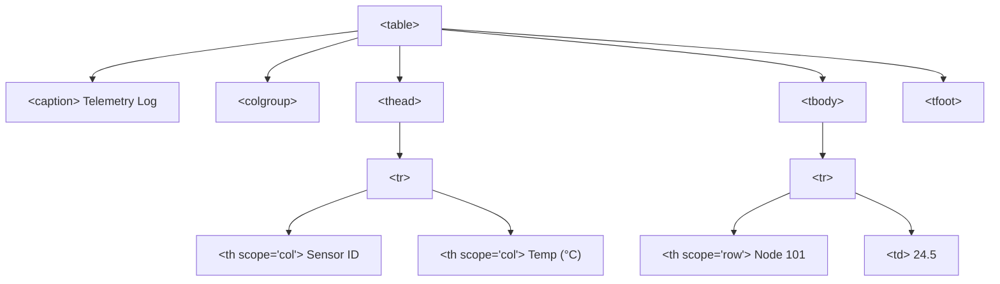

```yaml
schema_version: "2.0"
metadata:
  lesson_id: "HTML5-MOD04-LES02"
  course_slug: "course-01-html5"
  course_title: "Course 1: HTML5"
  module_slug: "mod-04-lists-and-tables"
  module_title: "Module 4 - Data Organization: Lists & Tables"
  lesson_slug: "tabular-data-and-advanced-table-markup"
  lesson_title: "Lesson 4.2 Tabular Data & Advanced Table Markup"
  sort_order: 402

pedagogy:
  difficulty: "intermediate"
  estimated_time:
    reading_minutes: 20
    practice_minutes: 25
    quiz_minutes: 10
    total_minutes: 55
  bloom_taxonomy_level: "Apply"
  xp_reward: 60

prerequisites:
  required_lesson_ids:
    - "HTML5-MOD04-LES01"
  required_skills:
    - "HTML Element Nesting Rules"

skills_acquired:
  - "Table Architecture (`<table>`, `<caption>`)"
  - "Semantic Structural Sections (`<thead>`, `<tbody>`, `<tfoot>`)"
  - "Multi-Row & Multi-Column Spanning (`rowspan`, `colspan`)"
  - "Column Grouping & Styling (`<colgroup>`, `<col>`)"
  - "Accessible Table Header Scoping (`scope='col|row|colgroup|rowgroup'`)"
  - "Responsive Mobile Table Layout Patterns"

dependencies:
  software:
    - "VS Code"
  hardware: []

seo_and_social:
  meta_title: "HTML Tables Masterclass: Architecture, Spanning, Accessibility & Responsiveness"
  meta_description: "Master HTML tables: table, caption, thead, tbody, tfoot, rowspan, colspan, colgroup, accessible scope attributes, and responsive mobile patterns."
  keywords: ["HTML Tables", "table caption", "thead tbody tfoot", "colspan rowspan", "colgroup col", "scope attribute", "Responsive Tables"]

assessment_config:
  has_quiz: true
  has_lab: true
  has_flashcards: true
  pass_score_percentage: 80
```

# Lesson 4.2 Tabular Data & Advanced Table Markup

## 1. Overview & Learning Objectives [id: overview]

- **Estimated Time**: 55 Minutes (20m Reading | 25m Practice | 10m Quiz)
- **Difficulty Level**: ⭐⭐ Intermediate
- **Prerequisites**: [Lesson 4.1 List Elements & Structure](file:///d:/My%20Drive/all%20files/PROJECT%20FILES/notes/docs/curriculum/_01_html5/_01_09_list_elements_and_structure.md)
- **XP Reward**: +60 XP

### Learning Objectives
By the end of this lesson, you will be able to:
1. Construct semantic HTML tables using `<table>`, `<caption>`, `<thead>`, `<tbody>`, and `<tfoot>`.
2. Differentiate between header cells (`<th>`) and data cells (`<td>`).
3. Merge complex matrix cells using `colspan` (column spanning) and `rowspan` (row spanning).
4. Apply `<colgroup>` and `<col>` tags for efficient column-level styling.
5. Implement accessible table headers using the `scope` attribute (`col`, `row`, `colgroup`, `rowgroup`).
6. Build mobile-responsive data tables that scroll smoothly without breaking small viewports.

---

## 2. Environment & Prerequisites [id: prerequisites]

Open VS Code and create `table_demo.html` to write interactive data table examples.

---

## 3. Theoretical Foundations [id: theory]

### 3.1 Semantic Table Architecture
An HTML table represents two-dimensional tabular data arranged in rows and columns:

- `<table>`: Main container.
- `<caption>`: Accessible table title (must be the first direct child of `<table>`).
- `<thead>`: Encloses table header rows.
- `<tbody>`: Encloses main data rows.
- `<tfoot>`: Encloses summary or total calculation rows (e.g. column sums).

```html
<table>
  <caption>IoT Sensor Telemetry Log</caption>
  <thead>
    <tr><th>Timestamp</th><th>Sensor ID</th><th>Reading</th></tr>
  </thead>
  <tbody>
    <tr><td>15:52:00</td><td>ESP32-01</td><td>24.5°C</td></tr>
  </tbody>
  <tfoot>
    <tr><td colspan="2">Average Temp</td><td>24.5°C</td></tr>
  </tfoot>
</table>
```

### 3.2 Cell Spanning (`colspan` & `rowspan`)
- `colspan="N"`: Spans a single cell across $N$ columns horizontally.
- `rowspan="N"`: Spans a single cell across $N$ rows vertically.

```
colspan="2":  [ Cell 1 (Spans 2 Columns) ]
rowspan="2":  [ Cell A ] [ Cell B ]
              [ (Rowspan) ] [ Cell C ]
```

### 3.3 Column Groups (`<colgroup>` & `<col>`)
Allows defining style properties (width, background color) for entire columns without repeating inline classes on every single `<td>` cell:

```html
<table>
  <colgroup>
    <col style="width: 20%; background: #f1f5f9;">
    <col style="width: 50%;">
    <col style="width: 30%; background: #e2e8f0;">
  </colgroup>
  <!-- Table rows here -->
</table>
```

### 3.4 Table Accessibility & Header Scoping
Screen reader users navigate tables cell-by-cell. Without explicit header relationships, screen readers speak raw values without context.

#### The `scope` Attribute
The `scope` attribute on `<th>` elements tells screen readers whether a header applies to a column or a row:

- `scope="col"`: Header for a column.
- `scope="row"`: Header for a row.
- `scope="colgroup"`: Header for a group of columns.
- `scope="rowgroup"`: Header for a group of rows.

```html
<tr>
  <th scope="row">ESP32 Gateway</th> <!-- Row Header -->
  <td>Online</td>
  <td>192.168.1.101</td>
</tr>
```

### 3.5 Responsive Mobile Table Patterns
Tables default to intrinsic content width, which breaks small mobile viewports.

#### CSS Scroll Container Pattern (Recommended)
Wrap `<table>` inside a `div` with `overflow-x: auto`:

```html
<div style="overflow-x: auto; max-width: 100%;">
  <table>...</table>
</div>
```

---

## 4. Architecture & Diagram Visualizations [id: diagram]

### Accessible Table DOM Hierarchy


---

## 5. Code & Hardware Implementation [id: syntax]

### 5.1 Complex Accessible Matrix Table (`matrix_table.html`)

```html
<!DOCTYPE html>
<html lang="en">
<head>
  <meta charset="UTF-8">
  <title>Accessible IoT Telemetry Table</title>
  <style>
    body { font-family: system-ui; padding: 20px; }
    .table-container { overflow-x: auto; border: 1px solid #cbd5e1; border-radius: 8px; }
    table { width: 100%; border-collapse: collapse; text-align: left; }
    caption { font-weight: bold; font-size: 1.2rem; padding: 12px; caption-side: top; text-align: left; }
    th, td { padding: 12px; border-bottom: 1px solid #e2e8f0; }
    thead th { background: #0f172a; color: #fff; }
    tbody tr:nth-child(even) { background: #f8fafc; }
    tfoot td { background: #e2e8f0; font-weight: bold; }
  </style>
</head>
<body>

  <div class="table-container">
    <table>
      <caption>Quarterly IoT Energy & Telemetry Metrics (2026)</caption>
      
      <colgroup>
        <col style="width: 25%;">
        <col style="width: 25%;">
        <col style="width: 25%;">
        <col style="width: 25%;">
      </colgroup>

      <thead>
        <tr>
          <th scope="col">Device Location</th>
          <th scope="col">Q1 Power (kWh)</th>
          <th scope="col">Q2 Power (kWh)</th>
          <th scope="col">Status</th>
        </tr>
      </thead>

      <tbody>
        <tr>
          <th scope="row">Server Room A</th>
          <td>420.5</td>
          <td>412.0</td>
          <td>Active</td>
        </tr>
        <tr>
          <th scope="row">Lab Beta</th>
          <td>180.2</td>
          <td>195.8</td>
          <td>Active</td>
        </tr>
        <tr>
          <th scope="row" rowspan="2">Outdoor Solar Station</th>
          <td>95.0</td>
          <td>110.4</td>
          <td>Active</td>
        </tr>
        <tr>
          <!-- Note: First column spanned by rowspan above -->
          <td colspan="2">Maintenance Downtime: 4 Hrs</td>
          <td>Warning</td>
        </tr>
      </tbody>

      <tfoot>
        <tr>
          <th scope="row">Total Energy Used</th>
          <td colspan="2">1,413.9 kWh</td>
          <td>Operational</td>
        </tr>
      </tfoot>
    </table>
  </div>

</body>
</html>
```

---

## 6. Enterprise Real-World Applications [id: examples]

### Financial Reports & System Metrics Dashboards
In enterprise dashboards (AWS Billing, Grafana, Cloudflare):
- **`<caption`>**: Ensures tabular reports comply with Section 508 and WCAG 2.1 AA accessibility regulations.
- **`colspan` Summary Footers**: Summarizes monthly costs or uptime metrics at the bottom of data grids using `<tfoot>`.

---

## 7. Guided Step-by-Step Hands-On Exercise [id: exercises]

### Task: Inspect Accessible Headers in DevTools

#### Step 1: Open `matrix_table.html`
Save the code from Section 5.1 and open it in Chrome.

#### Step 2: Inspect Table Accessibility Properties
1. Open DevTools (`F12`) $\rightarrow$ Click **Elements** tab.
2. Select any `<td>` data cell in the table body.
3. Click the **Accessibility** sub-panel.
4. Verify screen reader computed properties link the data cell directly to its matching `scope="col"` and `scope="row"` headers!

---

## 8. Common Pitfalls & Troubleshooting [id: common_mistakes]

| Bug / Error | Root Cause | Engineering Solution |
| :--- | :--- | :--- |
| **Misaligned Grid Cells** | Miscalculating `colspan` or `rowspan` totals, causing cells to overflow row boundaries. | Ensure the sum of normal cells + `colspan` values in every row matches total column count. |
| **Screen Readers Reading Data Without Context** | Omitting `scope="col"` / `scope="row"` on `<th>` cells or omitting `<caption>`. | Add explicit `scope` attributes to all `<th>` tags and include a `<caption>`. |
| **Table Overflowing Mobile Screen** | Omitting `overflow-x: auto` wrapper on `<table>` containers. | Wrap `<table>` in `<div style="overflow-x: auto">`. |

---

## 9. Best Practices & Optimization [id: best_practices]

- **Always Include `<caption>`**: First child of `<table>` for accessible table titles.
- **Use `<thead>`, `<tbody>`, `<tfoot>`**: Explicitly structure rows.
- **Add `scope="col|row"`**: Ensure screen readers connect cells to headers.
- **Use `border-collapse: collapse`**: Eliminates ugly default double borders in CSS.

---

## 10. Industry Interview Q&A [id: interview_qa]

### Q1: What is the purpose of the `scope` attribute on `<th>` elements?
**Answer**:
The `scope` attribute explicitly defines the directional relationship between a header cell (`<th>`) and its associated data cells (`<td>`). Setting `scope="col"` specifies that the header applies to all cells in that vertical column; `scope="row"` specifies that the header applies to all cells in that horizontal row. This enables screen readers to speak the correct column and row headers as a user navigates from cell to cell.

---

## 11. Self-Assessment Quiz [id: quiz]

```json
{
  "quiz_title": "Lesson 4.2 Tabular Data & Advanced Table Markup Assessment",
  "questions": [
    {
      "question_id": "Q1",
      "type": "multiple_choice",
      "question_text": "Which tag defines an accessible table title and must be the FIRST child of a `<table>`?",
      "options": ["<header>", "<caption>", "<title>", "<thead>"],
      "correct_answer_index": 1,
      "explanation": "<caption> provides the accessible title and must be the first child of <table>."
    },
    {
      "question_id": "Q2",
      "type": "multiple_choice",
      "question_text": "Which attribute merges a single table cell horizontally across 3 columns?",
      "options": ["rowspan='3'", "colspan='3'", "colgroup='3'", "span='3'"],
      "correct_answer_index": 1,
      "explanation": "colspan='3' spans a cell horizontally across 3 columns."
    },
    {
      "question_id": "Q3",
      "type": "multiple_choice",
      "question_text": "What is the recommended `scope` value for a header cell at the start of a horizontal row?",
      "options": ["scope='col'", "scope='row'", "scope='rowgroup'", "scope='horizontal'"],
      "correct_answer_index": 1,
      "explanation": "scope='row' informs screen readers that the header applies to all cells in that row."
    }
  ]
}
```

---

## 12. Portfolio Assignment & Challenge [id: lab]

Build an accessible IoT pricing comparison table with column groups, merged headers, and footer totals.

---

## 13. Spaced Repetition Flashcards [id: flashcards]

**Front**: What element defines column-level default styling in HTML tables?
**Back**: `<colgroup>` containing `<col>` elements.
<!-- flashcard:end -->

**Front**: How do you prevent HTML tables from bursting out of mobile screen viewports?
**Back**: Wrap the table in a container `<div>` with CSS `overflow-x: auto`.
<!-- flashcard:end -->

---

## 14. Summary & Cheat Sheet [id: summary]

```html
<table>
  <caption>Data Summary</caption>
  <thead>
    <tr><th scope="col">Item</th><th scope="col">Price</th></tr>
  </thead>
  <tbody>
    <tr><th scope="row">Sensor</th><td>$15.00</td></tr>
  </tbody>
</table>
```
