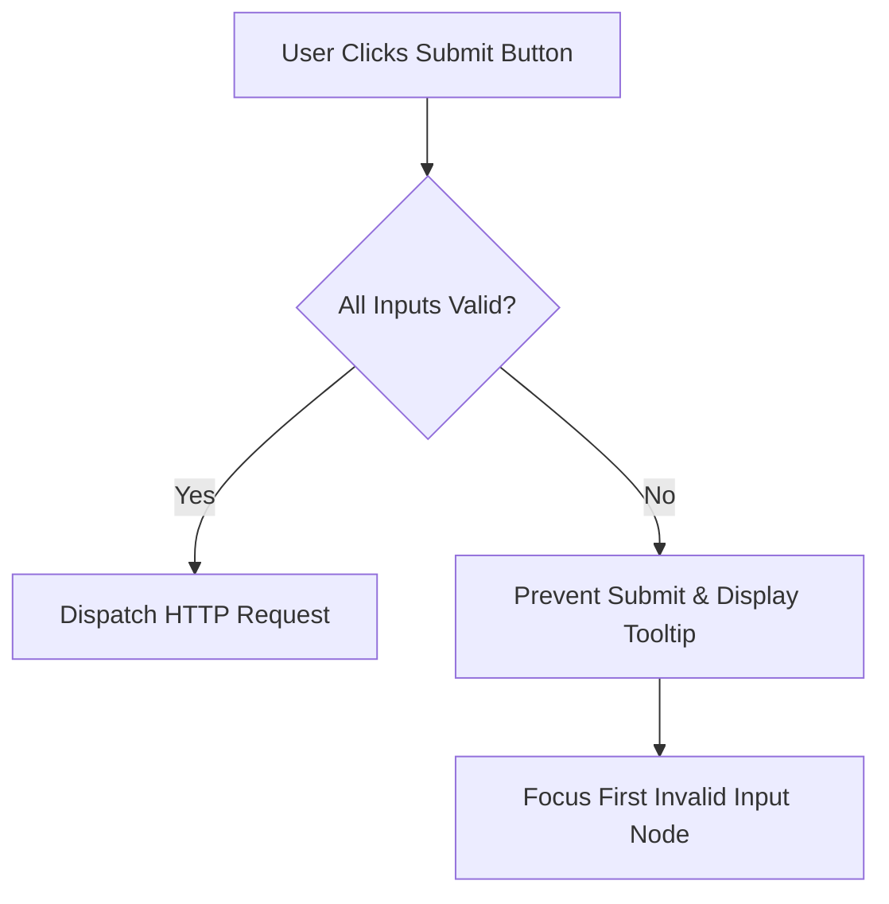

```yaml
schema_version: "2.0"
metadata:
  lesson_id: "HTML5-MOD05-LES03"
  course_slug: "course-01-html5"
  course_title: "Course 1: HTML5"
  module_slug: "mod-05-forms-and-validation"
  module_title: "Module 5 - Forms, Inputs, & Client-Side Validation"
  lesson_slug: "native-client-side-form-validation"
  lesson_title: "Lesson 5.3 Native Client-Side Form Validation"
  sort_order: 503

pedagogy:
  difficulty: "intermediate"
  estimated_time:
    reading_minutes: 20
    practice_minutes: 25
    quiz_minutes: 10
    total_minutes: 55
  bloom_taxonomy_level: "Apply"
  xp_reward: 60

prerequisites:
  required_lesson_ids:
    - "HTML5-MOD05-LES02"
  required_skills:
    - "Form Controls & Input Selection"

skills_acquired:
  - "Native Validation Attributes (`required`, `min`, `max`, `step`, `pattern`)"
  - "Regular Expression Matching in `pattern` Attributes"
  - "CSS Validation Pseudo-Classes (`:valid`, `:invalid`, `:user-invalid`)"
  - "JavaScript Constraint Validation API (`checkValidity()`, `setCustomValidity()`)"
  - "Custom Error Tooltips & Accessibility Feedback"

dependencies:
  software:
    - "VS Code"
    - "Google Chrome"
  hardware: []

seo_and_social:
  meta_title: "Native HTML5 Client-Side Form Validation & Constraint Validation API"
  meta_description: "Master HTML5 validation attributes (required, pattern, min/max), Regex pattern matching, CSS :valid/:invalid styles, and JavaScript setCustomValidity()."
  keywords: ["HTML5 Validation", "required", "pattern regex", "min max step", "CSS :valid :invalid", "Constraint Validation API", "setCustomValidity"]

assessment_config:
  has_quiz: true
  has_lab: true
  has_flashcards: true
  pass_score_percentage: 80
```

# Lesson 5.3 Native Client-Side Form Validation

## 1. Overview & Learning Objectives [id: overview]

- **Estimated Time**: 55 Minutes (20m Reading | 25m Practice | 10m Quiz)
- **Difficulty Level**: ⭐⭐ Intermediate
- **Prerequisites**: [Lesson 5.2 Form Controls & Input Types](file:///d:/My%20Drive/all%20files/PROJECT%20FILES/notes/docs/curriculum/_01_html5/_01_12_form_controls_and_input_types.md)
- **XP Reward**: +60 XP

### Learning Objectives
By the end of this lesson, you will be able to:
1. Apply native HTML5 validation attributes (`required`, `min`, `max`, `step`, `minlength`, `maxlength`, `pattern`).
2. Write regular expressions for the `pattern` attribute to validate complex data (MAC addresses, IP addresses, serial numbers).
3. Style valid and invalid input fields using CSS pseudo-classes (`:valid`, `:invalid`, `:user-invalid`).
4. Interact with the JavaScript **Constraint Validation API** (`checkValidity()`, `reportValidity()`, `validityState`).
5. Customize native error tooltips using `element.setCustomValidity()`.

---

## 2. Environment & Prerequisites [id: prerequisites]

Open VS Code and create `validation_demo.html` to build client-side form validation rules.

---

## 3. Theoretical Foundations [id: theory]

### 3.1 Native Validation Attributes
HTML5 includes built-in client-side validation that intercepts form submissions before any server request is sent:

- `required`: Prevents submission if field is empty.
- `minlength` & `maxlength`: Restricts character count bounds for text inputs.
- `min`, `max`, `step`: Enforces numeric boundaries and step increments for `number` and `range` controls.
- `pattern="RegEx"`: Enforces custom regular expression matching.

```html
<!-- MAC Address Validation Pattern -->
<input type="text" 
       id="mac-address" 
       name="mac" 
       pattern="^([0-9A-Fa-f]{2}[:-]){5}([0-9A-Fa-f]{2})$" 
       placeholder="24:0A:C4:00:01:10" 
       required>
```

### 3.2 CSS Validation Pseudo-Classes

```css
/* Input passes all validation rules */
input:valid { border-color: #22c55e; }

/* Input fails one or more validation rules */
input:invalid { border-color: #ef4444; }

/* Modern: Only highlights invalid state AFTER user interacts (prevents red forms on initial load!) */
input:user-invalid { border-color: #ef4444; background: #fef2f2; }
```

### 3.3 The Constraint Validation API (JavaScript)
Form elements expose programmatic validation interfaces:

- `element.checkValidity()`: Returns `true` if element passes validation.
- `element.reportValidity()`: Triggers native error tooltips if invalid.
- `element.setCustomValidity("Custom error message")`: Sets a custom error message; passing `""` clears error state.
- `element.validity`: Returns a `ValidityState` object detailing error causes (`valueMissing`, `patternMismatch`, `rangeUnderflow`, `typeMismatch`).

---

## 4. Architecture & Diagram Visualizations [id: diagram]

### Constraint Validation Flow


---

## 5. Code & Hardware Implementation [id: syntax]

### 5.1 Custom Validation & RegEx Portal (`validation_portal.html`)

```html
<!DOCTYPE html>
<html lang="en">
<head>
  <meta charset="UTF-8">
  <title>Validation & Constraint API Portal</title>
  <style>
    body { font-family: system-ui; padding: 20px; }
    form { max-width: 500px; background: #f8fafc; padding: 20px; border-radius: 8px; border: 1px solid #cbd5e1; }
    .field { margin-bottom: 16px; }
    label { display: block; font-weight: bold; margin-bottom: 4px; }
    input { width: 100%; padding: 8px; border: 2px solid #cbd5e1; border-radius: 4px; }
    
    /* Modern User-Invalid Styling */
    input:user-invalid { border-color: #ef4444; background: #fef2f2; }
    input:user-valid { border-color: #22c55e; }
    
    .error-msg { color: #dc2626; font-size: 0.85rem; margin-top: 4px; display: none; }
    button { background: #3b82f6; color: #fff; padding: 10px 20px; border: none; border-radius: 4px; cursor: pointer; }
  </style>
</head>
<body>

  <h2>IoT Device Registration Form</h2>

  <form id="reg-form" novalidate>
    
    <div class="field">
      <label for="device-mac">MAC Address (Format: XX:XX:XX:XX:XX:XX)</label>
      <input type="text" id="device-mac" name="mac" 
             pattern="^([0-9A-Fa-f]{2}[:-]){5}([0-9A-Fa-f]{2})$" 
             required>
      <div class="error-msg" id="mac-error">Please enter a valid 6-byte hexadecimal MAC address.</div>
    </div>

    <div class="field">
      <label for="baud-rate">Baud Rate (Must be multiple of 300)</label>
      <input type="number" id="baud-rate" name="baud" min="300" max="115200" step="300" value="9600" required>
    </div>

    <button type="submit">Register Device</button>
  </form>

  <script>
    const form = document.getElementById('reg-form');
    const macInput = document.getElementById('device-mac');
    const macError = document.getElementById('mac-error');

    // Custom Error Messaging via Constraint API
    macInput.addEventListener('input', () => {
      if (macInput.validity.patternMismatch) {
        macInput.setCustomValidity("Invalid MAC Address format! Use XX:XX:XX:XX:XX:XX");
        macError.style.display = "block";
      } else {
        macInput.setCustomValidity("");
        macError.style.display = "none";
      }
    });

    form.addEventListener('submit', (e) => {
      if (!form.checkValidity()) {
        e.preventDefault(); // Stop submission
        form.reportValidity(); // Show native tooltips
      }
    });
  </script>

</body>
</html>
```

---

## 6. Enterprise Real-World Applications [id: examples]

### Client-Side Validation is NOT Security
Enterprise applications always implement **Double Validation**:
1. **Client-Side (HTML5/JS)**: Improves user experience by giving instant feedback.
2. **Server-Side (Flask/FastAPI/Pydantic)**: Mandated for security; malicious actors can bypass client-side validation using `cURL` or Postman.

---

## 7. Guided Step-by-Step Hands-On Exercise [id: exercises]

1. Save Section 5.1 code as `validation_portal.html` and launch in Chrome.
2. Type `1234` into the MAC Address field $\rightarrow$ Observe `input:user-invalid` turns red.
3. Type `24:0A:C4:00:01:10` $\rightarrow$ Observe input turns green (`input:user-valid`).

---

## 8. Common Pitfalls & Troubleshooting [id: common_mistakes]

| Bug / Error | Root Cause | Engineering Solution |
| :--- | :--- | :--- |
| **All Inputs Red on Initial Page Load** | Styling `input:invalid` instead of `input:user-invalid`. | Use `input:user-invalid` so styling triggers only after user interaction. |

---

## 9. Best Practices & Optimization [id: best_practices]

- **Use `input:user-invalid`**: Avoid aggressive red validation borders before user interaction.
- **Always Validate Server-Side**: Client-side validation is for UX, not security.

---

## 10. Industry Interview Q&A [id: interview_qa]

### Q1: What is `ValidityState` in the HTML5 Constraint Validation API?
**Answer**: `element.validity` returns a `ValidityState` boolean object containing properties like `valueMissing`, `patternMismatch`, `rangeUnderflow`, `rangeOverflow`, `stepMismatch`, `tooLong`, `tooShort`, `typeMismatch`, and `valid`.

---

## 11. Self-Assessment Quiz [id: quiz]

```json
{
  "quiz_title": "Lesson 5.3 Native Client-Side Form Validation Assessment",
  "questions": [
    {
      "question_id": "Q1",
      "type": "multiple_choice",
      "question_text": "Which CSS pseudo-class highlights invalid form inputs ONLY after user interaction?",
      "options": [":invalid", ":user-invalid", ":dirty", ":error"],
      "correct_answer_index": 1,
      "explanation": ":user-invalid triggers only after the user interacts with the input field."
    }
  ]
}
```

---

## 12. Portfolio Assignment & Challenge [id: lab]

Build a RegEx validated IoT API key generator form.

---

## 13. Spaced Repetition Flashcards [id: flashcards]

**Front**: What JS method sets a custom error message on a form input?
**Back**: `element.setCustomValidity("message")`
<!-- flashcard:end -->

---

## 14. Summary & Cheat Sheet [id: summary]

```html
<input type="text" pattern="^[0-9]{5}$" required>
```
