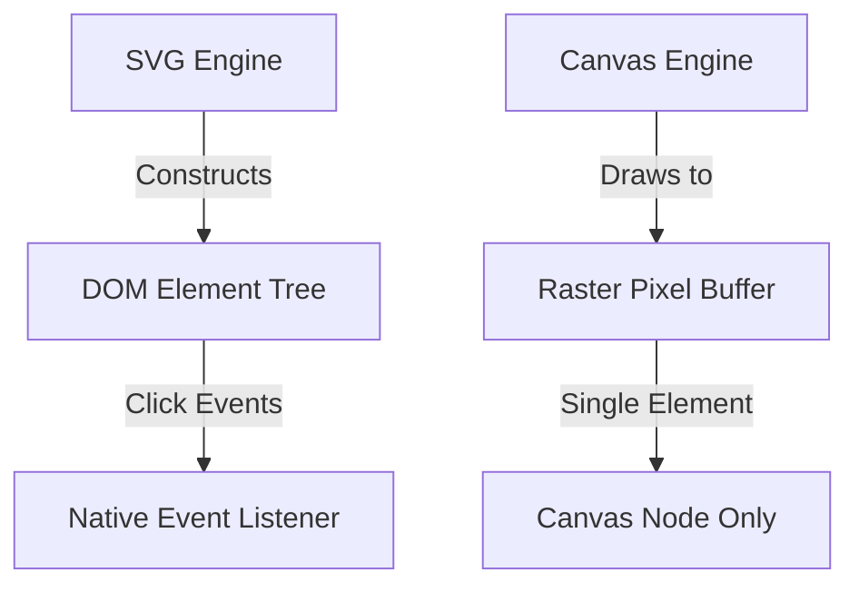

```yaml
schema_version: "2.0"
metadata:
  lesson_id: "HTML5-MOD06-LES03"
  course_slug: "course-01-html5"
  course_title: "Course 1: HTML5"
  module_slug: "mod-06-multimedia-and-canvas"
  module_title: "Module 6 - Multimedia, Embedded Content, & Graphics"
  lesson_slug: "vector-graphics-and-html5-canvas"
  lesson_title: "Lesson 6.3 Vector Graphics & HTML5 Canvas"
  sort_order: 603

pedagogy:
  difficulty: "intermediate"
  estimated_time:
    reading_minutes: 20
    practice_minutes: 25
    quiz_minutes: 10
    total_minutes: 55
  bloom_taxonomy_level: "Apply"
  xp_reward: 60

prerequisites:
  required_lesson_ids:
    - "HTML5-MOD06-LES01"
  required_skills:
    - "HTML Document Structure & CSS Styling"

skills_acquired:
  - "Inline Scalable Vector Graphics (`<svg>`) Construction"
  - "SVG Primitives (`<rect>`, `<circle>`, `<line>`, `<polygon>`, `<path>`, `<g>`)"
  - "CSS & SVG Animation Integration"
  - "HTML5 Canvas (`<canvas>`) Setup & 2D Context API"
  - "Canvas 2D Drawing Operations (rectangles, paths, text)"
  - "Canvas vs SVG Architecture Comparison Matrix"

dependencies:
  software:
    - "VS Code"
    - "Google Chrome"
  hardware: []

seo_and_social:
  meta_title: "HTML5 Vector Graphics (SVG) & Canvas 2D API Masterclass"
  meta_description: "Master inline SVG vector graphics (path, circle, rect), CSS SVG animations, HTML5 Canvas 2D Context API, and SVG vs Canvas decision matrix."
  keywords: ["HTML5 Canvas", "SVG Vector", "inline SVG", "svg path circle rect", "Canvas 2D API", "getContext('2d')", "SVG vs Canvas"]

assessment_config:
  has_quiz: true
  has_lab: true
  has_flashcards: true
  pass_score_percentage: 80
```

# Lesson 6.3 Vector Graphics & HTML5 Canvas

## 1. Overview & Learning Objectives [id: overview]

- **Estimated Time**: 55 Minutes (20m Reading | 25m Practice | 10m Quiz)
- **Difficulty Level**: ⭐⭐ Intermediate
- **Prerequisites**: [Lesson 6.1 Media Elements](file:///d:/My%20Drive/all%20files/PROJECT%20FILES/notes/docs/curriculum/_01_html5/_01_14_media_elements_images_audio_and_video.md)
- **XP Reward**: +60 XP

### Learning Objectives
By the end of this lesson, you will be able to:
1. Construct resolution-independent inline **Scalable Vector Graphics (SVG)** markup.
2. Utilize SVG primitives (`<rect>`, `<circle>`, `<ellipse>`, `<line>`, `<polygon>`, `<path>`, `<g>`).
3. Animate and style SVG elements using CSS selectors and keyframes.
4. Set up an **HTML5 Canvas (`<canvas>`)** element and acquire the `2d` rendering context.
5. Execute Canvas 2D drawing commands (fill, stroke, paths, text rendering).
6. Evaluate the trade-offs between SVG (Vector/DOM-based) and Canvas (Raster/Immediate-mode).

---

## 2. Environment & Prerequisites [id: prerequisites]

Open VS Code and create `graphics_demo.html` to write interactive SVG and Canvas graphics.

---

## 3. Theoretical Foundations [id: theory]

### 3.1 SVG vs Canvas Comparison Matrix

```
┌─────────────────────────────────────────────────────────────────────────────┐
│                          SVG VS CANVAS ARCHITECTURE                         │
├─────────────────┬──────────────────────────────────┬────────────────────────┤
│ Characteristic  │ SVG (Scalable Vector Graphics)   │ HTML5 Canvas 2D        │
├─────────────────┼──────────────────────────────────┼────────────────────────┤
│ Rendering Mode  │ Retained Mode (DOM-based XML)    │ Immediate Mode (Raster)│
│ Resolution      │ Resolution-independent (scalable)│ Pixel-dependent (dpi)  │
│ DOM Integration │ Every shape is a DOM node        │ Single `<canvas>` node │
│ Event Handling  │ Native JS event listeners (click)│ Manual coordinate math │
│ Performance     │ High memory for 10,000+ objects  │ Fast for 100,000+ items│
│ Ideal Use Case  │ Icons, UI charts, schematics     │ Games, particle simulations│
└─────────────────┴──────────────────────────────────┴────────────────────────┘
```

### 3.2 SVG Primitives (`<svg>`)
SVG uses XML tags to render mathematical vector graphics:

```html
<svg width="200" height="200" viewBox="0 0 200 200">
  <rect x="10" y="10" width="180" height="180" rx="10" fill="#0f172a" stroke="#3b82f6" stroke-width="4" />
  <circle cx="100" cy="100" r="50" fill="#38bdf8" />
  <path d="M 50 100 L 150 100" stroke="#fff" stroke-width="6" />
</svg>
```

### 3.3 HTML5 Canvas 2D API (`<canvas>`)
Canvas provides a procedural JavaScript API for drawing pixel buffers:

```html
<canvas id="my-canvas" width="400" height="200"></canvas>

<script>
  const canvas = document.getElementById('my-canvas');
  const ctx = canvas.getContext('2d');
  
  // Fill background
  ctx.fillStyle = '#0f172a';
  ctx.fillRect(0, 0, 400, 200);

  // Draw Line
  ctx.beginPath();
  ctx.moveTo(50, 100);
  ctx.lineTo(350, 100);
  ctx.strokeStyle = '#38bdf8';
  ctx.lineWidth = 4;
  ctx.stroke();
</script>
```

---

## 4. Architecture & Diagram Visualizations [id: diagram]

### SVG (DOM Retained) vs Canvas (Pixel Immediate)


---

## 5. Code & Hardware Implementation [id: syntax]

```html
<!DOCTYPE html>
<html lang="en">
<head>
  <meta charset="UTF-8">
  <title>Graphics Portal</title>
</head>
<body>
  <h1>SVG & Canvas Graphics</h1>

  <!-- Inline SVG Icon -->
  <svg width="100" height="100">
    <circle cx="50" cy="50" r="40" fill="#22c55e" />
  </svg>

  <!-- HTML5 Canvas -->
  <canvas id="chart" width="300" height="150" style="border:1px solid #ccc;"></canvas>

  <script>
    const ctx = document.getElementById('chart').getContext('2d');
    ctx.fillStyle = '#3b82f6';
    ctx.fillRect(20, 20, 100, 100);
  </script>
</body>
</html>
```

---

## 6. Enterprise Real-World Applications [id: examples]

- **SVG**: UI icons (FontAwesome/Heroicons) and interactive D3.js data charts.
- **Canvas**: High-performance telemetry dashboards, 2D game engines (Phaser), and WebGL 3D views (Three.js).

---

## 7. Guided Step-by-Step Hands-On Exercise [id: exercises]

1. Save code as `graphics_demo.html`.
2. Inspect the SVG node in DevTools; verify `circle` is selectable in the DOM tree.

---

## 8. Common Pitfalls & Troubleshooting [id: common_mistakes]

| Bug / Error | Root Cause | Engineering Solution |
| :--- | :--- | :--- |
| **Canvas Appears Blurry** | Setting width/height via CSS instead of HTML canvas attributes. | Always set `width` and `height` attributes directly on the `<canvas>` tag! |

---

## 9. Best Practices & Optimization [id: best_practices]

- **Set Canvas Attributes**: Use `width="800"` and `height="600"` on `<canvas>` elements.
- **Use SVG for Scalable Icons**: Keep UI crisp across 4K Retina screens.

---

## 10. Industry Interview Q&A [id: interview_qa]

### Q1: What is the main architectural difference between SVG and Canvas?
**Answer**: SVG is **retained mode** (vector XML elements stored in the DOM tree). Canvas is **immediate mode** (procedural raster pixel drawing with no individual DOM nodes).

---

## 11. Self-Assessment Quiz [id: quiz]

```json
{
  "quiz_title": "Lesson 6.3 Vector Graphics & Canvas Assessment",
  "questions": [
    {
      "question_id": "Q1",
      "type": "multiple_choice",
      "question_text": "Which graphic format retains individual shapes as selectable DOM nodes?",
      "options": ["Canvas 2D", "SVG", "JPEG", "WebGL"],
      "correct_answer_index": 1,
      "explanation": "SVG is XML-based where every shape is a DOM node."
    }
  ]
}
```

---

## 12. Portfolio Assignment & Challenge [id: lab]

Draw a real-time IoT temperature gauge using Canvas 2D API.

---

## 13. Spaced Repetition Flashcards [id: flashcards]

**Front**: What JS method acquires the 2D drawing context for a `<canvas>` element?
**Back**: `canvas.getContext('2d')`
<!-- flashcard:end -->

---

## 14. Summary & Cheat Sheet [id: summary]

```javascript
const ctx = canvas.getContext('2d');
ctx.fillRect(0, 0, 100, 100);
```
