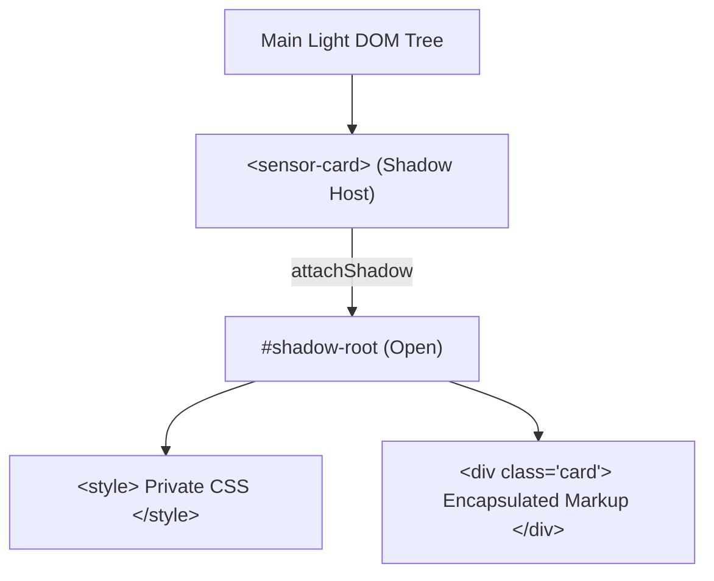

```yaml
schema_version: "2.0"
metadata:
  lesson_id: "HTML5-MOD08-LES01"
  course_slug: "course-01-html5"
  course_title: "Course 1: HTML5"
  module_slug: "mod-08-web-components"
  module_title: "Module 8 - Web Components & Modern HTML Specifications"
  lesson_slug: "shadow-dom-and-custom-elements"
  lesson_title: "Lesson 8.1 Shadow DOM & Custom Elements"
  sort_order: 801

pedagogy:
  difficulty: "advanced"
  estimated_time:
    reading_minutes: 20
    practice_minutes: 25
    quiz_minutes: 10
    total_minutes: 55
  bloom_taxonomy_level: "Apply"
  xp_reward: 70

prerequisites:
  required_lesson_ids:
    - "HTML5-MOD01-LES02"
  required_skills:
    - "DOM Tree Manipulation & ES6 Classes"

skills_acquired:
  - "Custom Elements API Definition (`customElements.define`)"
  - "Custom Element Naming Rules (Must contain a hyphen `-`)"
  - "Custom Element Lifecycle Callbacks (`connectedCallback`, `disconnectedCallback`, `attributeChangedCallback`)"
  - "Shadow DOM Encapsulation (`attachShadow({ mode: 'open' })`)"
  - "Encapsulated CSS Scope Isolation"

dependencies:
  software:
    - "VS Code"
  hardware: []

seo_and_social:
  meta_title: "HTML5 Web Components: Custom Elements API & Shadow DOM Encapsulation"
  meta_description: "Master HTML5 Web Components: customElements.define(), hyphenated naming rules, lifecycle callbacks (connectedCallback), and Shadow DOM style encapsulation."
  keywords: ["Web Components", "Custom Elements", "customElements.define", "Shadow DOM", "connectedCallback", "attachShadow", "Style Encapsulation"]

assessment_config:
  has_quiz: true
  has_lab: true
  has_flashcards: true
  pass_score_percentage: 80
```

# Lesson 8.1 Shadow DOM & Custom Elements

## 1. Overview & Learning Objectives [id: overview]

- **Estimated Time**: 55 Minutes (20m Reading | 25m Practice | 10m Quiz)
- **Difficulty Level**: ⭐⭐⭐ Advanced
- **Prerequisites**: [Lesson 1.2 Browser Rendering Engine](file:///d:/My%20Drive/all%20files/PROJECT%20FILES/notes/docs/curriculum/_01_html5/_01_02_browser_rendering_engine_architecture.md)
- **XP Reward**: +70 XP

### Learning Objectives
By the end of this lesson, you will be able to:
1. Define autonomous custom HTML tags using `customElements.define()`.
2. Enforce custom element naming rules (must contain a hyphen `-`).
3. Manage component lifecycles using `connectedCallback()`, `disconnectedCallback()`, and `attributeChangedCallback()`.
4. Attach an isolated **Shadow DOM** root using `attachShadow({ mode: 'open' })`.
5. Encapsulate CSS styles to prevent global stylesheet leaks into component interiors.

---

## 2. Environment & Prerequisites [id: prerequisites]

Open VS Code and create `web_component_demo.html` to write native Web Components.

---

## 3. Theoretical Foundations [id: theory]

### 3.1 Web Components Suite
Web Components allow developers to create reusable, encapsulated custom HTML elements natively supported by browsers without framework dependencies (React/Vue/Angular).

The standard consists of 3 technologies:
1. **Custom Elements**: Defines new HTML tags.
2. **Shadow DOM**: Encapsulates markup and styles in a private DOM tree.
3. **HTML Templates & Slots**: Defines reusable HTML fragments.

### 3.2 Custom Element Lifecycle Callbacks

```
┌─────────────────────────────────────────────────────────────────────────────┐
│                    CUSTOM ELEMENT LIFECYCLE CALLBACKS                       │
├──────────────────────────┬──────────────────────────────────────────────────┤
│ `constructor()`          │ Instantiates element; initialize state/Shadow DOM.│
├──────────────────────────┼──────────────────────────────────────────────────┤
│ `connectedCallback()`    │ Fired when element is inserted into page DOM.    │
├──────────────────────────┼──────────────────────────────────────────────────┤
│ `disconnectedCallback()` │ Fired when element is removed from page DOM.     │
├──────────────────────────┼──────────────────────────────────────────────────┤
│ `attributeChangedCallback()`| Fired when an observed attribute is mutated.   │
└──────────────────────────┴──────────────────────────────────────────────────┘
```

> [!IMPORTANT]
> **Hyphen Naming Rule**: Custom element tag names MUST contain at least one hyphen (e.g. `<sensor-card>`, `<user-avatar>`). Single-word custom tags (e.g. `<sensor>`) are rejected to prevent collisions with future native HTML tags.

### 3.3 Shadow DOM Encapsulation
Shadow DOM attaches a hidden, scoped DOM tree to an element. Styles inside Shadow DOM do NOT leak out, and global page CSS does NOT leak in!

---

## 4. Architecture & Diagram Visualizations [id: diagram]



---

## 5. Code & Hardware Implementation [id: syntax]

```html
<!DOCTYPE html>
<html lang="en">
<head>
  <meta charset="UTF-8">
  <title>Custom Element Demo</title>
</head>
<body>

  <!-- Custom Web Component -->
  <sensor-card name="ESP32 Node A" status="Active"></sensor-card>

  <script>
    class SensorCard extends HTMLElement {
      constructor() {
        super();
        // Attach Shadow DOM root
        this.attachShadow({ mode: 'open' });
      }

      connectedCallback() {
        const name = this.getAttribute('name') || 'Unknown Device';
        const status = this.getAttribute('status') || 'Offline';

        // Encapsulated Styles & HTML
        this.shadowRoot.innerHTML = `
          <style>
            .card { background: #0f172a; color: #fff; padding: 16px; border-radius: 8px; font-family: system-ui; }
            .badge { background: #22c55e; color: #000; padding: 2px 6px; border-radius: 4px; }
          </style>
          <div class="card">
            <h3>${name}</h3>
            <p>Status: <span class="badge">${status}</span></p>
          </div>
        `;
      }
    }

    // Register Custom Element Tag Name (Must contain a hyphen!)
    customElements.define('sensor-card', SensorCard);
  </script>

</body>
</html>
```

---

## 6. Enterprise Real-World Applications [id: examples]

- **Design Systems (Shoelace, Material Web, Salesforce Lightning)**: Enterprise design systems build framework-agnostic component libraries using Web Components.

---

## 7. Guided Step-by-Step Hands-On Exercise [id: exercises]

1. Save code as `web_component_demo.html`.
2. Inspect `<sensor-card>` in DevTools $\rightarrow$ Expand `#shadow-root (open)` node!

---

## 8. Common Pitfalls & Troubleshooting [id: common_mistakes]

| Bug / Error | Root Cause | Engineering Solution |
| :--- | :--- | :--- |
| **`NotSupportedError: Registration failed`** | Custom element tag name lacks a hyphen (e.g. `customElements.define('card', ...)`). | Always include a hyphen in tag names (e.g. `'my-card'`). |

---

## 9. Best Practices & Optimization [id: best_practices]

- **Always Include Hyphens**: Tag names must contain a hyphen (`<x-element>`).

---

## 10. Industry Interview Q&A [id: interview_qa]

### Q1: What is the main purpose of the Shadow DOM in Web Components?
**Answer**: Shadow DOM provides **encapsulation** for DOM markup and CSS styling, ensuring component internal styles do not leak out into the main document, and main document global styles do not alter component interiors.

---

## 11. Self-Assessment Quiz [id: quiz]

```json
{
  "quiz_title": "Lesson 8.1 Custom Elements Assessment",
  "questions": [
    {
      "question_id": "Q1",
      "type": "multiple_choice",
      "question_text": "What structural rule must all custom element tag names satisfy?",
      "options": ["Must start with uppercase letter", "Must contain at least one hyphen (-)", "Must end with .component", "Must be less than 8 characters"],
      "correct_answer_index": 1,
      "explanation": "Custom element tag names MUST contain a hyphen to prevent collisions with native tags."
    }
  ]
}
```

---

## 12. Portfolio Assignment & Challenge [id: lab]

Build a custom `<telemetry-gauge>` Web Component with Shadow DOM styling.

---

## 13. Spaced Repetition Flashcards [id: flashcards]

**Front**: Which Web Component lifecycle callback fires when an element is inserted into the DOM?
**Back**: `connectedCallback()`
<!-- flashcard:end -->

---

## 14. Summary & Cheat Sheet [id: summary]

```javascript
customElements.define('my-widget', MyWidget);
```
