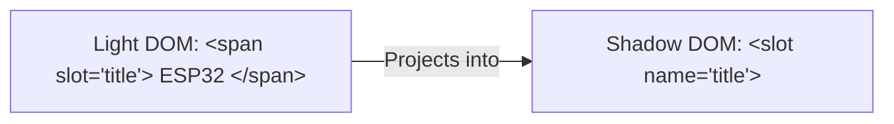

```yaml
schema_version: "2.0"
metadata:
  lesson_id: "HTML5-MOD08-LES02"
  course_slug: "course-01-html5"
  course_title: "Course 1: HTML5"
  module_slug: "mod-08-web-components"
  module_title: "Module 8 - Web Components & Modern HTML Specifications"
  lesson_slug: "html-templates-and-slots"
  lesson_title: "Lesson 8.2 HTML Templates & Slots"
  sort_order: 802

pedagogy:
  difficulty: "intermediate"
  estimated_time:
    reading_minutes: 15
    practice_minutes: 20
    quiz_minutes: 10
    total_minutes: 45
  bloom_taxonomy_level: "Apply"
  xp_reward: 60

prerequisites:
  required_lesson_ids:
    - "HTML5-MOD08-LES01"
  required_skills:
    - "Custom Elements & Shadow DOM Basics"

skills_acquired:
  - "HTML Template Element (`<template>`) Implementation"
  - "DocumentFragment Instantiation (`template.content.cloneNode(true)`)"
  - "Slot Element (`<slot>`) Content Projection"
  - "Named Slots (`<slot name='header'>`) & Fallback Default Content"

dependencies:
  software:
    - "VS Code"
  hardware: []

seo_and_social:
  meta_title: "HTML5 Templates (<template>), DocumentFragment & Slots (<slot>)"
  meta_description: "Master HTML5 templates: <template> tag, DocumentFragment cloning (cloneNode), <slot> light DOM distribution, and named slots."
  keywords: ["HTML Template", "<template>", "DocumentFragment", "cloneNode", "<slot>", "Named Slots", "Web Components"]

assessment_config:
  has_quiz: true
  has_lab: true
  has_flashcards: true
  pass_score_percentage: 80
```

# Lesson 8.2 HTML Templates & Slots

## 1. Overview & Learning Objectives [id: overview]

- **Estimated Time**: 45 Minutes (15m Reading | 20m Practice | 10m Quiz)
- **Difficulty Level**: ⭐⭐ Intermediate
- **Prerequisites**: [Lesson 8.1 Shadow DOM & Custom Elements](file:///d:/My%20Drive/all%20files/PROJECT%20FILES/notes/docs/curriculum/_01_html5/_01_21_shadow_dom_and_custom_elements.md)
- **XP Reward**: +60 XP

### Learning Objectives
By the end of this lesson, you will be able to:
1. Declare inert HTML markup fragments using the `<template>` element.
2. Instantiate DocumentFragments via `template.content.cloneNode(true)`.
3. Project Light DOM content into Web Components using the `<slot>` element.
4. Implement named slots (`<slot name="...">`) and fallback default slot content.

---

## 2. Environment & Prerequisites [id: prerequisites]

Open VS Code and create `template_demo.html` to write template and slot code.

---

## 3. Theoretical Foundations [id: theory]

### 3.1 The `<template>` Element
The `<template>` tag holds inert HTML markup that is **parsed but not rendered** on page load. Images do not download, scripts do not execute, and CSS does not apply until cloned into the active DOM:

```html
<template id="card-template">
  <div class="card">
    <h2 class="title">Card Title</h2>
  </div>
</template>
```

### 3.2 DocumentFragment & `cloneNode()`
Instantiate template contents using `importNode()` or `cloneNode(true)`:

```javascript
const template = document.getElementById('card-template');
const clone = template.content.cloneNode(true);
clone.querySelector('.title').textContent = 'Dynamic Title';
document.body.appendChild(clone);
```

### 3.3 Slots (`<slot>`)
Slots allow component consumers to project custom markup from the Light DOM into designated positions inside a Web Component's Shadow DOM:

```html
<!-- Component Template -->
<template id="user-card">
  <div class="user-card">
    <slot name="username">Default User</slot>
  </div>
</template>

<!-- Usage in HTML -->
<user-card>
  <span slot="username">Alice Admin</span>
</user-card>
```

---

## 4. Architecture & Diagram Visualizations [id: diagram]



---

## 5. Code & Hardware Implementation [id: syntax]

```html
<!DOCTYPE html>
<html lang="en">
<head>
  <meta charset="UTF-8">
  <title>Templates and Slots</title>
</head>
<body>

  <!-- Reusable Card Component with Named Slots -->
  <info-card>
    <h2 slot="header">System Alert</h2>
    <p slot="body">Temperature exceeded 40°C threshold.</p>
  </info-card>

  <script>
    class InfoCard extends HTMLElement {
      constructor() {
        super();
        this.attachShadow({ mode: 'open' });
        this.shadowRoot.innerHTML = `
          <style>
            .container { border: 2px solid #ef4444; border-radius: 8px; padding: 16px; font-family: system-ui; }
          </style>
          <div class="container">
            <header><slot name="header">Default Header</slot></header>
            <main><slot name="body">Default Body Text</slot></main>
          </div>
        `;
      }
    }
    customElements.define('info-card', InfoCard);
  </script>

</body>
</html>
```

---

## 6. Enterprise Real-World Applications [id: examples]

- **Design Systems**: Slots allow component consumers to insert custom icons, buttons, or formatted text into pre-styled component cards.

---

## 7. Guided Step-by-Step Hands-On Exercise [id: exercises]

1. Save code as `template_demo.html` and open in Chrome.
2. Inspect `<info-card>` in DevTools $\rightarrow$ Expand Shadow DOM to see slot projection!

---

## 8. Common Pitfalls & Troubleshooting [id: common_mistakes]

| Bug / Error | Root Cause | Engineering Solution |
| :--- | :--- | :--- |
| **Slot Content Does Not Appear** | Misspelled `slot="..."` attribute name between Light DOM and Shadow DOM `<slot name="...">`. | Ensure `slot` attribute string matches `name` property on `<slot>` tag exactly. |

---

## 9. Best Practices & Optimization [id: best_practices]

- **Provide Default Slot Content**: Include fallback text inside `<slot>Fallback</slot>`.

---

## 10. Industry Interview Q&A [id: interview_qa]

### Q1: What makes the `<template>` tag unique compared to `<div style="display:none">`?
**Answer**: Markup inside `<template>` is completely inert: images do not load, scripts do not execute, and styles are not applied until the template content is cloned into the active document. `<div style="display:none">` still triggers asset downloads.

---

## 11. Self-Assessment Quiz [id: quiz]

```json
{
  "quiz_title": "Lesson 8.2 HTML Templates Assessment",
  "questions": [
    {
      "question_id": "Q1",
      "type": "multiple_choice",
      "question_text": "What tag defines a slot placeholder inside a Web Component Shadow DOM?",
      "options": ["<template>", "<slot>", "<inject>", "<placeholder>"],
      "correct_answer_index": 1,
      "explanation": "<slot> accepts projected Light DOM content."
    }
  ]
}
```

---

## 12. Portfolio Assignment & Challenge [id: lab]

Build a reusable `<modal-dialog>` component with `<slot name="title">` and `<slot name="content">`.

---

## 13. Spaced Repetition Flashcards [id: flashcards]

**Front**: How do you clone a `<template>` content DocumentFragment in JS?
**Back**: `template.content.cloneNode(true)`
<!-- flashcard:end -->

---

## 14. Summary & Cheat Sheet [id: summary]

```html
<template id="t"><slot name="header"></slot></template>
```
