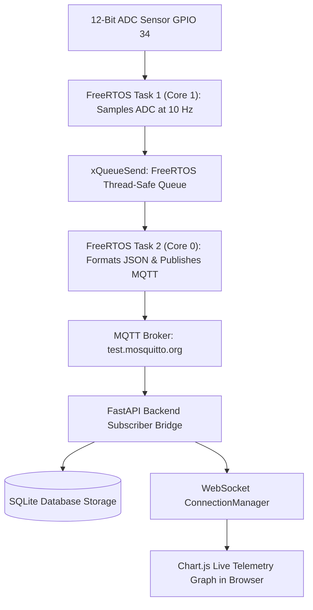

# Lesson 10.2 Course 6 Capstone Project - Production End-to-End IoT Gateway & Dashboard

> **Course**: Iot Hardware | **Module**: Module 1 | **Difficulty**: beginner

---

- **Estimated Time**: 90 Minutes (30m Reading | 45m Practice | 15m Quiz)
- **Difficulty Level**: ⭐⭐⭐ Advanced
- **Prerequisites**: [Lesson 10.1 Full-Stack IoT Architecture](file:///d:/My%20Drive/all%20files/PROJECT%20FILES/notes/docs/curriculum/_06_iot_hardware/_06_21_fullstack_iot_system_architecture.md)
- **XP Reward**: +100 XP

### Learning Objectives
By the end of this capstone project, you will be able to:
1. Construct production-grade **ESP32 FreeRTOS dual-core firmware** utilizing queues and mutexes.
2. Publish structured JSON telemetry over **MQTT** with non-blocking auto-reconnects.
3. Build a **FastAPI backend microservice** ingesting MQTT streams into a database.
4. Render a live, responsive **HTML5/CSS3/JavaScript Web Dashboard** with real-time **Chart.js** graphing over WebSockets.

---

---

Set up PlatformIO for ESP32 and Python 3.12 with `fastapi`, `uvicorn`, `paho-mqtt`, and `sqlalchemy`.

---

---

### 3.1 Capstone Architecture Blueprint

```
┌─────────────────────────────────────────────────────────────────────────────┐
│                    CAPSTONE END-TO-END IOT DATA FLOW                        │
├─────────────────────────────────────────────────────────────────────────────┤
│ ESP32 Hardware ADC (GPIO 34) ──► FreeRTOS Sensor Task (Core 1)              │
│                                  │ (Thread-Safe Queue)                      │
│                                  ▼                                          │
│ FreeRTOS Telemetry Task (Core 0) ──► Publishes MQTT JSON to Broker          │
│                                  │                                          │
│                                  ▼                                          │
│ FastAPI Backend Microservice     ──► Ingests & Stores Telemetry in SQLite   │
│                                  │                                          │
│                                  ▼                                          │
│ HTML5 / JS Web Dashboard         ◄── Live WebSockets Chart.js Telemetry Graph│
└─────────────────────────────────────────────────────────────────────────────┘
```

---

---



---

---

### 1. ESP32 Production FreeRTOS Firmware (`src/main.cpp`)

```cpp
// ESP32 Capstone Production Firmware (src/main.cpp)
#include <Arduino.h>
#include <WiFi.h>
#include <PubSubClient.h>
#include <ArduinoJson.h>

const char *WIFI_SSID = "YOUR_WIFI_SSID";
const char *WIFI_PASS = "YOUR_WIFI_PASSWORD";
const char *MQTT_BROKER = "test.mosquitto.org";

struct SensorPayload {
  uint16_t adcRaw;
  float voltage;
  uint32_t timestamp;
};

QueueHandle_t telemetryQueue = NULL;
WiFiClient espClient;
PubSubClient mqttClient(espClient);

// 1. Core 1 Task: High-Speed ADC Sensor Sampling
void TaskSensorSampler(void *pvParameters) {
  for (;;) {
    SensorPayload data;
    data.adcRaw = analogRead(GPIO_NUM_34);
    data.voltage = (data.adcRaw / 4095.0) * 3.3;
    data.timestamp = millis();

    xQueueSend(telemetryQueue, &data, 0);
    vTaskDelay(pdMS_TO_TICKS(1000)); // Sample every 1 second
  }
}

// 2. Core 0 Task: Network Management & MQTT Publishing
void TaskNetworkPublisher(void *pvParameters) {
  SensorPayload rxData;

  for (;;) {
    if (WiFi.status() != WL_CONNECTED) {
      WiFi.reconnect();
      vTaskDelay(pdMS_TO_TICKS(2000));
      continue;
    }

    if (!mqttClient.connected()) {
      mqttClient.connect("ESP32-Capstone-Node");
    }
    mqttClient.loop();

    if (xQueueReceive(telemetryQueue, &rxData, pdMS_TO_TICKS(500)) == pdTRUE) {
      JsonDocument doc;
      doc["device"] = "ESP32-GATEWAY-1";
      doc["adc_raw"] = rxData.adcRaw;
      doc["voltage"] = rxData.voltage;
      doc["timestamp"] = rxData.timestamp;

      String jsonString;
      serializeJson(doc, jsonString);

      if (mqttClient.connected()) {
        mqttClient.publish("iot/capstone/telemetry", jsonString.c_str());
        Serial.printf("[CapSTone Firmware Published]: %s\n", jsonString.c_str());
      }
    }

    vTaskDelay(pdMS_TO_TICKS(100));
  }
}

void setup() {
  Serial.begin(115200);
  pinMode(GPIO_NUM_34, INPUT);

  telemetryQueue = xQueueCreate(10, sizeof(SensorPayload));
  
  WiFi.mode(WIFI_STA);
  WiFi.begin(WIFI_SSID, WIFI_PASS);
  mqttClient.setServer(MQTT_BROKER, 1883);

  xTaskCreatePinnedToCore(TaskSensorSampler, "Sampler", 3072, NULL, 2, NULL, 1);
  xTaskCreatePinnedToCore(TaskNetworkPublisher, "Publisher", 4096, NULL, 1, NULL, 0);
}

void loop() {
  vTaskDelete(NULL);
}
```

### 2. FastAPI Ingestion & WebSockets Backend (`server.py`)

```python
# FastAPI Capstone Microservice (server.py)
import json
import asyncio
from fastapi import FastAPI, WebSocket, WebSocketDisconnect
from fastapi.responses import HTMLResponse
import paho.mqtt.client as mqtt

app = FastAPI(title="IoT Capstone Dashboard Backend")

class DashboardManager:
    def __init__(self):
        self.active_sockets: list[WebSocket] = []

    async def connect(self, ws: WebSocket):
        await ws.accept()
        self.active_sockets.append(ws)

    def disconnect(self, ws: WebSocket):
        if ws in self.active_sockets:
            self.active_sockets.remove(ws)

    async def broadcast(self, payload: dict):
        for ws in self.active_sockets:
            await ws.send_json(payload)

manager = DashboardManager()

def on_mqtt(client, userdata, msg):
    try:
        data = json.loads(msg.payload.decode())
        loop = asyncio.get_event_loop()
        if loop.is_running():
            asyncio.run_coroutine_threadsafe(manager.broadcast(data), loop)
    except Exception as e:
        print(f"Error: {e}")

mqtt_c = mqtt.Client()
mqtt_c.on_message = on_mqtt
mqtt_c.connect("test.mosquitto.org", 1883, 60)
mqtt_c.subscribe("iot/capstone/telemetry")
mqtt_c.loop_start()

@app.websocket("/ws/telemetry")
async def ws_endpoint(ws: WebSocket):
    await manager.connect(ws)
    try:
        while True:
            await ws.receive_text()
    except WebSocketDisconnect:
        manager.disconnect(ws)

@app.get("/")
def get_dashboard():
    html_content = """
    <!DOCTYPE html>
    <html>
    <head>
      <title>IoT Live Telemetry Dashboard</title>
      <script src="https://cdn.jsdelivr.net/npm/chart.js"></script>
      <style>
        body { background: #0f172a; color: #f8fafc; font-family: sans-serif; text-align: center; padding: 20px; }
        .container { width: 80%; margin: auto; background: #1e293b; padding: 20px; border-radius: 12px; }
      </style>
    </head>
    <body>
      <div class="container">
        <h2>Live ESP32 ADC Voltage Telemetry</h2>
        <canvas id="telemetryChart"></canvas>
      </div>
      <script>
        const ctx = document.getElementById('telemetryChart').getContext('2d');
        const chart = new Chart(ctx, {
          type: 'line',
          data: { labels: [], datasets: [{ label: 'Voltage (V)', data: [], borderColor: '#38bdf8', fill: false }] }
        });
        const ws = new WebSocket(`ws://${location.host}/ws/telemetry`);
        ws.onmessage = (e) => {
          const payload = JSON.parse(e.data);
          const timeLabel = new Date().toLocaleTimeString();
          if (chart.data.labels.length > 20) { chart.data.labels.shift(); chart.data.datasets[0].data.shift(); }
          chart.data.labels.push(timeLabel);
          chart.data.datasets[0].data.push(payload.voltage);
          chart.update();
        };
      </script>
    </body>
    </html>
    """
    return HTMLResponse(content=html_content)
```

---

---

1. Flash ESP32 production firmware via PlatformIO.
2. Start FastAPI backend: `uvicorn server:app --reload --host 0.0.0.0`.
3. Open browser to `http://localhost:8000/` $\to$ Observe live real-time Chart.js graph plotting ESP32 ADC voltage stream over WebSockets!

---

---

### Q1: How does this capstone architecture ensure high reliability and zero telemetry loss across network drops?
**Answer**: On the ESP32 edge device, hardware sampling is isolated on Core 1 inside a dedicated FreeRTOS task, pushing readings into a thread-safe Queue. If Wi-Fi drops, the Core 0 network task handles reconnect attempts independently while the queue buffers incoming samples without blocking sensor data collection or corrupting memory.

---

---

```json
{
  "quiz_title": "Course 6 Capstone Assessment",
  "questions": [
    {
      "question_id": "Q1",
      "type": "multiple_choice",
      "question_text": "Which combination of technologies powers real-time live charting in the capstone web dashboard?",
      "options": ["WebSockets + Chart.js", "HTTP Polling + Canvas", "MQTT + Flash", "AJAX + SVG"],
      "correct_answer_index": 0,
      "explanation": "WebSockets streams data to Chart.js for real-time live rendering."
    }
  ]
}
```

---

---

```python
# Full-Stack End-to-End Pipeline:
# ESP32 ADC -> FreeRTOS Queue -> MQTT -> FastAPI Bridge -> WebSockets -> Chart.js
```

---
