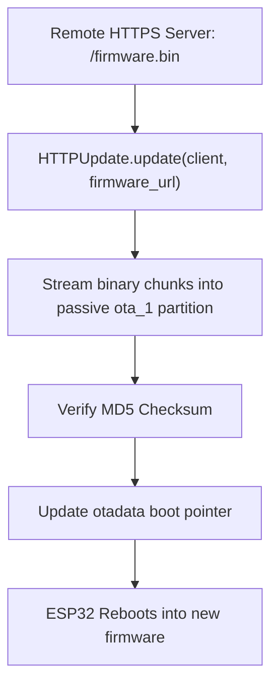

# Lesson 8.1 Over-The-Air (OTA) Firmware Updates

> **Course**: Iot Hardware | **Module**: Module 1 | **Difficulty**: beginner

---

- **Estimated Time**: 55 Minutes (20m Reading | 25m Practice | 10m Quiz)
- **Difficulty Level**: ⭐⭐⭐ Advanced
- **Prerequisites**: [Lesson 7.2 Wake-Up Sources](file:///d:/My%20Drive/all%20files/PROJECT%20FILES/notes/docs/curriculum/_06_iot_hardware/_06_16_deep_sleep_wakeup_sources.md)
- **XP Reward**: +70 XP

### Learning Objectives
By the end of this lesson, you will be able to:
1. Explain the **Dual-Bank OTA Partition Architecture** (`ota_0` vs `ota_1`).
2. Integrate local wireless flashing using **`ArduinoOTA`**.
3. Implement remote HTTPS firmware binary downloads using **`HTTPUpdate`**.
4. Safeguard devices against bricking using automatic boot rollback.

---

---

Open PlatformIO in VS Code.

---

---

### 3.1 Dual-Bank OTA Partition Architecture
Deploying firmware updates to physical IoT devices installed in remote locations requires Over-The-Air (OTA) update capabilities.

The ESP32 uses a dual-app partition table containing two application banks (`ota_0` and `ota_1`). While the active firmware executes from `ota_0`, new firmware is streamed over Wi-Fi into `ota_1`. Once verified, the bootloader updates the OTA data partition to boot from `ota_1` on the next restart:

```
┌─────────────────────────────────────────────────────────────────────────────┐
│                      ESP32 DUAL-BANK OTA PARTITION SCHEME                   │
├─────────────────────────────────────────────────────────────────────────────┤
│ 1. Bootloader reads `otadata` partition                                     │
│ 2. Active Application executing in Bank `ota_0`                             │
│ 3. Wi-Fi streams new `firmware.bin` into Bank `ota_1`                       │
│ 4. System verifies checksum ──► Swaps boot pointer to `ota_1` ──► Reboot!  │
└─────────────────────────────────────────────────────────────────────────────┘
```

> [!SAFETY]
> **Anti-Bricking Rollback**: If the new firmware crashes during startup, the ESP32 bootloader automatically rolls back the boot pointer to the previous working partition.

---

---



---

---

```cpp
// ESP32 ArduinoOTA Local Wireless Flashing (main.cpp)
#include <Arduino.h>
#include <WiFi.h>
#include <ArduinoOTA.h>

const char *WIFI_SSID = "YOUR_WIFI_SSID";
const char *WIFI_PASS = "YOUR_WIFI_PASSWORD";

void setupOTA() {
  // Hostname for local mDNS resolution (esp32-ota.local)
  ArduinoOTA.setHostname("esp32-ota");
  ArduinoOTA.setPassword("admin123"); // Password required for OTA uploads

  ArduinoOTA.onStart([]() {
    String type = (ArduinoOTA.getCommand() == U_FLASH) ? "sketch" : "filesystem";
    Serial.println("\n[OTA Update]: Start updating " + type);
  });

  ArduinoOTA.onEnd([]() {
    Serial.println("\n[OTA Update]: Flash complete! Rebooting...");
  });

  ArduinoOTA.onProgress([](unsigned int progress, unsigned int total) {
    Serial.printf("[OTA Progress]: %u%%\r", (progress / (total / 100)));
  });

  ArduinoOTA.onError([](ota_error_t error) {
    Serial.printf("[OTA Error %u]: ", error);
    if (error == OTA_AUTH_ERROR) Serial.println("Auth Failed");
    else if (error == OTA_BEGIN_ERROR) Serial.println("Begin Failed");
    else if (error == OTA_CONNECT_ERROR) Serial.println("Connect Failed");
    else if (error == OTA_RECEIVE_ERROR) Serial.println("Receive Failed");
    else if (error == OTA_END_ERROR) Serial.println("End Failed");
  });

  ArduinoOTA.begin();
  Serial.println("[OTA Initialized]: Listening for wireless uploads at esp32-ota.local");
}

void setup() {
  Serial.begin(115200);
  delay(1000);

  WiFi.mode(WIFI_STA);
  WiFi.begin(WIFI_SSID, WIFI_PASS);

  while (WiFi.status() != WL_CONNECTED) {
    delay(500);
    Serial.print(".");
  }

  Serial.println("\n[Wi-Fi Connected!]: IP = " + WiFi.localIP().toString());
  setupOTA();
}

void loop() {
  // Handle OTA update network packets!
  ArduinoOTA.handle();

  static uint32_t lastPrint = 0;
  if (millis() - lastPrint > 5000) {
    lastPrint = millis();
    Serial.println("[Firmware v1.0.0]: Running normal application code...");
  }
}
```

---

---

- **Fleet-Wide Fleet Firmware Upgrades**: Fleet management backends issue signed MQTT trigger commands instructing thousands of deployed ESP32 telematics devices to download and verify `v2.1.0.bin` over HTTPS automatically.

---

---

1. Upload initial firmware via USB with `ArduinoOTA` code.
2. In `platformio.ini`, add:
   `upload_protocol = espota`
   `upload_port = esp32-ota.local`
   `upload_flags = --auth=admin123`
3. Click PlatformIO **Upload** $\to$ Observe wireless firmware update flashing over Wi-Fi without USB cables!

---

---

| Bug / Error | Root Cause | Engineering Solution |
| :--- | :--- | :--- |
| **`Not Enough Space` OTA Error** | Default partition table allocs 1.3 MB for `app0` but the binary exceeds maximum size. | Use custom partition tables (e.g. `min_spiffs.csv` or `huge_app.csv`) allocating larger 1.9 MB application banks. |

---

---

- **Call `ArduinoOTA.handle()` Continuously**: Ensure `ArduinoOTA.handle()` is invoked inside `loop()` to process incoming update packets promptly.

---

---

### Q1: How does the ESP32 dual-bank partition table prevent device bricking during Over-The-Air (OTA) updates?
**Answer**: The ESP32 partition table defines two app partitions (`ota_0` and `ota_1`). When an update starts, the active partition continues executing the current app while new firmware is written to the passive partition. Only after full verification (MD5 checksum) does the bootloader update `otadata` to boot the new partition on restart. If the update fails mid-transmission, the original partition remains untouched and bootable.

---

---

```json
{
  "quiz_title": "Lesson 8.1 OTA Updates Assessment",
  "questions": [
    {
      "question_id": "Q1",
      "type": "multiple_choice",
      "question_text": "Which PlatformIO configuration setting enables wireless flashing over local Wi-Fi?",
      "options": ["upload_protocol = espota", "upload_protocol = wifi", "upload_protocol = serial_ota", "upload_protocol = network"],
      "correct_answer_index": 0,
      "explanation": "upload_protocol = espota enables wireless OTA flashing."
    }
  ]
}
```

---

---

Configure `ArduinoOTA` and wirelessly update firmware version strings over Wi-Fi.

---

---

**Front**: What function processes incoming wireless OTA update network packets in the `ArduinoOTA` library?
**Back**: `ArduinoOTA.handle()`.
<!-- flashcard:end -->

---

---

```cpp
ArduinoOTA.setHostname("esp32");
ArduinoOTA.begin();
// In loop():
ArduinoOTA.handle();
```

---
