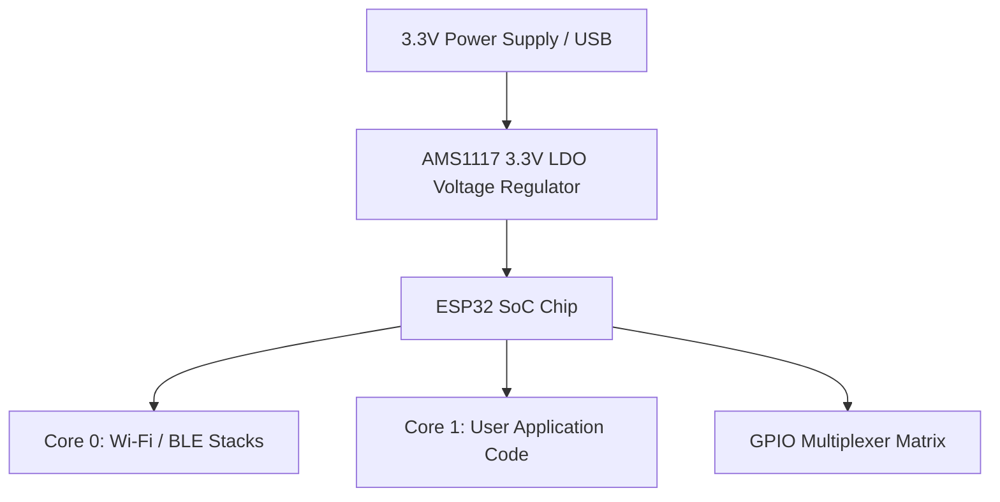

```yaml
schema_version: "2.0"
metadata:
  lesson_id: "IOT-MOD01-LES01"
  course_slug: "course-06-iot-hardware"
  course_title: "Course 6: Embedded Systems, ESP32, FreeRTOS, & Hardware IoT"
  module_slug: "mod-01-esp32-architecture"
  module_title: "Module 1 - ESP32 Microcontroller Architecture & Environment Setup"
  lesson_slug: "esp32-architecture-and-pinout"
  lesson_title: "Lesson 1.1 ESP32 Hardware Architecture & Dual-Core Xtensa/RISC-V"
  sort_order: 101

pedagogy:
  difficulty: "beginner"
  estimated_time:
    reading_minutes: 15
    practice_minutes: 20
    quiz_minutes: 10
    total_minutes: 45
  bloom_taxonomy_level: "Apply"
  xp_reward: 50

prerequisites:
  required_lesson_ids:
    - "FAP-MOD10-LES02"
  required_skills:
    - "Basic C/C++ Concepts & Digital Electronics Fundamentals"

skills_acquired:
  - "Understanding ESP32 System-on-Chip (SoC) Architecture"
  - "Dual-Core Tensilica Xtensa LX6 / RISC-V Microprocessors"
  - "Memory Map Layout (SRAM, Flash, RTC Memory)"
  - "GPIO Pinout Classification (Strapping Pins, Input-Only Pins, RTC GPIOs)"

dependencies:
  software:
    - "VS Code"
  hardware:
    - "ESP32 DevKit v1 Development Board"
    - "Micro-USB / USB-C Cable"

seo_and_social:
  meta_title: "ESP32 Architecture: Xtensa LX6 Dual-Core, Memory Map & GPIO Pinout"
  meta_description: "Master ESP32 Hardware Architecture: Xtensa LX6 dual-core 32-bit SoC, SRAM memory layout, Wi-Fi/Bluetooth sub-systems, and GPIO pinout constraints."
  keywords: ["ESP32 Architecture", "Xtensa LX6", "ESP32 Pinout", "Dual Core SoC", "SRAM Memory Map", "Strapping Pins"]

assessment_config:
  has_quiz: true
  has_lab: true
  has_flashcards: true
  pass_score_percentage: 80
```

# Lesson 1.1 ESP32 Hardware Architecture & Dual-Core Xtensa/RISC-V

## 1. Overview & Learning Objectives [id: overview]

- **Estimated Time**: 45 Minutes (15m Reading | 20m Practice | 10m Quiz)
- **Difficulty Level**: ⭐ Beginner
- **Prerequisites**: [Lesson 10.2 Production Deployment](file:///d:/My%20Drive/all%20files/PROJECT%20FILES/notes/docs/curriculum/_05_fastapi/_05_20_production_deployment_gunicorn_uvicorn_docker.md)
- **XP Reward**: +50 XP

### Learning Objectives
By the end of this lesson, you will be able to:
1. Explain the **ESP32 System-on-Chip (SoC)** hardware architecture.
2. Differentiate between Core 0 (PRO_CPU) and Core 1 (APP_CPU) dual-core processors.
3. Understand the internal memory layout (SRAM, External SPI Flash, RTC Memory).
4. Identify critical GPIO pin constraints (Input-Only pins, Strapping Pins, Touch Capacitive Pins).

---

## 2. Environment & Prerequisites [id: prerequisites]

Obtain an **ESP32 DevKit v1** board and USB cable.

---

## 3. Theoretical Foundations [id: theory]

### 3.1 ESP32 System-on-Chip (SoC) Architecture
Developed by Espressif Systems, the **ESP32** is a low-cost, low-power 32-bit System-on-Chip (SoC) featuring integrated 2.4 GHz Wi-Fi and Bluetooth LE (BLE).

The core processor comprises two 32-bit Tensilica Xtensa LX6 microprocessors running at up to 240 MHz:
- **Core 0 (PRO_CPU - Protocol CPU)**: Dedicated to Wi-Fi/Bluetooth protocol stacks and background FreeRTOS tasks.
- **Core 1 (APP_CPU - Application CPU)**: Dedicated to user application code and sensor reading algorithms.

```
┌─────────────────────────────────────────────────────────────────────────────┐
│                         ESP32 SOC HARDWARE ARCHITECTURE                     │
├─────────────────────────────────────────────────────────────────────────────┤
│ ┌───────────────────────────┐         ┌───────────────────────────┐         │
│ │ Core 0 (PRO_CPU 240 MHz)  │         │ Core 1 (APP_CPU 240 MHz)  │         │
│ └─────────────┬─────────────┘         └─────────────┬─────────────┘         │
│               └──────────────┬──────────────────────┘                       │
│                              ▼                                              │
│ ┌─────────────────────────────────────────────────────────────────────────┐ │
│ │ 520 KB Internal SRAM | 448 KB ROM | External 4MB/8MB SPI Flash          │ │
│ ├─────────────────────────────────────────────────────────────────────────┤ │
│ │ Wi-Fi 802.11 b/g/n (150 Mbps) | Bluetooth 4.2 / BLE Transceiver          │ │
│ ├─────────────────────────────────────────────────────────────────────────┤ │
│ │ Peripherals: 34 GPIOs, 12-bit ADC, DAC, I2C, SPI, UART, PWM, Capacitive  │ │
│ └─────────────────────────────────────────────────────────────────────────┘ │
└─────────────────────────────────────────────────────────────────────────────┘
```

### 3.2 Critical GPIO Pin Classification
Not all 34 GPIO pins on the ESP32 can be used as general digital outputs:
- **Input-Only Pins (GPIO 34, 35, 36, 39)**: Do NOT have internal pull-up/pull-down resistors and cannot be configured as outputs (`OUTPUT`).
- **Strapping Pins (GPIO 0, 2, 5, 12, 15)**: Sampled during boot to determine flash/bootloader mode. Pulling GPIO 0 LOW puts the ESP32 into Flashing Mode.

---

## 4. Architecture & Diagram Visualizations [id: diagram]



---

## 5. Code & Hardware Implementation [id: syntax]

```cpp
// ESP32 System Chip Info & Core Inspection (main.cpp)
#include <Arduino.h>

void setup() {
  Serial.begin(115200);
  delay(1000);

  Serial.println("==============================================");
  Serial.println("         ESP32 SOC HARDWARE REPORT            ");
  Serial.println("==============================================");

  // Print Chip Details
  Serial.printf("ESP32 Chip Model: %s\n", ESP.getChipModel());
  Serial.printf("Chip Revision: %d\n", ESP.getChipRevision());
  Serial.printf("CPU Cores: %d\n", ESP.getChipCores());
  Serial.printf("CPU Frequency: %d MHz\n", ESP.getCpuFreqMHz());
  Serial.printf("Flash Memory Size: %d MB\n", ESP.getFlashChipSize() / (1024 * 1024));
  Serial.printf("Free Heap SRAM: %d Bytes\n", ESP.getFreeHeap());

  // Identify Active Core executing setup()
  Serial.printf("setup() executing on Core ID: %d\n", xPortGetCoreID());
}

void loop() {
  Serial.printf("loop() executing on Core ID: %d | Free Heap: %d Bytes\n", 
                xPortGetCoreID(), ESP.getFreeHeap());
  delay(5000);
}
```

---

## 6. Enterprise Real-World Applications [id: examples]

- **Industrial IoT Sensor Nodes**: Embedded engineers leverage ESP32's low-power Ultra-Low-Power (ULP) co-processor to keep main cores asleep while monitoring battery-powered agricultural soil sensors.

---

## 7. Guided Step-by-Step Hands-On Exercise [id: exercises]

1. Connect ESP32 DevKit to USB.
2. Upload program via PlatformIO or Arduino IDE at baud rate 115200.
3. Open Serial Monitor $\to$ Inspect dual-core execution report and free SRAM memory!

---

## 8. Common Pitfalls & Troubleshooting [id: common_mistakes]

| Bug / Error | Root Cause | Engineering Solution |
| :--- | :--- | :--- |
| **ESP32 Fails to Boot / Infinite Reset Loop** | Connecting external sensors to Strapping Pins (e.g. GPIO 0 or 12) holding them in illegal boot states. | Avoid using Strapping Pins (GPIO 0, 2, 5, 12, 15) for external pull-up sensors. |

---

## 9. Best Practices & Optimization [id: best_practices]

- **Avoid Input-Only Pins for Outputs**: Never set `pinMode(34, OUTPUT)`—GPIO 34, 35, 36, and 39 are hardware input-only.

---

## 10. Industry Interview Q&A [id: interview_qa]

### Q1: What are ESP32 Strapping Pins and why must engineers exercise caution when connecting external hardware components to them?
**Answer**: Strapping Pins (GPIO 0, 2, 5, 12, 15) are sampled by the internal hardware bootloader during power-up or reset to determine the chip's boot mode (e.g., SPI Flash Boot vs UART Download/Flashing Mode, 3.3V vs 1.8V flash voltage). Connecting external pull-up/pull-down circuits to these pins can force the ESP32 into bootloader mode or prevent normal boot.

---

## 11. Self-Assessment Quiz [id: quiz]

```json
{
  "quiz_title": "Lesson 1.1 ESP32 Architecture Assessment",
  "questions": [
    {
      "question_id": "Q1",
      "type": "multiple_choice",
      "question_text": "Which ESP32 GPIO pin must be pulled LOW during reset to enter UART Flashing Download mode?",
      "options": ["GPIO 16", "GPIO 0", "GPIO 22", "GPIO 34"],
      "correct_answer_index": 1,
      "explanation": "GPIO 0 controls Flashing Download Mode."
    }
  ]
}
```

---

## 12. Portfolio Assignment & Challenge [id: lab]

Write C++ code querying ESP32 CPU frequency, flash size, and active execution Core ID.

---

## 13. Spaced Repetition Flashcards [id: flashcards]

**Front**: Which ESP32 GPIO pins are input-only and cannot be configured as digital outputs?
**Back**: GPIO 34, 35, 36 (VP), and 39 (VN).
<!-- flashcard:end -->

---

## 14. Summary & Cheat Sheet [id: summary]

```cpp
Serial.printf("Core: %d, Freq: %d MHz\n", xPortGetCoreID(), ESP.getCpuFreqMHz());
```
