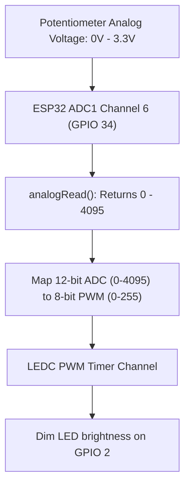

```yaml
schema_version: "2.0"
metadata:
  lesson_id: "IOT-MOD02-LES02"
  course_slug: "course-06-iot-hardware"
  course_title: "Course 6: Embedded Systems, ESP32, FreeRTOS, & Hardware IoT"
  module_slug: "mod-02-gpio-peripherals-protocols"
  module_title: "Module 2 - Peripherals, GPIO, & Communication Protocols"
  lesson_slug: "adc-dac-and-pwm-timer-control"
  lesson_title: "Lesson 2.2 Analog-to-Digital Conversion (ADC) & Pulse Width Modulation (PWM)"
  sort_order: 202

pedagogy:
  difficulty: "beginner"
  estimated_time:
    reading_minutes: 15
    practice_minutes: 20
    quiz_minutes: 10
    total_minutes: 45
  bloom_taxonomy_level: "Apply"
  xp_reward: 50

prerequisites:
  required_lesson_ids:
    - "IOT-MOD02-LES01"
  required_skills:
    - "ESP32 GPIO Pinout & Digital IO"

skills_acquired:
  - "Reading 12-bit ADC Analog Signals (`analogRead()`, 0–4095)"
  - "ADC1 vs ADC2 Architecture & Wi-Fi Limitations"
  - "Configuring LEDC Peripheral PWM Timers (`ledcAttach()`, `ledcWrite()`)"
  - "8-bit Digital-to-Analog Conversion (DAC Output on GPIO 25/26)"

dependencies:
  software:
    - "VS Code"
    - "PlatformIO"
  hardware:
    - "ESP32 DevKit v1 Board"
    - "10k Potentiometer"
    - "LED & 220 Ohm Resistor"

seo_and_social:
  meta_title: "ESP32 Analog & PWM: 12-bit ADC, LEDC Timer Control & DAC Output"
  meta_description: "Master ESP32 Analog & PWM Peripherals: 12-bit ADC (0–4095), ADC1 vs ADC2 Wi-Fi conflict, LEDC PWM timer control, duty cycle calculations, and 8-bit DAC."
  keywords: ["ESP32 ADC", "analogRead", "12-bit ADC", "LEDC PWM", "ESP32 PWM", "DAC Output", "ADC1 ADC2 Conflict"]

assessment_config:
  has_quiz: true
  has_lab: true
  has_flashcards: true
  pass_score_percentage: 80
```

# Lesson 2.2 Analog-to-Digital Conversion (ADC) & Pulse Width Modulation (PWM)

## 1. Overview & Learning Objectives [id: overview]

- **Estimated Time**: 45 Minutes (15m Reading | 20m Practice | 10m Quiz)
- **Difficulty Level**: ⭐ Beginner
- **Prerequisites**: [Lesson 2.1 GPIO & Interrupts](file:///d:/My%20Drive/all%20files/PROJECT%20FILES/notes/docs/curriculum/_06_iot_hardware/_06_03_gpio_digital_io_and_interrupts.md)
- **XP Reward**: +50 XP

### Learning Objectives
By the end of this lesson, you will be able to:
1. Read analog voltage levels using the 12-bit **Analog-to-Digital Converter (ADC)**.
2. Navigate the hardware conflict between **ADC1** and **ADC2** (Wi-Fi co-existence).
3. Generate hardware Pulse Width Modulation (PWM) signals using the **LEDC peripheral**.
4. Produce true analog voltage outputs using the 8-bit **Digital-to-Analog Converter (DAC)** pins.

---

## 2. Environment & Prerequisites [id: prerequisites]

Gather ESP32, 10k Potentiometer, LED, and Jumper Wires.

---

## 3. Theoretical Foundations [id: theory]

### 3.1 12-Bit Analog-to-Digital Conversion (ADC)
The ESP32 features two 12-bit Successive Approximation Register (SAR) ADCs:
- **Resolution**: $2^{12} = 4096$ quantization levels (returns integer values from `0` to `4095`).
- **Input Voltage Range**: Default 0.0V to 3.3V.

```
┌─────────────────────────────────────────────────────────────────────────────┐
│                          ESP32 ADC ARCHITECTURE MATRIX                      │
├─────────────────┬───────────────────────────────────────────────────────────┤
│ ADC Unit        │ Channels & Wi-Fi Co-existence Rules                       │
├─────────────────┼───────────────────────────────────────────────────────────┤
│ **ADC1**        │ 8 Channels (GPIO 32, 33, 34, 35, 36, 39)                  │
│                 │ *Safe to use anytime (Does NOT conflict with Wi-Fi)*      │
├─────────────────┼───────────────────────────────────────────────────────────┤
│ **ADC2**        │ 10 Channels (GPIO 0, 2, 4, 12, 13, 14, 15, 25, 26, 27)    │
│                 │ *RESTRICTED: Cannot be used while Wi-Fi is active!*       │
└─────────────────┴───────────────────────────────────────────────────────────┘
```

### 3.2 Hardware PWM via LEDC Peripheral
ESP32 does not use traditional software PWM. It features 16 independent hardware **LEDC (LED Control)** PWM channels capable of driving LEDs, servos, and motor controllers without CPU intervention:

$$\text{Duty Cycle Voltage} = V_{\text{max}} \times \left( \frac{\text{Duty Value}}{2^{\text{Resolution}} - 1} \right)$$

---

## 4. Architecture & Diagram Visualizations [id: diagram]



---

## 5. Code & Hardware Implementation [id: syntax]

```cpp
// ESP32 ADC Reading & LEDC PWM Control (main.cpp)
#include <Arduino.h>

const gpio_num_t POT_PIN = GPIO_NUM_34; // ADC1 Channel 6 (Safe with Wi-Fi!)
const gpio_num_t LED_PIN = GPIO_NUM_2;   // PWM Output Pin

const uint32_t PWM_FREQ = 5000;         // 5 kHz Frequency
const uint8_t PWM_RESOLUTION = 8;       // 8-bit resolution (0 - 255)

void setup() {
  Serial.begin(115200);

  // Configure ADC Pin
  pinMode(POT_PIN, INPUT);

  // Attach LED Pin to LEDC PWM Hardware Engine (Arduino Core 3.0+ API)
  ledcAttach(LED_PIN, PWM_FREQ, PWM_RESOLUTION);

  Serial.println("[ADC & PWM Initialized]: Turn potentiometer connected to GPIO 34.");
}

void loop() {
  // 1. Read 12-bit Raw ADC Value (0 - 4095)
  uint16_t rawAdc = analogRead(POT_PIN);

  // Read calibrated voltage in millivolts (mV)
  uint32_t milliVolts = analogReadMilliVolts(POT_PIN);

  // 2. Map 12-bit ADC (0-4095) to 8-bit PWM Duty Cycle (0-255)
  uint8_t pwmDuty = map(rawAdc, 0, 4095, 0, 255);

  // 3. Write Duty Cycle to LEDC PWM Hardware Engine
  ledcWrite(LED_PIN, pwmDuty);

  Serial.printf("[ADC Raw]: %4u | [Voltage]: %4u mV | [PWM Duty]: %3u/255\n",
                rawAdc, milliVolts, pwmDuty);

  delay(200);
}
```

---

## 6. Enterprise Real-World Applications [id: examples]

- **Smart Lighting & Motor Controllers**: Industrial automation gateways sample 0–10V industrial analog pressure sensors via voltage divider circuits into ADC1 and control high-speed BLDC motor drivers using LEDC PWM timers.

---

## 7. Guided Step-by-Step Hands-On Exercise [id: exercises]

1. Wire Potentiometer outer pins to 3.3V and GND, center wiper pin to GPIO 34.
2. Upload program via PlatformIO.
3. Open Serial Monitor $\to$ Turn potentiometer knob $\to$ Observe smooth LED dimming and real-time millivolt readout!

---

## 8. Common Pitfalls & Troubleshooting [id: common_mistakes]

| Bug / Error | Root Cause | Engineering Solution |
| :--- | :--- | :--- |
| **`analogRead()` Fails or Returns 0 when Wi-Fi is On** | Reading analog sensors connected to **ADC2** pins (e.g. GPIO 4 or 14) while Wi-Fi is connected. | Connect all analog sensors to **ADC1** pins (GPIO 32, 33, 34, 35, 36, 39). |

---

## 9. Best Practices & Optimization [id: best_practices]

- **Always Use ADC1 for Sensors**: Always map analog sensors to ADC1 channels to avoid Wi-Fi driver channel pre-emption conflicts.

---

## 10. Industry Interview Q&A [id: interview_qa]

### Q1: Why should embedded engineers avoid connecting analog sensors to ADC2 pins on the ESP32 in connected IoT applications?
**Answer**: ADC2 is shared internally with the ESP32's 2.4 GHz Wi-Fi transceiver hardware controller. When Wi-Fi is actively sending or receiving packets, the Wi-Fi driver takes priority and locks ADC2, causing `analogRead()` calls on ADC2 pins to return invalid zero values or throw runtime errors. Analog sensors should always be connected to ADC1 (GPIO 32–39).

---

## 11. Self-Assessment Quiz [id: quiz]

```json
{
  "quiz_title": "Lesson 2.2 ADC & PWM Assessment",
  "questions": [
    {
      "question_id": "Q1",
      "type": "multiple_choice",
      "question_text": "What is the native bit resolution of the ESP32 Analog-to-Digital Converter (ADC)?",
      "options": ["8-bit (0-255)", "10-bit (0-1023)", "12-bit (0-4095)", "16-bit"],
      "correct_answer_index": 2,
      "explanation": "ESP32 ADC has 12-bit resolution returning 0-4095."
    }
  ]
}
```

---

## 12. Portfolio Assignment & Challenge [id: lab]

Read ADC1 channel 6 and write scaled PWM duty cycles to an LED.

---

## 13. Spaced Repetition Flashcards [id: flashcards]

**Front**: Which hardware pins on the ESP32 support 8-bit true Digital-to-Analog (DAC) voltage output?
**Back**: GPIO 25 (DAC1) and GPIO 26 (DAC2).
<!-- flashcard:end -->

---

## 14. Summary & Cheat Sheet [id: summary]

```cpp
uint16_t adc = analogRead(34);
ledcAttach(2, 5000, 8);
ledcWrite(2, 128);
```
