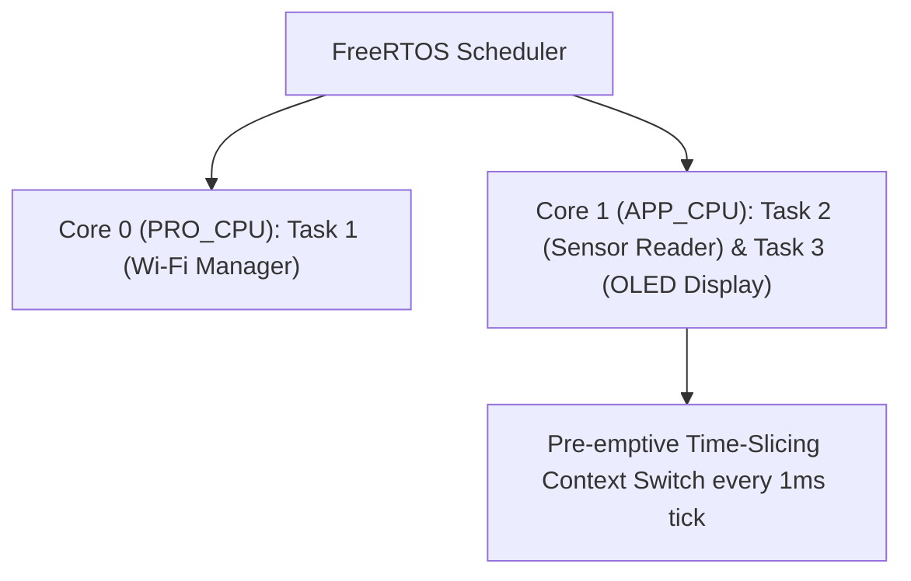

```yaml
schema_version: "2.0"
metadata:
  lesson_id: "IOT-MOD03-LES01"
  course_slug: "course-06-iot-hardware"
  course_title: "Course 6: Embedded Systems, ESP32, FreeRTOS, & Hardware IoT"
  module_slug: "mod-03-freertos-core"
  module_title: "Module 3 - Real-Time Operating System (FreeRTOS Core Mechanics)"
  lesson_slug: "freertos-task-creation-and-core-pinning"
  lesson_title: "Lesson 3.1 FreeRTOS Task Creation, Multi-Threading, & Core Pinning"
  sort_order: 301

pedagogy:
  difficulty: "intermediate"
  estimated_time:
    reading_minutes: 20
    practice_minutes: 25
    quiz_minutes: 10
    total_minutes: 55
  bloom_taxonomy_level: "Apply"
  xp_reward: 60

prerequisites:
  required_lesson_ids:
    - "IOT-MOD02-LES03"
  required_skills:
    - "ESP32 Dual-Core Architecture & C++ Fundamentals"

skills_acquired:
  - "Understanding Real-Time Operating System (RTOS) Multi-Threading"
  - "Creating Tasks via `xTaskCreate()` and `xTaskCreatePinnedToCore()`"
  - "Assigning Tasks to Core 0 (PRO_CPU) vs Core 1 (APP_CPU)"
  - "Task Function Signature & Infinite Execution Loops"

dependencies:
  software:
    - "VS Code"
    - "PlatformIO"
  hardware:
    - "ESP32 DevKit v1 Board"

seo_and_social:
  meta_title: "ESP32 FreeRTOS Tasks: xTaskCreate, xTaskCreatePinnedToCore & Dual-Core Pinning"
  meta_description: "Master FreeRTOS Multi-Threading on ESP32: creating tasks with xTaskCreate(), dual-core task pinning with xTaskCreatePinnedToCore(), and stack allocation."
  keywords: ["FreeRTOS ESP32", "xTaskCreatePinnedToCore", "xTaskCreate", "Dual Core Pinning", "FreeRTOS Multi-threading", "APP_CPU PRO_CPU"]

assessment_config:
  has_quiz: true
  has_lab: true
  has_flashcards: true
  pass_score_percentage: 80
```

# Lesson 3.1 FreeRTOS Task Creation, Multi-Threading, & Core Pinning

## 1. Overview & Learning Objectives [id: overview]

- **Estimated Time**: 55 Minutes (20m Reading | 25m Practice | 10m Quiz)
- **Difficulty Level**: ⭐⭐ Intermediate
- **Prerequisites**: [Lesson 2.3 Serial Protocols](file:///d:/My%20Drive/all%20files/PROJECT%20FILES/notes/docs/curriculum/_06_iot_hardware/_06_05_i2c_spi_and_uart_communication.md)
- **XP Reward**: +60 XP

### Learning Objectives
By the end of this lesson, you will be able to:
1. Explain the architectural necessity of a **Real-Time Operating System (RTOS)** in embedded applications.
2. Create concurrent threads using **`xTaskCreate()`**.
3. Pin specific tasks to Core 0 (PRO_CPU) or Core 1 (APP_CPU) using **`xTaskCreatePinnedToCore()`**.
4. Construct proper FreeRTOS task functions with infinite loops and stack allocations.

---

## 2. Environment & Prerequisites [id: prerequisites]

Open PlatformIO in VS Code with ESP32 connected via USB.

---

## 3. Theoretical Foundations [id: theory]

### 3.1 Why FreeRTOS on ESP32?
Single-threaded microcontrollers run code inside a single `loop()`. If a network operation (like a Wi-Fi HTTP POST) takes 2 seconds to complete, the entire microcontroller freezes, missing button presses and sensor reads.

**FreeRTOS** is an open-source Real-Time Operating System integrated into the ESP32 framework. It enables **pre-emptive multi-tasking**, allowing the ESP32 scheduler to switch execution between independent threads (tasks) in microseconds:

```
┌─────────────────────────────────────────────────────────────────────────────┐
│                      ESP32 DUAL-CORE FREERTOS SCHEDULER                     │
├─────────────────────────────────────────────────────────────────────────────┤
│ Core 0 (PRO_CPU): Wi-Fi / BLE Protocol Task | Background Data Processing    │
│ Core 1 (APP_CPU): Sensor Sampling Task     | Display Update Task            │
└─────────────────────────────────────────────────────────────────────────────┘
```

---

## 4. Architecture & Diagram Visualizations [id: diagram]



---

## 5. Code & Hardware Implementation [id: syntax]

```cpp
// FreeRTOS Task Creation & Dual-Core Pinning (main.cpp)
#include <Arduino.h>

// 1. Task Function for Core 0 (Network Operations)
void TaskNetworkCore0(void *pvParameters) {
  Serial.printf("[Core 0 Task Started] Running on Core: %d\n", xPortGetCoreID());

  for (;;) { // FreeRTOS tasks MUST contain an infinite loop!
    Serial.println("[Core 0]: Simulating Background Wi-Fi Telemetry Upload...");
    vTaskDelay(pdMS_TO_TICKS(3000)); // Non-blocking FreeRTOS delay!
  }
}

// 2. Task Function for Core 1 (Sensor Sampling)
void TaskSensorCore1(void *pvParameters) {
  Serial.printf("[Core 1 Task Started] Running on Core: %d\n", xPortGetCoreID());

  for (;;) {
    Serial.println("  -> [Core 1]: Reading High-Speed Sensor Data...");
    vTaskDelay(pdMS_TO_TICKS(1000));
  }
}

void setup() {
  Serial.begin(115200);
  delay(1000);

  Serial.println("[FreeRTOS Initialization]: Creating Dual-Core Tasks...");

  // Create Task pinned to Core 0 (PRO_CPU)
  xTaskCreatePinnedToCore(
    TaskNetworkCore0,   // Task function reference
    "TaskNetwork",      // Human-readable task name
    4096,               // Stack size in Bytes
    NULL,               // Task input parameter
    1,                  // Task Priority (1 = Low, 24 = High)
    NULL,               // Task Handle
    0                   // Pin to Core 0 (PRO_CPU)
  );

  // Create Task pinned to Core 1 (APP_CPU)
  xTaskCreatePinnedToCore(
    TaskSensorCore1,
    "TaskSensor",
    4096,
    NULL,
    2,                  // Higher Priority 2
    NULL,
    1                   // Pin to Core 1 (APP_CPU)
  );
}

void loop() {
  // FreeRTOS setup runs setup() and loop() inside an automatic Core 1 task!
  vTaskDelete(NULL); // Delete default loop task to free memory if unused!
}
```

---

## 6. Enterprise Real-World Applications [id: examples]

- **Smart Medical & Automotive IoT**: Automotive telemetry controllers pin high-speed CAN-bus motor telemetry tasks to Core 1 with high priority, while background cellular Cloud sync tasks execute independently on Core 0.

---

## 7. Guided Step-by-Step Hands-On Exercise [id: exercises]

1. Save code as `src/main.cpp`.
2. Upload via PlatformIO.
3. Open Serial Monitor $\to$ Observe concurrent task logs executing simultaneously on Core 0 and Core 1!

---

## 8. Common Pitfalls & Troubleshooting [id: common_mistakes]

| Bug / Error | Root Cause | Engineering Solution |
| :--- | :--- | :--- |
| **`Task Watchdog Got Triggered` Crash** | Forgetting to call `vTaskDelay()` inside an infinite `for (;;)` task loop. | Always include `vTaskDelay(pdMS_TO_TICKS(ms))` inside FreeRTOS task loops to feed the Task Watchdog Timer (TWDT). |

---

## 9. Best Practices & Optimization [id: best_practices]

- **Always Include `vTaskDelay()`**: Never write a tight `for (;;)` loop in FreeRTOS without `vTaskDelay()`, otherwise the Watchdog Timer will reset the chip.

---

## 10. Industry Interview Q&A [id: interview_qa]

### Q1: What is the difference between `xTaskCreate()` and `xTaskCreatePinnedToCore()` in ESP32 FreeRTOS?
**Answer**: `xTaskCreate()` allows the FreeRTOS scheduler to assign the created task to whichever core is currently available. `xTaskCreatePinnedToCore()` allows the developer to explicitly pin the task to Core 0 (`PRO_CPU`) or Core 1 (`APP_CPU`), guaranteeing deterministic execution for time-sensitive tasks.

---

## 11. Self-Assessment Quiz [id: quiz]

```json
{
  "quiz_title": "Lesson 3.1 FreeRTOS Tasks Assessment",
  "questions": [
    {
      "question_id": "Q1",
      "type": "multiple_choice",
      "question_text": "Which FreeRTOS function pins a created task to a specific ESP32 CPU core?",
      "options": ["xTaskCreate()", "xTaskCreatePinnedToCore()", "vTaskCoreAssign()", "vTaskBindCore()"],
      "correct_answer_index": 1,
      "explanation": "xTaskCreatePinnedToCore() pins tasks to specific CPU cores."
    }
  ]
}
```

---

## 12. Portfolio Assignment & Challenge [id: lab]

Create two FreeRTOS tasks pinned to Core 0 and Core 1 logging messages at 1s and 2s intervals.

---

## 13. Spaced Repetition Flashcards [id: flashcards]

**Front**: What function converts milliseconds to FreeRTOS system scheduler ticks?
**Back**: `pdMS_TO_TICKS(milliseconds)`.
<!-- flashcard:end -->

---

## 14. Summary & Cheat Sheet [id: summary]

```cpp
void Task(void *p) { for(;;) { vTaskDelay(pdMS_TO_TICKS(1000)); } }
xTaskCreatePinnedToCore(Task, "Name", 4096, NULL, 1, NULL, 0);
```
