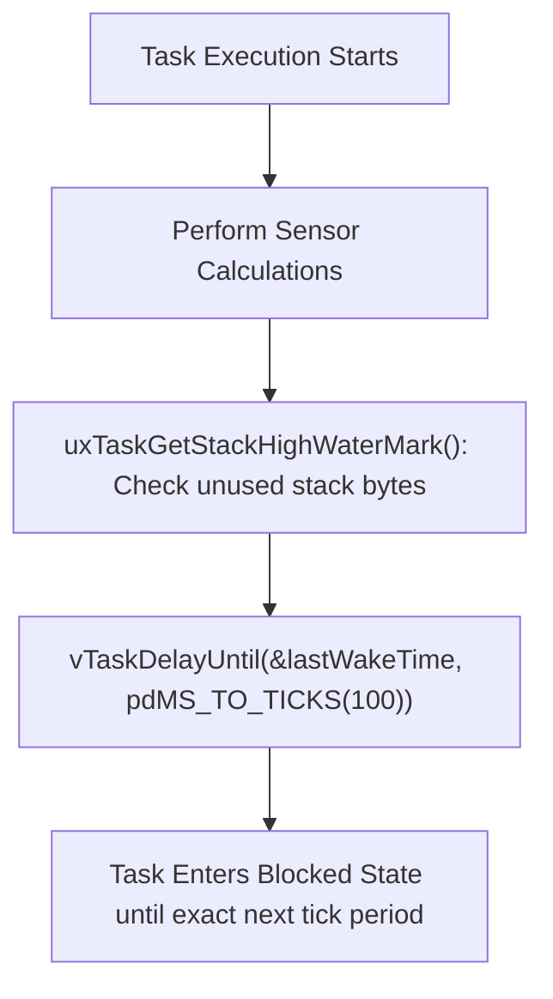

```yaml
schema_version: "2.0"
metadata:
  lesson_id: "IOT-MOD03-LES02"
  course_slug: "course-06-iot-hardware"
  course_title: "Course 6: Embedded Systems, ESP32, FreeRTOS, & Hardware IoT"
  module_slug: "mod-03-freertos-core"
  module_title: "Module 3 - Real-Time Operating System (FreeRTOS Core Mechanics)"
  lesson_slug: "freertos-task-priorities-delays-and-stack"
  lesson_title: "Lesson 3.2 Task Priorities, Delays, & Stack Management"
  sort_order: 302

pedagogy:
  difficulty: "intermediate"
  estimated_time:
    reading_minutes: 15
    practice_minutes: 20
    quiz_minutes: 10
    total_minutes: 45
  bloom_taxonomy_level: "Apply"
  xp_reward: 50

prerequisites:
  required_lesson_ids:
    - "IOT-MOD03-LES01"
  required_skills:
    - "FreeRTOS Task Creation & Dual-Core Pinning"

skills_acquired:
  - "Configuring FreeRTOS Pre-emptive Priorities (0 to 24)"
  - "Periodic Task Scheduling using `vTaskDelayUntil()`"
  - "Detecting Stack Overflows via `uxTaskGetStackHighWaterMark()`"
  - "Task Lifecycle Management (`vTaskSuspend()`, `vTaskResume()`, `vTaskDelete()`)"

dependencies:
  software:
    - "VS Code"
    - "PlatformIO"
  hardware:
    - "ESP32 DevKit v1 Board"

seo_and_social:
  meta_title: "FreeRTOS Priorities & Stack: vTaskDelayUntil, Stack High Water Mark & Task Control"
  meta_description: "Master FreeRTOS Scheduling & Memory: task priorities (0-24), periodic scheduling with vTaskDelayUntil(), checking stack overflow with uxTaskGetStackHighWaterMark()."
  keywords: ["FreeRTOS Priorities", "vTaskDelayUntil", "uxTaskGetStackHighWaterMark", "Stack Overflow ESP32", "vTaskSuspend", "Preemptive Scheduling"]

assessment_config:
  has_quiz: true
  has_lab: true
  has_flashcards: true
  pass_score_percentage: 80
```

# Lesson 3.2 Task Priorities, Delays, & Stack Management

## 1. Overview & Learning Objectives [id: overview]

- **Estimated Time**: 45 Minutes (15m Reading | 20m Practice | 10m Quiz)
- **Difficulty Level**: ⭐⭐ Intermediate
- **Prerequisites**: [Lesson 3.1 Task Creation](file:///d:/My%20Drive/all%20files/PROJECT%20FILES/notes/docs/curriculum/_06_iot_hardware/_06_06_freertos_task_creation_and_core_pinning.md)
- **XP Reward**: +50 XP

### Learning Objectives
By the end of this lesson, you will be able to:
1. Configure FreeRTOS pre-emptive task priorities (0 = lowest, 24 = highest).
2. Implement precise periodic task scheduling using **`vTaskDelayUntil()`**.
3. Detect stack memory overflow risks using **`uxTaskGetStackHighWaterMark()`**.
4. Control task lifecycles using `vTaskSuspend()`, `vTaskResume()`, and `vTaskDelete()`.

---

## 2. Environment & Prerequisites [id: prerequisites]

Open PlatformIO in VS Code.

---

## 3. Theoretical Foundations [id: theory]

### 3.1 Pre-emptive Priority Scheduling
FreeRTOS uses a **Pre-emptive Fixed-Priority Scheduler**. Higher priority tasks instantly pre-empt (pause) lower priority tasks whenever they enter the `Ready` state.

```
┌─────────────────────────────────────────────────────────────────────────────┐
│                         FREERTOS TASK STATE MATRIX                          │
├─────────────────┬───────────────────────────────────────────────────────────┤
│ Task State      │ Description                                               │
├─────────────────┼───────────────────────────────────────────────────────────┤
│ **Running**     │ Currently executing on CPU core                           │
│ **Ready**       │ Prepared to run; waiting for scheduler CPU time           │
│ **Blocked**     │ Waiting for a delay (`vTaskDelay`) or queue event         │
│ **Suspended**   │ Explicitly paused via `vTaskSuspend()`                    │
└─────────────────┴───────────────────────────────────────────────────────────┘
```

### 3.2 `vTaskDelay()` vs `vTaskDelayUntil()`
- **`vTaskDelay(ms)`**: Delays execution for $N$ milliseconds *relative to when the function is called*. Execution drift accumulates over time.
- **`vTaskDelayUntil(&lastWakeTime, ms)`**: Delays execution for an *absolute periodic frequency* (e.g. exactly 100 Hz), guaranteeing zero execution drift regardless of task processing time.

---

## 4. Architecture & Diagram Visualizations [id: diagram]



---

## 5. Code & Hardware Implementation [id: syntax]

```cpp
// FreeRTOS Task Priorities, Periodic Delay, & Stack Monitoring (main.cpp)
#include <Arduino.h>

TaskHandle_t TaskHandleHigh = NULL;
TaskHandle_t TaskHandleLow = NULL;

// 1. High-Priority Periodic Task (Runs every 1000ms exactly)
void TaskHighPriorityPeriod(void *pvParameters) {
  TickType_t xLastWakeTime = xTaskGetTickCount();
  const TickType_t xFrequency = pdMS_TO_TICKS(1000);

  for (;;) {
    // Precise periodic delay (Guarantees no drift!)
    vTaskDelayUntil(&xLastWakeTime, xFrequency);

    // Check remaining unused stack memory in words (1 word = 4 bytes)
    UBaseType_t remainingStackWords = uxTaskGetStackHighWaterMark(NULL);
    uint32_t remainingStackBytes = remainingStackWords * sizeof(void*);

    Serial.printf("[HIGH PRIORITY TASK]: Executed Periodic Tick | Remaining Stack: %u Bytes\n", 
                  remainingStackBytes);
  }
}

// 2. Low-Priority Background Task
void TaskLowPriorityBackground(void *pvParameters) {
  for (;;) {
    Serial.println("  -> [LOW PRIORITY TASK]: Idle Processing...");
    vTaskDelay(pdMS_TO_TICKS(2500));
  }
}

void setup() {
  Serial.begin(115200);
  delay(1000);

  Serial.println("[FreeRTOS Stack & Priority Demo Initialized]");

  // High Priority Task (Priority 5)
  xTaskCreatePinnedToCore(
    TaskHighPriorityPeriod,
    "HighPriorityTask",
    2048,               // 2048 bytes stack allocation
    NULL,
    5,                  // High Priority = 5
    &TaskHandleHigh,
    1
  );

  // Low Priority Task (Priority 1)
  xTaskCreatePinnedToCore(
    TaskLowPriorityBackground,
    "LowPriorityTask",
    2048,
    NULL,
    1,                  // Low Priority = 1
    &TaskHandleLow,
    1
  );
}

void loop() {
  vTaskDelete(NULL);
}
```

---

## 6. Enterprise Real-World Applications [id: examples]

- **Flight & Robot Control Loops**: High-precision robotics controllers use `vTaskDelayUntil()` to execute PID motor balance loops at exact 500 Hz intervals without timing jitter.

---

## 7. Guided Step-by-Step Hands-On Exercise [id: exercises]

1. Save code as `src/main.cpp`.
2. Upload via PlatformIO.
3. Open Serial Monitor $\to$ Observe precise 1000ms high-priority tick executions and unused stack memory reports!

---

## 8. Common Pitfalls & Troubleshooting [id: common_mistakes]

| Bug / Error | Root Cause | Engineering Solution |
| :--- | :--- | :--- |
| **`Stack overflow in task HighPriorityTask` Crash** | Allocating large local array buffers (`char buffer[4000]`) inside a task with only 2048 bytes stack allocation. | Increase stack size in `xTaskCreate` or allocate large arrays dynamically on the heap. |

---

## 9. Best Practices & Optimization [id: best_practices]

- **Use `uxTaskGetStackHighWaterMark()` During Tuning**: Call `uxTaskGetStackHighWaterMark()` to inspect minimum unused stack memory and optimize task stack size allocations.

---

## 10. Industry Interview Q&A [id: interview_qa]

### Q1: What is the difference between `vTaskDelay()` and `vTaskDelayUntil()` in FreeRTOS?
**Answer**: `vTaskDelay(ms)` blocks the task for $N$ milliseconds starting from the moment `vTaskDelay` is executed, causing execution time drift if processing time fluctuates. `vTaskDelayUntil(&lastWakeTime, frequency)` calculates the exact absolute tick count for the next execution period, guaranteeing a fixed periodic execution frequency without timing drift.

---

## 11. Self-Assessment Quiz [id: quiz]

```json
{
  "quiz_title": "Lesson 3.2 Stack & Priorities Assessment",
  "questions": [
    {
      "question_id": "Q1",
      "type": "multiple_choice",
      "question_text": "Which FreeRTOS function queries the minimum amount of unused stack memory remaining for a task since it started running?",
      "options": ["vTaskGetFreeMemory()", "uxTaskGetStackHighWaterMark()", "xTaskGetRemainingStack()", "vTaskStackCheck()"],
      "correct_answer_index": 1,
      "explanation": "uxTaskGetStackHighWaterMark() checks minimum unused stack memory."
    }
  ]
}
```

---

## 12. Portfolio Assignment & Challenge [id: lab]

Use `vTaskDelayUntil()` to create a 200 Hz periodic task and monitor stack high water mark.

---

## 13. Spaced Repetition Flashcards [id: flashcards]

**Front**: What FreeRTOS function permanently deletes a task and frees its stack memory allocation?
**Back**: `vTaskDelete(taskHandle)`.
<!-- flashcard:end -->

---

## 14. Summary & Cheat Sheet [id: summary]

```cpp
TickType_t last = xTaskGetTickCount();
vTaskDelayUntil(&last, pdMS_TO_TICKS(100));
uint32_t unused = uxTaskGetStackHighWaterMark(NULL);
```
