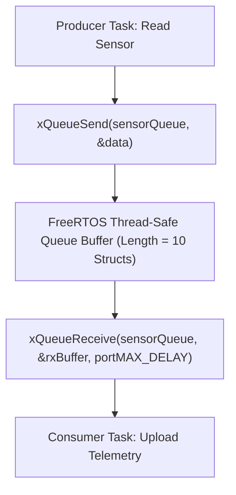

```yaml
schema_version: "2.0"
metadata:
  lesson_id: "IOT-MOD04-LES01"
  course_slug: "course-06-iot-hardware"
  course_title: "Course 6: Embedded Systems, ESP32, FreeRTOS, & Hardware IoT"
  module_slug: "mod-04-freertos-ipc-sync"
  module_title: "Module 4 - FreeRTOS Inter-Task Communication & Synchronization"
  lesson_slug: "freertos-queues-and-inter-task-messaging"
  lesson_title: "Lesson 4.1 FreeRTOS Queues & Inter-Task Messaging"
  sort_order: 401

pedagogy:
  difficulty: "intermediate"
  estimated_time:
    reading_minutes: 20
    practice_minutes: 25
    quiz_minutes: 10
    total_minutes: 55
  bloom_taxonomy_level: "Apply"
  xp_reward: 60

prerequisites:
  required_lesson_ids:
    - "IOT-MOD03-LES02"
  required_skills:
    - "FreeRTOS Task Creation, Priorities, & Stack Management"

skills_acquired:
  - "Thread-Safe Inter-Task Communication using FreeRTOS Queues"
  - "Creating Queues (`xQueueCreate()`)"
  - "Sending Messages (`xQueueSend()`, `xQueueSendFromISR()`)"
  - "Receiving Messages (`xQueueReceive()`)"
  - "Decoupling Producer and Consumer Tasks"

dependencies:
  software:
    - "VS Code"
    - "PlatformIO"
  hardware:
    - "ESP32 DevKit v1 Board"

seo_and_social:
  meta_title: "FreeRTOS Queues: xQueueCreate, xQueueSend, xQueueReceive & Thread Safety"
  meta_description: "Master FreeRTOS Inter-Task Messaging: thread-safe queues with xQueueCreate(), sending data with xQueueSend(), receiving with xQueueReceive(), and ISR queueing."
  keywords: ["FreeRTOS Queues", "xQueueCreate", "xQueueSend", "xQueueReceive", "xQueueSendFromISR", "Thread-safe Messaging"]

assessment_config:
  has_quiz: true
  has_lab: true
  has_flashcards: true
  pass_score_percentage: 80
```

# Lesson 4.1 FreeRTOS Queues & Inter-Task Messaging

## 1. Overview & Learning Objectives [id: overview]

- **Estimated Time**: 55 Minutes (20m Reading | 25m Practice | 10m Quiz)
- **Difficulty Level**: ⭐⭐ Intermediate
- **Prerequisites**: [Lesson 3.2 Task Priorities](file:///d:/My%20Drive/all%20files/PROJECT%20FILES/notes/docs/curriculum/_06_iot_hardware/_06_07_freertos_task_priorities_delays_and_stack.md)
- **XP Reward**: +60 XP

### Learning Objectives
By the end of this lesson, you will be able to:
1. Explain the necessity of thread-safe **Inter-Task Communication (IPC)**.
2. Instantiate FIFO queues using **`xQueueCreate()`**.
3. Send data structures safely between tasks using **`xQueueSend()`** and **`xQueueSendFromISR()`**.
4. Receive and process queued messages using **`xQueueReceive()`**.

---

## 2. Environment & Prerequisites [id: prerequisites]

Open PlatformIO in VS Code.

---

## 3. Theoretical Foundations [id: theory]

### 3.1 Why FreeRTOS Queues?
Sharing raw C++ global variables between concurrent tasks leads to **Data Race Conditions**—one task reads a variable while another task overwrites it mid-byte.

**FreeRTOS Queues** provide thread-safe FIFO (First-In, First-Out) data pipes:
- **Pass by Value**: Data copied into the queue is physically duplicated into queue memory, preventing pointer corruption.
- **Blocking Capabilities**: Tasks attempting to read from an empty queue block automatically until a message arrives, consuming zero CPU cycles while waiting!

```
┌─────────────────────────────────────────────────────────────────────────────┐
│                         FREERTOS QUEUE PIPELINE                             │
├─────────────────────────────────────────────────────────────────────────────┤
│ Producer Task ──► `xQueueSend(queue, &sensorData, 0)`                       │
│                     │ (FIFO Buffer Array - Thread Safe Copy)                │
│                     ▼                                                       │
│ Consumer Task ◄── `xQueueReceive(queue, &rxData, portMAX_DELAY)`           │
└─────────────────────────────────────────────────────────────────────────────┘
```

---

## 4. Architecture & Diagram Visualizations [id: diagram]



---

## 5. Code & Hardware Implementation [id: syntax]

```cpp
// FreeRTOS Queues & Inter-Task Messaging (main.cpp)
#include <Arduino.h>

// Sensor Data Payload Structure
struct SensorData {
  char sensorId[16];
  float temperature;
  uint32_t timestamp;
};

QueueHandle_t sensorQueue = NULL;

// 1. Producer Task: Samples sensor data and sends to Queue
void TaskProducer(void *pvParameters) {
  float mockTemp = 20.0;

  for (;;) {
    SensorData data;
    snprintf(data.sensorId, sizeof(data.sensorId), "ESP32-S1");
    data.temperature = mockTemp;
    data.timestamp = millis();

    mockTemp += 0.5;
    if (mockTemp > 35.0) mockTemp = 20.0;

    // Send copy of data struct to queue (Timeout = 0)
    if (xQueueSend(sensorQueue, &data, 0) == pdPASS) {
      Serial.printf("[Producer]: Queued Temp = %.1f°C\n", data.temperature);
    } else {
      Serial.println("[Producer Error]: Queue Full! Message dropped.");
    }

    vTaskDelay(pdMS_TO_TICKS(1500));
  }
}

// 2. Consumer Task: Receives data from Queue and processes it
void TaskConsumer(void *pvParameters) {
  SensorData rxData;

  for (;;) {
    // Block indefinitely (portMAX_DELAY) until a message arrives in the queue!
    if (xQueueReceive(sensorQueue, &rxData, portMAX_DELAY) == pdTRUE) {
      Serial.printf("  -> [Consumer Received]: Sensor=%s | Temp=%.1f°C | Time=%u ms\n",
                    rxData.sensorId, rxData.temperature, rxData.timestamp);
    }
  }
}

void setup() {
  Serial.begin(115200);
  delay(1000);

  // Create Queue holding up to 10 SensorData items
  sensorQueue = xQueueCreate(10, sizeof(SensorData));

  if (sensorQueue != NULL) {
    Serial.println("[Queue Created Successfully]: Launching Tasks...");

    xTaskCreatePinnedToCore(TaskProducer, "Producer", 3072, NULL, 2, NULL, 1);
    xTaskCreatePinnedToCore(TaskConsumer, "Consumer", 3072, NULL, 1, NULL, 1);
  }
}

void loop() {
  vTaskDelete(NULL);
}
```

---

## 6. Enterprise Real-World Applications [id: examples]

- **IoT Telemetry Ingestion Architecture**: High-speed sensor ISRs and hardware UART tasks push incoming sensor packets into a FreeRTOS Queue (`xQueueSendFromISR`), allowing background MQTT publisher tasks to transmit telemetry non-blockingly.

---

## 7. Guided Step-by-Step Hands-On Exercise [id: exercises]

1. Save code as `src/main.cpp`.
2. Upload via PlatformIO.
3. Open Serial Monitor $\to$ Observe Producer queuing messages every 1.5s and Consumer instantly receiving them!

---

## 8. Common Pitfalls & Troubleshooting [id: common_mistakes]

| Bug / Error | Root Cause | Engineering Solution |
| :--- | :--- | :--- |
| **Crash when calling `xQueueSendFromISR`** | Calling standard `xQueueSend()` inside an ISR function instead of the ISR-safe variant `xQueueSendFromISR()`. | Always use `xQueueSendFromISR()` when pushing messages from an Interrupt Service Routine. |

---

## 9. Best Practices & Optimization [id: best_practices]

- **Use `portMAX_DELAY` for Blocked Consumers**: Allows consumer tasks to sleep continuously until data arrives, conserving CPU energy.

---

## 10. Industry Interview Q&A [id: interview_qa]

### Q1: How do FreeRTOS Queues achieve thread safety when sharing data between tasks running on different CPU cores?
**Answer**: FreeRTOS Queues utilize internal spinlocks, critical sections, and memory copying ("Pass-by-Value"). When `xQueueSend()` is called, data is physically copied into the queue's pre-allocated internal memory buffer under critical section locks. If a task attempts to read from an empty queue, the scheduler suspends the task until the queue's semaphore signals available data.

---

## 11. Self-Assessment Quiz [id: quiz]

```json
{
  "quiz_title": "Lesson 4.1 FreeRTOS Queues Assessment",
  "questions": [
    {
      "question_id": "Q1",
      "type": "multiple_choice",
      "question_text": "Which FreeRTOS function creates a new queue instance?",
      "options": ["xQueueCreate()", "vQueueInit()", "xQueueMake()", "xQueueAlloc()"],
      "correct_answer_index": 0,
      "explanation": "xQueueCreate() creates queue instances."
    }
  ]
}
```

---

## 12. Portfolio Assignment & Challenge [id: lab]

Create a queue sending custom telemetry structs from a producer task to a consumer task.

---

## 13. Spaced Repetition Flashcards [id: flashcards]

**Front**: What macro specifies an infinite block timeout when calling `xQueueReceive()`?
**Back**: `portMAX_DELAY`.
<!-- flashcard:end -->

---

## 14. Summary & Cheat Sheet [id: summary]

```cpp
QueueHandle_t q = xQueueCreate(10, sizeof(Data));
xQueueSend(q, &txData, 0);
xQueueReceive(q, &rxData, portMAX_DELAY);
```
