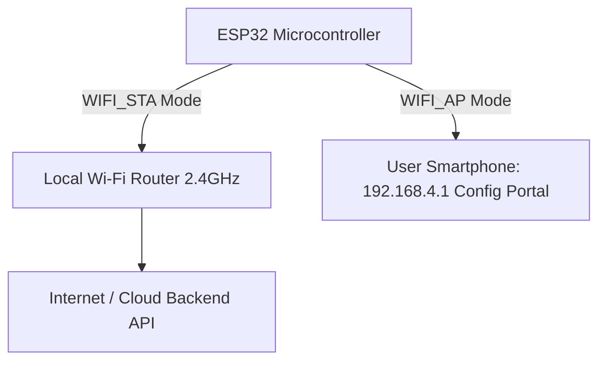

```yaml
schema_version: "2.0"
metadata:
  lesson_id: "IOT-MOD05-LES01"
  course_slug: "course-06-iot-hardware"
  course_title: "Course 6: Embedded Systems, ESP32, FreeRTOS, & Hardware IoT"
  module_slug: "mod-05-wifi-connectivity"
  module_title: "Module 5 - Wi-Fi Networking & Wireless Connectivity"
  lesson_slug: "wifi-station-and-access-point-modes"
  lesson_title: "Lesson 5.1 Wi-Fi Station (STA) Mode & Access Point (AP) Configuration"
  sort_order: 501

pedagogy:
  difficulty: "beginner"
  estimated_time:
    reading_minutes: 15
    practice_minutes: 20
    quiz_minutes: 10
    total_minutes: 45
  bloom_taxonomy_level: "Apply"
  xp_reward: 50

prerequisites:
  required_lesson_ids:
    - "IOT-MOD04-LES02"
  required_skills:
    - "ESP32 C++ Programming & FreeRTOS Basics"

skills_acquired:
  - "Configuring Station (STA) Mode (`WiFi.mode(WIFI_STA)`)"
  - "Configuring Access Point (AP) Mode (`WiFi.softAP()`)"
  - "Dual AP + STA Mode (`WIFI_AP_STA`)"
  - "Scanning Local Wi-Fi Networks (`WiFi.scanNetworks()`)"

dependencies:
  software:
    - "VS Code"
    - "PlatformIO"
  hardware:
    - "ESP32 DevKit v1 Board"

seo_and_social:
  meta_title: "ESP32 Wi-Fi: Station (STA) Mode, SoftAP Access Point & WiFi.scanNetworks"
  meta_description: "Master ESP32 Wi-Fi Networking: Station (STA) mode connection to routers, softAP Access Point mode, Wi-Fi network scanning, and IP address assignment."
  keywords: ["ESP32 Wi-Fi", "WiFi.mode", "WIFI_STA", "WIFI_AP", "softAP", "WiFi.scanNetworks", "ESP32 IP Address"]

assessment_config:
  has_quiz: true
  has_lab: true
  has_flashcards: true
  pass_score_percentage: 80
```

# Lesson 5.1 Wi-Fi Station (STA) Mode & Access Point (AP) Configuration

## 1. Overview & Learning Objectives [id: overview]

- **Estimated Time**: 45 Minutes (15m Reading | 20m Practice | 10m Quiz)
- **Difficulty Level**: ⭐ Beginner
- **Prerequisites**: [Lesson 4.2 Semaphores & Mutexes](file:///d:/My%20Drive/all%20files/PROJECT%20FILES/notes/docs/curriculum/_06_iot_hardware/_06_09_freertos_semaphores_mutexes_and_locks.md)
- **XP Reward**: +50 XP

### Learning Objectives
By the end of this lesson, you will be able to:
1. Configure ESP32 in **Station (STA) Mode** to connect to local 2.4 GHz Wi-Fi routers.
2. Configure ESP32 as a **Soft Access Point (AP) Mode** hotspot (`WiFi.softAP()`).
3. Combine dual **AP + STA Mode (`WIFI_AP_STA`)** for captive portal device onboarding.
4. Scan and report nearby Wi-Fi networks using **`WiFi.scanNetworks()`**.

---

## 2. Environment & Prerequisites [id: prerequisites]

Open PlatformIO in VS Code. Have your 2.4 GHz Wi-Fi SSID and password ready.

---

## 3. Theoretical Foundations [id: theory]

### 3.1 ESP32 Wi-Fi Operating Modes
The ESP32 integrated 802.11 b/g/n Wi-Fi radio supports 3 primary operational modes:

```
┌─────────────────────────────────────────────────────────────────────────────┐
│                          ESP32 WI-FI OPERATING MODES                        │
├─────────────────┬──────────────────────────────────┬────────────────────────┤
│ Mode Enum       │ Functionality                    │ Example Use Case       │
├─────────────────┼──────────────────────────────────┼────────────────────────┤
│ **`WIFI_STA`**  │ Station Mode (Connects to router)│ Cloud MQTT / REST      │
│ **`WIFI_AP`**   │ Soft Access Point (Broadcasts SSID)│ Local Web Configuration│
│ **`WIFI_AP_STA`│ Dual Mode (AP and STA active)   │ Wi-Fi Captive Portal   │
└─────────────────┴──────────────────────────────────┴────────────────────────┘
```

> [!NOTE]
> **2.4 GHz Network Requirement**: The ESP32 hardware radio operates strictly on 2.4 GHz Wi-Fi bands and cannot connect to 5 GHz-only Wi-Fi networks.

---

## 4. Architecture & Diagram Visualizations [id: diagram]



---

## 5. Code & Hardware Implementation [id: syntax]

```cpp
// ESP32 Wi-Fi Station (STA) Mode & Network Scanner (main.cpp)
#include <Arduino.h>
#include <WiFi.h>

const char *WIFI_SSID = "YOUR_WIFI_SSID";
const char *WIFI_PASS = "YOUR_WIFI_PASSWORD";

void scanNearbyNetworks() {
  Serial.println("[Wi-Fi Scanner]: Scanning for 2.4 GHz networks...");
  int networkCount = WiFi.scanNetworks();

  if (networkCount == 0) {
    Serial.println("  -> No Wi-Fi networks found.");
  } else {
    Serial.printf("[Scan Complete]: Found %d networks:\n", networkCount);
    for (int i = 0; i < networkCount; i++) {
      Serial.printf("  %2d: SSID='%s' | RSSI=%d dBm | Encrypt=%s\n",
                    i + 1,
                    WiFi.SSID(i).c_str(),
                    WiFi.RSSI(i),
                    WiFi.encryptionType(i) == WIFI_AUTH_OPEN ? "OPEN" : "SECURE");
    }
  }
  Serial.println("");
}

void connectToWiFiStation() {
  Serial.printf("[Wi-Fi STA]: Connecting to SSID '%s'...\n", WIFI_SSID);

  WiFi.mode(WIFI_STA);
  WiFi.begin(WIFI_SSID, WIFI_PASS);

  uint8_t attempts = 0;
  while (WiFi.status() != WL_CONNECTED && attempts < 20) {
    delay(500);
    Serial.print(".");
    attempts++;
  }

  if (WiFi.status() == WL_CONNECTED) {
    Serial.println("\n[Wi-Fi Connected!]: Station Mode Active.");
    Serial.printf("  -> Assigned IP Address: %s\n", WiFi.localIP().toString().c_str());
    Serial.printf("  -> Signal Strength (RSSI): %d dBm\n", WiFi.RSSI());
  } else {
    Serial.println("\n[Wi-Fi Error]: Failed to connect to router.");
  }
}

void setup() {
  Serial.begin(115200);
  delay(1000);

  scanNearbyNetworks();
  connectToWiFiStation();
}

void loop() {
  delay(5000);
}
```

---

## 6. Enterprise Real-World Applications [id: examples]

- **Smart Home Provisioning & Provisioning Portals**: Smart appliances start up in `WIFI_AP_STA` mode, serving a local configuration web page (`192.168.4.1`) to the user's phone to enter home Wi-Fi credentials before switching to `WIFI_STA` mode.

---

## 7. Guided Step-by-Step Hands-On Exercise [id: exercises]

1. Replace `WIFI_SSID` and `WIFI_PASS` with your 2.4 GHz router credentials.
2. Upload firmware via PlatformIO.
3. Open Serial Monitor $\to$ Observe nearby network scan results and assigned DHCP IP address!

---

## 8. Common Pitfalls & Troubleshooting [id: common_mistakes]

| Bug / Error | Root Cause | Engineering Solution |
| :--- | :--- | :--- |
| **`WL_CONNECT_FAILED` / Times Out** | Attempting to connect to a 5 GHz-only Wi-Fi network SSID. | Ensure the target Wi-Fi router broadcasts a 2.4 GHz band network. |

---

## 9. Best Practices & Optimization [id: best_practices]

- **Set `WiFi.mode(WIFI_STA)` Explicitly**: Always set `WiFi.mode()` before calling `WiFi.begin()` to prevent radio state leakage.

---

## 10. Industry Interview Q&A [id: interview_qa]

### Q1: What is the difference between Station (STA) Mode and Access Point (AP) Mode on the ESP32?
**Answer**: In Station (STA) mode, the ESP32 acts as a client connecting to an external Wi-Fi router to obtain an IP address via DHCP and reach the Internet. In Access Point (AP / SoftAP) mode, the ESP32 broadcasts its own Wi-Fi network SSID and acts as a local router/DHCP server (`192.168.4.1`), allowing phones or laptops to connect directly to it.

---

## 11. Self-Assessment Quiz [id: quiz]

```json
{
  "quiz_title": "Lesson 5.1 Wi-Fi Modes Assessment",
  "questions": [
    {
      "question_id": "Q1",
      "type": "multiple_choice",
      "question_text": "Which ESP32 Wi-Fi mode connects the chip to an external Wi-Fi router as a client?",
      "options": ["WIFI_AP", "WIFI_STA", "WIFI_OFF", "WIFI_MESH"],
      "correct_answer_index": 1,
      "explanation": "WIFI_STA (Station Mode) connects to external routers."
    }
  ]
}
```

---

## 12. Portfolio Assignment & Challenge [id: lab]

Write a network scanner printing available 2.4 GHz SSIDs and RSSI values.

---

## 13. Spaced Repetition Flashcards [id: flashcards]

**Front**: What function returns the assigned IP address of an ESP32 in Station Mode?
**Back**: `WiFi.localIP().toString()`.
<!-- flashcard:end -->

---

## 14. Summary & Cheat Sheet [id: summary]

```cpp
WiFi.mode(WIFI_STA);
WiFi.begin("SSID", "PASS");
while (WiFi.status() != WL_CONNECTED) delay(500);
```
