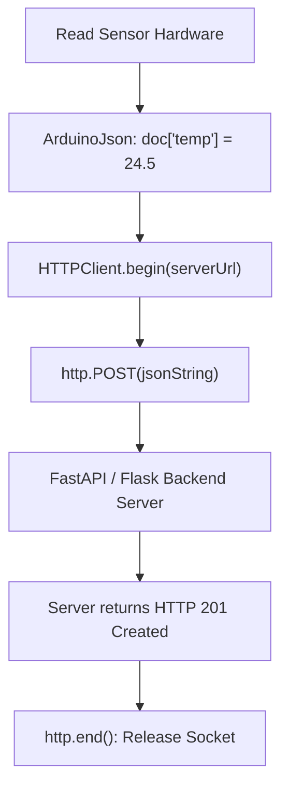

```yaml
schema_version: "2.0"
metadata:
  lesson_id: "IOT-MOD06-LES01"
  course_slug: "course-06-iot-hardware"
  course_title: "Course 6: Embedded Systems, ESP32, FreeRTOS, & Hardware IoT"
  module_slug: "mod-06-iot-network-protocols"
  module_title: "Module 6 - IoT Network Protocols: MQTT, HTTP REST, & WebSockets"
  lesson_slug: "http-rest-client-requests"
  lesson_title: "Lesson 6.1 HTTP REST Client Requests from ESP32"
  sort_order: 601

pedagogy:
  difficulty: "intermediate"
  estimated_time:
    reading_minutes: 20
    practice_minutes: 25
    quiz_minutes: 10
    total_minutes: 55
  bloom_taxonomy_level: "Apply"
  xp_reward: 60

prerequisites:
  required_lesson_ids:
    - "IOT-MOD05-LES02"
  required_skills:
    - "ESP32 Wi-Fi Station Mode & Arduino C++"

skills_acquired:
  - "Utilizing `HTTPClient` Library for Outbound REST API Requests"
  - "Executing HTTP GET & POST Requests (`http.GET()`, `http.POST()`)"
  - "Formatting JSON Payloads with `ArduinoJson` Library"
  - "HTTPS SSL/TLS Certificate Verification (`WiFiClientSecure`)"

dependencies:
  software:
    - "VS Code"
    - "PlatformIO"
    - "bblanchon/ArduinoJson"
  hardware:
    - "ESP32 DevKit v1 Board"

seo_and_social:
  meta_title: "ESP32 HTTP Client: HTTPClient Library, JSON POST & WiFiClientSecure"
  meta_description: "Master ESP32 HTTP REST Client: sending GET/POST requests via HTTPClient library, formatting JSON with ArduinoJson, handling response codes, and HTTPS WiFiClientSecure."
  keywords: ["ESP32 HTTPClient", "ArduinoJson", "WiFiClientSecure", "ESP32 REST API", "ESP32 POST JSON", "HTTPS ESP32"]

assessment_config:
  has_quiz: true
  has_lab: true
  has_flashcards: true
  pass_score_percentage: 80
```

# Lesson 6.1 HTTP REST Client Requests from ESP32

## 1. Overview & Learning Objectives [id: overview]

- **Estimated Time**: 55 Minutes (20m Reading | 25m Practice | 10m Quiz)
- **Difficulty Level**: ⭐⭐ Intermediate
- **Prerequisites**: [Lesson 5.2 Auto-Reconnect](file:///d:/My%20Drive/all%20files/PROJECT%20FILES/notes/docs/curriculum/_06_iot_hardware/_06_11_non_blocking_wifi_reconnect_and_events.md)
- **XP Reward**: +60 XP

### Learning Objectives
By the end of this lesson, you will be able to:
1. Issue outbound HTTP GET and POST requests using **`HTTPClient`**.
2. Construct and serialize JSON payloads using the **`ArduinoJson`** library.
3. Parse HTTP status codes (`200 OK`, `201 Created`) and payload strings.
4. Establish secure HTTPS connections using **`WiFiClientSecure`**.

---

## 2. Environment & Prerequisites [id: prerequisites]

Include `bblanchon/ArduinoJson @ ^7.0.0` in `platformio.ini`.

---

## 3. Theoretical Foundations [id: theory]

### 3.1 Embedded HTTP Client Architecture
To send sensor data to a backend microservice (such as a Flask or FastAPI server), the ESP32 operates as an **HTTP Client**.

The **`HTTPClient`** library manages socket creation, HTTP request header formatting, Content-Type headers (`application/json`), and response payload parsing:

```
┌─────────────────────────────────────────────────────────────────────────────┐
│                         ESP32 HTTP POST PAYLOAD FLOW                        │
├─────────────────────────────────────────────────────────────────────────────┤
│ 1. `ArduinoJson` serializes C++ struct ──► `{"node_id":"E1","temp":24.5}`   │
│ 2. `HTTPClient.POST(jsonBuffer)`       ──► Sends POST to `/api/v1/telemetry` │
│ 3. Server responds HTTP 201 Created   ──► `http.end()` closes socket        │
└─────────────────────────────────────────────────────────────────────────────┘
```

---

## 4. Architecture & Diagram Visualizations [id: diagram]



---

## 5. Code & Hardware Implementation [id: syntax]

```cpp
// ESP32 HTTP REST Client & ArduinoJson Serialization (main.cpp)
#include <Arduino.h>
#include <WiFi.h>
#include <HTTPClient.h>
#include <ArduinoJson.h>

const char *WIFI_SSID = "YOUR_WIFI_SSID";
const char *WIFI_PASS = "YOUR_WIFI_PASSWORD";

// Target REST API Endpoint URL (Replace with your backend IP!)
const char *API_ENDPOINT = "http://192.168.1.100:8000/api/v1/telemetry/ingest";

void sendTelemetryREST(float temperature, float humidity) {
  if (WiFi.status() != WL_CONNECTED) {
    Serial.println("[HTTP Error]: Cannot send REST request — Wi-Fi Disconnected!");
    return;
  }

  // 1. Construct JSON Payload using ArduinoJson 7
  JsonDocument doc;
  doc["node_id"] = "ESP32-NODE-101";
  doc["temperature"] = temperature;
  doc["humidity"] = humidity;
  doc["timestamp"] = millis();

  String jsonString;
  serializeJson(doc, jsonString);

  // 2. Initialize HTTPClient
  HTTPClient http;
  http.begin(API_ENDPOINT);
  http.addHeader("Content-Type", "application/json");

  Serial.printf("[HTTP POST]: Sending JSON to %s...\n", API_ENDPOINT);
  Serial.printf("  -> Payload: %s\n", jsonString.c_str());

  // 3. Execute HTTP POST Request
  int httpResponseCode = http.POST(jsonString);

  if (httpResponseCode > 0) {
    Serial.printf("[HTTP Success]: Response Code = %d\n", httpResponseCode);
    String responseBody = http.getString();
    Serial.printf("  -> Server Reply: %s\n", responseBody.c_str());
  } else {
    Serial.printf("[HTTP Error]: POST Failed! Error = %s\n",
                  http.errorToString(httpResponseCode).c_str());
  }

  // 4. Always Close Connection Socket!
  http.end();
}

void setup() {
  Serial.begin(115200);
  delay(1000);

  WiFi.mode(WIFI_STA);
  WiFi.begin(WIFI_SSID, WIFI_PASS);

  while (WiFi.status() != WL_CONNECTED) {
    delay(500);
    Serial.print(".");
  }
  Serial.println("\n[Wi-Fi Connected!]: Ready for REST requests.");
}

void loop() {
  // Send telemetry every 10 seconds
  sendTelemetryREST(24.8, 58.2);
  delay(10000);
}
```

---

## 6. Enterprise Real-World Applications [id: examples]

- **Cloud Microservice Telemetry Ingestion**: Remote IoT gateways aggregate sensor readings, format structured JSON DTO payloads via `ArduinoJson`, and POST data to cloud REST API endpoints over HTTPS.

---

## 7. Guided Step-by-Step Hands-On Exercise [id: exercises]

1. Set `platformio.ini` dependency: `lib_deps = bblanchon/ArduinoJson@^7.0.0`.
2. Replace `API_ENDPOINT` with your active FastAPI backend URL.
3. Upload firmware $\to$ Inspect backend server logs receiving the JSON payload!

---

## 8. Common Pitfalls & Troubleshooting [id: common_mistakes]

| Bug / Error | Root Cause | Engineering Solution |
| :--- | :--- | :--- |
| **`http.end()` Omitted / Socket Leak** | Forgetting to call `http.end()` after completing an HTTP request. | Always invoke `http.end()` to release memory and close TCP sockets. |

---

## 9. Best Practices & Optimization [id: best_practices]

- **Use `ArduinoJson 7` `JsonDocument`**: In `ArduinoJson 7`, use `JsonDocument` without hardcoding static memory buffer sizes.

---

## 10. Industry Interview Q&A [id: interview_qa]

### Q1: Why is `http.end()` mandatory after executing an HTTP request with `HTTPClient` on the ESP32?
**Answer**: `HTTPClient.begin()` allocates internal memory buffers and opens a TCP network socket connection to the target server. If `http.end()` is omitted, the socket remains open in memory. Calling HTTP requests repeatedly without `http.end()` quickly exhausts ESP32 heap memory and available socket descriptors, causing the microcontroller to crash.

---

## 11. Self-Assessment Quiz [id: quiz]

```json
{
  "quiz_title": "Lesson 6.1 ESP32 HTTP Client Assessment",
  "questions": [
    {
      "question_id": "Q1",
      "type": "multiple_choice",
      "question_text": "Which library method closes TCP sockets and releases memory after an HTTPClient request?",
      "options": ["http.close()", "http.end()", "http.stop()", "http.disconnect()"],
      "correct_answer_index": 1,
      "explanation": "http.end() closes HTTPClient sockets and frees memory."
    }
  ]
}
```

---

## 12. Portfolio Assignment & Challenge [id: lab]

Use `ArduinoJson` and `HTTPClient` to POST sensor telemetry to a REST endpoint.

---

## 13. Spaced Repetition Flashcards [id: flashcards]

**Front**: What function in `ArduinoJson 7` serializes a `JsonDocument` object into a C++ `String`?
**Back**: `serializeJson(doc, jsonString)`.
<!-- flashcard:end -->

---

## 14. Summary & Cheat Sheet [id: summary]

```cpp
HTTPClient http;
http.begin("http://api/v1/data");
http.addHeader("Content-Type", "application/json");
int code = http.POST(jsonStr);
http.end();
```
