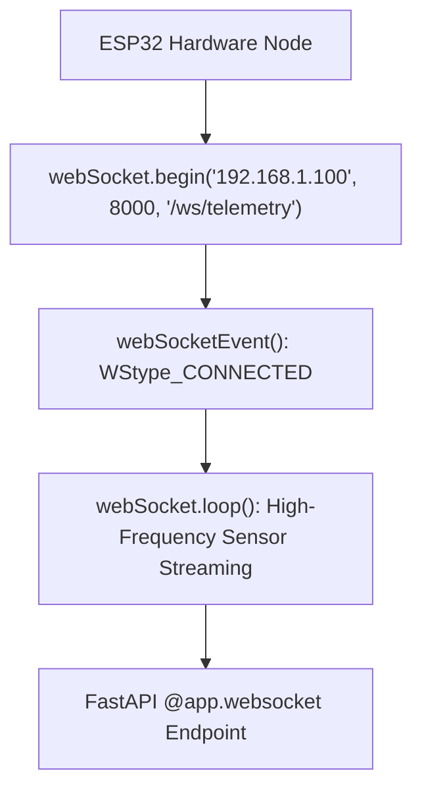

```yaml
schema_version: "2.0"
metadata:
  lesson_id: "IOT-MOD06-LES03"
  course_slug: "course-06-iot-hardware"
  course_title: "Course 6: Embedded Systems, ESP32, FreeRTOS, & Hardware IoT"
  module_slug: "mod-06-iot-network-protocols"
  module_title: "Module 6 - IoT Network Protocols: MQTT, HTTP REST, & WebSockets"
  lesson_slug: "esp32-websocket-client-streaming"
  lesson_title: "Lesson 6.3 ESP32 WebSocket Client for Real-Time Streaming"
  sort_order: 603

pedagogy:
  difficulty: "advanced"
  estimated_time:
    reading_minutes: 20
    practice_minutes: 25
    quiz_minutes: 10
    total_minutes: 55
  bloom_taxonomy_level: "Apply"
  xp_reward: 70

prerequisites:
  required_lesson_ids:
    - "IOT-MOD06-LES02"
  required_skills:
    - "ESP32 MQTT & Wi-Fi Station Networking"

skills_acquired:
  - "Configuring Full-Duplex ESP32 WebSocket Client (`WebSocketsClient`)"
  - "Handling Event Callbacks (`WStype_CONNECTED`, `WStype_DISCONNECTED`, `WStype_TEXT`)"
  - "High-Speed Real-Time Sensor Telemetry Streaming"
  - "Bi-directional Hardware Control via WebSockets"

dependencies:
  software:
    - "VS Code"
    - "PlatformIO"
    - "links2004/WebSockets"
    - "bblanchon/ArduinoJson"
  hardware:
    - "ESP32 DevKit v1 Board"

seo_and_social:
  meta_title: "ESP32 WebSocket Client: WebSocketsClient Library & Real-Time Streaming"
  meta_description: "Master ESP32 Real-Time WebSocket Streaming: WebSocketsClient library integration, full-duplex socket handshakes, event handlers, and streaming JSON to FastAPI."
  keywords: ["ESP32 WebSocket Client", "WebSocketsClient", "Real-time Telemetry Streaming", "ESP32 Full Duplex", "FastAPI WebSocket ESP32"]

assessment_config:
  has_quiz: true
  has_lab: true
  has_flashcards: true
  pass_score_percentage: 80
```

# Lesson 6.3 ESP32 WebSocket Client for Real-Time Streaming

## 1. Overview & Learning Objectives [id: overview]

- **Estimated Time**: 55 Minutes (20m Reading | 25m Practice | 10m Quiz)
- **Difficulty Level**: ⭐⭐⭐ Advanced
- **Prerequisites**: [Lesson 6.2 MQTT Protocol](file:///d:/My%20Drive/all%20files/PROJECT%20FILES/notes/docs/curriculum/_06_iot_hardware/_06_13_mqtt_protocol_and_pubsubclient.md)
- **XP Reward**: +70 XP

### Learning Objectives
By the end of this lesson, you will be able to:
1. Understand full-duplex low-latency **WebSocket** communication on microcontrollers.
2. Integrate the **`WebSocketsClient`** library into PlatformIO.
3. Handle socket event lifecycle types (`WStype_CONNECTED`, `WStype_TEXT`).
4. Stream sub-10ms sensor telemetry directly into FastAPI WebSocket servers.

---

## 2. Environment & Prerequisites [id: prerequisites]

Include `links2004/WebSockets @ ^2.4` and `bblanchon/ArduinoJson @ ^7.0.0` in `platformio.ini`.

---

## 3. Theoretical Foundations [id: theory]

### 3.1 Why WebSockets for Microcontroller Telemetry?
While HTTP requires opening new TCP connections for every request and MQTT requires an intermediary broker server, **WebSockets** establish a direct, persistent full-duplex TCP socket between the ESP32 microcontroller and a web server (like FastAPI).

This allows the ESP32 to stream high-frequency sensor data (e.g. 50 Hz accelerometer or audio streams) with minimal network latency (< 5ms):

```
┌─────────────────────────────────────────────────────────────────────────────┐
│                    ESP32 WEBSOCKET DIRECT STREAMING FLOW                    │
├─────────────────────────────────────────────────────────────────────────────┤
│ ESP32 WebSocket Client ──► `ws://192.168.1.100:8000/ws/telemetry`          │
│                        ──► Persistent TCP Socket Handshake                  │
│                        ──► `webSocket.sendTXT(jsonPayload)`                 │
│ FastAPI Server         ◄── Real-time sub-5ms Streaming Data Ingestion!      │
└─────────────────────────────────────────────────────────────────────────────┘
```

---

## 4. Architecture & Diagram Visualizations [id: diagram]



---

## 5. Code & Hardware Implementation [id: syntax]

```cpp
// ESP32 WebSocket Client & Real-Time Telemetry Streaming (main.cpp)
#include <Arduino.h>
#include <WiFi.h>
#include <WebSocketsClient.h>
#include <ArduinoJson.h>

const char *WIFI_SSID = "YOUR_WIFI_SSID";
const char *WIFI_PASS = "YOUR_WIFI_PASSWORD";

// Target FastAPI WebSocket Server Host & Port
const char *WS_HOST = "192.168.1.100";
const int WS_PORT = 8000;
const char *WS_PATH = "/ws/telemetry/esp32-node1";

WebSocketsClient webSocket;

// 1. WebSocket Event Callback Function
void webSocketEvent(WStype_t type, uint8_t * payload, size_t length) {
  switch (type) {
    case WStype_DISCONNECTED:
      Serial.println("[WebSocket]: DISCONNECTED from server.");
      break;

    case WStype_CONNECTED:
      Serial.printf("[WebSocket]: CONNECTED to server URL: %s\n", payload);
      // Send initial handshake registration JSON
      webSocket.sendTXT("{\"event\":\"CLIENT_CONNECTED\",\"node\":\"ESP32-S1\"}");
      break;

    case WStype_TEXT:
      Serial.printf("[WebSocket Received]: %s\n", payload);
      // Parse incoming real-time commands from server
      break;

    default:
      break;
  }
}

void setup() {
  Serial.begin(115200);
  delay(1000);

  WiFi.mode(WIFI_STA);
  WiFi.begin(WIFI_SSID, WIFI_PASS);

  while (WiFi.status() != WL_CONNECTED) {
    delay(500);
    Serial.print(".");
  }
  Serial.println("\n[Wi-Fi Connected!]: Starting WebSocket Client...");

  // 2. Initialize WebSocket Connection
  webSocket.begin(WS_HOST, WS_PORT, WS_PATH);
  webSocket.onEvent(webSocketEvent);
  webSocket.setReconnectInterval(5000); // Auto-reconnect every 5s if dropped
}

void loop() {
  // 3. Service WebSocket Client Sockets (MUST be called continuously!)
  webSocket.loop();

  // High-frequency telemetry stream (Every 200ms = 5 Hz)
  static uint32_t lastStreamMs = 0;
  if (millis() - lastStreamMs >= 200) {
    lastStreamMs = millis();

    JsonDocument doc;
    doc["node_id"] = "ESP32-STREAM";
    doc["sensor_val"] = analogRead(GPIO_NUM_34);
    doc["uptime_ms"] = millis();

    String jsonString;
    serializeJson(doc, jsonString);

    // Stream text frame over open WebSocket connection!
    webSocket.sendTXT(jsonString);
  }
}
```

---

## 6. Enterprise Real-World Applications [id: examples]

- **Vibration & High-Speed Audio Streaming**: Structural health monitoring systems stream high-frequency vibration waveforms directly from ESP32 microcontrollers to web dashboards over WebSockets.

---

## 7. Guided Step-by-Step Hands-On Exercise [id: exercises]

1. Set `platformio.ini`: `lib_deps = links2004/WebSockets@^2.4`, `bblanchon/ArduinoJson@^7.0.0`.
2. Start FastAPI WebSocket server from Course 5.
3. Upload firmware $\to$ Observe 5 Hz live sensor telemetry streaming into your FastAPI backend terminal!

---

## 8. Common Pitfalls & Troubleshooting [id: common_mistakes]

| Bug / Error | Root Cause | Engineering Solution |
| :--- | :--- | :--- |
| **`WebSocketsClient` Disconnects Instantly** | Omission of `webSocket.loop()` inside the main `loop()` function. | Keep `webSocket.loop()` executing on every main loop iteration. |

---

## 9. Best Practices & Optimization [id: best_practices]

- **Use `setReconnectInterval()`**: Configure `webSocket.setReconnectInterval(5000)` to handle connection drops automatically.

---

## 10. Industry Interview Q&A [id: interview_qa]

### Q1: When should an embedded engineer choose WebSockets over MQTT for an IoT system architecture?
**Answer**: WebSockets are chosen when direct, ultra-low-latency (< 10ms) point-to-point streaming is required between the microcontroller and a web application without requiring a secondary MQTT broker. MQTT is preferred for multi-device pub/sub topologies where multiple independent services consume the same sensor data streams.

---

## 11. Self-Assessment Quiz [id: quiz]

```json
{
  "quiz_title": "Lesson 6.3 ESP32 WebSockets Assessment",
  "questions": [
    {
      "question_id": "Q1",
      "type": "multiple_choice",
      "question_text": "Which method sends a text frame over an open WebSocket connection in the WebSocketsClient library?",
      "options": ["webSocket.sendTXT()", "webSocket.write()", "webSocket.sendString()", "webSocket.publish()"],
      "correct_answer_index": 0,
      "explanation": "webSocket.sendTXT() sends text frames over WebSockets."
    }
  ]
}
```

---

## 12. Portfolio Assignment & Challenge [id: lab]

Stream high-frequency ADC telemetry over WebSockets to a server endpoint.

---

## 13. Spaced Repetition Flashcards [id: flashcards]

**Front**: What event type in `WebSocketsClient` triggers when a WebSocket connection handshake completes successfully?
**Back**: `WStype_CONNECTED`.
<!-- flashcard:end -->

---

## 14. Summary & Cheat Sheet [id: summary]

```cpp
webSocket.begin("192.168.1.100", 8000, "/ws");
webSocket.onEvent(webSocketEvent);
webSocket.sendTXT("{\"data\": 123}");
webSocket.loop();
```
