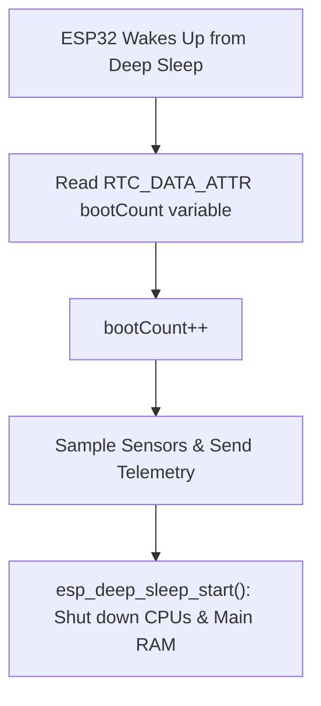

```yaml
schema_version: "2.0"
metadata:
  lesson_id: "IOT-MOD07-LES01"
  course_slug: "course-06-iot-hardware"
  course_title: "Course 6: Embedded Systems, ESP32, FreeRTOS, & Hardware IoT"
  module_slug: "mod-07-low-power-deep-sleep"
  module_title: "Module 7 - Low Power Modes & Deep Sleep Architecture"
  lesson_slug: "deep-sleep-modes-and-rtc-memory"
  lesson_title: "Lesson 7.1 Deep Sleep Modes & RTC Memory Retention"
  sort_order: 701

pedagogy:
  difficulty: "intermediate"
  estimated_time:
    reading_minutes: 15
    practice_minutes: 20
    quiz_minutes: 10
    total_minutes: 45
  bloom_taxonomy_level: "Apply"
  xp_reward: 50

prerequisites:
  required_lesson_ids:
    - "IOT-MOD06-LES03"
  required_skills:
    - "ESP32 Peripherals & FreeRTOS Architecture"

skills_acquired:
  - "Understanding ESP32 Low Power Modes (Active, Modem Sleep, Light Sleep, Deep Sleep)"
  - "Initiating Deep Sleep (`esp_deep_sleep_start()`)"
  - "Persisting Variables across Sleep Cycles using `RTC_DATA_ATTR`"
  - "Calculating Battery Life & Micro-Ampere Current Draw"

dependencies:
  software:
    - "VS Code"
    - "PlatformIO"
  hardware:
    - "ESP32 DevKit v1 Board"

seo_and_social:
  meta_title: "ESP32 Deep Sleep: esp_deep_sleep_start, RTC_DATA_ATTR & Low Power"
  meta_description: "Master ESP32 Deep Sleep: power consumption modes, initiating sleep with esp_deep_sleep_start(), persisting data in RTC Fast/Slow RAM with RTC_DATA_ATTR, and battery sizing."
  keywords: ["ESP32 Deep Sleep", "esp_deep_sleep_start", "RTC_DATA_ATTR", "RTC Memory", "Microamps Sleep Current", "Battery IoT"]

assessment_config:
  has_quiz: true
  has_lab: true
  has_flashcards: true
  pass_score_percentage: 80
```

# Lesson 7.1 Deep Sleep Modes & RTC Memory Retention

## 1. Overview & Learning Objectives [id: overview]

- **Estimated Time**: 45 Minutes (15m Reading | 20m Practice | 10m Quiz)
- **Difficulty Level**: ⭐⭐ Intermediate
- **Prerequisites**: [Lesson 6.3 WebSockets Client](file:///d:/My%20Drive/all%20files/PROJECT%20FILES/notes/docs/curriculum/_06_iot_hardware/_06_14_esp32_websocket_client_streaming.md)
- **XP Reward**: +50 XP

### Learning Objectives
By the end of this lesson, you will be able to:
1. Compare ESP32 power consumption modes (Active, Modem Sleep, Light Sleep, Deep Sleep, Hibernation).
2. Enter Deep Sleep mode using **`esp_deep_sleep_start()`**.
3. Persist variables across sleep cycles in SRAM using the **`RTC_DATA_ATTR`** attribute.
4. Calculate battery lifespan for battery-powered remote IoT sensor deployments.

---

## 2. Environment & Prerequisites [id: prerequisites]

Open PlatformIO in VS Code.

---

## 3. Theoretical Foundations [id: theory]

### 3.1 Power Consumption Modes Comparison
Running the ESP32 with Wi-Fi active draws ~160 mA to 240 mA of current. A standard 2000 mAh Li-Po battery would drain in under 12 hours.

In **Deep Sleep**, the CPUs, main SRAM, Wi-Fi radio, and all digital peripherals are powered down completely. Only the Ultra-Low-Power (ULP) co-processor, RTC controller, and 8 KB RTC Fast/Slow SRAM remain powered, dropping current consumption to **$\sim 10\,\mu\text{A}$**:

```
┌─────────────────────────────────────────────────────────────────────────────┐
│                       ESP32 POWER CONSUMPTION COMPARISON                    │
├──────────────────┬─────────────────────────────┬────────────────────────────┤
│ Power Mode       │ Active Components           │ Typical Current Draw       │
├──────────────────┼─────────────────────────────┼────────────────────────────┤
│ **Active**       │ Dual Cores, Wi-Fi/BLE, SRAM │ 160 mA – 240 mA            │
│ **Modem Sleep**  │ Dual Cores, SRAM (No Wi-Fi) │ 20 mA – 30 mA              │
│ **Light Sleep**  │ Peripherals Active (CPU Off)│ 0.8 mA                     │
│ **Deep Sleep**   │ RTC Domain & ULP Only       │ ~ 10 µA (0.01 mA!)         │
└──────────────────┴─────────────────────────────┴────────────────────────────┘
```

> [!IMPORTANT]
> **Variable Reset Behavior**: Coming out of Deep Sleep triggers a full system reset. Standard C++ global variables in main SRAM lose their value. Only variables marked with **`RTC_DATA_ATTR`** in RTC SRAM survive!

---

## 4. Architecture & Diagram Visualizations [id: diagram]



---

## 5. Code & Hardware Implementation [id: syntax]

```cpp
// ESP32 Deep Sleep & RTC Memory Persistence (main.cpp)
#include <Arduino.h>

// 1. Variable saved in 8 KB RTC Fast Memory (Survives Deep Sleep resets!)
RTC_DATA_ATTR uint32_t bootCount = 0;
RTC_DATA_ATTR float lastTemperatureReading = 0.0;

const uint64_t MICROSECONDS_TO_SECONDS = 1000000ULL;
const uint64_t TIME_TO_SLEEP_SECONDS = 10; // Sleep for 10 seconds

void setup() {
  Serial.begin(115200);
  delay(1000); // Allow serial monitor to open

  // Increment boot counter
  bootCount++;

  Serial.println("==============================================");
  Serial.printf("[ESP32 Boot Counter]: Wake Up Count = %u\n", bootCount);
  Serial.printf("[RTC Memory]: Previous Saved Temp = %.2f°C\n", lastTemperatureReading);
  Serial.println("==============================================");

  // Simulate reading sensor and saving to RTC Memory
  lastTemperatureReading = 22.5 + (bootCount * 0.3);
  Serial.printf("  -> Sampled New Sensor Temp: %.2f°C\n", lastTemperatureReading);

  // 2. Configure Timer Wake-Up Source
  esp_sleep_enable_timer_wakeup(TIME_TO_SLEEP_SECONDS * MICROSECONDS_TO_SECONDS);

  Serial.printf("[Deep Sleep]: Entering sleep for %llu seconds...\n\n", TIME_TO_SLEEP_SECONDS);
  Serial.flush(); // Flush serial transmit buffer before sleeping!

  // 3. Initiate Deep Sleep (CPUs and Main RAM shut down now!)
  esp_deep_sleep_start();

  // Code past this point is NEVER executed!
}

void loop() {
  // Never reached in Deep Sleep setup pattern
}
```

---

## 6. Enterprise Real-World Applications [id: examples]

- **Multi-Year Battery Agricultural Sensors**: Soil moisture sensors wake up once every 4 hours, power up the Wi-Fi modem, POST data to a REST API in 2 seconds, and enter Deep Sleep for 3 hours and 59 minutes, achieving a 5-year battery lifespan on 2 AA batteries.

---

## 7. Guided Step-by-Step Hands-On Exercise [id: exercises]

1. Save code as `src/main.cpp`.
2. Upload via PlatformIO.
3. Open Serial Monitor $\to$ Observe `bootCount` incrementing cleanly on every 10-second wake-up cycle while previous sensor values persist!

---

## 8. Common Pitfalls & Troubleshooting [id: common_mistakes]

| Bug / Error | Root Cause | Engineering Solution |
| :--- | :--- | :--- |
| **High Current Draw in Deep Sleep (> 5 mA)** | Onboard DevKit USB-to-UART bridge IC (CP2102/CH340) and power LED continuing to draw power. | For production battery products, use custom bare-metal ESP32-WROOM modules without onboard USB chips or LEDs. |

---

## 9. Best Practices & Optimization [id: best_practices]

- **Flush Serial Before Sleep**: Always call `Serial.flush()` before `esp_deep_sleep_start()` so serial text finishes transmitting.

---

## 10. Industry Interview Q&A [id: interview_qa]

### Q1: What happens to standard C++ global variables versus `RTC_DATA_ATTR` variables when the ESP32 enters Deep Sleep?
**Answer**: Entering Deep Sleep cuts power to the main SRAM memory bank, destroying all standard C++ global and local stack variables. Variables annotated with `RTC_DATA_ATTR` are stored in the 8 KB RTC Fast SRAM region, which remains powered by the low-power RTC domain during sleep, preserving their values across sleep/wake cycles.

---

## 11. Self-Assessment Quiz [id: quiz]

```json
{
  "quiz_title": "Lesson 7.1 Deep Sleep Assessment",
  "questions": [
    {
      "question_id": "Q1",
      "type": "multiple_choice",
      "question_text": "Which attribute persists C++ variables in RTC memory during ESP32 Deep Sleep?",
      "options": ["RTC_DATA_ATTR", "FLASH_ATTR", "PERSIST_ATTR", "NVRAM_DATA"],
      "correct_answer_index": 0,
      "explanation": "RTC_DATA_ATTR saves variables in RTC memory."
    }
  ]
}
```

---

## 12. Portfolio Assignment & Challenge [id: lab]

Use `RTC_DATA_ATTR` to track wake counts and sleep the ESP32 for 15 seconds.

---

## 13. Spaced Repetition Flashcards [id: flashcards]

**Front**: What function initiates Deep Sleep mode on the ESP32?
**Back**: `esp_deep_sleep_start()`.
<!-- flashcard:end -->

---

## 14. Summary & Cheat Sheet [id: summary]

```cpp
RTC_DATA_ATTR int count = 0;
esp_sleep_enable_timer_wakeup(10 * 1000000ULL);
esp_deep_sleep_start();
```
