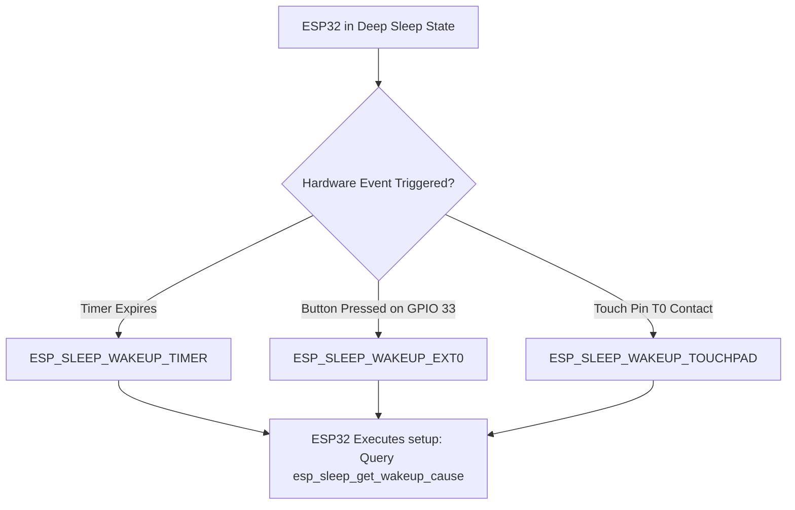

```yaml
schema_version: "2.0"
metadata:
  lesson_id: "IOT-MOD07-LES02"
  course_slug: "course-06-iot-hardware"
  course_title: "Course 6: Embedded Systems, ESP32, FreeRTOS, & Hardware IoT"
  module_slug: "mod-07-low-power-deep-sleep"
  module_title: "Module 7 - Low Power Modes & Deep Sleep Architecture"
  lesson_slug: "deep-sleep-wakeup-sources"
  lesson_title: "Lesson 7.2 Timer, Ext0/Ext1 GPIO, & Touch Wake-Up Triggers"
  sort_order: 702

pedagogy:
  difficulty: "intermediate"
  estimated_time:
    reading_minutes: 15
    practice_minutes: 20
    quiz_minutes: 10
    total_minutes: 45
  bloom_taxonomy_level: "Apply"
  xp_reward: 50

prerequisites:
  required_lesson_ids:
    - "IOT-MOD07-LES01"
  required_skills:
    - "ESP32 Deep Sleep Basics & RTC Memory"

skills_acquired:
  - "Configuring External Pin Wake-Up (`esp_sleep_enable_ext0_wakeup()`)"
  - "Configuring Multi-GPIO Wake-Up (`esp_sleep_enable_ext1_wakeup()`)"
  - "Capacitive Touch Pad Wake-Up (`esp_sleep_enable_touchpad_wakeup()`)"
  - "Querying Reset Reason & Wake-Up Cause (`esp_sleep_get_wakeup_cause()`)"

dependencies:
  software:
    - "VS Code"
    - "PlatformIO"
  hardware:
    - "ESP32 DevKit v1 Board"
    - "Push Button & Jumper Wire"

seo_and_social:
  meta_title: "ESP32 Wakeup Sources: Ext0, Ext1 GPIO, Touch & esp_sleep_get_wakeup_cause"
  meta_description: "Master ESP32 Deep Sleep Wake-up Triggers: Ext0 single pin, Ext1 multi-pin mask, capacitive touch pads, and querying wake-up causes via esp_sleep_get_wakeup_cause()."
  keywords: ["ESP32 Wakeup Sources", "ext0 wakeup", "ext1 wakeup", "esp_sleep_get_wakeup_cause", "ESP32 Touch Wakeup", "RTC GPIO"]

assessment_config:
  has_quiz: true
  has_lab: true
  has_flashcards: true
  pass_score_percentage: 80
```

# Lesson 7.2 Timer, Ext0/Ext1 GPIO, & Touch Wake-Up Triggers

## 1. Overview & Learning Objectives [id: overview]

- **Estimated Time**: 45 Minutes (15m Reading | 20m Practice | 10m Quiz)
- **Difficulty Level**: ⭐⭐ Intermediate
- **Prerequisites**: [Lesson 7.1 Deep Sleep](file:///d:/My%20Drive/all%20files/PROJECT%20FILES/notes/docs/curriculum/_06_iot_hardware/_06_15_deep_sleep_modes_and_rtc_memory.md)
- **XP Reward**: +50 XP

### Learning Objectives
By the end of this lesson, you will be able to:
1. Configure single external GPIO pin wake-up using **Ext0 (`esp_sleep_enable_ext0_wakeup()`)**.
2. Configure multi-pin bitmask wake-up using **Ext1 (`esp_sleep_enable_ext1_wakeup()`)**.
3. Enable capacitive touch pad wake-up triggers using **`esp_sleep_enable_touchpad_wakeup()`**.
4. Identify the exact wake-up source using **`esp_sleep_get_wakeup_cause()`**.

---

## 2. Environment & Prerequisites [id: prerequisites]

Gather ESP32 DevKit, Push Button, and Jumper Wires.

---

## 3. Theoretical Foundations [id: theory]

### 3.1 Deep Sleep Wake-Up Sources Matrix
When the ESP32 enters Deep Sleep, it can be woken up by several hardware triggers configured in the RTC controller:

```
┌─────────────────────────────────────────────────────────────────────────────┐
│                          ESP32 WAKE-UP SOURCE MATRIX                        │
├─────────────────┬──────────────────────────────────┬────────────────────────┤
│ Wake-Up Method  │ Description & Configuration      │ Allowed Pins           │
├─────────────────┼──────────────────────────────────┼────────────────────────┤
│ **Timer**       │ Periodic RTC timer wake-up       │ Internal Hardware      │
│ **Ext0**        │ Single RTC GPIO pin HIGH or LOW  │ RTC GPIOs (0,2,4,12-15,│
│                 │ (`esp_sleep_enable_ext0_wakeup`) │ 25-27,32-39)           │
│ **Ext1**        │ Multiple RTC GPIOs (AND / OR)    │ Any RTC GPIO Bitmask   │
│                 │ (`esp_sleep_enable_ext1_wakeup`) │                        │
│ **TouchPad**    │ Capacitive Touch Threshold       │ Touch Pins (T0 to T9)  │
└─────────────────┴──────────────────────────────────┴────────────────────────┘
```

---

## 4. Architecture & Diagram Visualizations [id: diagram]



---

## 5. Code & Hardware Implementation [id: syntax]

```cpp
// ESP32 Ext0 & Touch Wake-Up Source Inspection (main.cpp)
#include <Arduino.h>

const gpio_num_t BUTTON_PIN = GPIO_NUM_33; // RTC GPIO Pin

void printWakeupReason() {
  esp_sleep_wakeup_cause_t wakeup_reason = esp_sleep_get_wakeup_cause();

  switch (wakeup_reason) {
    case ESP_SLEEP_WAKEUP_EXT0:
      Serial.println("[Wake-Up Source]: External GPIO Button (Ext0) Triggered!");
      break;

    case ESP_SLEEP_WAKEUP_TIMER:
      Serial.println("[Wake-Up Source]: RTC Timer Expired!");
      break;

    case ESP_SLEEP_WAKEUP_TOUCHPAD:
      Serial.println("[Wake-Up Source]: Capacitive Touch Pad Triggered!");
      break;

    default:
      Serial.printf("[Wake-Up Source]: Normal Power-On / Reset (Cause Code %d)\n", wakeup_reason);
      break;
  }
}

void setup() {
  Serial.begin(115200);
  delay(1000);

  Serial.println("==============================================");
  printWakeupReason();
  Serial.println("==============================================");

  // 1. Configure Ext0 Wake-Up (Triggers when GPIO 33 goes LOW to GND)
  // Pin must be an RTC GPIO! 0 = LOW trigger, 1 = HIGH trigger
  esp_sleep_enable_ext0_wakeup(BUTTON_PIN, 0);

  // 2. Configure Backup Timer Wake-Up (30 seconds)
  esp_sleep_enable_timer_wakeup(30 * 1000000ULL);

  Serial.println("[Deep Sleep]: Press button on GPIO 33 or wait 30s...");
  Serial.flush();

  // Enter Deep Sleep
  esp_deep_sleep_start();
}

void loop() {
  // Unused
}
```

---

## 6. Enterprise Real-World Applications [id: examples]

- **Smart Door Sensors & Panic Buttons**: Battery-powered security door contact sensors remain in Deep Sleep drawing 10 $\mu\text{A}$ until a reed switch opens (Ext0 GPIO trigger), instantly waking the ESP32 to push an emergency alert to the Cloud.

---

## 7. Guided Step-by-Step Hands-On Exercise [id: exercises]

1. Connect Push Button between GPIO 33 and GND.
2. Upload firmware via PlatformIO.
3. Open Serial Monitor $\to$ Press button $\to$ Observe instant wake-up and `ESP_SLEEP_WAKEUP_EXT0` log output!

---

## 8. Common Pitfalls & Troubleshooting [id: common_mistakes]

| Bug / Error | Root Cause | Engineering Solution |
| :--- | :--- | :--- |
| **`ESP_ERR_INVALID_ARG` when calling Ext0** | Trying to use a non-RTC pin (e.g. GPIO 16 or 17) for Ext0 wake-up. | Only use **RTC GPIO** pins (GPIO 0, 2, 4, 12-15, 25-27, 32-39) for Ext0/Ext1 wake-up triggers. |

---

## 9. Best Practices & Optimization [id: best_practices]

- **Use Internal Pull-ups for Ext0**: Enable internal RTC pull-ups (`rtc_gpio_pullup_en()`) when using active-low buttons to avoid floating pins.

---

## 10. Industry Interview Q&A [id: interview_qa]

### Q1: What is the difference between Ext0 and Ext1 wake-up sources on the ESP32?
**Answer**: Ext0 uses the RTC IO peripheral to monitor a **single RTC GPIO pin** for a HIGH or LOW signal state. Ext1 uses the RTC controller to monitor a **bitmask of multiple RTC GPIO pins** simultaneously, allowing the chip to wake up if ANY pin in the mask triggers (`ESP_EXT1_WAKEUP_ANY_HIGH`) or if ALL pins trigger (`ESP_EXT1_WAKEUP_ALL_LOW`).

---

## 11. Self-Assessment Quiz [id: quiz]

```json
{
  "quiz_title": "Lesson 7.2 Wake-Up Triggers Assessment",
  "questions": [
    {
      "question_id": "Q1",
      "type": "multiple_choice",
      "question_text": "Which ESP32 API function queries the cause of the most recent Deep Sleep wake-up reset?",
      "options": ["esp_sleep_get_wakeup_cause()", "WiFi.getResetReason()", "esp_get_sleep_mode()", "rtc_get_reset_cause()"],
      "correct_answer_index": 0,
      "explanation": "esp_sleep_get_wakeup_cause() queries wake-up causes."
    }
  ]
}
```

---

## 12. Portfolio Assignment & Challenge [id: lab]

Configure Ext0 wake-up on GPIO 33 and query `esp_sleep_get_wakeup_cause()`.

---

## 13. Spaced Repetition Flashcards [id: flashcards]

**Front**: What return enum value from `esp_sleep_get_wakeup_cause()` indicates an Ext0 pin wake-up event?
**Back**: `ESP_SLEEP_WAKEUP_EXT0`.
<!-- flashcard:end -->

---

## 14. Summary & Cheat Sheet [id: summary]

```cpp
esp_sleep_enable_ext0_wakeup(GPIO_NUM_33, 0);
esp_sleep_wakeup_cause_t cause = esp_sleep_get_wakeup_cause();
esp_deep_sleep_start();
```
