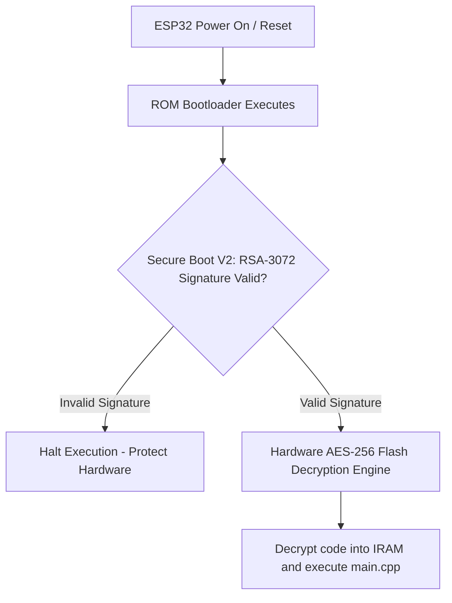

```yaml
schema_version: "2.0"
metadata:
  lesson_id: "IOT-MOD08-LES02"
  course_slug: "course-06-iot-hardware"
  course_title: "Course 6: Embedded Systems, ESP32, FreeRTOS, & Hardware IoT"
  module_slug: "mod-08-ota-updates-security"
  module_title: "Module 8 - Over-The-Air (OTA) Firmware Updates & Security"
  lesson_slug: "secure-boot-flash-encryption-partitions"
  lesson_title: "Lesson 8.2 Secure Boot, Flash Encryption, & Partition Tables"
  sort_order: 802

pedagogy:
  difficulty: "advanced"
  estimated_time:
    reading_minutes: 25
    practice_minutes: 30
    quiz_minutes: 10
    total_minutes: 65
  bloom_taxonomy_level: "Apply"
  xp_reward: 80

prerequisites:
  required_lesson_ids:
    - "IOT-MOD08-LES01"
  required_skills:
    - "ESP32 OTA Updates & Toolchain Configuration"

skills_acquired:
  - "Designing Custom CSV Partition Tables (`default.csv`, `huge_app.csv`, `custom.csv`)"
  - "Configuring Hardware Flash Encryption (AES-256 Flash Encryption)"
  - "Enabling Secure Boot V2 (RSA-3072 Signature Verification)"
  - "Managing eFuses (`espefuse.py`) and Hardening Hardware IoT"

dependencies:
  software:
    - "VS Code"
    - "PlatformIO"
    - "esptool.py"
    - "espefuse.py"
  hardware:
    - "ESP32 DevKit v1 Board"

seo_and_social:
  meta_title: "ESP32 Security: Secure Boot V2, AES-256 Flash Encryption & Partitions"
  meta_description: "Master ESP32 Hardware Security: custom CSV partition tables, AES-256 SPI Flash encryption, Secure Boot V2 RSA signature verification, and eFuse configuration."
  keywords: ["ESP32 Security", "Secure Boot V2", "Flash Encryption", "partitions.csv", "AES-256 ESP32", "eFuse", "espefuse.py"]

assessment_config:
  has_quiz: true
  has_lab: true
  has_flashcards: true
  pass_score_percentage: 80
```

# Lesson 8.2 Secure Boot, Flash Encryption, & Partition Tables

## 1. Overview & Learning Objectives [id: overview]

- **Estimated Time**: 65 Minutes (25m Reading | 30m Practice | 10m Quiz)
- **Difficulty Level**: ⭐⭐⭐ Advanced
- **Prerequisites**: [Lesson 8.1 OTA Updates](file:///d:/My%20Drive/all%20files/PROJECT%20FILES/notes/docs/curriculum/_06_iot_hardware/_06_17_over_the_air_ota_firmware_updates.md)
- **XP Reward**: +80 XP

### Learning Objectives
By the end of this lesson, you will be able to:
1. Design custom partition tables using CSV format (**`partitions.csv`**).
2. Protect firmware binary code and sensitive keys using hardware **AES-256 Flash Encryption**.
3. Verify firmware integrity using **Secure Boot V2 (RSA-3072 Signatures)**.
4. Program hardware **eFuses** using `espefuse.py` for enterprise device hardening.

---

## 2. Environment & Prerequisites [id: prerequisites]

Ensure `esptool.py` and `espefuse.py` CLI tools are installed.

---

## 3. Theoretical Foundations [id: theory]

### 3.1 Custom Partition Tables
The ESP32 external SPI Flash memory is divided into structured memory regions defined in a CSV partition table file:

```
┌─────────────────────────────────────────────────────────────────────────────┐
│                         ESP32 PARTITION TABLE MAP                           │
├─────────────────┬──────┬─────────┬───────────┬────────────┬─────────────────┤
│ Name            │ Type │ SubType │ Offset    │ Size       │ Flags           │
├─────────────────┼──────┼─────────┼───────────┼────────────┼─────────────────┤
│ **nvs**         │ data │ nvs     │ `0x9000`  │ `0x5000`   │ (Keys/Config)   │
│ **otadata**     │ data │ ota     │ `0xe000`  │ `0x2000`   │ (Boot Pointer)  │
│ **app0**        │ app  │ ota_0   │ `0x10000` │ `0x180000` │ (Primary App)   │
│ **app1**        │ app  │ ota_1   │ `0x190000`│ `0x180000` │ (Secondary App) │
│ **spiffs**      │ data │ spiffs  │ `0x310000`│ `0xf0000`  │ (File Storage)  │
└─────────────────┴──────┴─────────┴───────────┴────────────┴─────────────────┘
```

### 3.2 Hardware Security Primitives
1. **Flash Encryption**: Uses an internal hardware AES-256 key stored inside OTP (One-Time Programmable) eFuses to transparently encrypt all code and data stored in external SPI Flash memory.
2. **Secure Boot V2**: Prevents unauthorized firmware execution by requiring the ESP32 hardware bootloader to verify an RSA-3072 digital signature attached to the application binary before executing code.

---

## 4. Architecture & Diagram Visualizations [id: diagram]



---

## 5. Code & Hardware Implementation [id: syntax]

### File: `partitions_custom.csv` (Custom 4MB Dual-OTA Partition Table)

```csv
# Name,   Type, SubType, Offset,  Size,     Flags
nvs,      data, nvs,     0x9000,  0x5000,
otadata,  data, ota,     0xe000,  0x2000,
phy_init, data, phy,     0x10000, 0x1000,
factory,  app,  factory, 0x20000, 0x100000,
ota_0,    app,  ota_0,   0x120000,0x140000,
ota_1,    app,  ota_1,   0x260000,0x140000,
spiffs,   data, spiffs,  0x3a0000,0x50000,
```

### File: `platformio.ini` (Configuring Custom Partition Table)

```ini
[env:esp32dev]
platform = espressif32
board = esp32dev
framework = arduino

monitor_speed = 115200

; Reference Custom CSV Partition Table File!
board_build.partitions = partitions_custom.csv
```

### File: `main.cpp` (Querying Partition & Security Status)

```cpp
// ESP32 Partition & Security Status Inspection (main.cpp)
#include <Arduino.h>
#include <esp_ota_ops.h>
#include <esp_flash_encrypt.h>

void setup() {
  Serial.begin(115200);
  delay(1000);

  Serial.println("==============================================");
  Serial.println("       ESP32 SECURITY & PARTITION REPORT      ");
  Serial.println("==============================================");

  // 1. Query Active Running Partition
  const esp_partition_t *runningPartition = esp_ota_get_running_partition();
  Serial.printf("Running Partition Label: %s\n", runningPartition->label);
  Serial.printf("Partition Subtype: 0x%02X | Address: 0x%08X | Size: %u Bytes\n",
                runningPartition->subtype, runningPartition->address, runningPartition->size);

  // 2. Query Flash Encryption Status
  bool isEncrypted = esp_flash_encryption_enabled();
  Serial.printf("AES-256 Flash Encryption Enabled: %s\n", isEncrypted ? "YES (SECURE)" : "NO (DEVELOPMENT)");

  Serial.println("==============================================");
}

void loop() {
  delay(10000);
}
```

---

## 6. Enterprise Real-World Applications [id: examples]

- **Commercial Smart Locks & Medical Devices**: Commercial IoT products lock down eFuses, enable AES-256 Flash Encryption and Secure Boot V2, and disable UART flashing interfaces prior to mass production to prevent physical hardware extraction attacks.

---

## 7. Guided Step-by-Step Hands-On Exercise [id: exercises]

1. Create `partitions_custom.csv` in your project root directory.
2. Reference `board_build.partitions = partitions_custom.csv` in `platformio.ini`.
3. Upload firmware via PlatformIO $\to$ Inspect running partition label (`factory` or `ota_0`) in Serial Monitor!

---

## 8. Common Pitfalls & Troubleshooting [id: common_mistakes]

| Bug / Error | Root Cause | Engineering Solution |
| :--- | :--- | :--- |
| **`Partition Offset Misaligned` Error** | Offsets in `partitions.csv` are not aligned to 64 KB (`0x10000`) flash sector boundaries. | Ensure application partition offsets are exact multiples of `0x10000` (64 KB). |

---

## 9. Best Practices & Optimization [id: best_practices]

- **Align Offsets to 64 KB Boundaries**: Always align app partition offsets in `partitions.csv` to 64 KB sector boundaries (`0x10000`, `0x20000`, `0x120000`).

---

## 10. Industry Interview Q&A [id: interview_qa]

### Q1: Explain how Secure Boot V2 and Flash Encryption combine to secure ESP32 hardware in the field.
**Answer**: Flash Encryption uses a hardware-bound AES-256 key stored in eFuses to transparently encrypt all code and data stored in external SPI Flash memory, preventing attackers from dumping or reading firmware via logic analyzers. Secure Boot V2 uses RSA-3072 digital signatures to verify that the bootloader and application binaries have been signed by the vendor's private key before execution, preventing attackers from flashing unauthorized firmware.

---

## 11. Self-Assessment Quiz [id: quiz]

```json
{
  "quiz_title": "Lesson 8.2 Security & Partitions Assessment",
  "questions": [
    {
      "question_id": "Q1",
      "type": "multiple_choice",
      "question_text": "Which symmetric encryption algorithm is used by the ESP32 hardware Flash Encryption peripheral?",
      "options": ["DES", "AES-256", "RSA-2048", "Blowfish"],
      "correct_answer_index": 1,
      "explanation": "ESP32 uses hardware AES-256 Flash Encryption."
    }
  ]
}
```

---

## 12. Portfolio Assignment & Challenge [id: lab]

Design a custom `partitions.csv` file defining 1.4 MB OTA partitions and verify running partition details.

---

## 13. Spaced Repetition Flashcards [id: flashcards]

**Front**: What C API function checks if hardware Flash Encryption is active on the ESP32?
**Back**: `esp_flash_encryption_enabled()`.
<!-- flashcard:end -->

---

## 14. Summary & Cheat Sheet [id: summary]

```ini
board_build.partitions = partitions_custom.csv
```
```cpp
const esp_partition_t *p = esp_ota_get_running_partition();
bool sec = esp_flash_encryption_enabled();
```
