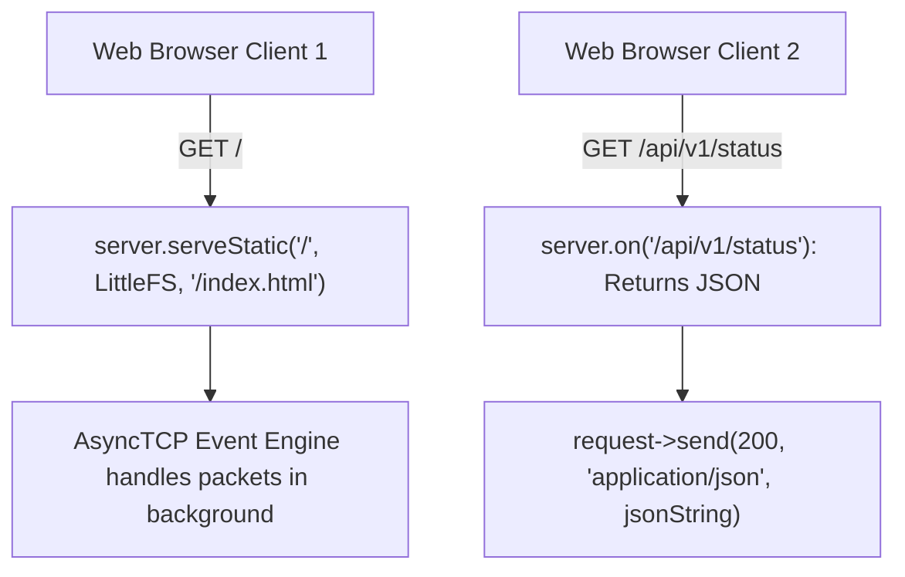

```yaml
schema_version: "2.0"
metadata:
  lesson_id: "IOT-MOD09-LES02"
  course_slug: "course-06-iot-hardware"
  course_title: "Course 6: Embedded Systems, ESP32, FreeRTOS, & Hardware IoT"
  module_slug: "mod-09-embedded-webservers"
  module_title: "Module 9 - Embedded Asynchronous Web Servers & Filesystems"
  lesson_slug: "espasyncwebserver-and-rest-control"
  lesson_title: "Lesson 9.2 Asynchronous Embedded Web Servers & REST Control Endpoints"
  sort_order: 902

pedagogy:
  difficulty: "advanced"
  estimated_time:
    reading_minutes: 20
    practice_minutes: 25
    quiz_minutes: 10
    total_minutes: 55
  bloom_taxonomy_level: "Apply"
  xp_reward: 70

prerequisites:
  required_lesson_ids:
    - "IOT-MOD09-LES01"
  required_skills:
    - "ESP32 LittleFS & Wi-Fi Station Mode"

skills_acquired:
  - "Configuring Non-Blocking `AsyncWebServer` on Port 80"
  - "Serving Static Files from LittleFS (`server.serveStatic()`)"
  - "Building Asynchronous REST Endpoints (`request->send()`)"
  - "Handling Multi-Client HTTP Concurrent Requests"

dependencies:
  software:
    - "VS Code"
    - "PlatformIO"
    - "mathieucarbou/ESPAsyncWebServer"
    - "bblanchon/ArduinoJson"
  hardware:
    - "ESP32 DevKit v1 Board"

seo_and_social:
  meta_title: "ESP32 AsyncWebServer: ESPAsyncWebServer, REST APIs & LittleFS Static Serving"
  meta_description: "Master ESP32 Asynchronous Web Servers: non-blocking ESPAsyncWebServer setup, serving static LittleFS web pages, building REST API control endpoints, and AsyncWebSocket."
  keywords: ["ESPAsyncWebServer", "AsyncWebServer", "ESP32 Web Server", "LittleFS ServeStatic", "ESP32 REST API", "Non-blocking Web Server"]

assessment_config:
  has_quiz: true
  has_lab: true
  has_flashcards: true
  pass_score_percentage: 80
```

# Lesson 9.2 Asynchronous Embedded Web Servers & REST Control Endpoints

## 1. Overview & Learning Objectives [id: overview]

- **Estimated Time**: 55 Minutes (20m Reading | 25m Practice | 10m Quiz)
- **Difficulty Level**: ⭐⭐⭐ Advanced
- **Prerequisites**: [Lesson 9.1 Embedded Filesystems](file:///d:/My%20Drive/all%20files/PROJECT%20FILES/notes/docs/curriculum/_06_iot_hardware/_06_19_spiffs_littlefs_and_static_file_serving.md)
- **XP Reward**: +70 XP

### Learning Objectives
By the end of this lesson, you will be able to:
1. Configure non-blocking asynchronous web servers using **`ESPAsyncWebServer`**.
2. Serve static HTML/CSS/JS files directly from LittleFS using **`server.serveStatic()`**.
3. Implement REST API control routes (`/api/v1/relay`, `/api/v1/sensors`).
4. Handle concurrent multi-client HTTP requests without blocking FreeRTOS background tasks.

---

## 2. Environment & Prerequisites [id: prerequisites]

Include `mathieucarbou/ESPAsyncWebServer @ ^3.0` and `bblanchon/ArduinoJson @ ^7.0` in `platformio.ini`.

---

## 3. Theoretical Foundations [id: theory]

### 3.1 Synchronous vs Asynchronous Web Servers
Standard synchronous web servers (like `WebServer.h`) process incoming HTTP requests sequentially inside the main loop. If 5 browser clients request web pages at the same time, client #5 must wait until clients 1 through 4 finish loading.

**`ESPAsyncWebServer`** operates asynchronously on top of the `AsyncTCP` engine. It handles multiple concurrent HTTP client connections and static file streams in the background using event-driven callbacks, consuming zero main thread CPU time while waiting for network packets:

```
┌─────────────────────────────────────────────────────────────────────────────┐
│                    ESPASYNCWEBSERVER ASYNCHRONOUS ARCHITECTURE              │
├─────────────────────────────────────────────────────────────────────────────┤
│ Browser Client 1 GET `/`      ──► Serves `/index.html` from LittleFS        │
│ Browser Client 2 POST `/relay`──► Asynchronous REST Handler Toggles GPIO     │
│ Main C++ loop()               ──► Continues executing sensor tasks!         │
└─────────────────────────────────────────────────────────────────────────────┘
```

---

## 4. Architecture & Diagram Visualizations [id: diagram]



---

## 5. Code & Hardware Implementation [id: syntax]

```cpp
// ESP32 Asynchronous Web Server & REST API (main.cpp)
#include <Arduino.h>
#include <WiFi.h>
#include <LittleFS.h>
#include <ESPAsyncWebServer.h>
#include <ArduinoJson.h>

const char *WIFI_SSID = "YOUR_WIFI_SSID";
const char *WIFI_PASS = "YOUR_WIFI_PASSWORD";

// Instantiate AsyncWebServer on Port 80
AsyncWebServer server(80);

void setup() {
  Serial.begin(115200);
  pinMode(GPIO_NUM_2, OUTPUT);

  // 1. Mount LittleFS
  if (!LittleFS.begin(true)) {
    Serial.println("[LittleFS Error]: Failed to mount.");
    return;
  }

  // 2. Connect Wi-Fi
  WiFi.mode(WIFI_STA);
  WiFi.begin(WIFI_SSID, WIFI_PASS);
  while (WiFi.status() != WL_CONNECTED) {
    delay(500);
    Serial.print(".");
  }
  Serial.println("\n[Wi-Fi Connected!]: IP = " + WiFi.localIP().toString());

  // 3. Serve Static HTML File from LittleFS
  server.serveStatic("/", LittleFS, "/").setDefaultFile("index.html");

  // 4. REST GET Endpoint: Returns Sensor Data as JSON
  server.on("/api/v1/sensors", HTTP_GET, [](AsyncWebServerRequest *request) {
    JsonDocument doc;
    doc["node_id"] = "ESP32-ASYNC1";
    doc["temperature"] = 25.4;
    doc["heap"] = ESP.getFreeHeap();

    String jsonString;
    serializeJson(doc, jsonString);

    request->send(200, "application/json", jsonString);
  });

  // 5. REST POST Endpoint: Controls Relay / LED
  server.on("/api/v1/relay/toggle", HTTP_POST, [](AsyncWebServerRequest *request) {
    digitalWrite(GPIO_NUM_2, !digitalRead(GPIO_NUM_2));
    bool newState = digitalRead(GPIO_NUM_2);

    JsonDocument doc;
    doc["status"] = "SUCCESS";
    doc["led_state"] = newState ? "ON" : "OFF";

    String jsonString;
    serializeJson(doc, jsonString);

    request->send(200, "application/json", jsonString);
  });

  // 6. Start Asynchronous Server
  server.begin();
  Serial.println("[AsyncWebServer Running]: Listening on port 80.");
}

void loop() {
  // No server handle code needed inside loop() — Server runs asynchronously!
  delay(1000);
}
```

---

## 6. Enterprise Real-World Applications [id: examples]

- **Embedded Industrial Gateways & Web Diagnostics**: Standalone IoT sensors host local web diagnostics portals over `ESPAsyncWebServer`, serving responsive single-page web applications (SPAs) directly from LittleFS to service technicians' tablets without requiring internet access.

---

## 7. Guided Step-by-Step Hands-On Exercise [id: exercises]

1. Set `platformio.ini`: `lib_deps = mathieucarbou/ESPAsyncWebServer@^3.0`, `bblanchon/ArduinoJson@^7.0`.
2. Upload `index.html` to LittleFS and upload `main.cpp`.
3. Open browser to `http://<ESP32_IP>/api/v1/sensors` $\to$ Observe instant JSON response!

---

## 8. Common Pitfalls & Troubleshooting [id: common_mistakes]

| Bug / Error | Root Cause | Engineering Solution |
| :--- | :--- | :--- |
| **`Guru Meditation Error` inside Request Callback** | Calling heavy blocking operations (`delay(1000)`) inside an `ESPAsyncWebServer` request callback function. | Keep request callback functions non-blocking; return responses (`request->send()`) immediately. |

---

## 9. Best Practices & Optimization [id: best_practices]

- **Keep Callbacks Non-Blocking**: `ESPAsyncWebServer` callbacks execute within the AsyncTCP network thread. Never call blocking delays inside callbacks.

---

## 10. Industry Interview Q&A [id: interview_qa]

### Q1: Why is `ESPAsyncWebServer` superior to the standard synchronous `WebServer.h` library for ESP32 applications?
**Answer**: `WebServer.h` executes synchronously in the main loop thread, meaning slow clients or dropped packets block all server processing and background tasks. `ESPAsyncWebServer` builds on `AsyncTCP` event-driven sockets, processing multi-client HTTP requests, file downloads, and WebSocket frames asynchronously in background tasks without blocking the main C++ execution loop.

---

## 11. Self-Assessment Quiz [id: quiz]

```json
{
  "quiz_title": "Lesson 9.2 AsyncWebServer Assessment",
  "questions": [
    {
      "question_id": "Q1",
      "type": "multiple_choice",
      "question_text": "Which ESPAsyncWebServer method serves static files stored in LittleFS directly to web clients?",
      "options": ["server.serveStatic()", "server.serveFile()", "server.sendFile()", "server.mountFolder()"],
      "correct_answer_index": 0,
      "explanation": "server.serveStatic() serves static LittleFS files."
    }
  ]
}
```

---

## 12. Portfolio Assignment & Challenge [id: lab]

Build an `ESPAsyncWebServer` serving an HTML portal and providing a REST API controlling GPIO 2.

---

## 13. Spaced Repetition Flashcards [id: flashcards]

**Front**: How do you send a JSON HTTP response in `ESPAsyncWebServer`?
**Back**: `request->send(200, "application/json", jsonString);`.
<!-- flashcard:end -->

---

## 14. Summary & Cheat Sheet [id: summary]

```cpp
AsyncWebServer server(80);
server.serveStatic("/", LittleFS, "/").setDefaultFile("index.html");
server.on("/api/data", HTTP_GET, [](AsyncWebServerRequest *r){
    r->send(200, "application/json", "{\"status\":\"ok\"}");
});
server.begin();
```
