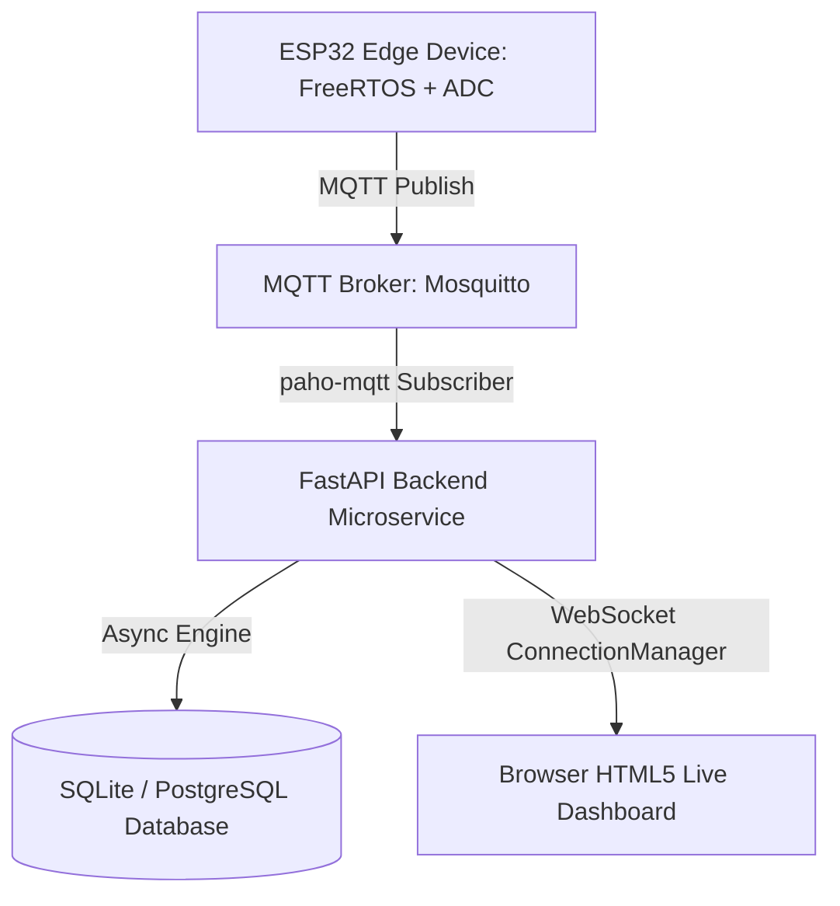

```yaml
schema_version: "2.0"
metadata:
  lesson_id: "IOT-MOD10-LES01"
  course_slug: "course-06-iot-hardware"
  course_title: "Course 6: Embedded Systems, ESP32, FreeRTOS, & Hardware IoT"
  module_slug: "mod-10-iot-capstone"
  module_title: "Module 10 - Full-Stack End-to-End IoT Capstone Architecture"
  lesson_slug: "fullstack-iot-system-architecture"
  lesson_title: "Lesson 10.1 Full-Stack IoT System Architecture & Protocol Integration"
  sort_order: 1001

pedagogy:
  difficulty: "advanced"
  estimated_time:
    reading_minutes: 20
    practice_minutes: 25
    quiz_minutes: 10
    total_minutes: 55
  bloom_taxonomy_level: "Apply"
  xp_reward: 70

prerequisites:
  required_lesson_ids:
    - "IOT-MOD09-LES02"
  required_skills:
    - "ESP32 Peripherals, FreeRTOS, MQTT & FastAPI Microservices"

skills_acquired:
  - "Designing End-to-End IoT System Architectures"
  - "Integrating Sensor Hardware, ESP32 FreeRTOS Firmware, & Cloud Broker"
  - "Connecting MQTT Brokers to FastAPI Microservice Backends"
  - "Real-Time WebSocket Streaming to Browser Dashboards"

dependencies:
  software:
    - "VS Code"
    - "Python 3.12+"
    - "fastapi"
    - "uvicorn"
    - "paho-mqtt"
  hardware:
    - "ESP32 DevKit v1 Board"

seo_and_social:
  meta_title: "Full-Stack IoT Architecture: ESP32 FreeRTOS, MQTT Broker & FastAPI Dashboard"
  meta_description: "Master Full-Stack End-to-End IoT Architecture: connecting ESP32 FreeRTOS edge firmware to MQTT brokers, FastAPI microservices, and real-time WebSockets."
  keywords: ["Full Stack IoT", "ESP32 Architecture", "MQTT FastAPI Integration", "IoT End-to-End", "FreeRTOS Edge Device"]

assessment_config:
  has_quiz: true
  has_lab: true
  has_flashcards: true
  pass_score_percentage: 80
```

# Lesson 10.1 Full-Stack IoT System Architecture & Protocol Integration

## 1. Overview & Learning Objectives [id: overview]

- **Estimated Time**: 55 Minutes (20m Reading | 25m Practice | 10m Quiz)
- **Difficulty Level**: ⭐⭐⭐ Advanced
- **Prerequisites**: [Lesson 9.2 AsyncWebServer](file:///d:/My%20Drive/all%20files/PROJECT%20FILES/notes/docs/curriculum/_06_iot_hardware/_06_20_espasyncwebserver_and_rest_control.md)
- **XP Reward**: +70 XP

### Learning Objectives
By the end of this lesson, you will be able to:
1. Map out an enterprise **Full-Stack End-to-End IoT System Architecture**.
2. Connect embedded ESP32 FreeRTOS firmware to an MQTT message broker.
3. Integrate Python FastAPI microservices with MQTT subscriber daemons (`paho-mqtt`).
4. Relay MQTT telemetry to web browser dashboards via WebSockets.

---

## 2. Environment & Prerequisites [id: prerequisites]

Ensure Python 3.12, `fastapi`, `uvicorn`, and `paho-mqtt` are installed in your backend environment.

---

## 3. Theoretical Foundations [id: theory]

### 3.1 End-to-End Full-Stack IoT Data Pipeline
A production IoT platform integrates five distinct technical layers:

```
┌─────────────────────────────────────────────────────────────────────────────┐
│                    FULL-STACK END-TO-END IOT ARCHITECTURE                   │
├─────────────────────────────────────────────────────────────────────────────┤
│ 1. HARDWARE LAYER: Analog Sensors / GPIO / ADC                              │
│       │                                                                     │
│       ▼                                                                     │
│ 2. EDGE FIRMWARE: ESP32 Dual-Core FreeRTOS (Queues, Mutexes, WiFi)          │
│       │                                                                     │
│       ▼                                                                     │
│ 3. BROKER LAYER: MQTT Message Broker (Mosquitto / EMQX)                     │
│       │                                                                     │
│       ▼                                                                     │
│ 4. BACKEND MICROSERVICE: FastAPI (SQLAlchemy 2.0, Pydantic, paho-mqtt)       │
│       │                                                                     │
│       ▼                                                                     │
│ 5. FRONTEND DASHBOARD: HTML5 / CSS3 / JS (WebSockets Live Telemetry Chart)  │
└─────────────────────────────────────────────────────────────────────────────┘
```

---

## 4. Architecture & Diagram Visualizations [id: diagram]



---

## 5. Code & Hardware Implementation [id: syntax]

### File: `backend_bridge.py` (FastAPI + MQTT Ingestion Bridge)

```python
# FastAPI Microservice with Background MQTT Bridge (backend_bridge.py)
import json
import asyncio
from fastapi import FastAPI, WebSocket, WebSocketDisconnect
import paho.mqtt.client as mqtt

app = FastAPI(title="Full-Stack IoT Gateway API")

# WebSocket ConnectionManager for Web Browsers
class ConnectionManager:
    def __init__(self):
        self.active_connections: list[WebSocket] = []

    async def connect(self, websocket: WebSocket):
        await websocket.accept()
        self.active_connections.append(websocket)

    def disconnect(self, websocket: WebSocket):
        if websocket in self.active_connections:
            self.active_connections.remove(websocket)

    async def broadcast(self, message: dict):
        for connection in self.active_connections:
            await connection.send_json(message)

manager = ConnectionManager()

# MQTT Callback when telemetry message arrives from ESP32
def on_mqtt_message(client, userdata, msg):
    payload = msg.payload.decode("utf-8")
    print(f"[MQTT -> FastAPI Bridge]: Topic '{msg.topic}' | Payload: {payload}")
    
    try:
        data = json.loads(payload)
        # Event loop scheduling for async broadcast
        loop = asyncio.get_event_loop()
        if loop.is_running():
            asyncio.run_coroutine_threadsafe(
                manager.broadcast({"event": "TELEMETRY", "data": data}), loop
            )
    except Exception as e:
        print(f"[Bridge Error]: {e}")

# Initialize Paho MQTT Client
mqtt_client = mqtt.Client()
mqtt_client.on_message = on_mqtt_message
mqtt_client.connect("test.mosquitto.org", 1883, 60)
mqtt_client.subscribe("nodes/+/telemetry")
mqtt_client.loop_start() # Start background thread

@app.websocket("/ws/telemetry-stream")
async def websocket_endpoint(websocket: WebSocket):
    await manager.connect(websocket)
    try:
        while True:
            await websocket.receive_text()
    except WebSocketDisconnect:
        manager.disconnect(websocket)
```

---

## 6. Enterprise Real-World Applications [id: examples]

- **Smart City Environmental Monitoring**: Metropolitan air quality networks deploy thousands of ESP32 sensor nodes publishing PM2.5 levels over MQTT, which are ingested by FastAPI microservices and streamed live to public municipal web dashboards over WebSockets.

---

## 7. Guided Step-by-Step Hands-On Exercise [id: exercises]

1. Run FastAPI bridge: `uvicorn backend_bridge:app --reload`.
2. Connect your ESP32 publishing MQTT telemetry to `test.mosquitto.org`.
3. Open browser to `ws://localhost:8000/ws/telemetry-stream` $\to$ Observe live end-to-end telemetry streaming from ESP32 hardware directly into your web dashboard!

---

## 8. Common Pitfalls & Troubleshooting [id: common_mistakes]

| Bug / Error | Root Cause | Engineering Solution |
| :--- | :--- | :--- |
| **`RuntimeError: There is no current event loop`** | Attempting to call async WebSocket broadcast directly from synchronous `paho-mqtt` callback thread. | Use `asyncio.run_coroutine_threadsafe(manager.broadcast(...), loop)` to bridge thread execution safely. |

---

## 9. Best Practices & Optimization [id: best_practices]

- **Bridge Threads Safely**: Always use `asyncio.run_coroutine_threadsafe()` when bridging synchronous MQTT callbacks into async FastAPI WebSocket handlers.

---

## 10. Industry Interview Q&A [id: interview_qa]

### Q1: Why is an MQTT message broker placed between embedded ESP32 devices and backend FastAPI microservices in full-stack IoT architectures?
**Answer**: An MQTT broker decouples edge devices from backend microservices. If the backend microservice restarts or undergoes maintenance, edge devices continue publishing messages to the broker without dropping data or failing. Furthermore, multiple backend services (analytics, database loggers, alert engines) can subscribe to the same broker streams independently without increasing load on the edge microcontrollers.

---

## 11. Self-Assessment Quiz [id: quiz]

```json
{
  "quiz_title": "Lesson 10.1 Full-Stack Architecture Assessment",
  "questions": [
    {
      "question_id": "Q1",
      "type": "multiple_choice",
      "question_text": "Which Python library bridges synchronous MQTT callbacks into an asynchronous asyncio event loop safely?",
      "options": ["asyncio.run_coroutine_threadsafe()", "asyncio.create_task()", "loop.run_until_complete()", "asyncio.sleep()"],
      "correct_answer_index": 0,
      "explanation": "asyncio.run_coroutine_threadsafe() schedules coroutines from external threads."
    }
  ]
}
```

---

## 12. Portfolio Assignment & Challenge [id: lab]

Build a Python FastAPI backend subscribing to MQTT sensor telemetry and broadcasting via WebSockets.

---

## 13. Spaced Repetition Flashcards [id: flashcards]

**Front**: What Python library connects FastAPI microservices to MQTT brokers?
**Back**: `paho-mqtt`.
<!-- flashcard:end -->

---

## 14. Summary & Cheat Sheet [id: summary]

```python
mqtt_client.on_message = on_msg
mqtt_client.subscribe("nodes/+/telemetry")
asyncio.run_coroutine_threadsafe(broadcast(data), loop)
```
