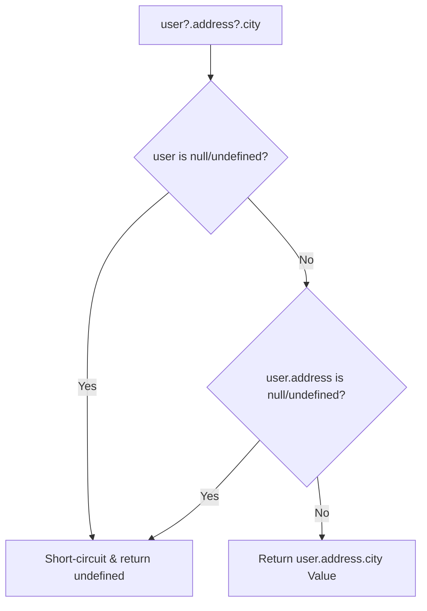

# Comprehensive Operator Systems

> **Course**: Git Version Control | **Module**: Introduction | **Difficulty**: beginner

---

- **Estimated Time**: 55 Minutes (20m Reading | 25m Practice | 10m Quiz)
- **Difficulty Level**: ⭐⭐ Intermediate
- **Prerequisites**: [Lesson 2.3 Type Coercion](file:///d:/My%20Drive/all%20files/PROJECT%20FILES/notes/docs/curriculum/_03_javascript/_03_06_type_coercion_and_comparison_operations.md)
- **XP Reward**: +60 XP

### Learning Objectives
By the end of this lesson, you will be able to:
1. Leverage Short-Circuit Evaluation (`&&`, `||`).
2. Contrast the **Nullish Coalescing Operator (`??`)** with Logical OR (`||`).
3. Safely navigate nested object properties using **Optional Chaining (`?.`)**.
4. Execute high-performance Bitwise operations (`&`, `|`, `^`, `~`, `<<`, `>>`).
5. Utilize Unary and Special Operators (`delete`, `void`, Ternary `? :`).

---

---

Open Node.js REPL to execute operator expressions.

---

---

### 3.1 `||` vs `??` (Nullish Coalescing)
- **Logical OR (`||`)**: Returns right-hand side if left-hand side is ANY **Falsy** value (`0`, `""`, `false`, `null`, `undefined`).
- **Nullish Coalescing (`??`)**: Returns right-hand side ONLY if left-hand side is `null` or `undefined`!

```javascript
const count = 0;

const val1 = count || 10; // Evaluates to 10! (Because 0 is falsy)
const val2 = count ?? 10; // Evaluates to 0!  (Preserves valid 0 value!)
```

### 3.2 Optional Chaining (`?.`)
Short-circuits property access and returns `undefined` if an object reference is `null` or `undefined`, preventing `Cannot read properties of undefined` crashes:

```javascript
const user = {};
const city = user?.address?.city; // Evaluates safely to undefined!
```

---

---



---

---

```javascript
// Comprehensive Operator Demonstration

const telemetryConfig = {
  nodeId: "ESP32-A1",
  readings: {
    temperature: 0 // Valid 0 degree reading!
  }
};

// 1. Optional Chaining & Nullish Coalescing
const temp = telemetryConfig?.readings?.temperature ?? 25;
console.log(`Temperature: ${temp}°C`); // Outputs 0°C (Correctly preserved!)

// 2. Bitwise Permission Flags
const READ_PERM  = 1 << 0; // 0001 (1)
const WRITE_PERM = 1 << 1; // 0010 (2)
let userPerms = READ_PERM | WRITE_PERM; // 0011 (3)

console.log("Can Read?", (userPerms & READ_PERM) !== 0); // true
```

---

---

- **Bitwise IoT Hardware Flags**: Microcontroller telemetry packets encode sensor state flags into single bitwise integer bitmasks (`1 << n`) to minimize network bandwidth.

---

---

1. Save code as `operators_demo.js`.
2. Run `node operators_demo.js` $\to$ Verify `??` preserves `0°C` temperature value!

---

---

| Bug / Error | Root Cause | Engineering Solution |
| :--- | :--- | :--- |
| **Default Overwritten by `||`** | Using `||` for default settings when `0` or `""` are valid valid inputs. | Replace `||` with `??` (Nullish Coalescing). |

---

---

- **Use `??` for Defaults**: Preserves valid `0` and `""` inputs.
- **Use `?.` for Nested Access**: Eliminates defensive `if (user && user.address)` checks.

---

---

### Q1: How does the Nullish Coalescing Operator (`??`) differ from the Logical OR Operator (`||`)?
**Answer**: The Logical OR (`||`) operator returns the right-hand operand for ANY falsy left-hand value (including `0`, `""`, and `false`). The Nullish Coalescing operator (`??`) returns the right-hand operand ONLY if the left-hand operand evaluates to `null` or `undefined`.

---

---

```json
{
  "quiz_title": "Lesson 2.4 Operators Assessment",
  "questions": [
    {
      "question_id": "Q1",
      "type": "multiple_choice",
      "question_text": "What does `const x = 0 ?? 42;` evaluate to?",
      "options": ["42", "0", "undefined", "null"],
      "correct_answer_index": 1,
      "explanation": "0 is not null or undefined, so ?? returns 0."
    }
  ]
}
```

---

---

Build a robust JSON API payload parser using `?.` and `??` for error-free property extraction.

---

---

**Front**: What operator prevents `TypeError: Cannot read properties of undefined`?
**Back**: Optional Chaining Operator (`?.`).
<!-- flashcard:end -->

---

---

```javascript
const city = user?.address?.city ?? "Unknown";
```

---
