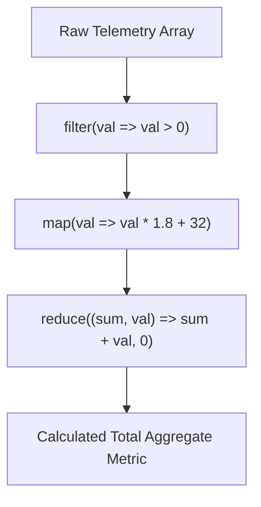

# Dense Sparse Arrays And Higher Order Methods

> **Course**: Git Version Control | **Module**: Introduction | **Difficulty**: beginner

---

- **Estimated Time**: 55 Minutes (20m Reading | 25m Practice | 10m Quiz)
- **Difficulty Level**: ⭐⭐ Intermediate
- **Prerequisites**: [Lesson 5.1 Objects](file:///d:/My%20Drive/all%20files/PROJECT%20FILES/notes/docs/curriculum/_03_javascript/_03_15_object_literals_descriptors_and_immutability.md)
- **XP Reward**: +60 XP

### Learning Objectives
By the end of this lesson, you will be able to:
1. Differentiate between Dense and Sparse Arrays in JavaScript.
2. Separate Mutating methods (`splice`, `sort`, `reverse`) from Non-Mutating methods (`slice`, `concat`, `map`).
3. Transform datasets using Higher-Order Iteration methods (`map`, `filter`, `reduce`, `flatMap`).
4. Write robust numeric sorting comparator functions (`(a, b) => a - b`).

---

---

Open Node.js REPL to execute array operations.

---

---

### 3.1 Mutating vs Non-Mutating Methods

```
┌─────────────────────────────────────────────────────────────────────────────┐
│                          MUTATING VS NON-MUTATING METHODS                   │
├─────────────────┬──────────────────────────────────┬────────────────────────┤
│ Category        │ Array Methods                    │ Behavior               │
├─────────────────┼──────────────────────────────────┼────────────────────────┤
│ Mutating        │ `push()`, `pop()`, `shift()`,    │ Alters original array  │
│                 │ `unshift()`, `splice()`, `sort()`│ in memory directly     │
├─────────────────┼──────────────────────────────────┼────────────────────────┤
│ Non-Mutating    │ `concat()`, `slice()`, `map()`,  │ Returns a brand NEW    │
│                 │ `filter()`, `reduce()`, `flat()` │ transformed array      │
└─────────────────┴──────────────────────────────────┴────────────────────────┘
```

> [!CAUTION]
> **Default `.sort()` Lexicographical Trap**: `[10, 2, 5].sort()` returns `[10, 2, 5]` because `.sort()` converts numbers to strings by default (`"10" < "2"`). Always supply a numeric comparator function: `arr.sort((a, b) => a - b)`.

---

---



---

---

```javascript
// Functional Array Operations Demonstration

const sensorReadings = [
  { id: "S1", temp: 22.5, active: true },
  { id: "S2", temp: 45.0, active: false },
  { id: "S3", temp: 31.2, active: true },
  { id: "S4", temp: 19.8, active: true }
];

// 1. Chaining filter, map, and reduce
const activeAvgTemp = sensorReadings
  .filter(s => s.active)                              // Keep active sensors
  .map(s => s.temp)                                   // Extract temperatures
  .reduce((acc, temp, _, arr) => acc + temp / arr.length, 0); // Calculate average

console.log(`Active Average Temp: ${activeAvgTemp.toFixed(2)}°C`);

// 2. Numeric Array Sorting with Comparator
const numbers = [100, 25, 5, 80, 1];
numbers.sort((a, b) => a - b); // Ascending order!
console.log("Sorted Numbers:", numbers);

// 3. flatMap (Map + Flat level 1)
const packetBatches = [
  [10, 20],
  [30, 40]
];
const flattened = packetBatches.flatMap(batch => batch.map(x => x * 2));
console.log("FlatMapped Output:", flattened); // [20, 40, 60, 80]
```

---

---

- **E-Commerce Shopping Cart Analytics**: Aggregating cart item totals, applying discount filters, and generating subtotal summaries using functional `reduce()` chains.

---

---

1. Save code as `arrays_demo.js`.
2. Run `node arrays_demo.js` $\to$ Inspect active average and flatMap outputs!

---

---

| Bug / Error | Root Cause | Engineering Solution |
| :--- | :--- | :--- |
| **Incorrect Sorting Order** | Calling `.sort()` without a comparator callback on numeric arrays. | Pass `(a, b) => a - b` for ascending or `(a, b) => b - a` for descending. |

---

---

- **Prefer Non-Mutating Methods**: Use `map`, `filter`, `concat` to maintain predictable immutable state updates.

---

---

### Q1: How does `.reduce()` work in JavaScript and what is the role of the initial value parameter?
**Answer**: `.reduce()` executes a reducer callback function on each element of the array, passing the accumulated result from the previous iteration. The `initialValue` parameter initializes the accumulator on the first call; if omitted, the first array element is used as the initial accumulator.

---

---

```json
{
  "quiz_title": "Lesson 5.2 Array Methods Assessment",
  "questions": [
    {
      "question_id": "Q1",
      "type": "multiple_choice",
      "question_text": "Which array method mutates the original array in place?",
      "options": ["map()", "filter()", "splice()", "slice()"],
      "correct_answer_index": 2,
      "explanation": "splice() mutates the original array."
    }
  ]
}
```

---

---

Build a data pipeline querying, grouping, and aggregating 1,000 telemetry objects using `reduce()`.

---

---

**Front**: What is the difference between `slice()` and `splice()`?
**Back**: `slice()` returns a new copy without modifying the original array. `splice()` mutates the original array by removing or inserting elements.
<!-- flashcard:end -->

---

---

```javascript
const avg = arr.reduce((sum, val) => sum + val, 0) / arr.length;
```

---
