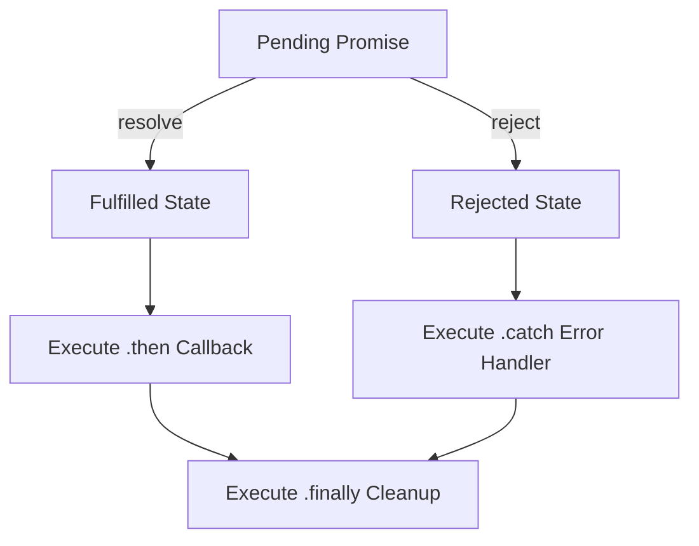

# Es6 Promises Architecture States And Chaining

> **Course**: Git Version Control | **Module**: Introduction | **Difficulty**: beginner

---

- **Estimated Time**: 55 Minutes (20m Reading | 25m Practice | 10m Quiz)
- **Difficulty Level**: ⭐⭐ Intermediate
- **Prerequisites**: [Lesson 6.1 Event Loop](file:///d:/My%20Drive/all%20files/PROJECT%20FILES/notes/docs/curriculum/_03_javascript/_03_19_asynchronous_execution_callbacks_event_queue.md)
- **XP Reward**: +60 XP

### Learning Objectives
By the end of this lesson, you will be able to:
1. Identify the 3 immutable states of a Promise (`Pending`, `Fulfilled`, `Rejected`).
2. Construct Promises using `new Promise((resolve, reject) => {})`.
3. Chain asynchronous operations using `.then()`, `.catch()`, and `.finally()`.
4. Trace error bubbling down an asynchronous Promise chain.

---

---

Open Node.js REPL to execute Promise chains.

---

---

### 3.1 Promise States & Immutability
A **Promise** is a placeholder object for a value that is not yet available. A Promise exists in exactly one of three states:

1. **`Pending`**: Initial state; neither fulfilled nor rejected.
2. **`Fulfilled`**: Operation completed successfully (`resolve(value)`).
3. **`Rejected`**: Operation failed (`reject(error)`).

> [!IMPORTANT]
> **State Settling Immutability**: Once a Promise transitions from `Pending` to either `Fulfilled` or `Rejected`, its state is **Settled** and permanently locked. Calling `resolve()` or `reject()` a second time is ignored.

```
┌─────────────────────────────────────────────────────────────────────────────┐
│                          PROMISE STATE TRANSITIONS                          │
├─────────────────────────────────────────────────────────────────────────────┤
│                          ┌──► Fulfilled (via resolve(val)) ──► .then()     │
│ Pending (Initial State) ─┤                                                  │
│                          └──► Rejected  (via reject(err))  ──► .catch()    │
└─────────────────────────────────────────────────────────────────────────────┘
```

---

---



---

---

```javascript
// Promise Construction & Chaining Demonstration

function fetchIotTelemetry(sensorId) {
  return new Promise((resolve, reject) => {
    setTimeout(() => {
      if (!sensorId) {
        reject(new Error("Invalid Sensor ID!"));
      } else {
        resolve({ sensorId, temperature: 26.4, status: "OK" });
      }
    }, 500);
  });
}

// Chaining .then(), .catch(), and .finally()
fetchIotTelemetry("ESP32-NODE-1")
  .then(data => {
    console.log("Step 1 (Raw Data):", data);
    return data.temperature; // Returns value wrapped in a new Fulfilled Promise!
  })
  .then(temp => {
    console.log(`Step 2 (Fahrenheit): ${(temp * 1.8 + 32).toFixed(1)}°F`);
  })
  .catch(err => {
    console.error("Promise Error Caught:", err.message);
  })
  .finally(() => {
    console.log("Cleanup: Telemetry operation finalized.");
  });
```

---

---

- **Fetch API HTTP Requests**: Browsers' native `window.fetch()` API returns a Promise that fulfills with a `Response` object or rejects on network disconnects.

---

---

1. Save code as `promises_demo.js`.
2. Run `node promises_demo.js` $\to$ Inspect Promise chain step outputs!

---

---

| Bug / Error | Root Cause | Engineering Solution |
| :--- | :--- | :--- |
| **`UnhandledPromiseRejection`** | Omitting a `.catch()` block at the end of a Promise chain. | Always append `.catch()` or handle rejections inside async wrappers. |

---

---

- **Always Return Values in `.then()`**: Returning a value forwards it to the next `.then()` callback in the chain.

---

---

### Q1: What happens if a `.then()` callback returns a plain scalar value versus another Promise?
**Answer**: If a `.then()` callback returns a scalar value (e.g. `number` or `string`), `.then()` automatically wraps it in a new Fulfilled Promise holding that value. If it returns another Promise, the chain waits for that inner Promise to settle before invoking the next `.then()` in the outer chain.

---

---

```json
{
  "quiz_title": "Lesson 6.2 Promises Assessment",
  "questions": [
    {
      "question_id": "Q1",
      "type": "multiple_choice",
      "question_text": "Which method executes regardless of whether a Promise fulfilled or rejected?",
      "options": [".then()", ".catch()", ".finally()", ".all()"],
      "correct_answer_index": 2,
      "explanation": ".finally() executes cleanup logic on both fulfillment and rejection."
    }
  ]
}
```

---

---

Convert a legacy callback-based `fs.readFile` function into a Promise-returning function (`promisify`).

---

---

**Front**: Can a Settled Promise (Fulfilled or Rejected) change its state again?
**Back**: No. State transitions are immutable and permanent once settled.
<!-- flashcard:end -->

---

---

```javascript
new Promise((resolve, reject) => resolve(data))
  .then(res => console.log(res))
  .catch(err => console.error(err));
```

---
