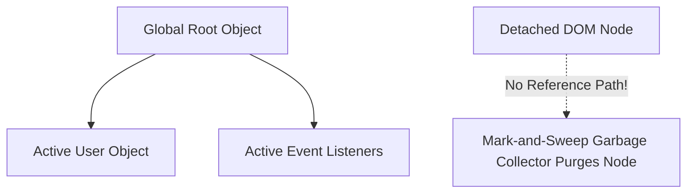

# Execution Context Call Stack And Memory Management

> **Course**: Git Version Control | **Module**: Introduction | **Difficulty**: beginner

---

- **Estimated Time**: 55 Minutes (20m Reading | 25m Practice | 10m Quiz)
- **Difficulty Level**: ⭐⭐⭐ Advanced
- **Prerequisites**: [Lesson 1.2 JavaScript Engine Architecture](file:///d:/My%20Drive/all%20files/PROJECT%20FILES/notes/docs/curriculum/_03_javascript/_03_02_javascript_engine_architecture.md)
- **XP Reward**: +70 XP

### Learning Objectives
By the end of this lesson, you will be able to:
1. Deconstruct the two phases of an **Execution Context** (Creation Phase vs Execution Phase).
2. Trace function execution frames through the LIFO **Call Stack**.
3. Identify memory allocation in the **Call Stack** (primitives) vs **Memory Heap** (objects/references).
4. Explain how V8's **Mark-and-Sweep Garbage Collector** reclaims memory.
5. Diagnose and fix common Memory Leaks (dangling event listeners, accidental globals, detached DOM trees).

---

---

Inspect Heap Snapshots in Chrome DevTools:
- Open DevTools (`F12`) $\to$ Click **Memory** tab $\to$ Select **Heap snapshot** $\to$ Click **Take snapshot**.

---

---

### 3.1 Execution Context Lifecycle
Every time a JavaScript function is invoked, a new Execution Context is pushed onto the Call Stack:

1. **Creation Phase**:
   - Creates the `window` or `global` object.
   - Sets up `this` binding.
   - Scans for variable and function declarations (**Hoisting**).
2. **Execution Phase**:
   - Assigns values to variables.
   - Executes code line by line.

```
┌─────────────────────────────────────────────────────────────────────────────┐
│                          CALL STACK vs MEMORY HEAP                          │
├──────────────────────────────────────┬──────────────────────────────────────┤
│ Call Stack (Primitive Values & Frame)│ Memory Heap (Unstructured Large Data)│
├──────────────────────────────────────┼──────────────────────────────────────┤
│ `let x = 10`                         │ `const user = { name: "Alice" }`     │
│ `let ptr = 0x00A1B` ─────────────────┼──► Memory Address 0x00A1B           │
└──────────────────────────────────────┴──────────────────────────────────────┘
```

### 3.2 Mark-and-Sweep Garbage Collection
V8 periodically traverses all objects starting from global **Roots**. Objects unreachable from the root are marked and swept from the Memory Heap.

---

---



---

---

```javascript
// Memory Leak Example: Dangling Event Listener

function attachListener() {
  const bigData = new Array(1000000).fill("Memory Payload");
  
  // Bug: Event listener retains bigData reference via closure!
  window.addEventListener('resize', function leakHandler() {
    console.log(bigData.length);
  });
}

attachListener(); // bigData is trapped in heap memory forever!
```

---

---

- **Node.js Production Servers**: Monitoring memory heap usage (`process.memoryUsage()`) prevents out-of-memory container crashes under heavy traffic loads.

---

---

1. Save code as `memory_demo.js`.
2. Open Chrome DevTools Memory tab $\to$ Take Heap Snapshot $\to$ Observe 1,000,000 array items retained in memory!

---

---

| Bug / Error | Root Cause | Engineering Solution |
| :--- | :--- | :--- |
| **`RangeError: Maximum call stack size exceeded`** | Infinite recursive function call without a termination base condition. | Add proper base conditions to recursion loops. |

---

---

- **Remove Event Listeners**: Call `removeEventListener()` when components unmount.

---

---

### Q1: What is Mark-and-Sweep Garbage Collection in JavaScript?
**Answer**: Mark-and-Sweep is V8's primary memory reclamation algorithm. It starts from global roots, "marks" all reachable objects, and "sweeps" un-marked, unreachable memory addresses back into free heap space.

---

---

```json
{
  "quiz_title": "Lesson 1.3 Execution Context Assessment",
  "questions": [
    {
      "question_id": "Q1",
      "type": "multiple_choice",
      "question_text": "During which Execution Context phase are variables hoisted and assigned `undefined`?",
      "options": ["Creation Phase", "Execution Phase", "Compilation Phase", "Garbage Collection Phase"],
      "correct_answer_index": 0,
      "explanation": "Variable declarations are hoisted during the Creation Phase."
    }
  ]
}
```

---

---

Profile and eliminate 3 intentional memory leaks using Chrome Memory Profiler.

---

---

**Front**: Where are primitive values stored in JavaScript?
**Back**: In the Call Stack frame (objects are stored in the Memory Heap).
<!-- flashcard:end -->

---

---

```javascript
window.removeEventListener('resize', handler);
```

---
