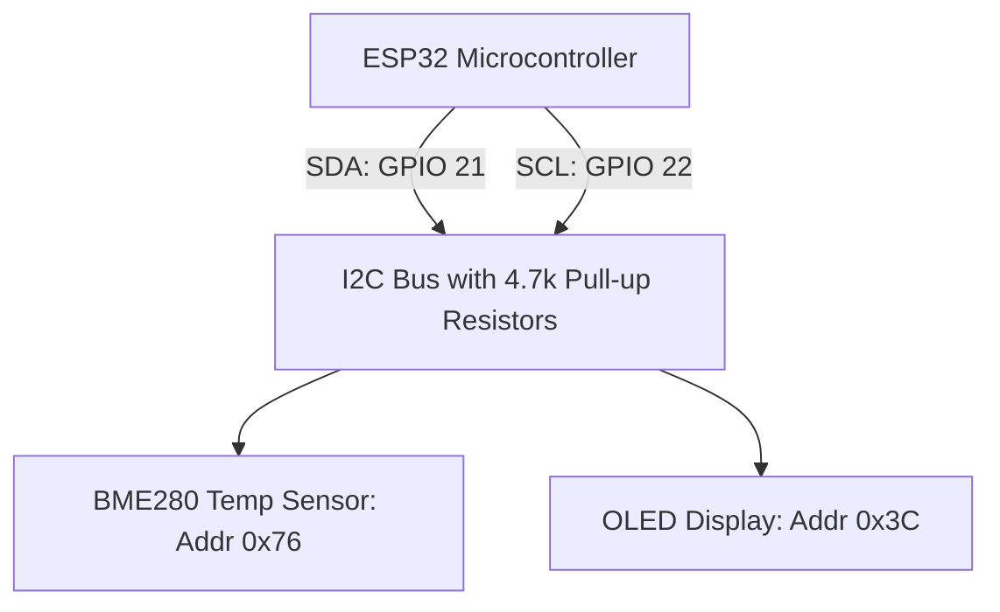

# I2C Spi And Uart Communication

> **Course**: Git Version Control | **Module**: Introduction | **Difficulty**: beginner

---

- **Estimated Time**: 55 Minutes (20m Reading | 25m Practice | 10m Quiz)
- **Difficulty Level**: ⭐⭐ Intermediate
- **Prerequisites**: [Lesson 2.2 ADC & PWM](file:///d:/My%20Drive/all%20files/PROJECT%20FILES/notes/docs/curriculum/_06_iot_hardware/_06_04_adc_dac_and_pwm_timer_control.md)
- **XP Reward**: +60 XP

### Learning Objectives
By the end of this lesson, you will be able to:
1. Explain the operational mechanics of **I2C**, **SPI**, and **UART** serial communication protocols.
2. Implement I2C bus scanning and sensor reading using **`Wire.h`** (SDA GPIO 21, SCL GPIO 22).
3. Configure high-speed **SPI** communications (MOSI, MISO, SCK, CS).
4. Utilize ESP32 **HardwareSerial** peripherals (UART0, UART1, UART2).

---

---

Gather ESP32, I2C Sensor (BME280/MPU6050/OLED Display), and Jumper Wires.

---

---

### 3.1 Serial Protocol Comparison Matrix

```
┌─────────────────────────────────────────────────────────────────────────────┐
│                       EMBEDDED SERIAL PROTOCOL COMPARISON                   │
├──────────┬─────────────────┬────────────────────┬───────────────────────────┤
│ Protocol │ Lines / Wires   │ Speed (Clock Rate) │ Addressing / Selection    │
├──────────┼─────────────────┼────────────────────┼───────────────────────────┤
│ **I2C**  │ 2 (SDA, SCL)    │ 100 kHz - 400 kHz  │ 7-bit / 10-bit Slave Addr │
│ **SPI**  │ 4 (MOSI,MISO,   │ 10 MHz - 80 MHz    │ Chip Select (CS) Pin      │
│          │    SCK, CS)     │                    │ per Slave Device          │
│ **UART** │ 2 (TX, RX)      │ 9600 - 921600 Baud │ Asynchronous Point-to-    │
│          │                 │                    │ Point (No shared clock)   │
└──────────┴─────────────────┴────────────────────┴───────────────────────────┘
```

- **I2C (Inter-Integrated Circuit)**: Shared 2-wire bus using open-drain lines with pull-up resistors. Default ESP32 pins: **SDA = GPIO 21**, **SCL = GPIO 22**.
- **SPI (Serial Peripheral Interface)**: Ultra-high-speed 4-wire synchronous bus used for displays and SD cards.
- **UART (Universal Asynchronous Receiver-Transmitter)**: ESP32 features 3 hardware UART controllers (**UART0**, **UART1**, **UART2** on RX2 GPIO 16 / TX2 GPIO 17).

---

---



---

---

### File: `main.cpp` (I2C Bus Address Scanner & Dual Hardware UART)

```cpp
// ESP32 I2C Scanner & Hardware UART2 (main.cpp)
#include <Arduino.h>
#include <Wire.h>

// Initialize HardwareSerial for UART2 (RX2=GPIO 16, TX2=GPIO 17)
HardwareSerial SerialGPS(2);

void scanI2CBus() {
  Serial.println("\n[I2C Bus Scanner]: Scanning addresses 0x01 to 0x7F...");
  uint8_t devicesFound = 0;

  for (uint8_t address = 1; address < 127; address++) {
    Wire.beginTransmission(address);
    uint8_t error = Wire.endTransmission();

    if (error == 0) {
      Serial.printf("  -> Found I2C Device at address: 0x%02X\n", address);
      devicesFound++;
    }
  }

  if (devicesFound == 0) {
    Serial.println("  -> No I2C devices detected. Check SDA (GPIO 21) & SCL (GPIO 22) wiring!");
  } else {
    Serial.printf("[I2C Scan Complete]: %u device(s) detected.\n\n", devicesFound);
  }
}

void setup() {
  Serial.begin(115200);

  // Initialize I2C Bus on default pins (SDA=21, SCL=22)
  Wire.begin(21, 22);

  // Initialize Hardware UART2 for external GPS/GSM sensor module (Baud 9600)
  SerialGPS.begin(9600, SERIAL_8N1, 16, 17);

  delay(1000);
  scanI2CBus();
}

void loop() {
  // Read incoming serial bytes from Hardware UART2 module
  while (SerialGPS.available()) {
    char c = SerialGPS.read();
    Serial.print(c); // Forward UART2 characters to USB Serial Monitor
  }

  delay(5000);
  scanI2CBus();
}
```

---

---

- **Multi-Sensor Environmental Telemetry**: Commercial weather stations connect an I2C humidity sensor (0x76), an SPI SD card logger (80 MHz), and a UART GPS module (UART2) to a single ESP32 controller simultaneously.

---

---

1. Wire I2C Sensor SDA to GPIO 21, SCL to GPIO 22, VCC to 3.3V, GND to GND.
2. Upload program via PlatformIO.
3. Open Serial Monitor $\to$ Observe auto-detected 7-bit hex address (e.g. `0x76` or `0x3C`)!

---

---

| Bug / Error | Root Cause | Engineering Solution |
| :--- | :--- | :--- |
| **I2C Bus Lockup / No Devices Found** | Missing pull-up resistors or swapping SDA/SCL wires. | Ensure SDA (GPIO 21) and SCL (GPIO 22) are correctly wired with 4.7k pull-up resistors if not built into the breakout module. |

---

---

- **Use `Wire.begin(sda, scl)`**: Explicitly pass SDA and SCL pin arguments when initializing non-default I2C pin assignments.

---

---

### Q1: Compare I2C and SPI protocols. When would you choose SPI over I2C in an embedded system design?
**Answer**: I2C uses 2 wires with 7-bit slave addressing and runs at up to 400 kHz, making it ideal for connecting multiple slow sensors (temperature, pressure). SPI uses 4 wires with dedicated Chip Select (CS) lines per slave and runs at speeds up to 80 MHz. SPI is chosen over I2C when high data throughput is required, such as driving color TFT displays, audio codecs, or SD card storage.

---

---

```json
{
  "quiz_title": "Lesson 2.3 Serial Protocols Assessment",
  "questions": [
    {
      "question_id": "Q1",
      "type": "multiple_choice",
      "question_text": "What are the default hardware I2C pin assignments on the ESP32?",
      "options": ["SDA=GPIO 16, SCL=GPIO 17", "SDA=GPIO 21, SCL=GPIO 22", "SDA=GPIO 4, SCL=GPIO 15", "SDA=GPIO 32, SCL=GPIO 33"],
      "correct_answer_index": 1,
      "explanation": "SDA=GPIO 21 and SCL=GPIO 22 are default I2C pins."
    }
  ]
}
```

---

---

Build an I2C scanner scanning addresses `0x01` through `0x7F` and reporting active devices.

---

---

**Front**: What hardware class in Arduino ESP32 core accesses secondary UART serial ports (UART1, UART2)?
**Back**: `HardwareSerial` (e.g. `HardwareSerial SerialGPS(2);`).
<!-- flashcard:end -->

---

---

```cpp
Wire.begin(21, 22);
Wire.beginTransmission(0x76);
if (Wire.endTransmission() == 0) Serial.println("Found!");
```

---
