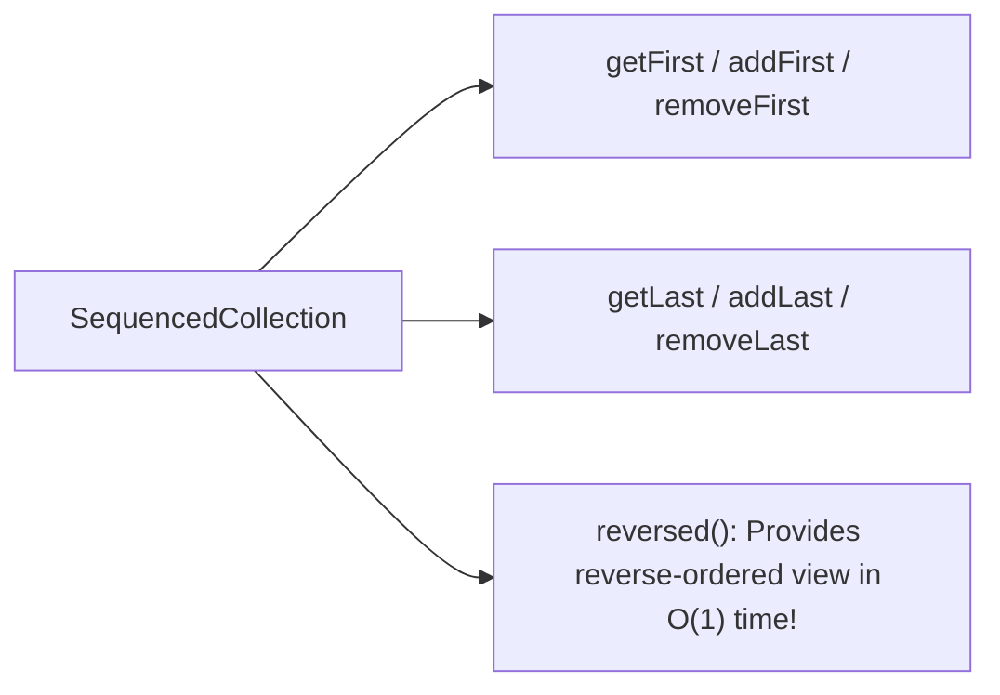

# Java21 Sequenced Collections

> **Course**: Git Version Control | **Module**: Introduction | **Difficulty**: beginner

---

- **Estimated Time**: 45 Minutes (15m Reading | 20m Practice | 10m Quiz)
- **Difficulty Level**: ⭐⭐ Intermediate
- **Prerequisites**: Java Collections Framework
- **XP Reward**: +50 XP

### Learning Objectives
By the end of this lesson, you will be able to:
1. Understand the Java 21 **Sequenced Collection Hierarchy** (`SequencedCollection`, `SequencedSet`, `SequencedMap`).
2. Uniformly access first and last elements using `getFirst()` and `getLast()`.
3. Perform first and last element insertions and removals (`addFirst()`, `removeLast()`).
4. Generate reverse-ordered collection views using `reversed()`.

---

---

Ensure JDK 21 LTS is active.

---

---

### 3.1 The Missing Abstraction in Legacy Java Collections
Before Java 21, accessing the first or last element of a collection depended on the specific underlying class (e.g. `list.get(0)` vs `deque.getFirst()` vs `sortedSet.first()`).

**Java 21 Sequenced Collections** introduces a unified interface hierarchy for any collection with a defined encounter order:

```
                  Collection
                      │
              SequencedCollection
            ╱          │          ╲
        List        Deque      SequencedSet
                                    │
                                LinkedHashSet / SortedSet
```

```java
// Standardized Uniform Methods across ALL Sequenced Collections
void addFirst(E e);
void addLast(E e);
E getFirst();
E getLast();
E removeFirst();
E removeLast();
SequencedCollection<E> reversed();
```

---

---



---

---

```java
import java.util.ArrayList;
import java.util.LinkedHashSet;

class SequencedDemo {
    public static void main(String[] args) {
        // 1. Sequenced List
        var list = new ArrayList<String>();
        list.add("Middle");
        list.addFirst("First");
        list.addLast("Last");

        System.out.println("First Element: " + list.getFirst()); // "First"
        System.out.println("Last Element: " + list.getLast());   // "Last"

        // 2. Reversed View (Zero-copy O(1) reversed iteration!)
        System.out.println("Reversed List: " + list.reversed());

        // 3. Sequenced Set (LinkedHashSet implements SequencedSet!)
        var set = new LinkedHashSet<Integer>();
        set.add(10);
        set.add(20);
        set.add(30);

        System.out.println("Set First: " + set.getFirst()); // 10
        System.out.println("Set Last: " + set.getLast());   // 30
    }
}
```

---

---

- **LRU Cache Implementation**: Web application session management and cache eviction algorithms use `SequencedMap` / `LinkedHashMap` to access first/last accessed items with uniform API calls.

---

---

1. Save code as `SequencedDemo.java`.
2. Compile and run: `javac SequencedDemo.java` $\to$ `java SequencedDemo`.

---

---

| Bug / Error | Root Cause | Engineering Solution |
| :--- | :--- | :--- |
| **`NoSuchElementException`** | Calling `getFirst()` or `getLast()` on an empty collection. | Check `isEmpty()` before accessing head or tail elements. |

---

---

- **Use `reversed()`**: Provides an $O(1)$ zero-copy reversed view without duplicating collection memory.

---

---

### Q1: What problem do Sequenced Collections solve in Java 21?
**Answer**: Prior to Java 21, Java lacked a unified interface for collections with a defined encounter order. Accessing or manipulating the first/last elements required different methods depending on whether you had a `List`, `Deque`, or `SortedSet`. Sequenced Collections unifies these under standard methods (`getFirst()`, `getLast()`, `addFirst()`, `removeLast()`, `reversed()`).

---

---

```json
{
  "quiz_title": "Lesson 3.2 Sequenced Collections Assessment",
  "questions": [
    {
      "question_id": "Q1",
      "type": "multiple_choice",
      "question_text": "Which Java 21 method returns a reverse-ordered view of a SequencedCollection?",
      "options": ["reverse()", "reversed()", "toReverse()", "flip()"],
      "correct_answer_index": 1,
      "explanation": "reversed() returns a reverse-ordered view of the collection."
    }
  ]
}
```

---

---

Refactor a legacy collection processing utility to use Java 21 Sequenced Collections.

---

---

**Front**: Does `reversed()` create a copy of the collection?
**Back**: No. `reversed()` returns a zero-copy $O(1)$ reversed view.
<!-- flashcard:end -->

---

---

```java
var first = list.getFirst();
var last = list.getLast();
```

---
