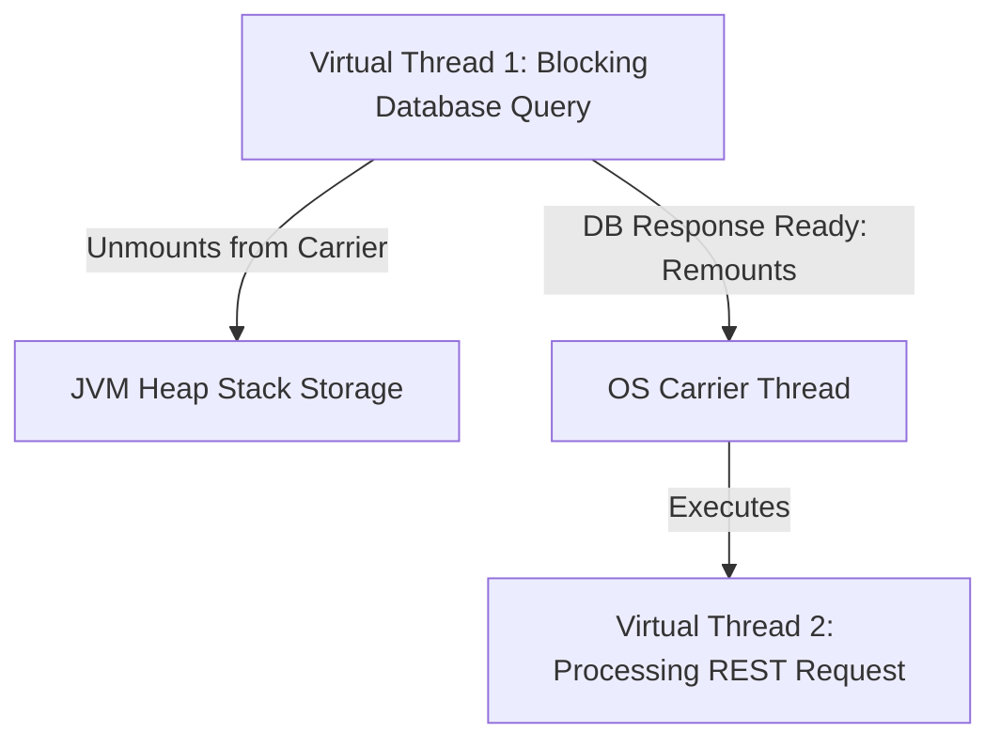

# Java21 Virtual Threads Project Loom

> **Course**: Git Version Control | **Module**: Introduction | **Difficulty**: beginner

---

- **Estimated Time**: 55 Minutes (20m Reading | 25m Practice | 10m Quiz)
- **Difficulty Level**: ⭐⭐⭐ Advanced
- **Prerequisites**: Java Threading Basics
- **XP Reward**: +70 XP

### Learning Objectives
By the end of this lesson, you will be able to:
1. Contrast OS-managed **Platform Threads** with JVM-managed **Virtual Threads**.
2. Understand Carrier Threads, mounting, and unmounting mechanics during blocking I/O.
3. Spawn millions of concurrent virtual threads using `Executors.newVirtualThreadPerTaskExecutor()`.
4. Identify and fix **Thread Pinning** caused by legacy `synchronized` blocks.

---

---

Ensure JDK 21 LTS is active.

---

---

### 3.1 Platform Threads vs Virtual Threads
Historically, every Java `Thread` was a 1:1 wrapper around an OS kernel thread. OS threads consume ~1MB of stack memory, limiting JVM capacity to ~5,000 concurrent threads before crashing with `OutOfMemoryError`.

**Virtual Threads (Project Loom)** are lightweight user-mode threads managed entirely by the JVM:
- **Stack Size**: Starts at bytes (grows dynamically).
- **Scale**: Millions of active virtual threads per JVM instance!
- **M:N Scheduling**: Millions of Virtual Threads are multiplexed over a small pool of OS **Carrier Threads**.

```
┌─────────────────────────────────────────────────────────────────────────────┐
│                   PLATFORM THREADS VS VIRTUAL THREADS                       │
├─────────────────┬──────────────────────────────────┬────────────────────────┤
│ Metric          │ Platform Threads (OS 1:1)        │ Virtual Threads (M:N)  │
├─────────────────┼──────────────────────────────────┼────────────────────────┤
│ Memory Footprint│ ~1 MB per thread                 │ ~200 Bytes per thread  │
│ Creation Cost   │ Expensive (OS syscall)           │ Near Zero (JVM Heap)   │
│ Max Capacity    │ ~5,000 threads                   │ 1,000,000+ threads     │
│ Blocking I/O    │ Blocks OS thread                 │ Unmounts from Carrier! │
└─────────────────┴──────────────────────────────────┴────────────────────────┘
```

---

---



---

---

```java
import java.time.Duration;
import java.util.concurrent.Executors;
import java.util.stream.IntStream;

class VirtualThreadDemo {
    public static void main(String[] args) {
        long start = System.currentTimeMillis();

        // Spawn 100,000 Virtual Threads concurrently!
        try (var executor = Executors.newVirtualThreadPerTaskExecutor()) {
            IntStream.range(0, 100_000).forEach(i -> {
                executor.submit(() -> {
                    // Blocking I/O operation (does NOT block OS thread!)
                    Thread.sleep(Duration.ofSeconds(1));
                    return i;
                });
            });
        } // Executor automatically closes and waits for all 100,000 tasks to finish!

        long elapsed = System.currentTimeMillis() - start;
        System.out.println("Executed 100,000 Virtual Threads in: " + elapsed + " ms");
    }
}
```

---

---

- **High-Throughput Microservices (Tomcat / Jetty)**: Spring Boot 3.2+ running on Java 21 can handle 50,000+ requests per second by configuring `spring.threads.virtual.enabled=true`.

---

---

1. Save code as `VirtualThreadDemo.java`.
2. Compile and run: `javac VirtualThreadDemo.java` $\to$ `java VirtualThreadDemo` $\to$ Observe 100,000 threads complete in ~1.2 seconds!

---

---

| Bug / Error | Root Cause | Engineering Solution |
| :--- | :--- | :--- |
| **Thread Pinning Slowness** | Calling blocking operations inside a `synchronized` block pins the virtual thread to its carrier thread. | Replace `synchronized` blocks with `ReentrantLock`. |

---

---

- **Do NOT Pool Virtual Threads**: Never use thread pools for virtual threads; create them on demand using `Executors.newVirtualThreadPerTaskExecutor()`.

---

---

### Q1: What is Thread Pinning in Java 21 Virtual Threads and how do you avoid it?
**Answer**: Thread Pinning occurs when a virtual thread cannot unmount from its OS carrier thread during a blocking operation. This happens when blocking occurs inside a `synchronized` block/method or native code. To avoid pinning, replace `synchronized` locks with `java.util.concurrent.locks.ReentrantLock`.

---

---

```json
{
  "quiz_title": "Lesson 4.1 Virtual Threads Assessment",
  "questions": [
    {
      "question_id": "Q1",
      "type": "multiple_choice",
      "question_text": "Which executor method creates an ExecutorService that spawns a new virtual thread for each task?",
      "options": ["Executors.newFixedThreadPool()", "Executors.newVirtualThreadPerTaskExecutor()", "Executors.newCachedThreadPool()", "Executors.newSingleThreadExecutor()"],
      "correct_answer_index": 1,
      "explanation": "Executors.newVirtualThreadPerTaskExecutor() spawns virtual threads."
    }
  ]
}
```

---

---

Benchmark 10,000 concurrent HTTP GET requests using Platform Threads vs Virtual Threads.

---

---

**Front**: Should virtual threads be pooled like traditional platform threads?
**Back**: No. Virtual threads are cheap (~200 bytes) and should be created per task, never pooled.
<!-- flashcard:end -->

---

---

```java
try (var executor = Executors.newVirtualThreadPerTaskExecutor()) {
    executor.submit(() -> Thread.sleep(1000));
}
```

---
