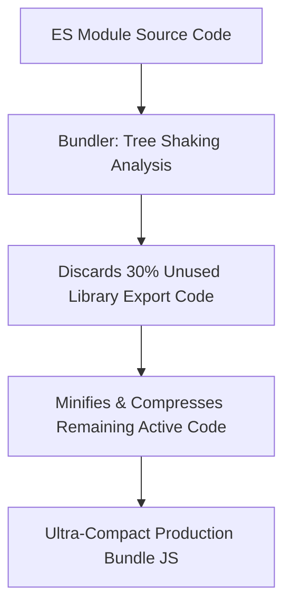

# Modern Build Tooling Bundlers Tree Shaking

> **Course**: Git Version Control | **Module**: Introduction | **Difficulty**: beginner

---

- **Estimated Time**: 55 Minutes (20m Reading | 25m Practice | 10m Quiz)
- **Difficulty Level**: ⭐⭐ Intermediate
- **Prerequisites**: [Lesson 10.2 Dynamic Imports](file:///d:/My%20Drive/all%20files/PROJECT%20FILES/notes/docs/curriculum/_03_javascript/_03_36_dynamic_imports_and_toplevel_await.md)
- **XP Reward**: +60 XP

### Learning Objectives
By the end of this lesson, you will be able to:
1. Compare modern build tools (**Vite**, **esbuild**, **Rollup**, **Webpack**).
2. Understand **Tree Shaking** dead-code elimination mechanics.
3. Contrast instant Native ESM Development Servers with optimized Production Bundles.
4. Utilize **Source Maps** (`.map`) to debug minified production code.

---

---

Open Node.js REPL or terminal to run Vite initialization.

---

---

### 3.1 Legacy Bundlers (Webpack) vs Modern Native ESM (Vite)
Legacy build tools (Webpack) bundled every single module in your project into memory before starting the dev server. **Vite** leverages native browser ES Modules during development, serving files on demand instantly powered by **esbuild** (written in Go, 10–100x faster than JavaScript-based bundlers).

```
┌─────────────────────────────────────────────────────────────────────────────┐
│                          BUILD TOOLING COMPARISON MATRIX                    │
├─────────────────┬──────────────────────────────────┬────────────────────────┤
│ Tool            │ Primary Use Case                 │ Under-the-Hood Engine  │
├─────────────────┼──────────────────────────────────┼────────────────────────┤
│ **Vite**        │ Next-gen frontend dev server & UI│ esbuild (dev) + Rollup │
│ **esbuild**     │ Ultra-fast JS/TS transpiler      │ Written in Go          │
│ **Rollup**      │ Library bundler (Tree Shaking)   │ JavaScript Native ESM  │
│ **Webpack**     │ Enterprise legacy bundler        │ JavaScript Node.js     │
└─────────────────┴──────────────────────────────────┴────────────────────────┘
```

### 3.2 Tree Shaking Mechanics
**Tree Shaking** is static dead-code elimination. Because ES Modules use static `import`/`export` syntax, bundlers can trace the import dependency graph and discard unused functions from the final production bundle:

```javascript
// mathUtils.js
export function add(a, b) { return a + b; }
export function unusedFunction() { ... } // DISCARDED BY TREE SHAKING!

// main.js
import { add } from './mathUtils.js';
```

---

---



---

---

### Initializing a Lightning-Fast Vite Project

```bash
# 1. Initialize modern Vite project in non-interactive mode
npm create vite@latest my-app -- --template vanilla

# 2. Navigate and install dependencies
cd my-app
npm install

# 3. Start Instant Native ESM Dev Server (with HMR Hot Module Replacement!)
npm run dev
```

### Production Build & Source Map Inspection

```bash
# 4. Generate optimized production bundle (Triggers Tree Shaking & Minification)
npm run build

# Output directory: dist/
# Contains minified index-[hash].js and source maps!
```

---

---

- **Production Web Performance**: Enterprise applications use Tree Shaking to import individual icons (`import { Check } from 'lucide-react'`) rather than bundling entire 5MB icon libraries into client downloads.

---

---

1. Run `npx create-vite@latest test-app --template vanilla`.
2. Run `npm run build` $\to$ Inspect generated production bundle size in `dist/`!

---

---

| Bug / Error | Root Cause | Engineering Solution |
| :--- | :--- | :--- |
| **Tree Shaking Failed (Huge Bundle Size)** | Importing libraries using CommonJS `require()` or side-effectful mutations that prevent static analysis. | Use ES Modules (`import`/`export`) and add `"sideEffects": false` to `package.json`. |

---

---

- **Adopt Vite for New Projects**: Replaces slow legacy Webpack dev servers with instant HMR.

---

---

### Q1: What is Tree Shaking in modern JavaScript build tools and how does it work?
**Answer**: Tree Shaking is a form of dead-code elimination used during production bundling. By leveraging the static structure of ES Modules (`import` and `export`), bundlers like Rollup and esbuild analyze the dependency graph at build time and exclude any exported functions or variables that are never actually imported or executed.

---

---

```json
{
  "quiz_title": "Lesson 10.3 Build Tooling Assessment",
  "questions": [
    {
      "question_id": "Q1",
      "type": "multiple_choice",
      "question_text": "Which modern dev server uses native browser ES Modules and esbuild for instant HMR startup?",
      "options": ["Webpack", "Vite", "Babel", "Gulp"],
      "correct_answer_index": 1,
      "explanation": "Vite uses native browser ESM and esbuild."
    }
  ]
}
```

---

---

Set up a production Vite build pipeline with custom source map generation.

---

---

**Front**: What file allows debugging minified production code back to original source code?
**Back**: Source Maps (`.map` files).
<!-- flashcard:end -->

---

---

```bash
npm create vite@latest app -- --template vanilla
npm run build
```

---
