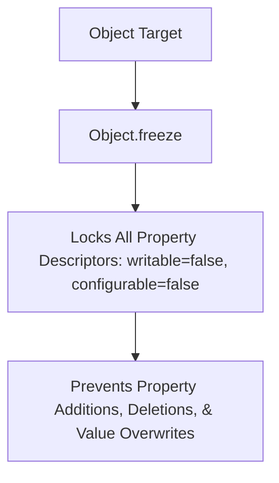

# Object Literals Descriptors And Immutability

> **Course**: Git Version Control | **Module**: Introduction | **Difficulty**: beginner

---

- **Estimated Time**: 45 Minutes (15m Reading | 20m Practice | 10m Quiz)
- **Difficulty Level**: ⭐⭐ Intermediate
- **Prerequisites**: [Lesson 4.4 Functional Concepts](file:///d:/My%20Drive/all%20files/PROJECT%20FILES/notes/docs/curriculum/_03_javascript/_03_14_functional_concepts_and_higher_order_functions.md)
- **XP Reward**: +50 XP

### Learning Objectives
By the end of this lesson, you will be able to:
1. Access and assign object properties dynamically using Dot and Bracket Notation.
2. Define Property Descriptors (`writable`, `enumerable`, `configurable`) via `Object.defineProperty()`.
3. Differentiate between `Object.freeze()`, `Object.seal()`, and `Object.preventExtensions()`.
4. Transform object entries using `Object.keys()`, `Object.values()`, `Object.entries()`, and `Object.fromEntries()`.

---

---

Open Node.js REPL to execute Object manipulation methods.

---

---

### 3.1 Object Immutability Levels

```
┌─────────────────────────────────────────────────────────────────────────────┐
│                       OBJECT IMMUTABILITY LEVELS MATRIX                     │
├─────────────────────────┬─────────────────┬──────────────────┬──────────────┤
│ Method                  │ Add Properties? │ Delete Properties│ Mutate Values│
├─────────────────────────┼─────────────────┼──────────────────┼──────────────┤
│ `preventExtensions()`   │ ❌ NO           │ ✅ YES           │ ✅ YES       │
│ `Object.seal()`         │ ❌ NO           │ ❌ NO            │ ✅ YES       │
│ `Object.freeze()`       │ ❌ NO           │ ❌ NO            │ ❌ NO        │
└─────────────────────────┴─────────────────┴──────────────────┴──────────────┘
```

> [!CAUTION]
> **Shallow Freeze**: `Object.freeze()` performs a shallow freeze. Nested objects inside a frozen object can still be mutated! Use recursive deep freezing for full nested immutability.

---

---



---

---

```javascript
// Object Descriptors & Immutability Demonstration

// 1. Property Descriptors
const sensor = {};
Object.defineProperty(sensor, 'deviceId', {
  value: 'ESP32-NODE-101',
  writable: false,     // Read-only!
  enumerable: true,    // Visible in loops!
  configurable: false  // Cannot delete or reconfigure!
});

console.log("Device ID:", sensor.deviceId);
sensor.deviceId = "OVERWRITE_ATTEMPT"; // Fails silently (or throws in strict mode)
console.log("After Overwrite Attempt:", sensor.deviceId); // Remains "ESP32-NODE-101"

// 2. Object Transformations (entries & fromEntries)
const metrics = { temperature: 24.5, humidity: 60.2, battery: 98 };

// Transform: Scale telemetry by 1.1
const scaledMetrics = Object.fromEntries(
  Object.entries(metrics).map(([key, val]) => [key, Number((val * 1.1).toFixed(2))])
);

console.log("Scaled Metrics:", scaledMetrics);

// 3. Object Freeze
const config = Object.freeze({ host: "192.168.1.1", port: 8080 });
// config.port = 9090; // Silent fail or TypeError in strict mode!
```

---

---

- **Application Configuration Locking**: Freezing environment configuration objects (`Object.freeze(envConfig)`) on startup guarantees that application settings cannot be overwritten at runtime by third-party vendor scripts.

---

---

1. Save code as `objects_demo.js`.
2. Run `node objects_demo.js` $\to$ Observe property protection and `Object.entries()` transformation outputs!

---

---

| Bug / Error | Root Cause | Engineering Solution |
| :--- | :--- | :--- |
| **`TypeError: Cannot assign to read only property`** | Mutating a frozen property under `"use strict"` mode. | Perform immutable updates using `{ ...obj, key: val }`. |

---

---

- **Use `Object.fromEntries()`**: Pairs perfectly with `Object.entries().map()` for functional object transformations.

---

---

### Q1: What is the difference between `Object.freeze()` and `Object.seal()`?
**Answer**: `Object.seal()` prevents adding or deleting properties, but allows modifying existing property values. `Object.freeze()` prevents adding, deleting, AND modifying property values (setting `writable: false` on all existing properties).

---

---

```json
{
  "quiz_title": "Lesson 5.1 Objects Assessment",
  "questions": [
    {
      "question_id": "Q1",
      "type": "multiple_choice",
      "question_text": "Which static method converts an array of key-value pair arrays `[['a', 1], ['b', 2]]` back into an Object?",
      "options": ["Object.fromEntries()", "Object.entries()", "Object.assign()", "Object.toObject()"],
      "correct_answer_index": 0,
      "explanation": "Object.fromEntries() converts key-value pairs back into an Object."
    }
  ]
}
```

---

---

Build a recursive deep freeze utility function (`deepFreeze(obj)`).

---

---

**Front**: What property descriptor attribute controls whether a property appears in `for...in` loops?
**Back**: `enumerable: true`.
<!-- flashcard:end -->

---

---

```javascript
const obj = Object.freeze({ a: 1 });
const entries = Object.entries(obj);
```

---
