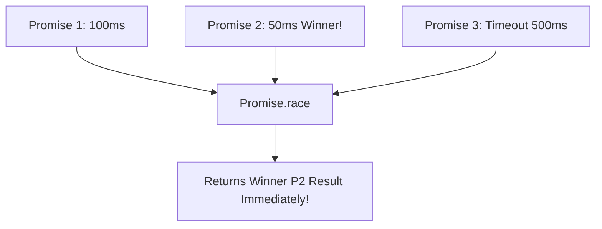

# Promise Combinators All Allsettled Race Any

> **Course**: Git Version Control | **Module**: Introduction | **Difficulty**: beginner

---

- **Estimated Time**: 55 Minutes (20m Reading | 25m Practice | 10m Quiz)
- **Difficulty Level**: ⭐⭐⭐ Advanced
- **Prerequisites**: [Lesson 6.3 Async/Await](file:///d:/My%20Drive/all%20files/PROJECT%20FILES/notes/docs/curriculum/_03_javascript/_03_21_async_await_syntactic_sugar_and_async_iteration.md)
- **XP Reward**: +70 XP

### Learning Objectives
By the end of this lesson, you will be able to:
1. Execute parallel asynchronous operations using **`Promise.all()`**.
2. Inspect complete batch results without early failures using **`Promise.allSettled()`**.
3. Implement request timeout patterns using **`Promise.race()`**.
4. Retrieve the fastest successful response using **`Promise.any()`** and handle `AggregateError`.

---

---

Open Node.js REPL to execute Promise combinator functions.

---

---

### 3.1 Promise Combinators Comparison Matrix

```
┌─────────────────────────────────────────────────────────────────────────────┐
│                      PROMISE COMBINATORS COMPARISON MATRIX                  │
├─────────────────┬───────────────────────────────┬───────────────────────────┤
│ Combinator      │ Fulfills When                 │ Rejects When              │
├─────────────────┼───────────────────────────────┼───────────────────────────┤
│ `Promise.all`   │ ALL promises fulfill          │ ANY promise rejects       │
│                 │ (Returns array of values)     │ (Fail-fast!)              │
├─────────────────┼───────────────────────────────┼───────────────────────────┤
│ `allSettled`    │ ALL promises settle (always!) │ Never rejects!            │
│                 │ (Returns status objects)      │ (Inspects all outcomes)   │
├─────────────────┼───────────────────────────────┼───────────────────────────┤
│ `Promise.race`  │ FIRST promise to settle       │ FIRST promise to settle   │
│                 │ (Whether fulfilled OR rejected│ (Whether fulfilled or rej)│
├─────────────────┼───────────────────────────────┼───────────────────────────┤
│ `Promise.any`   │ FIRST promise to FULFILL      │ ALL promises reject       │
│                 │ (Ignores early rejections)    │ (Throws AggregateError)   │
└─────────────────┴───────────────────────────────┴───────────────────────────┘
```

---

---



---

---

```javascript
// Promise Combinators Demonstration

const task = (id, ms, shouldFail = false) => new Promise((resolve, reject) => {
  setTimeout(() => shouldFail ? reject(new Error(`Task ${id} Failed`)) : resolve(`Task ${id} OK`), ms);
});

async function runCombinatorsDemo() {
  // 1. Promise.all (Fail-Fast Parallel Execution)
  try {
    const results = await Promise.all([task(1, 100), task(2, 150)]);
    console.log("Promise.all Results:", results); // ['Task 1 OK', 'Task 2 OK']
  } catch (err) {
    console.error("Promise.all Error:", err.message);
  }

  // 2. Promise.allSettled (Inspect Complete Batch Outcomes)
  const batchOutcome = await Promise.allSettled([
    task("A", 50),
    task("B", 100, true), // Fails!
    task("C", 150)
  ]);
  console.log("allSettled Outcomes:", batchOutcome);

  // 3. Promise.race Timeout Pattern
  const fetchWithTimeout = (promise, ms) => Promise.race([
    promise,
    new Promise((_, reject) => setTimeout(() => reject(new Error("Request Timed Out!")), ms))
  ]);

  try {
    const data = await fetchWithTimeout(task("SlowData", 1000), 200);
  } catch (err) {
    console.warn("Race Timeout:", err.message); // Request Timed Out!
  }
}

runCombinatorsDemo();
```

---

---

- **Microservice Resilient Aggregators**: Dashboard backends calling 5 independent microservices use `Promise.allSettled()` to display partial data widgets even if 1 microservice API is temporarily offline.

---

---

1. Save code as `combinators_demo.js`.
2. Run `node combinators_demo.js` $\to$ Inspect `Promise.all`, `allSettled`, and timeout race outputs!

---

---

| Bug / Error | Root Cause | Engineering Solution |
| :--- | :--- | :--- |
| **`Promise.all` Partial Data Loss** | Single component failure in `Promise.all([p1, p2, p3])` rejects the entire array immediately. | Use `Promise.allSettled()` when partial success is acceptable. |

---

---

- **Use `Promise.race()` for Timeouts**: Enforces hard SLA timeouts on external API dependencies.

---

---

### Q1: What is the main difference between `Promise.all()` and `Promise.allSettled()`?
**Answer**: `Promise.all()` is fail-fast: if any single input promise rejects, the entire `Promise.all()` rejects immediately with that error. `Promise.allSettled()` waits for *every* input promise to complete (whether fulfilled or rejected) and returns an array of outcome objects with `{ status: 'fulfilled' | 'rejected', value/reason }`.

---

---

```json
{
  "quiz_title": "Lesson 6.4 Combinators Assessment",
  "questions": [
    {
      "question_id": "Q1",
      "type": "multiple_choice",
      "question_text": "Which Promise combinator fulfills as soon as the FIRST promise fulfills, ignoring early rejections?",
      "options": ["Promise.all()", "Promise.race()", "Promise.any()", "Promise.allSettled()"],
      "correct_answer_index": 2,
      "explanation": "Promise.any() returns the first FULFILLED promise."
    }
  ]
}
```

---

---

Build a resilient API gateway client querying 3 mirror servers using `Promise.any()`.

---

---

**Front**: What error does `Promise.any()` throw if ALL input promises reject?
**Back**: `AggregateError` (containing an `.errors` array of all rejection reasons).
<!-- flashcard:end -->

---

---

```javascript
const results = await Promise.all([p1, p2]);
const outcomes = await Promise.allSettled([p1, p2]);
```

---
