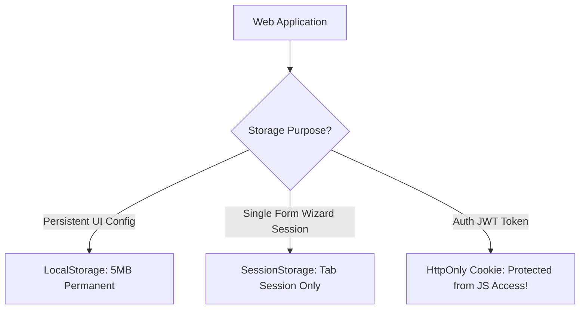

# Web Storage Cookies Localstorage Sessionstorage

> **Course**: Git Version Control | **Module**: Introduction | **Difficulty**: beginner

---

- **Estimated Time**: 45 Minutes (15m Reading | 20m Practice | 10m Quiz)
- **Difficulty Level**: ⭐ Beginner
- **Prerequisites**: [Lesson 9.1 Fetch API](file:///d:/My%20Drive/all%20files/PROJECT%20FILES/notes/docs/curriculum/_03_javascript/_03_31_fetch_api_and_http_network_requests.md)
- **XP Reward**: +50 XP

### Learning Objectives
By the end of this lesson, you will be able to:
1. Compare client-side storage mechanisms: **Cookies**, **LocalStorage**, and **SessionStorage**.
2. Perform synchronous key-value operations using `localStorage` and `sessionStorage`.
3. Synchronize state across multiple browser tabs using the **`storage`** event listener.
4. Evaluate security risks (XSS vs CSRF) when storing authentication tokens.

---

---

Open Browser DevTools Application Tab (`F12`).

---

---

### 3.1 Client Storage Comparison

```
┌─────────────────────────────────────────────────────────────────────────────┐
│                     CLIENT-SIDE STORAGE COMPARISON MATRIX                   │
├─────────────────┬──────────────────┬──────────────────┬─────────────────────┤
│ Storage Type    │ Capacity         │ Lifetime         │ Sent with HTTP?     │
├─────────────────┼──────────────────┼──────────────────┼─────────────────────┤
│ Cookies         │ ~4 KB            │ Expiration Date  │ YES (Every request!)│
│ LocalStorage    │ ~5–10 MB         │ Persistent       │ NO                  │
│ SessionStorage  │ ~5–10 MB         │ Tab Lifetime     │ NO                  │
└─────────────────┴──────────────────┴──────────────────┴─────────────────────┘
```

> [!CAUTION]
> **XSS Vulnerability**: Never store sensitive JWT access tokens in `localStorage`! Any Cross-Site Scripting (XSS) vulnerability allows malicious scripts to read `localStorage.getItem('jwt')`. Secure authentication tokens should be stored in `HttpOnly; SameSite=Strict` HTTP Cookies.

---

---



---

---

```javascript
// Web Storage API & Cross-Tab Sync Demonstration (Browser Environment)

// 1. Storing Complex Objects (Must serialize to JSON!)
const userSettings = { theme: "DARK", fontSize: 16 };
localStorage.setItem("app_config", JSON.stringify(userSettings));

// 2. Retrieving and Parsing Data
const storedConfig = localStorage.getItem("app_config");
if (storedConfig) {
  const config = JSON.parse(storedConfig);
  console.log("Active Theme:", config.theme);
}

// 3. Cross-Tab Synchronization Listener
// Fires in Tab B when Tab A mutates localStorage!
window.addEventListener("storage", (event) => {
  if (event.key === "app_config") {
    console.log("Config updated in another tab!");
    console.log("Old Value:", event.oldValue);
    console.log("New Value:", event.newValue);
  }
});
```

---

---

- **User UI Preference Persistence**: Web applications save theme modes (Dark/Light) in `localStorage` to instantly apply preferences on page reload before rendering the DOM.

---

---

1. Open Browser DevTools Application Tab $\to$ Select LocalStorage.
2. Execute `localStorage.setItem('test', '123')` in Console $\to$ Observe instant live update in Application panel!

---

---

| Bug / Error | Root Cause | Engineering Solution |
| :--- | :--- | :--- |
| **`[object Object]` Stored in Storage** | Passing an Object directly into `localStorage.setItem('k', obj)` without calling `JSON.stringify()`. | Always serialize objects using `JSON.stringify(obj)` before storing. |

---

---

- **Serialize to JSON**: Storage keys and values are strictly strings.

---

---

### Q1: What is the main security risk of storing authentication tokens in LocalStorage compared to HttpOnly Cookies?
**Answer**: LocalStorage is accessible to any JavaScript code executing on the domain. If an attacker injects a malicious script via a Cross-Site Scripting (XSS) vulnerability, they can extract all LocalStorage tokens. `HttpOnly` Cookies cannot be read or accessed by client-side JavaScript, protecting tokens from XSS theft.

---

---

```json
{
  "quiz_title": "Lesson 9.2 Web Storage Assessment",
  "questions": [
    {
      "question_id": "Q1",
      "type": "multiple_choice",
      "question_text": "Which storage mechanism is automatically cleared when the browser tab is closed?",
      "options": ["LocalStorage", "SessionStorage", "Cookies", "IndexedDB"],
      "correct_answer_index": 1,
      "explanation": "SessionStorage is scoped to the lifetime of a single browser tab."
    }
  ]
}
```

---

---

Build a theme switcher persisting user choices in `localStorage` across reloads.

---

---

**Front**: Does the `storage` event fire in the same tab that made the storage modification?
**Back**: No. The `storage` event fires ONLY in other open tabs on the same origin.
<!-- flashcard:end -->

---

---

```javascript
localStorage.setItem("key", JSON.stringify(data));
const data = JSON.parse(localStorage.getItem("key"));
```

---
