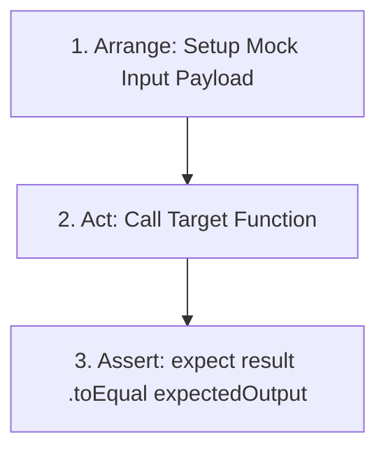

# Lesson 12.4 JavaScript Unit Testing with Vitest

> **Course**: Javascript | **Module**: Module 1 | **Difficulty**: beginner

---

- **Estimated Time**: 55 Minutes (20m Reading | 25m Practice | 10m Quiz)
- **Difficulty Level**: ⭐⭐ Intermediate
- **Prerequisites**: [Lesson 12.3 Service Workers](file:///d:/My%20Drive/all%20files/PROJECT%20FILES/notes/docs/curriculum/_03_javascript/_03_44_service_workers_and_offline_pwa_caching.md)
- **XP Reward**: +60 XP

### Learning Objectives
By the end of this lesson, you will be able to:
1. Apply the **AAA (Arrange, Act, Assert)** unit testing pattern.
2. Construct test suites using **Vitest** (`describe`, `it`, `expect`).
3. Assert primitive and structural equality using `toBe` and `toEqual`.
4. Mock dependencies and spy on function calls using `vi.fn()` and `vi.spyOn()`.

---

---

Open Node.js REPL or VS Code.

---

---

### 3.1 The AAA Unit Testing Pattern
Every unit test should follow the **Arrange, Act, Assert (AAA)** pattern for maximum readability:
1. **Arrange**: Set up test inputs, mock objects, and initial state.
2. **Act**: Execute the target function or unit under test.
3. **Assert**: Verify that the actual output matches expected results.

### 3.2 `toBe` vs `toEqual`
- **`toBe(val)`**: Strict primitive reference equality (`Object.is()` / `===`).
- **`toEqual(obj)`**: Deep structural equality comparison for objects and arrays.

---

---



---

---

### Target Module: `math.js`

```javascript
export function calculateSensorAverage(readings) {
  if (!Array.isArray(readings) || readings.length === 0) {
    throw new Error("Invalid readings input");
  }
  const sum = readings.reduce((a, b) => a + b, 0);
  return sum / readings.length;
}
```

### Vitest Test Suite: `math.test.js`

```javascript
import { describe, it, expect, vi } from "vitest";
import { calculateSensorAverage } from "./math.js";

describe("calculateSensorAverage Unit Tests", () => {
  it("should calculate correct average for valid numeric array", () => {
    // 1. Arrange
    const input = [10, 20, 30];

    // 2. Act
    const result = calculateSensorAverage(input);

    // 3. Assert
    expect(result).toBe(20);
  });

  it("should throw an error for empty arrays", () => {
    expect(() => calculateSensorAverage([])).toThrow("Invalid readings input");
  });

  it("should track mock function calls using vi.fn()", () => {
    const callback = vi.fn();
    callback("ESP32-NODE-01");

    expect(callback).toHaveBeenCalledWith("ESP32-NODE-01");
    expect(callback).toHaveBeenCalledTimes(1);
  });
});
```

---

---

- **CI/CD Automated Testing Pipelines**: Enterprise GitHub Actions workflows execute Vitest unit test suites on every pull request to guarantee zero regression bugs reach production.

---

---

1. Run `npx vitest` in terminal.
2. Watch Vitest execute test suites in instant watch mode!

---

---

| Bug / Error | Root Cause | Engineering Solution |
| :--- | :--- | :--- |
| **`AssertionError: expected {} to be {}`** | Using `.toBe()` to compare two distinct object instances with identical keys. | Use `.toEqual()` for deep object and array structural equality. |

---

---

- **Write Deterministic Tests**: Tests should never rely on hardcoded system time or network availability.

---

---

### Q1: What is the difference between `toBe` and `toEqual` in Vitest/Jest?
**Answer**: `toBe` uses strict identity equality (`Object.is()` / `===`), which fails when comparing two distinct object or array instances with identical properties. `toEqual` performs deep recursive structural evaluation, comparing property keys and values regardless of object reference memory addresses.

---

---

```json
{
  "quiz_title": "Lesson 12.4 Vitest Testing Assessment",
  "questions": [
    {
      "question_id": "Q1",
      "type": "multiple_choice",
      "question_text": "Which Vitest assertion method performs deep structural object comparison?",
      "options": ["toBe()", "toEqual()", "toStrictEqual()", "toMatch()"],
      "correct_answer_index": 1,
      "explanation": "toEqual() performs deep structural object comparison."
    }
  ]
}
```

---

---

Write a complete Vitest unit test suite covering a telemetry processing utility module.

---

---

**Front**: How do you create a mock spy function in Vitest?
**Back**: `const mockFn = vi.fn();`.
<!-- flashcard:end -->

---

---

```javascript
import { describe, it, expect } from "vitest";
it("tests unit", () => expect(1 + 1).toBe(2));
```

---
