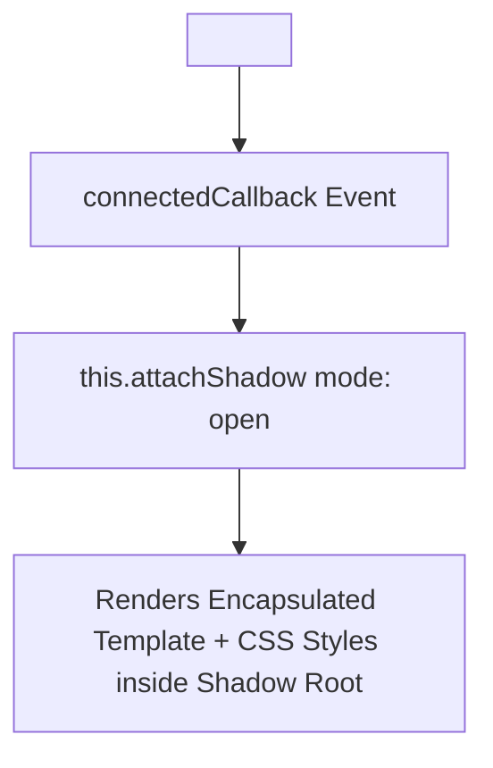

# Lesson 12.8 Web Components & Shadow DOM

> **Course**: Javascript | **Module**: Module 1 | **Difficulty**: beginner

---

- **Estimated Time**: 55 Minutes (20m Reading | 25m Practice | 10m Quiz)
- **Difficulty Level**: ⭐⭐⭐ Advanced
- **Prerequisites**: [Lesson 12.7 Intl API](file:///d:/My%20Drive/all%20files/PROJECT%20FILES/notes/docs/curriculum/_03_javascript/_03_48_internationalization_intl_api.md)
- **XP Reward**: +70 XP

### Learning Objectives
By the end of this lesson, you will be able to:
1. Define framework-agnostic HTML tags using the **Custom Elements API** (`customElements.define()`).
2. Manage component lifecycles (`connectedCallback`, `disconnectedCallback`, `attributeChangedCallback`).
3. Enforce true DOM and CSS style encapsulation using **Shadow DOM**.
4. Project child content dynamically using **`<template>`** tags and **`<slot>`** transclusion.

---

---

Open Browser DevTools Console & Inspector.

---

---

### 3.1 The 4 Web Components Technologies
Web Components allow developers to create reusable, framework-agnostic custom HTML elements with true style encapsulation:

1. **Custom Elements**: Defines custom HTML tags (e.g. `<sensor-card>`). Must contain a hyphen `-`!
2. **Shadow DOM**: Attaches a private, isolated DOM tree to an element that prevents outer CSS styles from bleeding in or out.
3. **HTML Templates (`<template>`)**: Holds inert HTML markup that is not rendered until instantiated.
4. **Slots (`<slot>`)**: Placeholder insertion points for user-provided child markup inside a Shadow DOM.

```
┌─────────────────────────────────────────────────────────────────────────────┐
│                          SHADOW DOM ENCAPSULATION                           │
├─────────────────────────────────────────────────────────────────────────────┤
│ Outer Document CSS ──► [ Shadow Boundary: STYLES BLOCKED! ] ──► Shadow Root │
└─────────────────────────────────────────────────────────────────────────────┘
```

---

---



---

---

```javascript
// Native Web Component Implementation

class TelemetryCard extends HTMLElement {
  constructor() {
    super();
    // 1. Attach Isolated Shadow Root
    this.attachShadow({ mode: "open" });
  }

  // Lifecycle: Fired when element is inserted into DOM document
  connectedCallback() {
    const nodeId = this.getAttribute("node-id") || "UNKNOWN";
    
    // Encapsulated Styles & HTML Markup
    this.shadowRoot.innerHTML = `
      <style>
        :host { display: block; font-family: sans-serif; margin: 10px; }
        .card { border: 1px solid #3b82f6; padding: 16px; borderRadius: 8px; background: #1e293b; color: white; }
        h4 { margin: 0 0 8px 0; color: #60a5fa; }
      </style>
      <div class="card">
        <h4>Node: ${nodeId}</h4>
        <slot name="metric">Default Metric Placeholder</slot>
      </div>
    `;
  }
}

// 2. Register Custom Element (Tag name MUST contain a hyphen!)
customElements.define("telemetry-card", TelemetryCard);
```

### Usage in HTML:

```html
<telemetry-card node-id="ESP32-A1">
  <span slot="metric">Temp: 24.5°C</span>
</telemetry-card>
```

---

---

- **Cross-Framework Enterprise UI Libraries**: Micro-frontend architectures build core design systems as Web Components, allowing React, Vue, and Angular applications to share identical UI buttons and modals.

---

---

1. Save code inside an HTML file.
2. Open in browser $\to$ Inspect element under DevTools Inspector to observe the `#shadow-root (open)` boundary!

---

---

| Bug / Error | Root Cause | Engineering Solution |
| :--- | :--- | :--- |
| **`DOMException: Registration failed for 'tag'`** | Defining a custom element tag without a hyphen (e.g. `<card>` instead of `<sensor-card>`). | Custom Element tag names MUST contain at least one hyphen `-` to avoid collision with standard HTML tags. |

---

---

- **Enforce Hyphenated Tags**: Always include a hyphen in custom tag names (`<telemetry-card>`).

---

---

### Q1: Why must Custom Element tag names contain a hyphen (`-`)?
**Answer**: HTML specifications enforce hyphens in custom element tag names (`<my-element>`) to guarantee namespace separation between user-defined components and future official HTML elements added to the HTML specification.

---

---

```json
{
  "quiz_title": "Lesson 12.8 Web Components Assessment",
  "questions": [
    {
      "question_id": "Q1",
      "type": "multiple_choice",
      "question_text": "Which lifecycle callback fires when a Custom Element is attached to the document DOM?",
      "options": ["createdCallback()", "connectedCallback()", "mounted()", "attributeChangedCallback()"],
      "correct_answer_index": 1,
      "explanation": "connectedCallback() fires when an element is inserted into the DOM."
    }
  ]
}
```

---

---

Build a framework-agnostic `<status-badge>` Web Component with Shadow DOM styling.

---

---

**Front**: What method attaches a Shadow Root to a Web Component instance?
**Back**: `this.attachShadow({ mode: 'open' })`.
<!-- flashcard:end -->

---

---

```javascript
class MyEl extends HTMLElement {
  connectedCallback() {
    this.attachShadow({ mode: "open" }).innerHTML = `<slot></slot>`;
  }
}
customElements.define("my-el", MyEl);
```

---
