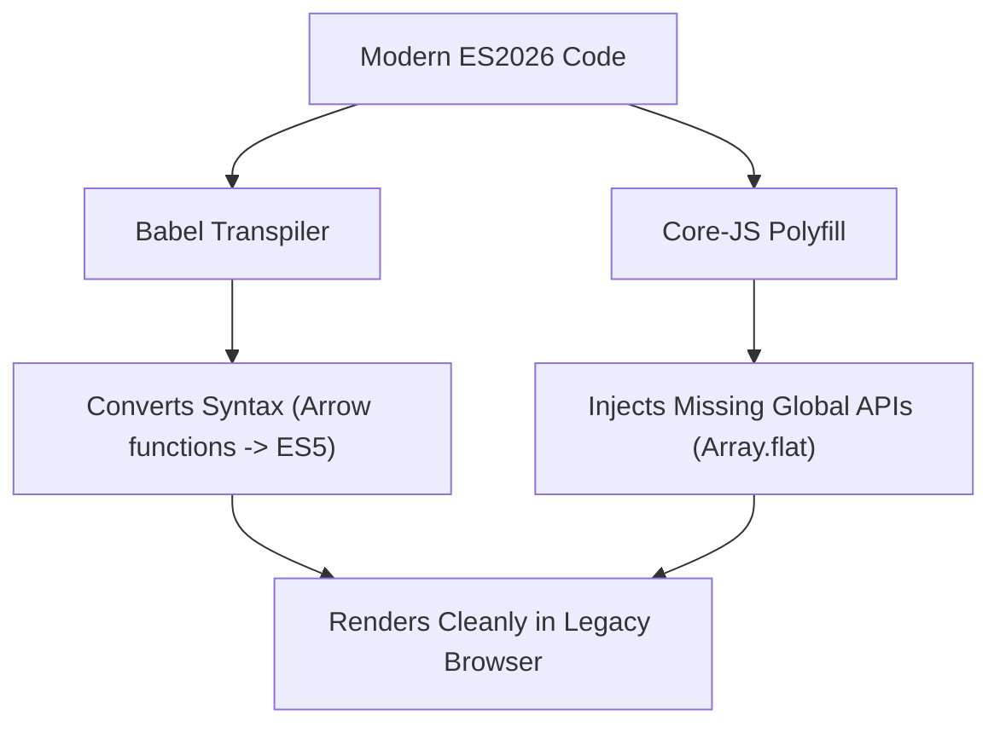

```yaml
schema_version: "2.0"
metadata:
  lesson_id: "JS-MOD01-LES01"
  course_slug: "course-03-javascript"
  course_title: "Course 3: JavaScript & ES6+"
  module_slug: "mod-01-language-architecture-engine"
  module_title: "Module 1 - Language Architecture, Engine, & Execution Mechanics"
  lesson_slug: "history-evolution-and-ecmascript-standards"
  lesson_title: "Lesson 1.1 History, Evolution, & ECMAScript Standards"
  sort_order: 101

pedagogy:
  difficulty: "beginner"
  estimated_time:
    reading_minutes: 15
    practice_minutes: 20
    quiz_minutes: 10
    total_minutes: 45
  bloom_taxonomy_level: "Understand"
  xp_reward: 50

prerequisites:
  required_lesson_ids:
    - "HTML5-MOD01-LES01"
  required_skills:
    - "Client-Side Web Architecture"

skills_acquired:
  - "ECMAScript TC39 Proposal Process (Stage 0 to Stage 4)"
  - "JavaScript Runtimes Comparison (V8, Node.js, Deno, Bun)"
  - "Backward Compatibility Principles & Web Stability Constraints"
  - "Transpilation Mechanics with Babel"
  - "Polyfill Integration (`core-js`)"

dependencies:
  software:
    - "VS Code"
    - "Node.js REPL"
  hardware: []

seo_and_social:
  meta_title: "JavaScript History, TC39 Standards, Polyfills & Babel Transpilation"
  meta_description: "Master JavaScript language architecture: origins, TC39 proposal stages, ECMAScript standards (ES5/ES6+), Node.js vs Deno vs Bun runtimes, and Babel polyfills."
  keywords: ["JavaScript History", "ECMAScript", "TC39 Process", "Babel Transpiler", "Polyfills", "Node.js vs Bun", "V8 Engine"]

assessment_config:
  has_quiz: true
  has_lab: true
  has_flashcards: true
  pass_score_percentage: 80
```

# Lesson 1.1 History, Evolution, & ECMAScript Standards

## 1. Overview & Learning Objectives [id: overview]

- **Estimated Time**: 45 Minutes (15m Reading | 20m Practice | 10m Quiz)
- **Difficulty Level**: ⭐ Beginner
- **Prerequisites**: [Lesson 1.1 Web Architecture](file:///d:/My%20Drive/all%20files/PROJECT%20FILES/notes/docs/curriculum/_01_html5/_01_01_web_architecture_and_protocols.md)
- **XP Reward**: +50 XP

### Learning Objectives
By the end of this lesson, you will be able to:
1. Trace the historical evolution of JavaScript from Netscape Navigator (1995) to modern ECMAScript standards.
2. Navigate the **TC39 Proposal Process** (Stage 0 Strawman $\to$ Stage 4 Finished).
3. Evaluate modern JavaScript runtimes (Browser V8/SpiderMonkey, Node.js, Deno, Bun).
4. Implement backward compatibility using **Babel Transpilation** and **Polyfills** (`core-js`).

---

## 2. Environment & Prerequisites [id: prerequisites]

Open Node.js REPL in terminal to verify runtime version:
- Run `node -v` $\to$ Access REPL by typing `node`.

---

## 3. Theoretical Foundations [id: theory]

### 3.1 TC39 Proposal Process
The **Ecma International Technical Committee 39 (TC39)** governs the standardization of ECMAScript through a 5-stage process:

```
Stage 0 (Strawman) ──► Stage 1 (Proposal) ──► Stage 2 (Draft) ──► Stage 3 (Candidate) ──► Stage 4 (Finished / Spec)
```

- **Stage 0 (Strawman)**: Initial feature idea submission.
- **Stage 1 (Proposal)**: Formal specification draft and use-case rationale.
- **Stage 2 (Draft)**: Precise syntax and semantics formalization.
- **Stage 3 (Candidate)**: Implementation complete in engines; pending web integration feedback.
- **Stage 4 (Finished)**: Feature merged into the annual ECMAScript release.

### 3.2 Transpilers vs Polyfills

```
┌─────────────────────────────────────────────────────────────────────────────┐
│                        TRANSPILERS VS POLYFILLS MATRIX                      │
├─────────────────┬──────────────────────────────────┬────────────────────────┤
│ Tool Category   │ Functionality                    │ Example Use Case       │
├─────────────────┼──────────────────────────────────┼────────────────────────┤
│ Transpiler      │ Rewrites NEW syntax into OLD     │ Converts `() => {}`    │
│ (Babel)         │ syntax structures.               │ into `function() {}`.   │
├─────────────────┼──────────────────────────────────┼────────────────────────┤
│ Polyfill        │ Supplies MISSING API methods     │ Implements missing     │
│ (`core-js`)     │ on global prototype objects.     │ `Array.prototype.at()`.│
└─────────────────┴──────────────────────────────────┴────────────────────────┘
```

---

## 4. Architecture & Diagram Visualizations [id: diagram]



---

## 5. Code & Hardware Implementation [id: syntax]

### 5.1 Babel Configuration Setup (`babel.config.json`)

```json
{
  "presets": [
    [
      "@babel/preset-env",
      {
        "targets": "> 0.25%, not dead",
        "useBuiltIns": "usage",
        "corejs": "3.36"
      }
    ]
  ]
}
```

---

## 6. Enterprise Real-World Applications [id: examples]

- **Enterprise Cross-Browser Support**: Production web applications build bundles targeted at specific browser matrix requirements (`browserslist`) using Babel and `core-js` to prevent runtime crashes on older mobile devices.

---

## 7. Guided Step-by-Step Hands-On Exercise [id: exercises]

1. Create a directory and run `npm init -y`.
2. Install Babel: `npm install --save-dev @babel/core @babel/cli @babel/preset-env`.
3. Transpile modern JS file: `npx babel src -d dist`.

---

## 8. Common Pitfalls & Troubleshooting [id: common_mistakes]

| Bug / Error | Root Cause | Engineering Solution |
| :--- | :--- | :--- |
| **`Uncaught TypeError: Method is not a function`** | Transpiling syntax with Babel without importing required polyfills for new built-in methods. | Configure `"useBuiltIns": "usage"` with `core-js` in Babel. |

---

## 9. Best Practices & Optimization [id: best_practices]

- **Target Modern Browsers**: Use `@babel/preset-env` with realistic `browserslist` definitions to minimize polyfill bundle bloat.

---

## 10. Industry Interview Q&A [id: interview_qa]

### Q1: What is the technical difference between a Babel transpiler and a polyfill?
**Answer**: A transpiler (Babel) rewrites new programming language *syntax* (like arrow functions or destructuring) into older syntax equivalents. A polyfill (`core-js`) provides runtime implementations of missing global *APIs* or data methods (like `Promise` or `Array.prototype.includes`).

---

## 11. Self-Assessment Quiz [id: quiz]

```json
{
  "quiz_title": "Lesson 1.1 History & Standards Assessment",
  "questions": [
    {
      "question_id": "Q1",
      "type": "multiple_choice",
      "question_text": "Which TC39 stage signifies that a proposal is finished and ready for specification inclusion?",
      "options": ["Stage 1", "Stage 2", "Stage 3", "Stage 4"],
      "correct_answer_index": 3,
      "explanation": "Stage 4 indicates a finished proposal merged into standard specs."
    }
  ]
}
```

---

## 12. Portfolio Assignment & Challenge [id: lab]

Build a production Babel build pipeline transpiling ES2026 syntax into ES5 code.

---

## 13. Spaced Repetition Flashcards [id: flashcards]

**Front**: What committee governs the standardization of the ECMAScript language?
**Back**: TC39 (Technical Committee 39).
<!-- flashcard:end -->

---

## 14. Summary & Cheat Sheet [id: summary]

```bash
npx babel src --out-dir dist
```
