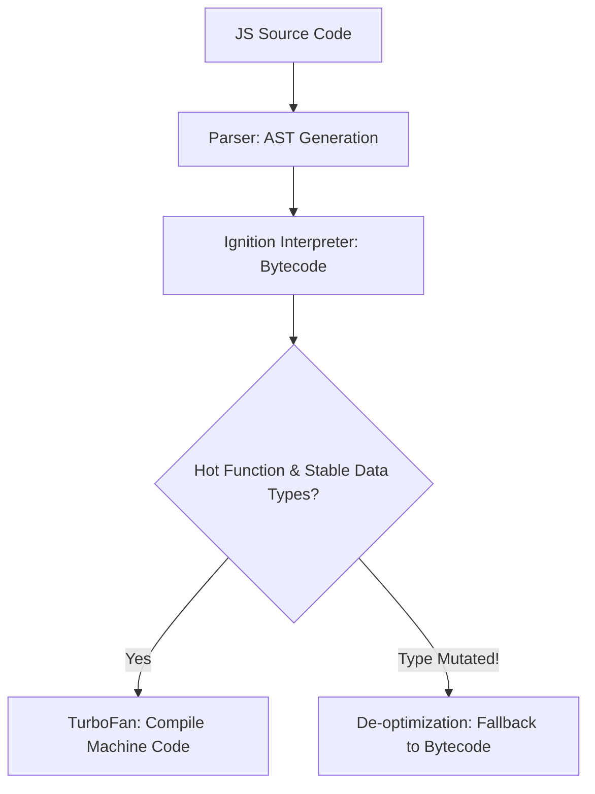

```yaml
schema_version: "2.0"
metadata:
  lesson_id: "JS-MOD01-LES02"
  course_slug: "course-03-javascript"
  course_title: "Course 3: JavaScript & ES6+"
  module_slug: "mod-01-language-architecture-engine"
  module_title: "Module 1 - Language Architecture, Engine, & Execution Mechanics"
  lesson_slug: "javascript-engine-architecture"
  lesson_title: "Lesson 1.2 JavaScript Engine Architecture"
  sort_order: 102

pedagogy:
  difficulty: "advanced"
  estimated_time:
    reading_minutes: 20
    practice_minutes: 25
    quiz_minutes: 10
    total_minutes: 55
  bloom_taxonomy_level: "Analyze"
  xp_reward: 70

prerequisites:
  required_lesson_ids:
    - "JS-MOD01-LES01"
  required_skills:
    - "ECMAScript Language Concepts"

skills_acquired:
  - "V8 Engine Architecture (Ignition Interpreter & TurboFan JIT Compiler)"
  - "Lexical Analysis & Abstract Syntax Tree (AST) Construction"
  - "Bytecode Compilation & Feedback Vector Optimization"
  - "Optimizing Compiler De-optimization Triggers"

dependencies:
  software:
    - "VS Code"
    - "Node.js (`--trace-opt`, `--trace-deopt` flags)"
  hardware: []

seo_and_social:
  meta_title: "V8 JavaScript Engine Architecture: AST, Ignition & TurboFan JIT Compiler"
  meta_description: "Master V8 JavaScript engine internals: AST parsing, Ignition bytecode interpreter, TurboFan JIT optimizing compiler, and de-optimization traps."
  keywords: ["V8 Engine", "JIT Compiler", "Ignition Interpreter", "TurboFan", "AST", "Abstract Syntax Tree", "Bytecode"]

assessment_config:
  has_quiz: true
  has_lab: true
  has_flashcards: true
  pass_score_percentage: 80
```

# Lesson 1.2 JavaScript Engine Architecture

## 1. Overview & Learning Objectives [id: overview]

- **Estimated Time**: 55 Minutes (20m Reading | 25m Practice | 10m Quiz)
- **Difficulty Level**: ⭐⭐⭐ Advanced
- **Prerequisites**: [Lesson 1.1 History & Standards](file:///d:/My%20Drive/all%20files/PROJECT%20FILES/notes/docs/curriculum/_03_javascript/_03_01_history_evolution_and_ecmascript_standards.md)
- **XP Reward**: +70 XP

### Learning Objectives
By the end of this lesson, you will be able to:
1. Trace how JavaScript source code passes through the **V8 Engine** pipeline.
2. Deconstruct Lexical Analysis, Tokenization, and Abstract Syntax Tree (AST) generation.
3. Compare the **Ignition** bytecode interpreter with the **TurboFan** optimizing JIT compiler.
4. Identify hot function optimization triggers and de-optimization traps (type mutations).

---

## 2. Environment & Prerequisites [id: prerequisites]

Inspect V8 JIT optimization traces in Node.js:
- Run `node --trace-opt --trace-deopt app.js`.

---

## 3. Theoretical Foundations [id: theory]

### 3.1 The V8 Engine Execution Pipeline

```
JS Source Code ──► Scanner (Tokens) ──► Parser (AST) ──► Ignition (Bytecode) ──► TurboFan (Optimized Machine Code)
                                                             │                          ▲
                                                             └── Feedback Vector ───────┘
```

1. **Scanner & Parser**: Converts raw text into Tokens and constructs an Abstract Syntax Tree (AST).
2. **Ignition Interpreter**: Compiles AST into compact V8 Bytecode for rapid startup execution.
3. **Feedback Vector**: Collects runtime type feedback on functions (Hidden Classes / Inline Caches).
4. **TurboFan JIT Compiler**: Promotes frequently called ("hot") functions to ultra-fast native Machine Code.
5. **De-optimization**: If a function receives unexpected data types, TurboFan discards native machine code and falls back to Ignition Bytecode!

---

## 4. Architecture & Diagram Visualizations [id: diagram]



---

## 5. Code & Hardware Implementation [id: syntax]

```javascript
// Monomorphic vs Polymorphic Function (V8 JIT Demonstration)

// Monomorphic Function (Fast: TurboFan optimizes smoothly)
function add(a, b) {
  return a + b;
}

// Warm up V8 Feedback Vector
for (let i = 0; i < 10000; i++) {
  add(i, i + 1); // Always numbers -> Monomorphic!
}

// Polymorphic Mutation (Triggers V8 De-optimization!)
add("string", 5); // Type changes -> TurboFan de-optimizes back to Ignition Bytecode!
```

---

## 6. Enterprise Real-World Applications [id: examples]

- **High-Performance Microservices**: Writing monomorphic functions (consistent data types) keeps Node.js and browser JS code running in TurboFan's optimized machine code state.

---

## 7. Guided Step-by-Step Hands-On Exercise [id: exercises]

1. Save code as `v8_demo.js`.
2. Run `node --trace-opt v8_demo.js` $\to$ Inspect terminal logs for `[optimizing add - reason: small function]`!

---

## 8. Common Pitfalls & Troubleshooting [id: common_mistakes]

| Bug / Error | Root Cause | Engineering Solution |
| :--- | :--- | :--- |
| **V8 De-optimization Slowness** | Passing mixed data types (numbers, objects, strings) into the same function parameter. | Maintain consistent monomorphic parameter types. |

---

## 9. Best Practices & Optimization [id: best_practices]

- **Maintain Monomorphic Types**: Pass consistent data structures into functions.

---

## 10. Industry Interview Q&A [id: interview_qa]

### Q1: What are Ignition and TurboFan in the Google Chrome V8 engine?
**Answer**: Ignition is V8's fast bytecode interpreter responsible for rapid initial code startup. TurboFan is V8's optimizing Just-In-Time (JIT) compiler that converts hot, frequently called functions into optimized native machine code.

---

## 11. Self-Assessment Quiz [id: quiz]

```json
{
  "quiz_title": "Lesson 1.2 V8 Engine Assessment",
  "questions": [
    {
      "question_id": "Q1",
      "type": "multiple_choice",
      "question_text": "Which V8 component compiles frequently executed 'hot' functions into native machine code?",
      "options": ["Ignition", "TurboFan", "Babel", "Parser"],
      "correct_answer_index": 1,
      "explanation": "TurboFan is V8's optimizing JIT compiler."
    }
  ]
}
```

---

## 12. Portfolio Assignment & Challenge [id: lab]

Profile function execution and de-optimization triggers using Node.js `--trace-deopt`.

---

## 13. Spaced Repetition Flashcards [id: flashcards]

**Front**: What is the name of V8's bytecode interpreter?
**Back**: Ignition.
<!-- flashcard:end -->

---

## 14. Summary & Cheat Sheet [id: summary]

```bash
node --trace-opt app.js
```
