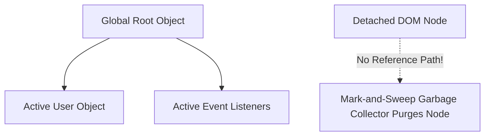

```yaml
schema_version: "2.0"
metadata:
  lesson_id: "JS-MOD01-LES03"
  course_slug: "course-03-javascript"
  course_title: "Course 3: JavaScript & ES6+"
  module_slug: "mod-01-language-architecture-engine"
  module_title: "Module 1 - Language Architecture, Engine, & Execution Mechanics"
  lesson_slug: "execution-context-call-stack-and-memory-management"
  lesson_title: "Lesson 1.3 Execution Context, Call Stack, & Memory Management"
  sort_order: 103

pedagogy:
  difficulty: "advanced"
  estimated_time:
    reading_minutes: 20
    practice_minutes: 25
    quiz_minutes: 10
    total_minutes: 55
  bloom_taxonomy_level: "Analyze"
  xp_reward: 70

prerequisites:
  required_lesson_ids:
    - "JS-MOD01-LES02"
  required_skills:
    - "V8 Engine Architecture & Execution Pipelines"

skills_acquired:
  - "Execution Context Creation & Execution Phases"
  - "Lexical Environment & Variable Environment Mapping"
  - "Call Stack Execution Mechanics & Stack Overflow Debugging"
  - "Memory Heap Allocation Dynamics"
  - "Garbage Collection Algorithms (Mark-and-Sweep)"
  - "Memory Leak Diagnosis using Chrome Memory Profiler"

dependencies:
  software:
    - "VS Code"
    - "Chrome DevTools Memory Panel"
  hardware: []

seo_and_social:
  meta_title: "JavaScript Execution Context, Call Stack & Memory Heap Garbage Collection"
  meta_description: "Master JavaScript Execution Context: Creation vs Execution phases, Call Stack mechanics, Memory Heap, Mark-and-Sweep garbage collection, and memory leaks."
  keywords: ["Execution Context", "Call Stack", "Memory Heap", "Mark and Sweep", "Garbage Collection", "Stack Overflow", "Memory Leak"]

assessment_config:
  has_quiz: true
  has_lab: true
  has_flashcards: true
  pass_score_percentage: 80
```

# Lesson 1.3 Execution Context, Call Stack, & Memory Management

## 1. Overview & Learning Objectives [id: overview]

- **Estimated Time**: 55 Minutes (20m Reading | 25m Practice | 10m Quiz)
- **Difficulty Level**: ⭐⭐⭐ Advanced
- **Prerequisites**: [Lesson 1.2 JavaScript Engine Architecture](file:///d:/My%20Drive/all%20files/PROJECT%20FILES/notes/docs/curriculum/_03_javascript/_03_02_javascript_engine_architecture.md)
- **XP Reward**: +70 XP

### Learning Objectives
By the end of this lesson, you will be able to:
1. Deconstruct the two phases of an **Execution Context** (Creation Phase vs Execution Phase).
2. Trace function execution frames through the LIFO **Call Stack**.
3. Identify memory allocation in the **Call Stack** (primitives) vs **Memory Heap** (objects/references).
4. Explain how V8's **Mark-and-Sweep Garbage Collector** reclaims memory.
5. Diagnose and fix common Memory Leaks (dangling event listeners, accidental globals, detached DOM trees).

---

## 2. Environment & Prerequisites [id: prerequisites]

Inspect Heap Snapshots in Chrome DevTools:
- Open DevTools (`F12`) $\to$ Click **Memory** tab $\to$ Select **Heap snapshot** $\to$ Click **Take snapshot**.

---

## 3. Theoretical Foundations [id: theory]

### 3.1 Execution Context Lifecycle
Every time a JavaScript function is invoked, a new Execution Context is pushed onto the Call Stack:

1. **Creation Phase**:
   - Creates the `window` or `global` object.
   - Sets up `this` binding.
   - Scans for variable and function declarations (**Hoisting**).
2. **Execution Phase**:
   - Assigns values to variables.
   - Executes code line by line.

```
┌─────────────────────────────────────────────────────────────────────────────┐
│                          CALL STACK vs MEMORY HEAP                          │
├──────────────────────────────────────┬──────────────────────────────────────┤
│ Call Stack (Primitive Values & Frame)│ Memory Heap (Unstructured Large Data)│
├──────────────────────────────────────┼──────────────────────────────────────┤
│ `let x = 10`                         │ `const user = { name: "Alice" }`     │
│ `let ptr = 0x00A1B` ─────────────────┼──► Memory Address 0x00A1B           │
└──────────────────────────────────────┴──────────────────────────────────────┘
```

### 3.2 Mark-and-Sweep Garbage Collection
V8 periodically traverses all objects starting from global **Roots**. Objects unreachable from the root are marked and swept from the Memory Heap.

---

## 4. Architecture & Diagram Visualizations [id: diagram]



---

## 5. Code & Hardware Implementation [id: syntax]

```javascript
// Memory Leak Example: Dangling Event Listener

function attachListener() {
  const bigData = new Array(1000000).fill("Memory Payload");
  
  // Bug: Event listener retains bigData reference via closure!
  window.addEventListener('resize', function leakHandler() {
    console.log(bigData.length);
  });
}

attachListener(); // bigData is trapped in heap memory forever!
```

---

## 6. Enterprise Real-World Applications [id: examples]

- **Node.js Production Servers**: Monitoring memory heap usage (`process.memoryUsage()`) prevents out-of-memory container crashes under heavy traffic loads.

---

## 7. Guided Step-by-Step Hands-On Exercise [id: exercises]

1. Save code as `memory_demo.js`.
2. Open Chrome DevTools Memory tab $\to$ Take Heap Snapshot $\to$ Observe 1,000,000 array items retained in memory!

---

## 8. Common Pitfalls & Troubleshooting [id: common_mistakes]

| Bug / Error | Root Cause | Engineering Solution |
| :--- | :--- | :--- |
| **`RangeError: Maximum call stack size exceeded`** | Infinite recursive function call without a termination base condition. | Add proper base conditions to recursion loops. |

---

## 9. Best Practices & Optimization [id: best_practices]

- **Remove Event Listeners**: Call `removeEventListener()` when components unmount.

---

## 10. Industry Interview Q&A [id: interview_qa]

### Q1: What is Mark-and-Sweep Garbage Collection in JavaScript?
**Answer**: Mark-and-Sweep is V8's primary memory reclamation algorithm. It starts from global roots, "marks" all reachable objects, and "sweeps" un-marked, unreachable memory addresses back into free heap space.

---

## 11. Self-Assessment Quiz [id: quiz]

```json
{
  "quiz_title": "Lesson 1.3 Execution Context Assessment",
  "questions": [
    {
      "question_id": "Q1",
      "type": "multiple_choice",
      "question_text": "During which Execution Context phase are variables hoisted and assigned `undefined`?",
      "options": ["Creation Phase", "Execution Phase", "Compilation Phase", "Garbage Collection Phase"],
      "correct_answer_index": 0,
      "explanation": "Variable declarations are hoisted during the Creation Phase."
    }
  ]
}
```

---

## 12. Portfolio Assignment & Challenge [id: lab]

Profile and eliminate 3 intentional memory leaks using Chrome Memory Profiler.

---

## 13. Spaced Repetition Flashcards [id: flashcards]

**Front**: Where are primitive values stored in JavaScript?
**Back**: In the Call Stack frame (objects are stored in the Memory Heap).
<!-- flashcard:end -->

---

## 14. Summary & Cheat Sheet [id: summary]

```javascript
window.removeEventListener('resize', handler);
```
