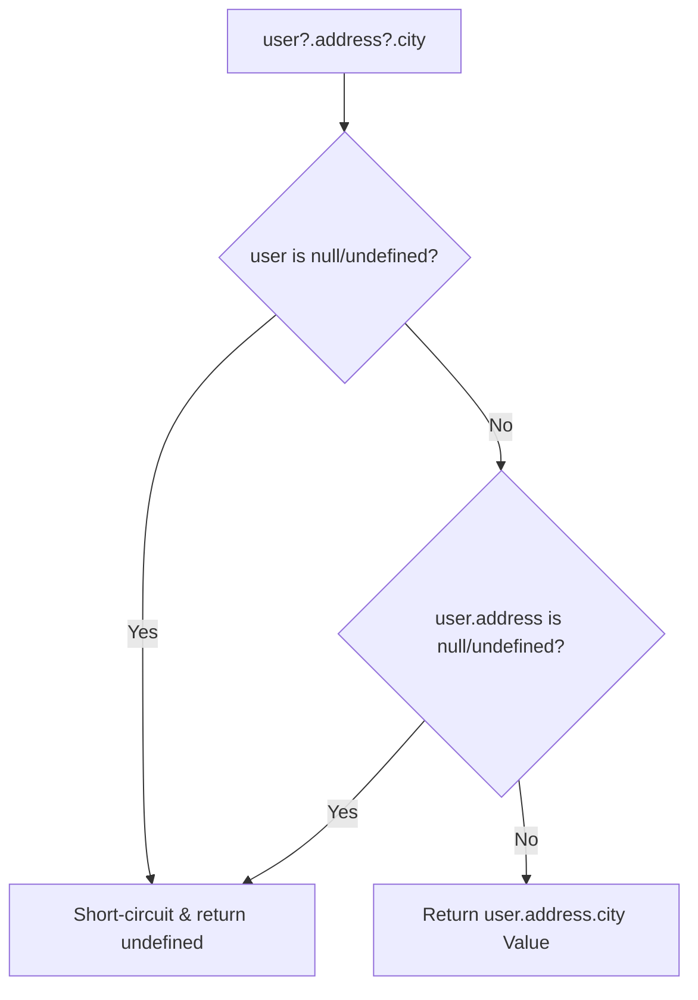

```yaml
schema_version: "2.0"
metadata:
  lesson_id: "JS-MOD02-LES04"
  course_slug: "course-03-javascript"
  course_title: "Course 3: JavaScript & ES6+"
  module_slug: "mod-02-variables-types-operators"
  module_title: "Module 2 - Variables, Data Types, & Operators"
  lesson_slug: "comprehensive-operator-systems"
  lesson_title: "Lesson 2.4 Comprehensive Operator Systems"
  sort_order: 204

pedagogy:
  difficulty: "intermediate"
  estimated_time:
    reading_minutes: 20
    practice_minutes: 25
    quiz_minutes: 10
    total_minutes: 55
  bloom_taxonomy_level: "Apply"
  xp_reward: 60

prerequisites:
  required_lesson_ids:
    - "JS-MOD02-LES03"
  required_skills:
    - "Type Coercion & Truthy/Falsy Rules"

skills_acquired:
  - "Short-Circuit Evaluation (`&&`, `||`)"
  - "Nullish Coalescing (`??`) vs Logical OR (`||`)"
  - "Optional Chaining Operator (`?.`)"
  - "Bitwise Operations (`&`, `|`, `^`, `~`, `<<`, `>>`, `>>>`)"
  - "Unary & Special Operators (`delete`, `void`, Ternary `? :`)"

dependencies:
  software:
    - "VS Code"
    - "Node.js REPL"
  hardware: []

seo_and_social:
  meta_title: "JavaScript Operators: Nullish Coalescing (??), Optional Chaining (?.) & Bitwise"
  meta_description: "Master JavaScript operator systems: short-circuiting (&&, ||), Nullish Coalescing (??), Optional Chaining (?.), Bitwise flags, and ternary expressions."
  keywords: ["JavaScript Operators", "Nullish Coalescing", "Optional Chaining", "Short Circuit", "Bitwise Operators", "Ternary Operator"]

assessment_config:
  has_quiz: true
  has_lab: true
  has_flashcards: true
  pass_score_percentage: 80
```

# Lesson 2.4 Comprehensive Operator Systems

## 1. Overview & Learning Objectives [id: overview]

- **Estimated Time**: 55 Minutes (20m Reading | 25m Practice | 10m Quiz)
- **Difficulty Level**: ⭐⭐ Intermediate
- **Prerequisites**: [Lesson 2.3 Type Coercion](file:///d:/My%20Drive/all%20files/PROJECT%20FILES/notes/docs/curriculum/_03_javascript/_03_06_type_coercion_and_comparison_operations.md)
- **XP Reward**: +60 XP

### Learning Objectives
By the end of this lesson, you will be able to:
1. Leverage Short-Circuit Evaluation (`&&`, `||`).
2. Contrast the **Nullish Coalescing Operator (`??`)** with Logical OR (`||`).
3. Safely navigate nested object properties using **Optional Chaining (`?.`)**.
4. Execute high-performance Bitwise operations (`&`, `|`, `^`, `~`, `<<`, `>>`).
5. Utilize Unary and Special Operators (`delete`, `void`, Ternary `? :`).

---

## 2. Environment & Prerequisites [id: prerequisites]

Open Node.js REPL to execute operator expressions.

---

## 3. Theoretical Foundations [id: theory]

### 3.1 `||` vs `??` (Nullish Coalescing)
- **Logical OR (`||`)**: Returns right-hand side if left-hand side is ANY **Falsy** value (`0`, `""`, `false`, `null`, `undefined`).
- **Nullish Coalescing (`??`)**: Returns right-hand side ONLY if left-hand side is `null` or `undefined`!

```javascript
const count = 0;

const val1 = count || 10; // Evaluates to 10! (Because 0 is falsy)
const val2 = count ?? 10; // Evaluates to 0!  (Preserves valid 0 value!)
```

### 3.2 Optional Chaining (`?.`)
Short-circuits property access and returns `undefined` if an object reference is `null` or `undefined`, preventing `Cannot read properties of undefined` crashes:

```javascript
const user = {};
const city = user?.address?.city; // Evaluates safely to undefined!
```

---

## 4. Architecture & Diagram Visualizations [id: diagram]



---

## 5. Code & Hardware Implementation [id: syntax]

```javascript
// Comprehensive Operator Demonstration

const telemetryConfig = {
  nodeId: "ESP32-A1",
  readings: {
    temperature: 0 // Valid 0 degree reading!
  }
};

// 1. Optional Chaining & Nullish Coalescing
const temp = telemetryConfig?.readings?.temperature ?? 25;
console.log(`Temperature: ${temp}°C`); // Outputs 0°C (Correctly preserved!)

// 2. Bitwise Permission Flags
const READ_PERM  = 1 << 0; // 0001 (1)
const WRITE_PERM = 1 << 1; // 0010 (2)
let userPerms = READ_PERM | WRITE_PERM; // 0011 (3)

console.log("Can Read?", (userPerms & READ_PERM) !== 0); // true
```

---

## 6. Enterprise Real-World Applications [id: examples]

- **Bitwise IoT Hardware Flags**: Microcontroller telemetry packets encode sensor state flags into single bitwise integer bitmasks (`1 << n`) to minimize network bandwidth.

---

## 7. Guided Step-by-Step Hands-On Exercise [id: exercises]

1. Save code as `operators_demo.js`.
2. Run `node operators_demo.js` $\to$ Verify `??` preserves `0°C` temperature value!

---

## 8. Common Pitfalls & Troubleshooting [id: common_mistakes]

| Bug / Error | Root Cause | Engineering Solution |
| :--- | :--- | :--- |
| **Default Overwritten by `||`** | Using `||` for default settings when `0` or `""` are valid valid inputs. | Replace `||` with `??` (Nullish Coalescing). |

---

## 9. Best Practices & Optimization [id: best_practices]

- **Use `??` for Defaults**: Preserves valid `0` and `""` inputs.
- **Use `?.` for Nested Access**: Eliminates defensive `if (user && user.address)` checks.

---

## 10. Industry Interview Q&A [id: interview_qa]

### Q1: How does the Nullish Coalescing Operator (`??`) differ from the Logical OR Operator (`||`)?
**Answer**: The Logical OR (`||`) operator returns the right-hand operand for ANY falsy left-hand value (including `0`, `""`, and `false`). The Nullish Coalescing operator (`??`) returns the right-hand operand ONLY if the left-hand operand evaluates to `null` or `undefined`.

---

## 11. Self-Assessment Quiz [id: quiz]

```json
{
  "quiz_title": "Lesson 2.4 Operators Assessment",
  "questions": [
    {
      "question_id": "Q1",
      "type": "multiple_choice",
      "question_text": "What does `const x = 0 ?? 42;` evaluate to?",
      "options": ["42", "0", "undefined", "null"],
      "correct_answer_index": 1,
      "explanation": "0 is not null or undefined, so ?? returns 0."
    }
  ]
}
```

---

## 12. Portfolio Assignment & Challenge [id: lab]

Build a robust JSON API payload parser using `?.` and `??` for error-free property extraction.

---

## 13. Spaced Repetition Flashcards [id: flashcards]

**Front**: What operator prevents `TypeError: Cannot read properties of undefined`?
**Back**: Optional Chaining Operator (`?.`).
<!-- flashcard:end -->

---

## 14. Summary & Cheat Sheet [id: summary]

```javascript
const city = user?.address?.city ?? "Unknown";
```
