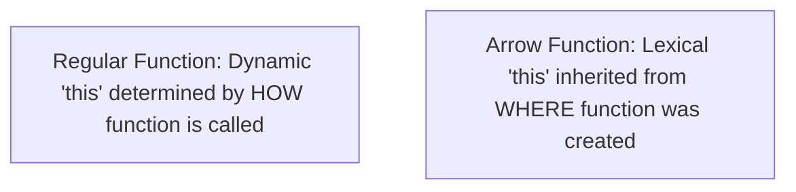

```yaml
schema_version: "2.0"
metadata:
  lesson_id: "JS-MOD04-LES01"
  course_slug: "course-03-javascript"
  course_title: "Course 3: JavaScript & ES6+"
  module_slug: "mod-04-functions-scope-closures"
  module_title: "Module 4 - Functions, Scope, & Closures"
  lesson_slug: "function-declarations-expressions-and-arrow-functions"
  lesson_title: "Lesson 4.1 Function Declarations, Expressions, & Arrow Functions"
  sort_order: 401

pedagogy:
  difficulty: "beginner"
  estimated_time:
    reading_minutes: 15
    practice_minutes: 20
    quiz_minutes: 10
    total_minutes: 45
  bloom_taxonomy_level: "Apply"
  xp_reward: 50

prerequisites:
  required_lesson_ids:
    - "JS-MOD03-LES03"
  required_skills:
    - "JavaScript Control Flow & Execution Context"

skills_acquired:
  - "Function Declarations vs Function Expressions"
  - "Function Hoisting Differences"
  - "Arrow Functions Syntax & Implicit Returns (`() => {}`)"
  - "Lexical `this` Binding in Arrow Functions"
  - "Immediately Invoked Function Expressions (IIFE)"

dependencies:
  software:
    - "VS Code"
    - "Node.js REPL"
  hardware: []

seo_and_social:
  meta_title: "JavaScript Functions: Declarations, Expressions, Arrow Functions & Lexical this"
  meta_description: "Master JavaScript functions: Function Declarations, Expressions, Arrow Functions, lexical this binding, IIFE patterns, and hoisting differences."
  keywords: ["JavaScript Functions", "Arrow Functions", "Lexical this", "Function Declaration", "Function Expression", "IIFE"]

assessment_config:
  has_quiz: true
  has_lab: true
  has_flashcards: true
  pass_score_percentage: 80
```

# Lesson 4.1 Function Declarations, Expressions, & Arrow Functions

## 1. Overview & Learning Objectives [id: overview]

- **Estimated Time**: 45 Minutes (15m Reading | 20m Practice | 10m Quiz)
- **Difficulty Level**: ⭐ Beginner
- **Prerequisites**: [Lesson 3.3 Iteration Protocols](file:///d:/My%20Drive/all%20files/PROJECT%20FILES/notes/docs/curriculum/_03_javascript/_03_10_iteration_protocols_iterators_and_generators.md)
- **XP Reward**: +50 XP

### Learning Objectives
By the end of this lesson, you will be able to:
1. Contrast Function Declarations with Function Expressions and their hoisting rules.
2. Write concise **Arrow Functions** (`() => {}`) with implicit return values.
3. Explain how Arrow Functions inherit **Lexical `this` Binding**.
4. Implement Immediately Invoked Function Expressions (IIFE).

---

## 2. Environment & Prerequisites [id: prerequisites]

Open Node.js REPL to execute function definitions.

---

## 3. Theoretical Foundations [id: theory]

### 3.1 Declarations vs Expressions vs Arrow Functions

```
┌─────────────────────────────────────────────────────────────────────────────┐
│                       FUNCTION DEFINITION VARIETIES MATRIX                  │
├─────────────────┬──────────────────┬─────────────────┬──────────────────────┤
│ Type            │ Hoisted?         │ Has Own `this`? │ Constructor (`new`)? │
├─────────────────┼──────────────────┼─────────────────┼──────────────────────┤
│ Declaration     │ YES (Full Body)  │ YES             │ YES                  │
│ Expression      │ Variable only    │ YES             │ YES                  │
│ Arrow Function  │ Variable only    │ NO (Lexical)    │ NO                   │
└─────────────────┴──────────────────┴─────────────────┴──────────────────────┘
```

> [!IMPORTANT]
> **Lexical `this` Binding**: Arrow functions do NOT have their own `this` keyword, `arguments` object, or `super` binding. They capture `this` from the enclosing scope at creation time!

---

## 4. Architecture & Diagram Visualizations [id: diagram]



---

## 5. Code & Hardware Implementation [id: syntax]

```javascript
// Function Syntax & Lexical 'this' Demonstration

// 1. Function Declaration (Hoisted!)
function add(a, b) {
  return a + b;
}

// 2. Arrow Function with Implicit Return
const multiply = (a, b) => a * b;

// 3. Lexical 'this' in Object Methods
const timer = {
  seconds: 0,
  start() {
    // Arrow function preserves outer 'timer' object 'this'!
    setInterval(() => {
      this.seconds++;
      console.log(`Elapsed: ${this.seconds}s`);
    }, 1000);
  }
};

// 4. IIFE (Immediately Invoked Function Expression)
(() => {
  console.log("IIFE Executed Immediately on Load!");
})();
```

---

## 6. Enterprise Real-World Applications [id: examples]

- **React Event Handlers & Node Async Callbacks**: Arrow functions prevent traditional `const self = this` or `.bind(this)` boilerplate when registering event listeners inside class components or modules.

---

## 7. Guided Step-by-Step Hands-On Exercise [id: exercises]

1. Save code as `fn_demo.js`.
2. Run `node fn_demo.js` $\to$ Observe lexical `this` binding in timer interval!

---

## 8. Common Pitfalls & Troubleshooting [id: common_mistakes]

| Bug / Error | Root Cause | Engineering Solution |
| :--- | :--- | :--- |
| **`TypeError: X is not a constructor`** | Attempting to instantiate an Arrow function with `new ArrowFn()`. | Use regular functions or ES6 `class` definitions for constructors. |

---

## 9. Best Practices & Optimization [id: best_practices]

- **Use Arrow Functions for Callbacks**: Eliminates manual `this` binding.

---

## 10. Industry Interview Q&A [id: interview_qa]

### Q1: How does the `this` keyword behave differently in Arrow Functions compared to Regular Functions?
**Answer**: In regular functions, `this` is dynamically bound based on *how* the function is invoked at runtime. In arrow functions, `this` is lexically bound, capturing the `this` value of the enclosing scope where the arrow function was defined.

---

## 11. Self-Assessment Quiz [id: quiz]

```json
{
  "quiz_title": "Lesson 4.1 Functions Assessment",
  "questions": [
    {
      "question_id": "Q1",
      "type": "multiple_choice",
      "question_text": "Do Arrow Functions have their own `this` binding?",
      "options": ["Yes", "No (Lexical inheritance)", "Only in strict mode", "Only when passed arguments"],
      "correct_answer_index": 1,
      "explanation": "Arrow functions inherit lexical 'this' from their enclosing scope."
    }
  ]
}
```

---

## 12. Portfolio Assignment & Challenge [id: lab]

Refactor a legacy `.bind(this)` codebase to modern ES6 arrow functions.

---

## 13. Spaced Repetition Flashcards [id: flashcards]

**Front**: Can arrow functions be instantiated using the `new` keyword?
**Back**: No. Arrow functions lack `[[Construct]]` internal methods.
<!-- flashcard:end -->

---

## 14. Summary & Cheat Sheet [id: summary]

```javascript
const add = (a, b) => a + b;
```
