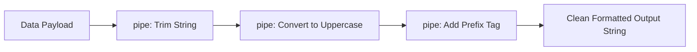

```yaml
schema_version: "2.0"
metadata:
  lesson_id: "JS-MOD04-LES04"
  course_slug: "course-03-javascript"
  course_title: "Course 3: JavaScript & ES6+"
  module_slug: "mod-04-functions-scope-closures"
  module_title: "Module 4 - Functions, Scope, & Closures"
  lesson_slug: "functional-concepts-and-higher-order-functions"
  lesson_title: "Lesson 4.4 Functional Concepts & Higher-Order Functions"
  sort_order: 404

pedagogy:
  difficulty: "advanced"
  estimated_time:
    reading_minutes: 20
    practice_minutes: 25
    quiz_minutes: 10
    total_minutes: 55
  bloom_taxonomy_level: "Apply"
  xp_reward: 70

prerequisites:
  required_lesson_ids:
    - "JS-MOD04-LES03"
  required_skills:
    - "Closures & Scope Chain Resolution"

skills_acquired:
  - "Higher-Order Functions Definition & Patterns"
  - "Pure Functions vs Side Effects Identification"
  - "Immutability & Defensive Data Copying"
  - "Function Composition Mechanics (`compose` / `pipe`)"
  - "Currying & Partial Application (`curry(fn)`)"

dependencies:
  software:
    - "VS Code"
    - "Node.js REPL"
  hardware: []

seo_and_social:
  meta_title: "Functional JavaScript: Higher-Order Functions, Pure Functions, Currying & Pipe"
  meta_description: "Master Functional Programming in JavaScript: Higher-Order Functions, Pure Functions, side effect elimination, Function Composition (pipe/compose), and Currying."
  keywords: ["Functional JavaScript", "Higher-Order Functions", "Pure Functions", "Currying", "Function Composition", "Immutability"]

assessment_config:
  has_quiz: true
  has_lab: true
  has_flashcards: true
  pass_score_percentage: 80
```

# Lesson 4.4 Functional Concepts & Higher-Order Functions

## 1. Overview & Learning Objectives [id: overview]

- **Estimated Time**: 55 Minutes (20m Reading | 25m Practice | 10m Quiz)
- **Difficulty Level**: ⭐⭐⭐ Advanced
- **Prerequisites**: [Lesson 4.3 Closures](file:///d:/My%20Drive/all%20files/PROJECT%20FILES/notes/docs/curriculum/_03_javascript/_03_13_scope_chain_and_closures.md)
- **XP Reward**: +70 XP

### Learning Objectives
By the end of this lesson, you will be able to:
1. Identify **Higher-Order Functions (HOFs)** that accept or return other functions.
2. Write **Pure Functions** free from side effects.
3. Enforce **Immutability Principles** when transforming application state.
4. Compose functions cleanly using `pipe()` and `compose()`.
5. Implement **Currying** and Partial Application.

---

## 2. Environment & Prerequisites [id: prerequisites]

Open Node.js REPL to execute functional composition scripts.

---

## 3. Theoretical Foundations [id: theory]

### 3.1 Pure Functions vs Side Effects
A function is **Pure** if it satisfies two guarantees:
1. **Determinism**: Given the same inputs, it ALWAYS returns the exact same output.
2. **Zero Side Effects**: It does NOT mutate global state, modify external parameters, or perform I/O.

```javascript
// Impure Function (Mutates external state!)
let total = 0;
function addToTotal(val) {
  total += val; // Side Effect!
  return total;
}

// Pure Function (Deterministic & Immutable)
const add = (a, b) => a + b;
```

### 3.2 Currying
**Currying** converts a multi-argument function $f(a, b, c)$ into a sequence of unary functions $f(a)(b)(c)$:

```javascript
// Standard Function
const multiply = (a, b) => a * b;

// Curried Function
const curriedMultiply = (a) => (b) => a * b;
const double = curriedMultiply(2);
console.log(double(5)); // 10
```

---

## 4. Architecture & Diagram Visualizations [id: diagram]



---

## 5. Code & Hardware Implementation [id: syntax]

```javascript
// Functional Concepts Demonstration

// 1. Function Pipe Utility (Left-to-Right Composition)
const pipe = (...fns) => (initialValue) => 
  fns.reduce((acc, fn) => fn(acc), initialValue);

// 2. Pure Transformation Functions
const trim = (str) => str.trim();
const capitalize = (str) => str.toUpperCase();
const addTag = (str) => `[SENSOR_LOG]: ${str}`;

// 3. Composed Processing Pipeline
const formatLog = pipe(trim, capitalize, addTag);

console.log(formatLog("   telemetry payload received   "));
// Output: "[SENSOR_LOG]: TELEMETRY PAYLOAD RECEIVED"

// 4. Currying Utility
const curry = (fn) => {
  return function curried(...args) {
    if (args.length >= fn.length) {
      return fn.apply(this, args);
    }
    return (...nextArgs) => curried.apply(this, args.concat(nextArgs));
  };
};

const volume = (l, w, h) => l * w * h;
const curriedVolume = curry(volume);
console.log(curriedVolume(2)(3)(4)); // 24
```

---

## 6. Enterprise Real-World Applications [id: examples]

- **Redux / RxJS State Architecture**: Enterprise state management libraries rely strictly on pure reducers and functional pipelining to maintain predictable time-travel debugging.

---

## 7. Guided Step-by-Step Hands-On Exercise [id: exercises]

1. Save code as `functional_demo.js`.
2. Run `node functional_demo.js` $\to$ Inspect pipe and currying outputs!

---

## 8. Common Pitfalls & Troubleshooting [id: common_mistakes]

| Bug / Error | Root Cause | Engineering Solution |
| :--- | :--- | :--- |
| **Accidental State Mutation** | Using `.push()` or `.sort()` directly on state arrays inside a function. | Use non-mutating equivalents (`.concat()`, `[...arr]`, `.toSorted()`). |

---

## 9. Best Practices & Optimization [id: best_practices]

- **Keep Reducers Pure**: Never perform API calls or generate random numbers inside pure transformation functions.

---

## 10. Industry Interview Q&A [id: interview_qa]

### Q1: What is Currying in Functional JavaScript?
**Answer**: Currying is a functional transformation that converts a function taking multiple arguments into a sequence of nested functions that each take a single argument. It enables partial application and reusable specialized functions.

---

## 11. Self-Assessment Quiz [id: quiz]

```json
{
  "quiz_title": "Lesson 4.4 Functional Concepts Assessment",
  "questions": [
    {
      "question_id": "Q1",
      "type": "multiple_choice",
      "question_text": "Which characteristic is mandatory for a function to be classified as a Pure Function?",
      "options": ["Must use async/await", "Must produce zero side effects and be deterministic", "Must mutate parameters in place", "Must use recursion"],
      "correct_answer_index": 1,
      "explanation": "Pure functions produce zero side effects and return deterministic outputs."
    }
  ]
}
```

---

## 12. Portfolio Assignment & Challenge [id: lab]

Build a functional validation pipe for user registration forms using `pipe()`.

---

## 13. Spaced Repetition Flashcards [id: flashcards]

**Front**: What direction does `pipe(f, g, h)(x)` execute functions compared to `compose(f, g, h)(x)`?
**Back**: `pipe` executes left-to-right ($f(x) \to g \to h$). `compose` executes right-to-left ($h(x) \to g \to f$).
<!-- flashcard:end -->

---

## 14. Summary & Cheat Sheet [id: summary]

```javascript
const pipe = (...fns) => (x) => fns.reduce((v, f) => f(v), x);
```
