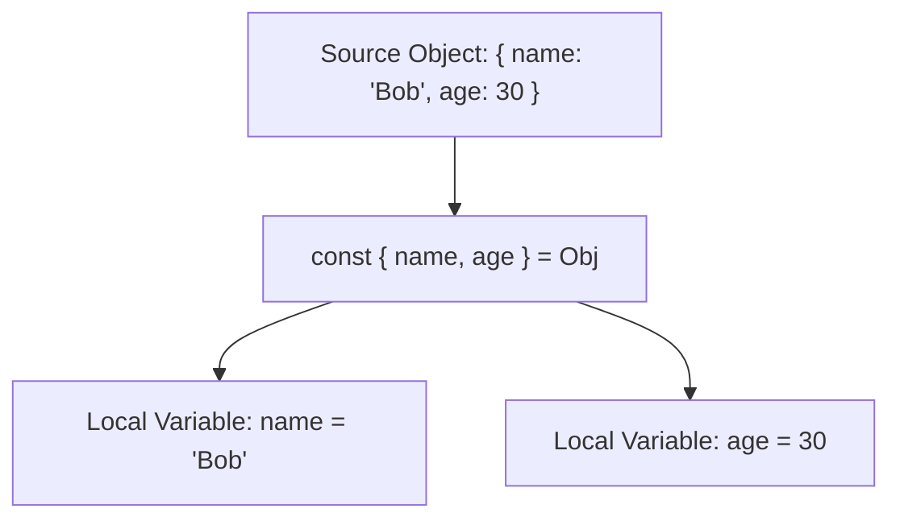

```yaml
schema_version: "2.0"
metadata:
  lesson_id: "JS-MOD05-LES03"
  course_slug: "course-03-javascript"
  course_title: "Course 3: JavaScript & ES6+"
  module_slug: "mod-05-objects-arrays-structures"
  module_title: "Module 5 - Objects, Arrays, & Data Structures"
  lesson_slug: "destructuring-assignment-and-spread-rest-operators"
  lesson_title: "Lesson 5.3 Destructuring Assignment & Spread/Rest Operators"
  sort_order: 503

pedagogy:
  difficulty: "intermediate"
  estimated_time:
    reading_minutes: 15
    practice_minutes: 20
    quiz_minutes: 10
    total_minutes: 45
  bloom_taxonomy_level: "Apply"
  xp_reward: 50

prerequisites:
  required_lesson_ids:
    - "JS-MOD05-LES02"
  required_skills:
    - "JavaScript Objects & Arrays"

skills_acquired:
  - "Array Destructuring (Positional, Default Values, Skipping Elements)"
  - "Object Destructuring (Renaming Variables `prop: newName`, Defaults)"
  - "Function Parameter Destructuring Pattern"
  - "Spread Syntax (`...`) for Shallow Object/Array Cloning & Merging"

dependencies:
  software:
    - "VS Code"
    - "Node.js REPL"
  hardware: []

seo_and_social:
  meta_title: "JavaScript ES6 Destructuring Assignment & Spread/Rest Syntax"
  meta_description: "Master ES6+ Destructuring Assignment: Array & Object destructuring, variable renaming, default values, parameter destructuring, and Spread (...) cloning."
  keywords: ["ES6 Destructuring", "Object Destructuring", "Array Destructuring", "Spread Operator", "Rest Syntax", "Shallow Copy"]

assessment_config:
  has_quiz: true
  has_lab: true
  has_flashcards: true
  pass_score_percentage: 80
```

# Lesson 5.3 Destructuring Assignment & Spread/Rest Operators

## 1. Overview & Learning Objectives [id: overview]

- **Estimated Time**: 45 Minutes (15m Reading | 20m Practice | 10m Quiz)
- **Difficulty Level**: ⭐⭐ Intermediate
- **Prerequisites**: [Lesson 5.2 Arrays](file:///d:/My%20Drive/all%20files/PROJECT%20FILES/notes/docs/curriculum/_03_javascript/_03_16_dense_sparse_arrays_and_higher_order_methods.md)
- **XP Reward**: +50 XP

### Learning Objectives
By the end of this lesson, you will be able to:
1. Extract array values using positional **Array Destructuring**.
2. Unpack object properties using **Object Destructuring**, variable renaming, and defaults.
3. Apply Destructuring directly inside **Function Parameter Signatures**.
4. Clone and merge objects and arrays using the **Spread Operator (`...`)**.

---

## 2. Environment & Prerequisites [id: prerequisites]

Open Node.js REPL to execute destructuring patterns.

---

## 3. Theoretical Foundations [id: theory]

### 3.1 Unpacking Data Structures
ES6 Destructuring provides a concise syntax for extracting properties from objects or elements from arrays directly into local variables:

```javascript
// Object Destructuring with Renaming & Default
const user = { name: "Alice", role: "ADMIN" };
const { name: userName, role, status = "ACTIVE" } = user;

// Array Destructuring with Rest
const [first, second, ...remaining] = [10, 20, 30, 40, 50];
```

### 3.2 Spread (`...`) for Immutable Merging
The Spread operator shallow-copies elements from an existing object or array into a new target container:

```javascript
const defaults = { theme: "DARK", notifications: true };
const userPrefs = { notifications: false, fontSize: 16 };

// Merging Objects (userPrefs overwrites collision keys in defaults!)
const finalConfig = { ...defaults, ...userPrefs };
```

---

## 4. Architecture & Diagram Visualizations [id: diagram]



---

## 5. Code & Hardware Implementation [id: syntax]

```javascript
// Destructuring & Spread Syntax Demonstration

// 1. Function Parameter Destructuring with Defaults
function renderUserProfile({ id, username, settings: { theme = "LIGHT" } = {} }) {
  console.log(`[User ${id}]: ${username} (Theme: ${theme})`);
}

const userData = {
  id: 101,
  username: "alex_dev",
  settings: { theme: "DARK" }
};

renderUserProfile(userData); // Output: [User 101]: alex_dev (Theme: DARK)

// 2. Swapping Variables without Temporary Storage
let a = 1, b = 2;
[a, b] = [b, a];
console.log(`Swapped: a=${a}, b=${b}`); // a=2, b=1

// 3. Immutable Array Insertion using Spread
const initialList = ["Alpha", "Gamma"];
const updatedList = [initialList[0], "Beta", ...initialList.slice(1)];
console.log("Updated List:", updatedList); // ['Alpha', 'Beta', 'Gamma']
```

---

## 6. Enterprise Real-World Applications [id: examples]

- **React Component Props & State Updates**: Modern React components destructure props in function signatures and use `setStore(prev => ({ ...prev, updatedKey: val }))` for immutable state updates.

---

## 7. Guided Step-by-Step Hands-On Exercise [id: exercises]

1. Save code as `destructuring_demo.js`.
2. Run `node destructuring_demo.js` $\to$ Inspect destructuring and variable swapping outputs!

---

## 8. Common Pitfalls & Troubleshooting [id: common_mistakes]

| Bug / Error | Root Cause | Engineering Solution |
| :--- | :--- | :--- |
| **`TypeError: Cannot destructure property X of undefined`** | Attempting to destructure properties from a target that evaluates to `null` or `undefined`. | Provide default fallback objects: `const { x } = target || {};`. |

---

## 9. Best Practices & Optimization [id: best_practices]

- **Destructure Function Parameters**: Makes function signatures self-documenting.

---

## 10. Industry Interview Q&A [id: interview_qa]

### Q1: How do you rename a variable during Object Destructuring in ES6?
**Answer**: By placing a colon and the new target variable name after the key: `const { originalKey: newVariableName } = object;`.

---

## 11. Self-Assessment Quiz [id: quiz]

```json
{
  "quiz_title": "Lesson 5.3 Destructuring Assessment",
  "questions": [
    {
      "question_id": "Q1",
      "type": "multiple_choice",
      "question_text": "What is the result of `const [x, , y] = [1, 2, 3];`?",
      "options": ["x=1, y=2", "x=1, y=3", "x=1, y=undefined", "Syntax Error"],
      "correct_answer_index": 1,
      "explanation": "Leaving a comma blank skips the second element (2), setting x=1 and y=3."
    }
  ]
}
```

---

## 12. Portfolio Assignment & Challenge [id: lab]

Refactor a complex API response handler to extract 10 nested fields via destructuring.

---

## 13. Spaced Repetition Flashcards [id: flashcards]

**Front**: How do you assign a default value during object destructuring?
**Back**: `const { prop = "defaultValue" } = object;`.
<!-- flashcard:end -->

---

## 14. Summary & Cheat Sheet [id: summary]

```javascript
const { name, age } = user;
const clone = { ...original };
```
