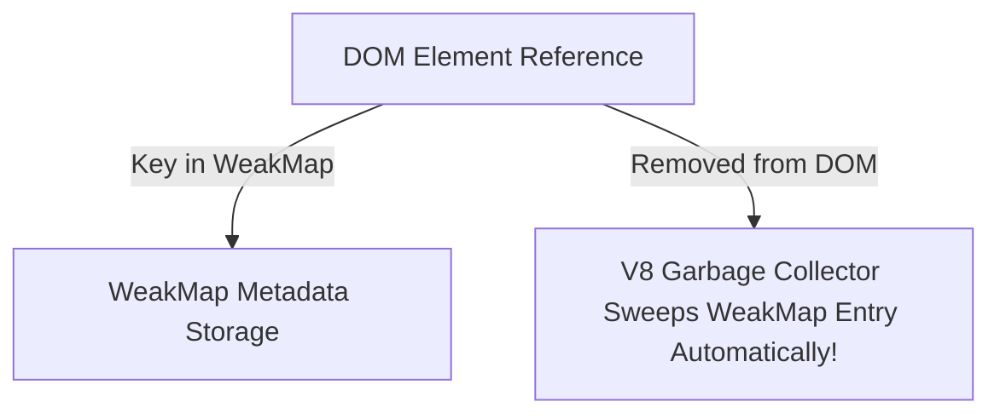

```yaml
schema_version: "2.0"
metadata:
  lesson_id: "JS-MOD05-LES04"
  course_slug: "course-03-javascript"
  course_title: "Course 3: JavaScript & ES6+"
  module_slug: "mod-05-objects-arrays-structures"
  module_title: "Module 5 - Objects, Arrays, & Data Structures"
  lesson_slug: "keyed-collections-map-set-weakmap-weakset"
  lesson_title: "Lesson 5.4 Keyed Collections: Map, Set, WeakMap, & WeakSet"
  sort_order: 504

pedagogy:
  difficulty: "intermediate"
  estimated_time:
    reading_minutes: 20
    practice_minutes: 25
    quiz_minutes: 10
    total_minutes: 55
  bloom_taxonomy_level: "Apply"
  xp_reward: 60

prerequisites:
  required_lesson_ids:
    - "JS-MOD05-LES03"
  required_skills:
    - "JavaScript Objects, Arrays, & Garbage Collection"

skills_acquired:
  - "Map Key-Value Collections with Any Data Type Keys"
  - "Set Unique Value Collections & Deduplication (`new Set(arr)`)"
  - "WeakMap & WeakSet Garbage Collection Mechanics (Weak References)"
  - "Memory Leak Prevention for DOM Node Metadata"

dependencies:
  software:
    - "VS Code"
    - "Node.js REPL"
  hardware: []

seo_and_social:
  meta_title: "JavaScript Keyed Collections: Map, Set, WeakMap & WeakSet"
  meta_description: "Master JavaScript Keyed Collections: Map vs Object, Set deduplication, WeakMap/WeakSet garbage collection weak references, and memory leak prevention."
  keywords: ["JavaScript Map", "JavaScript Set", "WeakMap", "WeakSet", "Deduplication", "Garbage Collection Weak Reference"]

assessment_config:
  has_quiz: true
  has_lab: true
  has_flashcards: true
  pass_score_percentage: 80
```

# Lesson 5.4 Keyed Collections: Map, Set, WeakMap, & WeakSet

## 1. Overview & Learning Objectives [id: overview]

- **Estimated Time**: 55 Minutes (20m Reading | 25m Practice | 10m Quiz)
- **Difficulty Level**: ⭐⭐ Intermediate
- **Prerequisites**: [Lesson 5.3 Destructuring](file:///d:/My%20Drive/all%20files/PROJECT%20FILES/notes/docs/curriculum/_03_javascript/_03_17_destructuring_assignment_and_spread_rest_operators.md)
- **XP Reward**: +60 XP

### Learning Objectives
By the end of this lesson, you will be able to:
1. Construct **`Map`** collections supporting objects/functions as keys.
2. Deduplicate array values using **`Set`** collections.
3. Compare **`Map`** vs plain JavaScript `Object`.
4. Prevent memory leaks using **`WeakMap`** and **`WeakSet`** (Weak Reference Garbage Collection).

---

## 2. Environment & Prerequisites [id: prerequisites]

Open Node.js REPL to execute Map and Set operations.

---

## 3. Theoretical Foundations [id: theory]

### 3.1 Plain Object vs `Map`

```
┌─────────────────────────────────────────────────────────────────────────────┐
│                          PLAIN OBJECT VS MAP MATRIX                         │
├─────────────────┬──────────────────────────────────┬────────────────────────┤
│ Feature         │ Plain Object                     │ ES6 `Map`              │
├─────────────────┼──────────────────────────────────┼────────────────────────┤
│ Key Types       │ Strings & Symbols ONLY           │ ANY Data Type (Objects)│
│ Direct Size     │ Manual (`Object.keys().length`)  │ `map.size` property    │
│ Order           │ Complex insertion ordering       │ Guaranteed Insertion   │
│ Performance     │ Un-optimized for frequent add/del│ Optimized Key/Val Map  │
└─────────────────┴──────────────────────────────────┴────────────────────────┘
```

### 3.2 `WeakMap` & `WeakSet` Garbage Collection
Standard `Map` holds **Strong References** to key objects, preventing V8 garbage collection even if the object is deleted elsewhere. **`WeakMap`** holds **Weak References**—if no other reference to the key object exists, V8 automatically garbage collects both the key AND its associated value!

---

## 4. Architecture & Diagram Visualizations [id: diagram]



---

## 5. Code & Hardware Implementation [id: syntax]

```javascript
// Map, Set, & WeakMap Demonstration

// 1. Map with Object Keys
const sensorMap = new Map();
const node1 = { id: "ESP32-A" };
const node2 = { id: "ESP32-B" };

sensorMap.set(node1, { temp: 24.5, active: true });
sensorMap.set(node2, { temp: 19.8, active: false });

console.log("Sensor 1 Reading:", sensorMap.get(node1));
console.log("Total Monitored Nodes:", sensorMap.size);

// 2. Set Deduplication
const rawCategories = ["Sensor", "Gateway", "Sensor", "Actuator", "Gateway"];
const uniqueCategories = [...new Set(rawCategories)];
console.log("Deduplicated Categories:", uniqueCategories); // ['Sensor', 'Gateway', 'Actuator']

// 3. WeakMap for Private Metadata (No Memory Leaks!)
const privateState = new WeakMap();

class SecureNode {
  constructor(secretKey) {
    // Store private state mapped to 'this' instance in WeakMap!
    privateState.set(this, { secretKey });
  }

  getSecret() {
    return privateState.get(this).secretKey;
  }
}

const nodeInstance = new SecureNode("RSA-90210");
console.log("Secret:", nodeInstance.getSecret());
```

---

## 6. Enterprise Real-World Applications [id: examples]

- **DOM Node Metadata & Event Listeners**: Modern UI frameworks use `WeakMap` to associate private metadata and event listeners with DOM elements without creating memory leaks when elements are removed from the document tree.

---

## 7. Guided Step-by-Step Hands-On Exercise [id: exercises]

1. Save code as `collections_demo.js`.
2. Run `node collections_demo.js` $\to$ Inspect Map object key retrieval and Set deduplication!

---

## 8. Common Pitfalls & Troubleshooting [id: common_mistakes]

| Bug / Error | Root Cause | Engineering Solution |
| :--- | :--- | :--- |
| **`TypeError: Invalid value used as weak map key`** | Passing a primitive (`number`, `string`) as a `WeakMap` key. | `WeakMap` keys MUST be Objects or Symbols. |

---

## 9. Best Practices & Optimization [id: best_practices]

- **Use `Set` for Array Deduplication**: `[...new Set(array)]` is the single fastest way to deduplicate values.

---

## 10. Industry Interview Q&A [id: interview_qa]

### Q1: Why can you not iterate over a `WeakMap` or check its size?
**Answer**: Because `WeakMap` keys are weakly referenced, their presence depends on the current state of V8 Garbage Collection, making the collection non-deterministic. Therefore, `WeakMap` does not support iteration (`for...of`), `.keys()`, `.values()`, or a `.size` property.

---

## 11. Self-Assessment Quiz [id: quiz]

```json
{
  "quiz_title": "Lesson 5.4 Keyed Collections Assessment",
  "questions": [
    {
      "question_id": "Q1",
      "type": "multiple_choice",
      "question_text": "Which collection guarantees that all contained values are unique?",
      "options": ["Map", "Set", "WeakMap", "Array"],
      "correct_answer_index": 1,
      "explanation": "Set enforces unique value constraints."
    }
  ]
}
```

---

## 12. Portfolio Assignment & Challenge [id: lab]

Build a private class property store using `WeakMap`.

---

## 13. Spaced Repetition Flashcards [id: flashcards]

**Front**: Can primitive values (numbers/strings) be used as keys in a `WeakMap`?
**Back**: No. `WeakMap` keys MUST be non-primitive Objects (or Symbols).
<!-- flashcard:end -->

---

## 14. Summary & Cheat Sheet [id: summary]

```javascript
const map = new Map([[key, val]]);
const unique = [...new Set(arr)];
```
