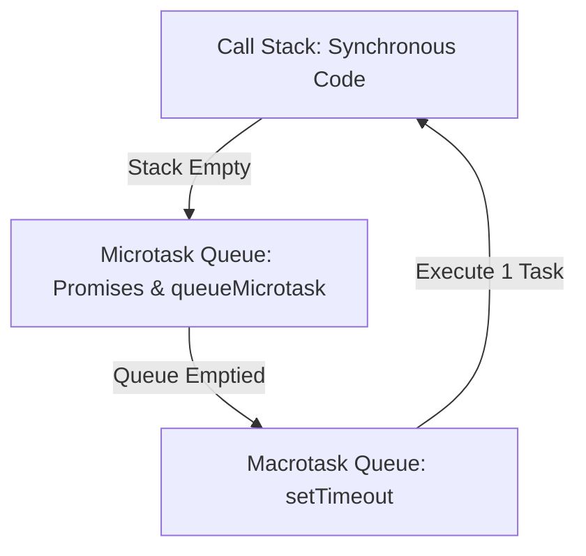

```yaml
schema_version: "2.0"
metadata:
  lesson_id: "JS-MOD06-LES01"
  course_slug: "course-03-javascript"
  course_title: "Course 3: JavaScript & ES6+"
  module_slug: "mod-06-async-promises-await"
  module_title: "Module 6 - Asynchronous JavaScript, Promises, & Async/Await"
  lesson_slug: "asynchronous-execution-callbacks-event-queue"
  lesson_title: "Lesson 6.1 Asynchronous Execution, Callbacks, & Event Queue"
  sort_order: 601

pedagogy:
  difficulty: "intermediate"
  estimated_time:
    reading_minutes: 20
    practice_minutes: 25
    quiz_minutes: 10
    total_minutes: 55
  bloom_taxonomy_level: "Analyze"
  xp_reward: 60

prerequisites:
  required_lesson_ids:
    - "JS-MOD05-LES04"
  required_skills:
    - "JavaScript Call Stack & Memory Heap Mechanics"

skills_acquired:
  - "Concurrency Architecture (Single-Threaded Event Loop)"
  - "Macrotask Queue vs Microtask Queue Priority Rules"
  - "Web APIs & Browser Thread Offloading"
  - "Callback Hell Mechanics & Inversion of Control"

dependencies:
  software:
    - "VS Code"
    - "Node.js REPL"
  hardware: []

seo_and_social:
  meta_title: "JavaScript Event Loop: Macrotasks vs Microtasks & Callback Hell"
  meta_description: "Master JavaScript Asynchronous Execution: single-threaded event loop, Web APIs, Macrotask queue (setTimeout) vs Microtask queue (Promises), and Callback Hell."
  keywords: ["JavaScript Event Loop", "Macrotask Queue", "Microtask Queue", "Callback Hell", "Async JavaScript", "Single Threaded"]

assessment_config:
  has_quiz: true
  has_lab: true
  has_flashcards: true
  pass_score_percentage: 80
```

# Lesson 6.1 Asynchronous Execution, Callbacks, & Event Queue

## 1. Overview & Learning Objectives [id: overview]

- **Estimated Time**: 55 Minutes (20m Reading | 25m Practice | 10m Quiz)
- **Difficulty Level**: ⭐⭐ Intermediate
- **Prerequisites**: [Lesson 5.4 Keyed Collections](file:///d:/My%20Drive/all%20files/PROJECT%20FILES/notes/docs/curriculum/_03_javascript/_03_18_keyed_collections_map_set_weakmap_weakset.md)
- **XP Reward**: +60 XP

### Learning Objectives
By the end of this lesson, you will be able to:
1. Explain how single-threaded JavaScript achieves concurrency via **Web APIs** and the **Event Loop**.
2. Differentiate between **Macrotasks** (`setTimeout`, `setInterval`) and **Microtasks** (`Promise`, `queueMicrotask`).
3. Trace the exact execution priority: Synchronous Stack $\to$ Microtask Queue $\to$ Macrotask Queue.
4. Identify the pitfalls of Callback Hell and Inversion of Control.

---

## 2. Environment & Prerequisites [id: prerequisites]

Open Node.js REPL to test event loop queue priority order.

---

## 3. Theoretical Foundations [id: theory]

### 3.1 The Event Loop & Task Queue Priority
JavaScript executes single-threaded synchronously on the Call Stack. When an asynchronous Web API call (`setTimeout`, `fetch`) is invoked, the browser offloads the work to background threads and pushes the completed callback into task queues:

1. **Call Stack**: Executes synchronous code line by line until empty.
2. **Microtask Queue** (HIGHEST PRIORITY): Processed **completely** before any rendering or macrotask! (`Promise.then()`, `queueMicrotask()`, `process.nextTick()`).
3. **Macrotask Queue** (LOWER PRIORITY): Processed one task per event loop turn (`setTimeout()`, `setInterval()`, `setImmediate()`).

```
┌─────────────────────────────────────────────────────────────────────────────┐
│                       EVENT LOOP QUEUE PRIORITY ORDER                       │
├─────────────────────────────────────────────────────────────────────────────┤
│ 1. Synchronous Call Stack Execution (Immediate)                             │
│ 2. ALL Microtasks (Promise callbacks, queueMicrotask) - Emptied completely! │
│ 3. ONE Macrotask (setTimeout, setInterval)                                  │
│ 4. Re-render UI (if browser environment)                                   │
└─────────────────────────────────────────────────────────────────────────────┘
```

---

## 4. Architecture & Diagram Visualizations [id: diagram]



---

## 5. Code & Hardware Implementation [id: syntax]

```javascript
// Event Loop Queue Priority Demonstration

console.log("1. Synchronous Start");

// Macrotask (Timer)
setTimeout(() => {
  console.log("4. Macrotask (setTimeout)");
}, 0);

// Microtask (Promise)
Promise.resolve().then(() => {
  console.log("3. Microtask (Promise.then)");
});

console.log("2. Synchronous End");

/* Expected Execution Output Order:
1. Synchronous Start
2. Synchronous End
3. Microtask (Promise.then)
4. Macrotask (setTimeout)
*/
```

---

## 6. Enterprise Real-World Applications [id: examples]

- **UI Render Smoothness (60fps)**: Starving the Event Loop by chaining infinite microtasks blocks the browser main thread, freezing DOM rendering and user interactions.

---

## 7. Guided Step-by-Step Hands-On Exercise [id: exercises]

1. Save code as `eventloop_demo.js`.
2. Run `node eventloop_demo.js` $\to$ Verify Microtask precedes Macrotask output!

---

## 8. Common Pitfalls & Troubleshooting [id: common_mistakes]

| Bug / Error | Root Cause | Engineering Solution |
| :--- | :--- | :--- |
| **Main Thread Freeze** | Executing heavy synchronous CPU loops or infinite microtask chains. | Offload CPU-heavy computation to Web Workers or `worker_threads`. |

---

## 9. Best Practices & Optimization [id: best_practices]

- **Understand Queue Priorities**: Microtasks execute before Macrotasks regardless of timeout values.

---

## 10. Industry Interview Q&A [id: interview_qa]

### Q1: What is the difference between the Macrotask Queue and Microtask Queue in the JavaScript Event Loop?
**Answer**: The Microtask Queue handles high-priority asynchronous callbacks (Promises, `queueMicrotask`). The event loop empties the *entire* Microtask Queue completely before moving on to process a single task from the Macrotask Queue (`setTimeout`, `setInterval`).

---

## 11. Self-Assessment Quiz [id: quiz]

```json
{
  "quiz_title": "Lesson 6.1 Event Loop Assessment",
  "questions": [
    {
      "question_id": "Q1",
      "type": "multiple_choice",
      "question_text": "Which task queue is emptied completely before the Event Loop executes a `setTimeout` callback?",
      "options": ["Macrotask Queue", "Microtask Queue", "Render Queue", "Worker Queue"],
      "correct_answer_index": 1,
      "explanation": "The Microtask Queue is emptied completely before any Macrotask is processed."
    }
  ]
}
```

---

## 12. Portfolio Assignment & Challenge [id: lab]

Predict and verify the execution output order of 8 mixed synchronous, Promise, and timer logs.

---

## 13. Spaced Repetition Flashcards [id: flashcards]

**Front**: Is `setTimeout(fn, 0)` guaranteed to execute in exactly 0 milliseconds?
**Back**: No. It waits until the Call Stack and all Microtasks are completely clear.
<!-- flashcard:end -->

---

## 14. Summary & Cheat Sheet [id: summary]

```javascript
queueMicrotask(() => console.log("Microtask"));
```
