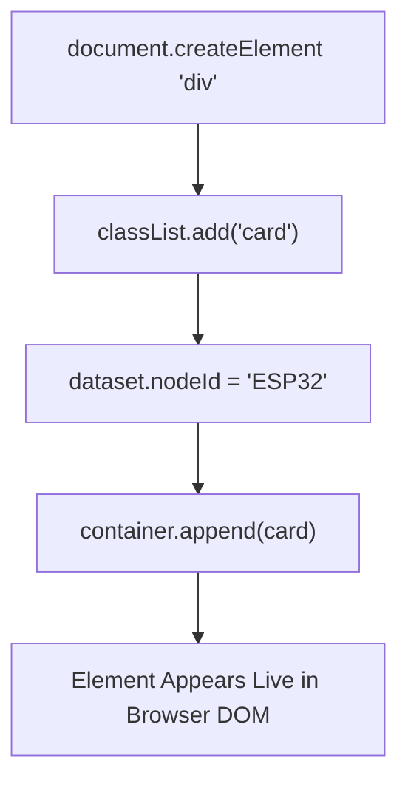

```yaml
schema_version: "2.0"
metadata:
  lesson_id: "JS-MOD08-LES02"
  course_slug: "course-03-javascript"
  course_title: "Course 3: JavaScript & ES6+"
  module_slug: "mod-08-dom-manipulation-events"
  module_title: "Module 8 - Document Object Model (DOM) Manipulation & Events"
  lesson_slug: "dynamic-element-creation-and-modification"
  lesson_title: "Lesson 8.2 Dynamic Element Creation, Modification, & Attributes"
  sort_order: 802

pedagogy:
  difficulty: "beginner"
  estimated_time:
    reading_minutes: 15
    practice_minutes: 20
    quiz_minutes: 10
    total_minutes: 45
  bloom_taxonomy_level: "Apply"
  xp_reward: 50

prerequisites:
  required_lesson_ids:
    - "JS-MOD08-LES01"
  required_skills:
    - "DOM Tree Navigation & Selection"

skills_acquired:
  - "Dynamic Element Creation (`document.createElement()`)"
  - "DOM Insertion Methods (`append()`, `prepend()`, `insertAdjacentHTML()`)"
  - "HTML5 Dataset API (`element.dataset.customAttr`)"
  - "CSS Class & Style Manipulation (`classList.toggle()`, `element.style`)"

dependencies:
  software:
    - "VS Code"
    - "Modern Web Browser"
  hardware: []

seo_and_social:
  meta_title: "JavaScript Dynamic DOM: createElement, appendChild, classList & dataset"
  meta_description: "Master Dynamic DOM Manipulation: createElement, append/prepend, insertAdjacentHTML, classList toggle/add/remove, and HTML5 data-* dataset attributes."
  keywords: ["Dynamic DOM", "createElement", "appendChild", "classList", "dataset API", "DOM Modification"]

assessment_config:
  has_quiz: true
  has_lab: true
  has_flashcards: true
  pass_score_percentage: 80
```

# Lesson 8.2 Dynamic Element Creation, Modification, & Attributes

## 1. Overview & Learning Objectives [id: overview]

- **Estimated Time**: 45 Minutes (15m Reading | 20m Practice | 10m Quiz)
- **Difficulty Level**: ⭐ Beginner
- **Prerequisites**: [Lesson 8.1 DOM Selection](file:///d:/My%20Drive/all%20files/PROJECT%20FILES/notes/docs/curriculum/_03_javascript/_03_27_dom_tree_navigation_and_selection.md)
- **XP Reward**: +50 XP

### Learning Objectives
By the end of this lesson, you will be able to:
1. Create new DOM elements programmatically using `document.createElement()`.
2. Insert elements into the document tree using `append()`, `prepend()`, and `insertAdjacentHTML()`.
3. Read and write custom data attributes using the HTML5 **`dataset`** API.
4. Modify CSS classes and inline styles using **`classList`** (`add`, `remove`, `toggle`) and `.style`.

---

## 2. Environment & Prerequisites [id: prerequisites]

Open Browser DevTools Console.

---

## 3. Theoretical Foundations [id: theory]

### 3.1 `appendChild()` vs `append()`
- **`appendChild()`**: Legacy method; takes ONLY a single `Node` object; returns the inserted node.
- **`append()`**: Modern ES6+ method; accepts multiple `Node` objects AND raw string primitives; returns `undefined`.

### 3.2 HTML5 `dataset` API
Custom HTML `data-*` attributes (e.g. `<div data-sensor-id="101" data-is-active="true">`) map directly to the JavaScript element's `.dataset` property in camelCase:

```javascript
element.dataset.sensorId;  // Accesses data-sensor-id
element.dataset.isActive;  // Accesses data-is-active
```

---

## 4. Architecture & Diagram Visualizations [id: diagram]



---

## 5. Code & Hardware Implementation [id: syntax]

```javascript
// Dynamic DOM Element Creation & Modification (Browser Environment)

function createSensorCard(id, temperature) {
  // 1. Create Element
  const card = document.createElement("div");

  // 2. Class Manipulation
  card.classList.add("sensor-card", "active");

  // 3. Custom HTML5 Dataset Attributes
  card.dataset.sensorId = id;
  card.dataset.metricType = "temperature";

  // 4. Content & Style Modification
  card.innerHTML = `
    <h3>Node: ${id}</h3>
    <p class="temp-display">Temp: <span>${temperature}</span>°C</p>
  `;

  if (temperature > 30.0) {
    card.style.borderColor = "#ef4444"; // Warning Red
  }

  return card;
}

// 5. Insert into Container
const container = document.querySelector("#sensor-container");
if (container) {
  const newCard = createSensorCard("ESP32-NODE-05", 34.2);
  container.append(newCard); // Appends to DOM
}
```

---

## 6. Enterprise Real-World Applications [id: examples]

- **Live Dashboard Telemetry Cards**: WebSockets receive real-time sensor JSON and dynamically instantiate/update UI metric cards using `document.createElement()` and `classList.toggle()`.

---

## 7. Guided Step-by-Step Hands-On Exercise [id: exercises]

1. Open DevTools Console on any webpage.
2. Run `const d = document.createElement('div'); d.textContent = 'Hello DOM'; document.body.prepend(d);` $\to$ Observe new banner element!

---

## 8. Common Pitfalls & Troubleshooting [id: common_mistakes]

| Bug / Error | Root Cause | Engineering Solution |
| :--- | :--- | :--- |
| **XSS Security Vulnerability** | Injecting un-sanitized user input string variables directly into `element.innerHTML`. | Use `element.textContent` or sanitize strings before setting `innerHTML`. |

---

## 9. Best Practices & Optimization [id: best_practices]

- **Use `classList.toggle()`**: Eliminates manual `if (el.classList.contains(...))` conditional checks.

---

## 10. Industry Interview Q&A [id: interview_qa]

### Q1: What is the HTML5 `dataset` API in JavaScript?
**Answer**: The `dataset` API provides a convenient read/write interface for custom HTML `data-*` attributes on an element. Attribute names containing hyphens (`data-sensor-node-id`) are automatically converted into camelCase property names on the `element.dataset` object (`element.dataset.sensorNodeId`).

---

## 11. Self-Assessment Quiz [id: quiz]

```json
{
  "quiz_title": "Lesson 8.2 Dynamic DOM Assessment",
  "questions": [
    {
      "question_id": "Q1",
      "type": "multiple_choice",
      "question_text": "Which `classList` method adds a CSS class if missing or removes it if present?",
      "options": ["add()", "remove()", "toggle()", "contains()"],
      "correct_answer_index": 2,
      "explanation": "classList.toggle() toggles class presence."
    }
  ]
}
```

---

## 12. Portfolio Assignment & Challenge [id: lab]

Build a dynamic todo list app inserting items via `document.createElement()`.

---

## 13. Spaced Repetition Flashcards [id: flashcards]

**Front**: What property safely sets plain text content without XSS security risks?
**Back**: `element.textContent`.
<!-- flashcard:end -->

---

## 14. Summary & Cheat Sheet [id: summary]

```javascript
const el = document.createElement("div");
el.classList.add("active");
el.dataset.id = "101";
```
