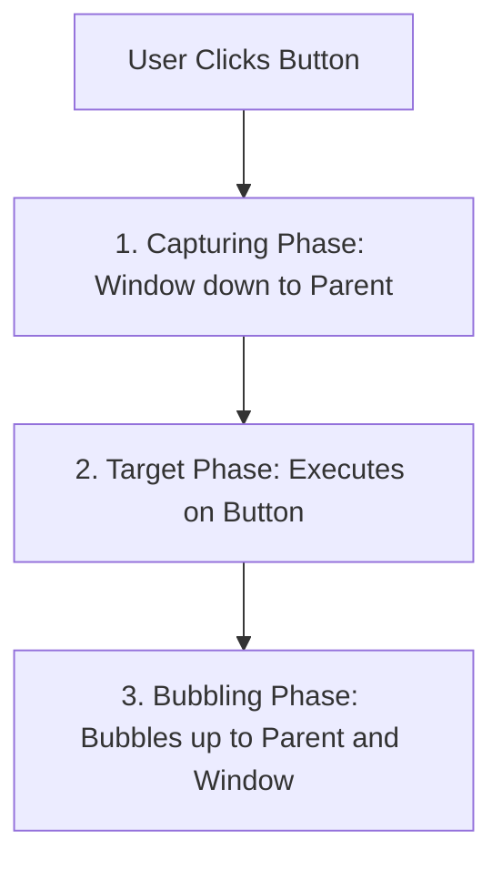

```yaml
schema_version: "2.0"
metadata:
  lesson_id: "JS-MOD08-LES03"
  course_slug: "course-03-javascript"
  course_title: "Course 3: JavaScript & ES6+"
  module_slug: "mod-08-dom-manipulation-events"
  module_title: "Module 8 - Document Object Model (DOM) Manipulation & Events"
  lesson_slug: "event-handling-propagation-bubbling-capturing"
  lesson_title: "Lesson 8.3 Event Handling, Propagation, Bubbling, & Capturing"
  sort_order: 803

pedagogy:
  difficulty: "intermediate"
  estimated_time:
    reading_minutes: 20
    practice_minutes: 25
    quiz_minutes: 10
    total_minutes: 55
  bloom_taxonomy_level: "Apply"
  xp_reward: 60

prerequisites:
  required_lesson_ids:
    - "JS-MOD08-LES02"
  required_skills:
    - "Dynamic DOM Element Modification"

skills_acquired:
  - "Event Listener Registration (`addEventListener`, `removeEventListener`)"
  - "Event Object Properties (`event.target`, `event.currentTarget`)"
  - "3 Event Propagation Phases (Capturing, Target, Bubbling)"
  - "Controlling Default Actions & Propagation (`preventDefault()`, `stopPropagation()`)"

dependencies:
  software:
    - "VS Code"
    - "Modern Web Browser"
  hardware: []

seo_and_social:
  meta_title: "JavaScript Event Propagation: Bubbling, Capturing & stopPropagation"
  meta_description: "Master JavaScript Events: addEventListener, 3 propagation phases (Capturing, Target, Bubbling), event.target vs event.currentTarget, and preventDefault."
  keywords: ["JavaScript Events", "Event Bubbling", "Event Capturing", "event.stopPropagation", "preventDefault", "addEventListener"]

assessment_config:
  has_quiz: true
  has_lab: true
  has_flashcards: true
  pass_score_percentage: 80
```

# Lesson 8.3 Event Handling, Propagation, Bubbling, & Capturing

## 1. Overview & Learning Objectives [id: overview]

- **Estimated Time**: 55 Minutes (20m Reading | 25m Practice | 10m Quiz)
- **Difficulty Level**: ⭐⭐ Intermediate
- **Prerequisites**: [Lesson 8.2 Dynamic DOM](file:///d:/My%20Drive/all%20files/PROJECT%20FILES/notes/docs/curriculum/_03_javascript/_03_28_dynamic_element_creation_and_modification.md)
- **XP Reward**: +60 XP

### Learning Objectives
By the end of this lesson, you will be able to:
1. Register and clean up event listeners using `addEventListener()` and `removeEventListener()`.
2. Differentiate between `event.target` (actual clicked element) and `event.currentTarget` (element handling the listener).
3. Trace the 3 phases of **Event Propagation**: **Capturing Phase**, **Target Phase**, and **Bubbling Phase**.
4. Halt default browser behaviors (`event.preventDefault()`) and event bubbling (`event.stopPropagation()`).

---

## 2. Environment & Prerequisites [id: prerequisites]

Open Browser DevTools Console.

---

## 3. Theoretical Foundations [id: theory]

### 3.1 The 3 Event Propagation Phases
When a user interacts with a DOM element (e.g. clicks a `<button>` inside a `<div>`), the event travels through 3 distinct phases:

1. **Capturing Phase (Trickling)**: Event travels DOWN from `window` $\to$ `document` $\to$ parent containers $\to$ target element.
2. **Target Phase**: Event arrives at the actual `event.target` element.
3. **Bubbling Phase**: Event bubbles UP from target element $\to$ parent containers $\to$ `document` $\to$ `window`.

```
┌─────────────────────────────────────────────────────────────────────────────┐
│                          3 EVENT PROPAGATION PHASES                         │
├─────────────────────────────────────────────────────────────────────────────┤
│ Window ──► Document ──► Parent (Phase 1: CAPTURING - Travels Downward)      │
│                          │                                                  │
│                        Target (Phase 2: TARGET)                             │
│                          │                                                  │
│ Window ◄── Document ◄── Parent (Phase 3: BUBBLING  - Travels Upward)        │
└─────────────────────────────────────────────────────────────────────────────┘
```

> [!NOTE]
> By default, `addEventListener(type, handler)` listens during the **Bubbling Phase**. To listen during the Capturing Phase, pass `{ capture: true }` as the 3rd argument.

---

## 4. Architecture & Diagram Visualizations [id: diagram]



---

## 5. Code & Hardware Implementation [id: syntax]

```javascript
// Event Propagation & Target vs CurrentTarget Demonstration

const outerDiv = document.querySelector("#outer-container");
const actionBtn = document.querySelector("#btn-action");

// 1. Event Handler on Outer Container
outerDiv.addEventListener("click", function(event) {
  console.log("Bubbled to Outer Div!");
  console.log("event.target (Clicked Element):", event.target.tagName);
  console.log("event.currentTarget (Handler Owner):", event.currentTarget.id);
});

// 2. Event Handler on Button
actionBtn.addEventListener("click", function(event) {
  // Prevent default form submit action
  event.preventDefault();
  
  console.log("Button Clicked!");

  // Uncomment to stop event from bubbling up to outerDiv:
  // event.stopPropagation();
});
```

---

## 6. Enterprise Real-World Applications [id: examples]

- **Modal & Dropdown Dismissal**: Clicking outside an active modal dialog detects event bubbling at the `window` level (`event.target.closest('.modal') === null`) to close open menus.

---

## 7. Guided Step-by-Step Hands-On Exercise [id: exercises]

1. Save HTML with nested `<div>` and `<button>`.
2. Click button in browser $\to$ Inspect target vs currentTarget console logs!

---

## 8. Common Pitfalls & Troubleshooting [id: common_mistakes]

| Bug / Error | Root Cause | Engineering Solution |
| :--- | :--- | :--- |
| **Confusing `target` with `currentTarget`** | Using `event.target` assuming it is always the element where the listener was attached. | Use `event.currentTarget` (or `this`) to reference the element hosting the `addEventListener`. |

---

## 9. Best Practices & Optimization [id: best_practices]

- **Remove Event Listeners**: Always clean up listeners on single-page application unmount using `removeEventListener()`.

---

## 10. Industry Interview Q&A [id: interview_qa]

### Q1: What is the difference between `event.target` and `event.currentTarget`?
**Answer**: `event.target` references the deep, exact DOM element that originally triggered the event (e.g. the specific `<i>` icon clicked inside a button). `event.currentTarget` references the element to which the `addEventListener` handler is currently attached.

---

## 11. Self-Assessment Quiz [id: quiz]

```json
{
  "quiz_title": "Lesson 8.3 Event Propagation Assessment",
  "questions": [
    {
      "question_id": "Q1",
      "type": "multiple_choice",
      "question_text": "Which method stops an event from traveling further up the DOM bubbling chain?",
      "options": ["event.preventDefault()", "event.stopPropagation()", "event.exit()", "event.halt()"],
      "correct_answer_index": 1,
      "explanation": "event.stopPropagation() halts event bubbling."
    }
  ]
}
```

---

## 12. Portfolio Assignment & Challenge [id: lab]

Build a modal popup window with click-outside-to-close event propagation mechanics.

---

## 13. Spaced Repetition Flashcards [id: flashcards]

**Front**: Does `event.preventDefault()` stop event bubbling up the DOM tree?
**Back**: No. `preventDefault()` halts default browser actions (like form submission); `stopPropagation()` halts bubbling.
<!-- flashcard:end -->

---

## 14. Summary & Cheat Sheet [id: summary]

```javascript
btn.addEventListener("click", e => {
  e.preventDefault();
  e.stopPropagation();
});
```
