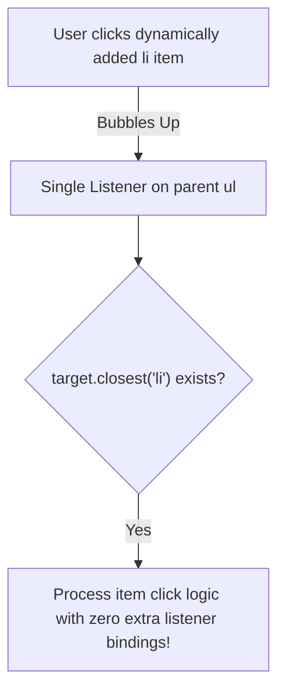

```yaml
schema_version: "2.0"
metadata:
  lesson_id: "JS-MOD08-LES04"
  course_slug: "course-03-javascript"
  course_title: "Course 3: JavaScript & ES6+"
  module_slug: "mod-08-dom-manipulation-events"
  module_title: "Module 8 - Document Object Model (DOM) Manipulation & Events"
  lesson_slug: "event-delegation-and-custom-events"
  lesson_title: "Lesson 8.4 Event Delegation & Custom Event Dispatching"
  sort_order: 804

pedagogy:
  difficulty: "intermediate"
  estimated_time:
    reading_minutes: 20
    practice_minutes: 25
    quiz_minutes: 10
    total_minutes: 55
  bloom_taxonomy_level: "Apply"
  xp_reward: 60

prerequisites:
  required_lesson_ids:
    - "JS-MOD08-LES03"
  required_skills:
    - "Event Propagation, Bubbling, & Target Verification"

skills_acquired:
  - "Event Delegation Pattern Implementation"
  - "Handling Dynamic Child Elements via Parent Listener"
  - "Custom Event Construction (`new CustomEvent(name, { detail })`)"
  - "Custom Event Dispatching (`element.dispatchEvent()`)"

dependencies:
  software:
    - "VS Code"
    - "Modern Web Browser"
  hardware: []

seo_and_social:
  meta_title: "JavaScript Event Delegation & CustomEvent Dispatching"
  meta_description: "Master Event Delegation and Custom Events in JavaScript: attach single parent listener for dynamic children and dispatch custom events with detail payloads."
  keywords: ["Event Delegation", "CustomEvent", "dispatchEvent", "DOM Performance", "Dynamic Event Handling", "JavaScript Events"]

assessment_config:
  has_quiz: true
  has_lab: true
  has_flashcards: true
  pass_score_percentage: 80
```

# Lesson 8.4 Event Delegation & Custom Event Dispatching

## 1. Overview & Learning Objectives [id: overview]

- **Estimated Time**: 55 Minutes (20m Reading | 25m Practice | 10m Quiz)
- **Difficulty Level**: ⭐⭐ Intermediate
- **Prerequisites**: [Lesson 8.3 Event Propagation](file:///d:/My%20Drive/all%20files/PROJECT%20FILES/notes/docs/curriculum/_03_javascript/_03_29_event_handling_propagation_bubbling_capturing.md)
- **XP Reward**: +60 XP

### Learning Objectives
By the end of this lesson, you will be able to:
1. Implement the high-performance **Event Delegation Pattern** by attaching a single event listener to a parent container.
2. Handle dynamically added child elements automatically without re-binding event listeners.
3. Construct custom application events using **`new CustomEvent()`** with data payloads (`detail`).
4. Dispatch custom events across components using **`element.dispatchEvent()`**.

---

## 2. Environment & Prerequisites [id: prerequisites]

Open Browser DevTools Console.

---

## 3. Theoretical Foundations [id: theory]

### 3.1 Event Delegation Architecture
Attaching individual event listeners to 1,000 table rows or list items consumes significant V8 heap memory and requires manual re-binding whenever new items are appended dynamically.

**Event Delegation** attaches a SINGLE listener to a parent container (`<ul>` or `<table>`) and uses event bubbling to catch events from all present and future child elements:

```javascript
// Single Parent Listener Handles All Current & Future <li> Clicks!
document.querySelector("#user-list").addEventListener("click", (e) => {
  const item = e.target.closest("li");
  if (item) {
    processUserItem(item.dataset.userId);
  }
});
```

### 3.2 Custom Events
Custom events allow decoupled component communication by broadcasting domain-specific events:

```javascript
const telemetryEvent = new CustomEvent("telemetry:update", {
  detail: { sensorId: "ESP32-A1", temp: 24.5 },
  bubbles: true
});

element.dispatchEvent(telemetryEvent);
```

---

## 4. Architecture & Diagram Visualizations [id: diagram]



---

## 5. Code & Hardware Implementation [id: syntax]

```javascript
// Event Delegation & Custom Event Demonstration

// 1. Event Delegation Pattern
const tableBody = document.querySelector("#telemetry-table-body");

if (tableBody) {
  tableBody.addEventListener("click", (event) => {
    // Check if click originated from or inside a delete button
    const deleteBtn = event.target.closest(".btn-delete");
    if (deleteBtn) {
      const row = deleteBtn.closest("tr");
      const nodeId = row.dataset.nodeId;
      
      // Dispatch Custom Event notifying application of node removal!
      const removeEvent = new CustomEvent("node:removed", {
        detail: { nodeId },
        bubbles: true
      });
      row.dispatchEvent(removeEvent);

      row.remove();
    }
  });
}

// 2. Listening for Custom Event on Document
document.addEventListener("node:removed", (event) => {
  console.log(`[Custom Event Received]: Node ${event.detail.nodeId} was deleted!`);
});
```

---

## 6. Enterprise Real-World Applications [id: examples]

- **Micro-Frontend Component Communication**: Independent UI widgets broadcast custom events (`new CustomEvent('cart:updated', { detail: { items } })`) to synchronize navigation headers without direct module coupling.

---

## 7. Guided Step-by-Step Hands-On Exercise [id: exercises]

1. Save HTML with a list and button.
2. Add event delegation listener on `<ul>` $\to$ Dynamically append new `<li>` elements and verify clicks work automatically!

---

## 8. Common Pitfalls & Troubleshooting [id: common_mistakes]

| Bug / Error | Root Cause | Engineering Solution |
| :--- | :--- | :--- |
| **Delegation Misses Clicks on Nested Icons** | Checking `event.target.tagName === 'BUTTON'` directly when the user clicks an inner `<i>` icon. | Use `event.target.closest('.btn-class')` instead of strict `===` tag matching. |

---

## 9. Best Practices & Optimization [id: best_practices]

- **Use `.closest()` in Delegation**: Reliably handles clicks on nested child icons or spans inside buttons.

---

## 10. Industry Interview Q&A [id: interview_qa]

### Q1: What are the primary benefits of using the Event Delegation Pattern?
**Answer**: Event Delegation reduces memory consumption by replacing hundreds of individual element listeners with a single parent listener. It also automatically handles dynamically added child elements without requiring manual event binding cycles.

---

## 11. Self-Assessment Quiz [id: quiz]

```json
{
  "quiz_title": "Lesson 8.4 Event Delegation Assessment",
  "questions": [
    {
      "question_id": "Q1",
      "type": "multiple_choice",
      "question_text": "Under what property payload are custom parameters passed when constructing a `CustomEvent`?",
      "options": ["payload", "detail", "data", "params"],
      "correct_answer_index": 1,
      "explanation": "CustomEvent parameters are passed under the detail object option."
    }
  ]
}
```

---

## 12. Portfolio Assignment & Challenge [id: lab]

Build a dynamic data table with event delegation for inline cell editing and custom save events.

---

## 13. Spaced Repetition Flashcards [id: flashcards]

**Front**: How do you dispatch a custom event in the DOM?
**Back**: `element.dispatchEvent(customEventInstance)`.
<!-- flashcard:end -->

---

## 14. Summary & Cheat Sheet [id: summary]

```javascript
parent.addEventListener("click", e => {
  const btn = e.target.closest(".btn");
  if (btn) process(btn);
});
```
