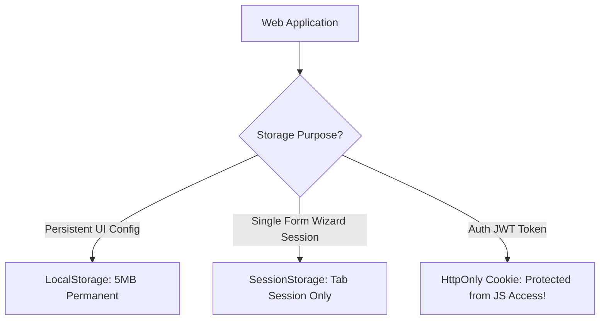

```yaml
schema_version: "2.0"
metadata:
  lesson_id: "JS-MOD09-LES02"
  course_slug: "course-03-javascript"
  course_title: "Course 3: JavaScript & ES6+"
  module_slug: "mod-09-web-apis-storage-network"
  module_title: "Module 9 - Web APIs, Client-Side Storage, & Network Requests"
  lesson_slug: "web-storage-cookies-localstorage-sessionstorage"
  lesson_title: "Lesson 9.2 Web Storage: Cookies, LocalStorage, & SessionStorage"
  sort_order: 902

pedagogy:
  difficulty: "beginner"
  estimated_time:
    reading_minutes: 15
    practice_minutes: 20
    quiz_minutes: 10
    total_minutes: 45
  bloom_taxonomy_level: "Apply"
  xp_reward: 50

prerequisites:
  required_lesson_ids:
    - "JS-MOD09-LES01"
  required_skills:
    - "Fetch API & Browser Environment"

skills_acquired:
  - "LocalStorage API Operations (`setItem`, `getItem`, `removeItem`)"
  - "SessionStorage Tab Lifecycle Scoping"
  - "Cross-Tab Synchronization via `storage` Event Listener"
  - "Security Trade-Offs (XSS vs CSRF, HttpOnly Cookies)"

dependencies:
  software:
    - "VS Code"
    - "Modern Web Browser"
  hardware: []

seo_and_social:
  meta_title: "Web Storage: LocalStorage vs SessionStorage vs Cookies & Security"
  meta_description: "Master Client-Side Web Storage: LocalStorage, SessionStorage, HTTP Cookies, quota limits, cross-tab synchronization with storage events, and XSS security."
  keywords: ["LocalStorage", "SessionStorage", "HTTP Cookies", "Web Storage API", "Cross Tab Synchronization", "Client Storage Security"]

assessment_config:
  has_quiz: true
  has_lab: true
  has_flashcards: true
  pass_score_percentage: 80
```

# Lesson 9.2 Web Storage: Cookies, LocalStorage, & SessionStorage

## 1. Overview & Learning Objectives [id: overview]

- **Estimated Time**: 45 Minutes (15m Reading | 20m Practice | 10m Quiz)
- **Difficulty Level**: ⭐ Beginner
- **Prerequisites**: [Lesson 9.1 Fetch API](file:///d:/My%20Drive/all%20files/PROJECT%20FILES/notes/docs/curriculum/_03_javascript/_03_31_fetch_api_and_http_network_requests.md)
- **XP Reward**: +50 XP

### Learning Objectives
By the end of this lesson, you will be able to:
1. Compare client-side storage mechanisms: **Cookies**, **LocalStorage**, and **SessionStorage**.
2. Perform synchronous key-value operations using `localStorage` and `sessionStorage`.
3. Synchronize state across multiple browser tabs using the **`storage`** event listener.
4. Evaluate security risks (XSS vs CSRF) when storing authentication tokens.

---

## 2. Environment & Prerequisites [id: prerequisites]

Open Browser DevTools Application Tab (`F12`).

---

## 3. Theoretical Foundations [id: theory]

### 3.1 Client Storage Comparison

```
┌─────────────────────────────────────────────────────────────────────────────┐
│                     CLIENT-SIDE STORAGE COMPARISON MATRIX                   │
├─────────────────┬──────────────────┬──────────────────┬─────────────────────┤
│ Storage Type    │ Capacity         │ Lifetime         │ Sent with HTTP?     │
├─────────────────┼──────────────────┼──────────────────┼─────────────────────┤
│ Cookies         │ ~4 KB            │ Expiration Date  │ YES (Every request!)│
│ LocalStorage    │ ~5–10 MB         │ Persistent       │ NO                  │
│ SessionStorage  │ ~5–10 MB         │ Tab Lifetime     │ NO                  │
└─────────────────┴──────────────────┴──────────────────┴─────────────────────┘
```

> [!CAUTION]
> **XSS Vulnerability**: Never store sensitive JWT access tokens in `localStorage`! Any Cross-Site Scripting (XSS) vulnerability allows malicious scripts to read `localStorage.getItem('jwt')`. Secure authentication tokens should be stored in `HttpOnly; SameSite=Strict` HTTP Cookies.

---

## 4. Architecture & Diagram Visualizations [id: diagram]



---

## 5. Code & Hardware Implementation [id: syntax]

```javascript
// Web Storage API & Cross-Tab Sync Demonstration (Browser Environment)

// 1. Storing Complex Objects (Must serialize to JSON!)
const userSettings = { theme: "DARK", fontSize: 16 };
localStorage.setItem("app_config", JSON.stringify(userSettings));

// 2. Retrieving and Parsing Data
const storedConfig = localStorage.getItem("app_config");
if (storedConfig) {
  const config = JSON.parse(storedConfig);
  console.log("Active Theme:", config.theme);
}

// 3. Cross-Tab Synchronization Listener
// Fires in Tab B when Tab A mutates localStorage!
window.addEventListener("storage", (event) => {
  if (event.key === "app_config") {
    console.log("Config updated in another tab!");
    console.log("Old Value:", event.oldValue);
    console.log("New Value:", event.newValue);
  }
});
```

---

## 6. Enterprise Real-World Applications [id: examples]

- **User UI Preference Persistence**: Web applications save theme modes (Dark/Light) in `localStorage` to instantly apply preferences on page reload before rendering the DOM.

---

## 7. Guided Step-by-Step Hands-On Exercise [id: exercises]

1. Open Browser DevTools Application Tab $\to$ Select LocalStorage.
2. Execute `localStorage.setItem('test', '123')` in Console $\to$ Observe instant live update in Application panel!

---

## 8. Common Pitfalls & Troubleshooting [id: common_mistakes]

| Bug / Error | Root Cause | Engineering Solution |
| :--- | :--- | :--- |
| **`[object Object]` Stored in Storage** | Passing an Object directly into `localStorage.setItem('k', obj)` without calling `JSON.stringify()`. | Always serialize objects using `JSON.stringify(obj)` before storing. |

---

## 9. Best Practices & Optimization [id: best_practices]

- **Serialize to JSON**: Storage keys and values are strictly strings.

---

## 10. Industry Interview Q&A [id: interview_qa]

### Q1: What is the main security risk of storing authentication tokens in LocalStorage compared to HttpOnly Cookies?
**Answer**: LocalStorage is accessible to any JavaScript code executing on the domain. If an attacker injects a malicious script via a Cross-Site Scripting (XSS) vulnerability, they can extract all LocalStorage tokens. `HttpOnly` Cookies cannot be read or accessed by client-side JavaScript, protecting tokens from XSS theft.

---

## 11. Self-Assessment Quiz [id: quiz]

```json
{
  "quiz_title": "Lesson 9.2 Web Storage Assessment",
  "questions": [
    {
      "question_id": "Q1",
      "type": "multiple_choice",
      "question_text": "Which storage mechanism is automatically cleared when the browser tab is closed?",
      "options": ["LocalStorage", "SessionStorage", "Cookies", "IndexedDB"],
      "correct_answer_index": 1,
      "explanation": "SessionStorage is scoped to the lifetime of a single browser tab."
    }
  ]
}
```

---

## 12. Portfolio Assignment & Challenge [id: lab]

Build a theme switcher persisting user choices in `localStorage` across reloads.

---

## 13. Spaced Repetition Flashcards [id: flashcards]

**Front**: Does the `storage` event fire in the same tab that made the storage modification?
**Back**: No. The `storage` event fires ONLY in other open tabs on the same origin.
<!-- flashcard:end -->

---

## 14. Summary & Cheat Sheet [id: summary]

```javascript
localStorage.setItem("key", JSON.stringify(data));
const data = JSON.parse(localStorage.getItem("key"));
```
