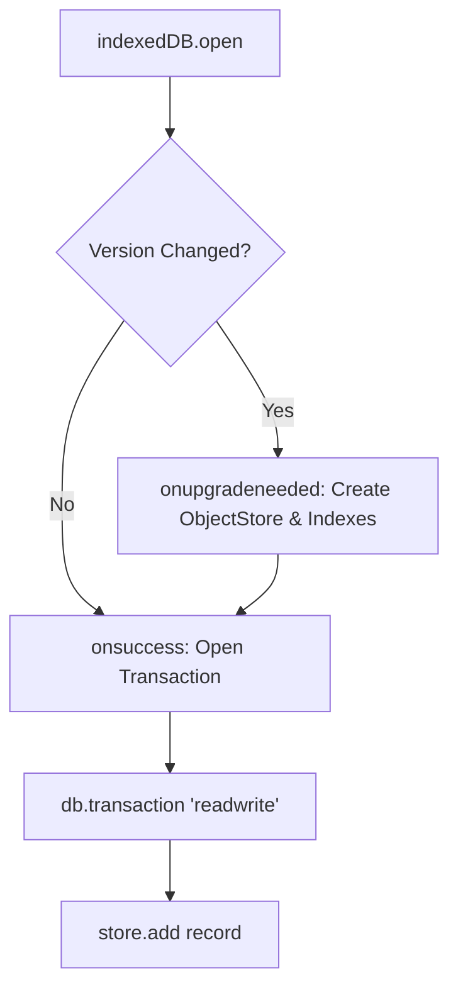

```yaml
schema_version: "2.0"
metadata:
  lesson_id: "JS-MOD09-LES03"
  course_slug: "course-03-javascript"
  course_title: "Course 3: JavaScript & ES6+"
  module_slug: "mod-09-web-apis-storage-network"
  module_title: "Module 9 - Web APIs, Client-Side Storage, & Network Requests"
  lesson_slug: "client-side-storage-with-indexeddb"
  lesson_title: "Lesson 9.3 Client-Side Storage with IndexedDB"
  sort_order: 903

pedagogy:
  difficulty: "advanced"
  estimated_time:
    reading_minutes: 20
    practice_minutes: 25
    quiz_minutes: 10
    total_minutes: 55
  bloom_taxonomy_level: "Apply"
  xp_reward: 70

prerequisites:
  required_lesson_ids:
    - "JS-MOD09-LES02"
  required_skills:
    - "Web Storage API & Asynchronous JavaScript"

skills_acquired:
  - "IndexedDB Architecture (Object Stores, Primary Keys, Indexes)"
  - "Database Schema Upgrades (`onupgradeneeded`)"
  - "Transactional Database Operations (`readwrite`, `readonly`)"
  - "Offline Large Dataset & Binary Blob Storage"

dependencies:
  software:
    - "VS Code"
    - "Modern Web Browser"
  hardware: []

seo_and_social:
  meta_title: "JavaScript IndexedDB: Offline Storage, Object Stores & Transactions"
  meta_description: "Master IndexedDB in JavaScript: client-side transactional database storage, Object Stores, primary key paths, index creation, and offline web apps."
  keywords: ["IndexedDB", "Client Side Database", "Object Stores", "IndexedDB Transactions", "Offline Web App", "Browser Database"]

assessment_config:
  has_quiz: true
  has_lab: true
  has_flashcards: true
  pass_score_percentage: 80
```

# Lesson 9.3 Client-Side Storage with IndexedDB

## 1. Overview & Learning Objectives [id: overview]

- **Estimated Time**: 55 Minutes (20m Reading | 25m Practice | 10m Quiz)
- **Difficulty Level**: ⭐⭐⭐ Advanced
- **Prerequisites**: [Lesson 9.2 Web Storage](file:///d:/My%20Drive/all%20files/PROJECT%20FILES/notes/docs/curriculum/_03_javascript/_03_32_web_storage_cookies_localstorage_sessionstorage.md)
- **XP Reward**: +70 XP

### Learning Objectives
By the end of this lesson, you will be able to:
1. Explain the **IndexedDB** low-level transactional database architecture.
2. Initialize database connections and handle version schema upgrades (`onupgradeneeded`).
3. Construct **Object Stores** and define primary key paths and index fields.
4. Execute `readonly` and `readwrite` database transactions to store large offline datasets.

---

## 2. Environment & Prerequisites [id: prerequisites]

Open Browser DevTools Application Tab $\to$ Select IndexedDB.

---

## 3. Theoretical Foundations [id: theory]

### 3.1 Why IndexedDB Over LocalStorage?
While `localStorage` is simple and synchronous, it is limited to 5MB of string data and blocks the browser main thread during read/write operations.

**IndexedDB** is a low-level, high-capacity, asynchronous client-side NoSQL database:
- **Capacity**: Hundreds of Megabytes / Gigabytes (up to 80% of available disk space!).
- **Data Types**: Stores JavaScript Objects, Files, and `Blob` binary arrays directly.
- **ACID Transactions**: All reads and writes take place within database transactions.

```
┌─────────────────────────────────────────────────────────────────────────────┐
│                          INDEXEDDB ARCHITECTURE                              │
├─────────────────────────────────────────────────────────────────────────────┤
│ Database ──► Object Store (Table) ──► Index (Column Search) ──► Records     │
└─────────────────────────────────────────────────────────────────────────────┘
```

---

## 4. Architecture & Diagram Visualizations [id: diagram]



---

## 5. Code & Hardware Implementation [id: syntax]

```javascript
// IndexedDB Initialization & CRUD Operations Demonstration

const DB_NAME = "TelemetryDB";
const DB_VERSION = 1;

function openTelemetryDatabase() {
  return new Promise((resolve, reject) => {
    const request = indexedDB.open(DB_NAME, DB_VERSION);

    // 1. Schema Upgrade Event (Fires on DB creation or version increment)
    request.onupgradeneeded = (event) => {
      const db = event.target.result;
      if (!db.objectStoreNames.contains("readings")) {
        // Create Object Store with auto-incrementing key
        const store = db.createObjectStore("readings", { keyPath: "id", autoIncrement: true });
        // Create Index for fast queries by sensorId
        store.createIndex("sensorId", "sensorId", { unique: false });
      }
    };

    request.onsuccess = () => resolve(request.result);
    request.onerror = () => reject(request.error);
  });
}

// 2. Transactional Record Insertion
async function saveTelemetryRecord(record) {
  const db = await openTelemetryDatabase();
  const tx = db.transaction("readings", "readwrite");
  const store = tx.objectStore("readings");

  return new Promise((resolve, reject) => {
    const addRequest = store.add(record);
    addRequest.onsuccess = () => resolve(addRequest.result);
    addRequest.onerror = () => reject(addRequest.error);
  });
}

// Example Execution
saveTelemetryRecord({ sensorId: "ESP32-99", temp: 28.4, timestamp: Date.now() })
  .then(id => console.log("Saved IndexedDB Record ID:", id));
```

---

## 6. Enterprise Real-World Applications [id: examples]

- **Offline-First Progressive Web Apps (PWAs)**: Service Workers store offline user edits in IndexedDB and synchronize with backend servers when network connectivity is restored.

---

## 7. Guided Step-by-Step Hands-On Exercise [id: exercises]

1. Save code as `idb_demo.js`.
2. Run code in Browser DevTools Console $\to$ Inspect saved records under Application $\to$ IndexedDB panel!

---

## 8. Common Pitfalls & Troubleshooting [id: common_mistakes]

| Bug / Error | Root Cause | Engineering Solution |
| :--- | :--- | :--- |
| **`ConstraintError: Key already exists`** | Attempting to insert a duplicate primary key into an Object Store. | Use `store.put(record)` to update existing keys or enable auto-increment. |

---

## 9. Best Practices & Optimization [id: best_practices]

- **Use Wrapper Libraries in Production**: Wrap callback-based IndexedDB code in Promise libraries like `idb` or `Dexie.js`.

---

## 10. Industry Interview Q&A [id: interview_qa]

### Q1: How does IndexedDB differ from LocalStorage?
**Answer**: IndexedDB is an asynchronous, high-capacity, transactional NoSQL database capable of storing complex JavaScript objects and binary Blobs. LocalStorage is a synchronous, 5MB key-value store limited to strings that blocks the main thread.

---

## 11. Self-Assessment Quiz [id: quiz]

```json
{
  "quiz_title": "Lesson 9.3 IndexedDB Assessment",
  "questions": [
    {
      "question_id": "Q1",
      "type": "multiple_choice",
      "question_text": "Which event callback is responsible for creating IndexedDB Object Stores and Indexes?",
      "options": ["onsuccess", "onupgradeneeded", "onerror", "oncomplete"],
      "correct_answer_index": 1,
      "explanation": "onupgradeneeded fires when database schemas are created or upgraded."
    }
  ]
}
```

---

## 12. Portfolio Assignment & Challenge [id: lab]

Build an offline-first notes application storing draft articles inside IndexedDB.

---

## 13. Spaced Repetition Flashcards [id: flashcards]

**Front**: What method updates an existing record or inserts a new record in IndexedDB?
**Back**: `store.put(record)`.
<!-- flashcard:end -->

---

## 14. Summary & Cheat Sheet [id: summary]

```javascript
const tx = db.transaction("store", "readwrite");
tx.objectStore("store").add(data);
```
