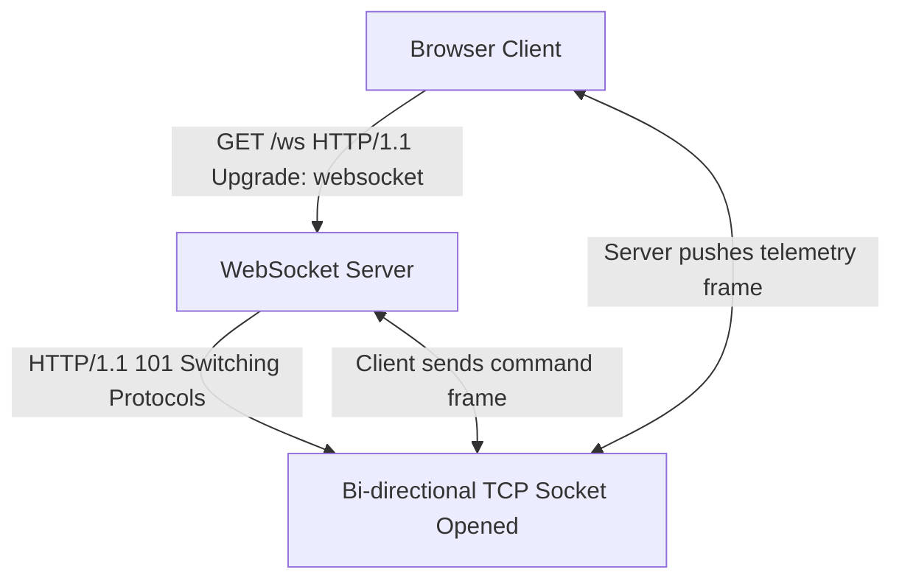

```yaml
schema_version: "2.0"
metadata:
  lesson_id: "JS-MOD09-LES04"
  course_slug: "course-03-javascript"
  course_title: "Course 3: JavaScript & ES6+"
  module_slug: "mod-09-web-apis-storage-network"
  module_title: "Module 9 - Web APIs, Client-Side Storage, & Network Requests"
  lesson_slug: "websockets-and-realtime-communication"
  lesson_title: "Lesson 9.4 WebSockets & Real-Time Communication"
  sort_order: 904

pedagogy:
  difficulty: "advanced"
  estimated_time:
    reading_minutes: 20
    practice_minutes: 25
    quiz_minutes: 10
    total_minutes: 55
  bloom_taxonomy_level: "Apply"
  xp_reward: 70

prerequisites:
  required_lesson_ids:
    - "JS-MOD09-LES03"
  required_skills:
    - "Event-Driven JavaScript & Network Protocols"

skills_acquired:
  - "WebSocket Protocol Connection (`ws://` / `wss://`)"
  - "HTTP to WebSocket Upgrade Handshake Mechanics"
  - "WebSocket API Events (`onopen`, `onmessage`, `onerror`, `onclose`)"
  - "Bidirectional Low-Latency Data Transmission"
  - "Exponential Backoff Reconnection Strategies"

dependencies:
  software:
    - "VS Code"
    - "Node.js 18+ or Modern Browser"
  hardware: []

seo_and_social:
  meta_title: "JavaScript WebSockets: Full-Duplex Real-Time Communication & Reconnection"
  meta_description: "Master JavaScript WebSockets: full-duplex real-time communication, wss:// security, onmessage event streaming, and exponential backoff reconnection strategies."
  keywords: ["JavaScript WebSockets", "WebSocket API", "Real Time Communication", "wss://", "Full Duplex", "Exponential Backoff"]

assessment_config:
  has_quiz: true
  has_lab: true
  has_flashcards: true
  pass_score_percentage: 80
```

# Lesson 9.4 WebSockets & Real-Time Communication

## 1. Overview & Learning Objectives [id: overview]

- **Estimated Time**: 55 Minutes (20m Reading | 25m Practice | 10m Quiz)
- **Difficulty Level**: ⭐⭐⭐ Advanced
- **Prerequisites**: [Lesson 9.3 IndexedDB](file:///d:/My%20Drive/all%20files/PROJECT%20FILES/notes/docs/curriculum/_03_javascript/_03_33_client_side_storage_with_indexeddb.md)
- **XP Reward**: +70 XP

### Learning Objectives
By the end of this lesson, you will be able to:
1. Explain the full-duplex, low-latency **WebSocket Protocol** (`wss://`).
2. Trace the HTTP-to-WebSocket **Handshake Upgrade** header negotiation.
3. Manage WebSocket connections using `onopen`, `onmessage`, `onerror`, and `onclose`.
4. Implement **Exponential Backoff Reconnection Strategies** for reliable network telemetry streaming.

---

## 2. Environment & Prerequisites [id: prerequisites]

Open Node.js REPL or Browser DevTools Console.

---

## 3. Theoretical Foundations [id: theory]

### 3.1 HTTP Polling vs WebSockets
HTTP is a request-response protocol where the client must initiate every interaction. For real-time applications (IoT telemetry, live chat, financial tickers), HTTP polling introduces massive header overhead and latency.

**WebSockets** initiate via an HTTP upgrade request, establishing a persistent, bi-directional, full-duplex TCP socket connection:

```
┌─────────────────────────────────────────────────────────────────────────────┐
│                          HTTP POLLING VS WEBSOCKETS                         │
├─────────────────┬──────────────────────────────────┬────────────────────────┤
│ Metric          │ HTTP Polling / Long Polling      │ WebSocket (`wss://`)   │
├─────────────────┼──────────────────────────────────┼────────────────────────┤
│ Connection      │ Repeated short-lived HTTP requests│ Single persistent TCP  │
│ Overhead        │ 500+ Bytes per HTTP header       │ 2–10 Bytes per frame   │
│ Direction       │ Half-duplex (Client pulls data)  │ Full-duplex (Bi-dir)   │
└─────────────────┴──────────────────────────────────┴────────────────────────┘
```

---

## 4. Architecture & Diagram Visualizations [id: diagram]



---

## 5. Code & Hardware Implementation [id: syntax]

```javascript
// WebSocket Client with Exponential Backoff Reconnection

class ResilientWebSocket {
  #url;
  #socket = null;
  #retryCount = 0;
  #maxRetryDelay = 30000; // 30s Max Delay

  constructor(url) {
    this.#url = url;
    this.connect();
  }

  connect() {
    console.log(`Connecting to WebSocket: ${this.#url}...`);
    this.#socket = new WebSocket(this.#url);

    this.#socket.onopen = () => {
      console.log("[WebSocket Connected] Operational.");
      this.#retryCount = 0; // Reset retry counter on success
    };

    this.#socket.onmessage = (event) => {
      const data = JSON.parse(event.data);
      console.log("[Telemetry Packet Received]:", data);
    };

    this.#socket.onclose = () => {
      console.warn("[WebSocket Disconnected] Attempting reconnection...");
      this.#reconnect();
    };

    this.#socket.onerror = (error) => {
      console.error("[WebSocket Error]:", error);
    };
  }

  send(data) {
    if (this.#socket?.readyState === WebSocket.OPEN) {
      this.#socket.send(JSON.stringify(data));
    }
  }

  #reconnect() {
    // Exponential Backoff: 1s, 2s, 4s, 8s, 16s... up to max 30s
    const delay = Math.min(1000 * Math.pow(2, this.#retryCount), this.#maxRetryDelay);
    this.#retryCount++;
    console.log(`Reconnecting in ${delay}ms (Attempt #${this.#retryCount})...`);
    setTimeout(() => this.connect(), delay);
  }
}

// Example Execution (Using public echo WebSocket test endpoint)
const client = new ResilientWebSocket("wss://echo.websocket.events");
```

---

## 6. Enterprise Real-World Applications [id: examples]

- **IoT Fleet Live Telemetry**: Industrial dashboards maintaining WebSocket connections to MQTT/WebSocket gateways streaming 1,000 sensor telemetry readings per second.

---

## 7. Guided Step-by-Step Hands-On Exercise [id: exercises]

1. Open DevTools Console on any site.
2. Run `const ws = new WebSocket('wss://echo.websocket.events'); ws.onmessage = e => console.log(e.data);` $\to$ Inspect live echo frames!

---

## 8. Common Pitfalls & Troubleshooting [id: common_mistakes]

| Bug / Error | Root Cause | Engineering Solution |
| :--- | :--- | :--- |
| **`INVALID_STATE_ERR`** | Calling `.send()` before the WebSocket `onopen` event fires. | Check `if (ws.readyState === WebSocket.OPEN)` before sending data. |

---

## 9. Best Practices & Optimization [id: best_practices]

- **Always Use `wss://`**: Secure WebSocket encrypted over TLS/SSL.

---

## 10. Industry Interview Q&A [id: interview_qa]

### Q1: What is Exponential Backoff and why is it essential for WebSocket reconnection strategies?
**Answer**: Exponential Backoff increases the delay time exponentially between consecutive reconnection attempts (e.g. 1s, 2s, 4s, 8s). It prevents "Thundering Herd" server outages, ensuring thousands of disconnected clients do not overwhelm a recovering backend server with simultaneous reconnection requests.

---

## 11. Self-Assessment Quiz [id: quiz]

```json
{
  "quiz_title": "Lesson 9.4 WebSockets Assessment",
  "questions": [
    {
      "question_id": "Q1",
      "type": "multiple_choice",
      "question_text": "Which readyState value indicates that a WebSocket is open and ready to send data?",
      "options": ["WebSocket.CONNECTING (0)", "WebSocket.OPEN (1)", "WebSocket.CLOSING (2)", "WebSocket.CLOSED (3)"],
      "correct_answer_index": 1,
      "explanation": "WebSocket.OPEN (1) indicates an active open connection."
    }
  ]
}
```

---

## 12. Portfolio Assignment & Challenge [id: lab]

Build a real-time collaborative chat room using WebSockets and JSON frame encoding.

---

## 13. Spaced Repetition Flashcards [id: flashcards]

**Front**: What HTTP header signals a client request to upgrade to WebSockets?
**Back**: `Upgrade: websocket` (with `Connection: Upgrade`).
<!-- flashcard:end -->

---

## 14. Summary & Cheat Sheet [id: summary]

```javascript
const ws = new WebSocket("wss://server.com");
ws.onmessage = (e) => console.log(JSON.parse(e.data));
```
