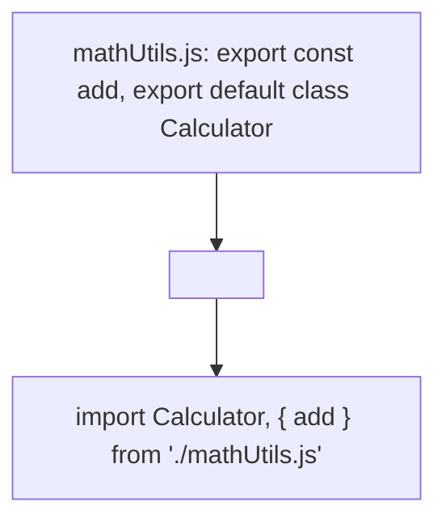

```yaml
schema_version: "2.0"
metadata:
  lesson_id: "JS-MOD10-LES01"
  course_slug: "course-03-javascript"
  course_title: "Course 3: JavaScript & ES6+"
  module_slug: "mod-10-es6-modules-bundlers"
  module_title: "Module 10 - ES6+ Modules, Tooling, & Bundlers"
  lesson_slug: "es6-modules-export-and-import-syntax"
  lesson_title: "Lesson 10.1 ES6 Modules: Export & Import Syntax"
  sort_order: 1001

pedagogy:
  difficulty: "beginner"
  estimated_time:
    reading_minutes: 15
    practice_minutes: 20
    quiz_minutes: 10
    total_minutes: 45
  bloom_taxonomy_level: "Apply"
  xp_reward: 50

prerequisites:
  required_lesson_ids:
    - "JS-MOD09-LES04"
  required_skills:
    - "JavaScript Functions & Objects"

skills_acquired:
  - "Named Exports & Named Imports Syntax"
  - "Default Exports & Default Imports (`export default`)"
  - "Re-exporting & Alias Imports (`import * as Module`)"
  - "CommonJS (`require`) vs ES Modules (`import`) Comparison"

dependencies:
  software:
    - "VS Code"
    - "Node.js REPL"
  hardware: []

seo_and_social:
  meta_title: "ES6 Modules: Named Exports, Default Exports & CommonJS vs ESM"
  meta_description: "Master ES6 Modules: named exports, default exports, alias imports, re-exporting, script type=module, and CommonJS vs ES Modules comparison."
  keywords: ["ES6 Modules", "export default", "import export", "CommonJS vs ESM", "type=module", "JavaScript Modules"]

assessment_config:
  has_quiz: true
  has_lab: true
  has_flashcards: true
  pass_score_percentage: 80
```

# Lesson 10.1 ES6 Modules: Export & Import Syntax

## 1. Overview & Learning Objectives [id: overview]

- **Estimated Time**: 45 Minutes (15m Reading | 20m Practice | 10m Quiz)
- **Difficulty Level**: ⭐ Beginner
- **Prerequisites**: [Lesson 9.4 WebSockets](file:///d:/My%20Drive/all%20files/PROJECT%20FILES/notes/docs/curriculum/_03_javascript/_03_34_websockets_and_realtime_communication.md)
- **XP Reward**: +50 XP

### Learning Objectives
By the end of this lesson, you will be able to:
1. Export functions, classes, and variables using **Named Exports** and **Default Exports**.
2. Import module bindings using `import` statements and alias syntax (`as`).
3. Differentiate between legacy CommonJS (`require()`) and native ES Modules (`import`).
4. Load modules in HTML using `<script type="module">`.

---

## 2. Environment & Prerequisites [id: prerequisites]

Open Node.js REPL or VS Code.

---

## 3. Theoretical Foundations [id: theory]

### 3.1 CommonJS (`require`) vs ES Modules (`import`)

```
┌─────────────────────────────────────────────────────────────────────────────┐
│                       COMMONJS VS ES MODULES MATRIX                         │
├─────────────────┬──────────────────────────────────┬────────────────────────┤
│ Feature         │ CommonJS (`require`)             │ ES Modules (`import`)   │
├─────────────────┼──────────────────────────────────┼────────────────────────┤
│ Environment     │ Node.js Legacy Standard          │ Native Browser & Node  │
│ Loading         │ Synchronous / Dynamic            │ Asynchronous / Static  │
│ Syntax          │ `const x = require('./x')`       │ `import { x } from './x'`│
│ Tree Shaking    │ Difficult static analysis        │ Native Tree Shaking    │
└─────────────────┴──────────────────────────────────┴────────────────────────┘
```

### 3.2 Named vs Default Exports
- **Named Exports**: Multiple allowed per file; imported using exact matching braces (`import { fn1, fn2 }`).
- **Default Exports**: ONLY one allowed per file; imported without curly braces using custom variable naming (`import CustomName from './module'`).

---

## 4. Architecture & Diagram Visualizations [id: diagram]



---

## 5. Code & Hardware Implementation [id: syntax]

### File 1: `mathUtils.js` (Module)

```javascript
// Named Exports
export const PI = 3.14159;
export function add(a, b) {
  return a + b;
}

// Default Export (One per file!)
export default class MathCalculator {
  multiply(a, b) {
    return a * b;
  }
}
```

### File 2: `main.js` (Consumer)

```javascript
// Import Default Export + Named Exports simultaneously
import MathCalculator, { PI, add as sum } from "./mathUtils.js";

const calc = new MathCalculator();
console.log("PI:", PI);
console.log("Sum:", sum(10, 20));
console.log("Product:", calc.multiply(4, 5));
```

---

## 6. Enterprise Real-World Applications [id: examples]

- **Modular Enterprise Frontend Frameworks**: React, Vue, and Angular applications structure components into isolated ES modules (`import { useState } from 'react'`).

---

## 7. Guided Step-by-Step Hands-On Exercise [id: exercises]

1. Create `package.json` with `"type": "module"`.
2. Run `node main.js` $\to$ Inspect clean ES module imports!

---

## 8. Common Pitfalls & Troubleshooting [id: common_mistakes]

| Bug / Error | Root Cause | Engineering Solution |
| :--- | :--- | :--- |
| **`SyntaxError: Cannot use import statement outside a module`** | Using `import` in Node.js without `"type": "module"` in `package.json` or `.mjs` extension. | Add `"type": "module"` to `package.json` or use `<script type="module">`. |

---

## 9. Best Practices & Optimization [id: best_practices]

- **Prefer Named Exports**: Named exports enable superior editor autocompletion and dead-code tree shaking.

---

## 10. Industry Interview Q&A [id: interview_qa]

### Q1: What is the main structural advantage of ES Modules over CommonJS `require()`?
**Answer**: ES Modules are statically analyzed at compile/parse time rather than evaluated at runtime. Static module structure enables static analysis, dead-code elimination (**Tree Shaking**), and asynchronous browser loading.

---

## 11. Self-Assessment Quiz [id: quiz]

```json
{
  "quiz_title": "Lesson 10.1 ES Modules Assessment",
  "questions": [
    {
      "question_id": "Q1",
      "type": "multiple_choice",
      "question_text": "How many default exports (`export default`) can a single ES module file contain?",
      "options": ["Unlimited", "Exactly One", "Zero", "Maximum 5"],
      "correct_answer_index": 1,
      "explanation": "A module file can contain at most ONE default export."
    }
  ]
}
```

---

## 12. Portfolio Assignment & Challenge [id: lab]

Build a modular UI component library with named and default exports.

---

## 13. Spaced Repetition Flashcards [id: flashcards]

**Front**: What attribute must be included in HTML `<script>` tags to enable ES module syntax?
**Back**: `type="module"` (`<script type="module" src="app.js">`).
<!-- flashcard:end -->

---

## 14. Summary & Cheat Sheet [id: summary]

```javascript
export const name = "val";
import { name } from "./mod.js";
```
