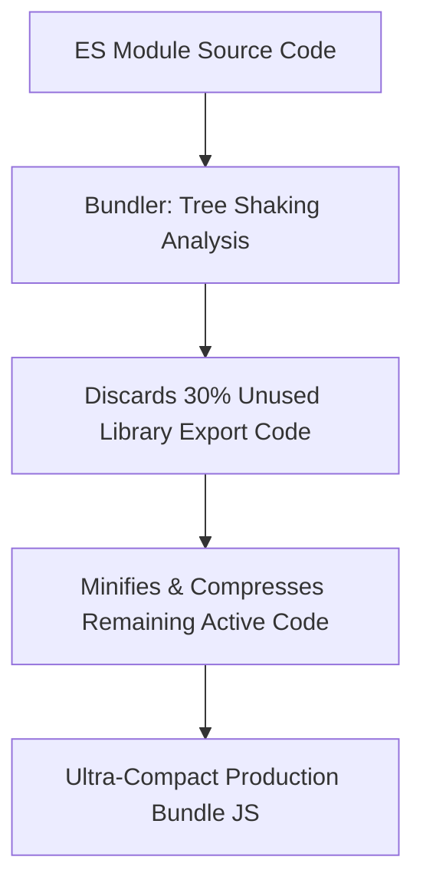

```yaml
schema_version: "2.0"
metadata:
  lesson_id: "JS-MOD10-LES03"
  course_slug: "course-03-javascript"
  course_title: "Course 3: JavaScript & ES6+"
  module_slug: "mod-10-es6-modules-bundlers"
  module_title: "Module 10 - ES6+ Modules, Tooling, & Bundlers"
  lesson_slug: "modern-build-tooling-bundlers-tree-shaking"
  lesson_title: "Lesson 10.3 Modern Build Tooling, Bundlers, & Tree Shaking"
  sort_order: 1003

pedagogy:
  difficulty: "intermediate"
  estimated_time:
    reading_minutes: 20
    practice_minutes: 25
    quiz_minutes: 10
    total_minutes: 55
  bloom_taxonomy_level: "Apply"
  xp_reward: 60

prerequisites:
  required_lesson_ids:
    - "JS-MOD10-LES02"
  required_skills:
    - "ES6 Modules & Dynamic Imports"

skills_acquired:
  - "Modern Build Tooling Architecture (Vite, Rollup, esbuild, Webpack)"
  - "Tree Shaking & Static Dead-Code Elimination"
  - "Development Server HMR (Hot Module Replacement) vs Production Bundles"
  - "Source Maps Debugging (`.map` files)"

dependencies:
  software:
    - "VS Code"
    - "Node.js 18+ with Vite"
  hardware: []

seo_and_social:
  meta_title: "JavaScript Build Tooling: Vite, Tree Shaking, Bundlers & Source Maps"
  meta_description: "Master modern JavaScript build tooling: Vite dev server, esbuild, Rollup, Webpack, Tree Shaking dead-code elimination, HMR, and production Source Maps."
  keywords: ["JavaScript Tooling", "Vite", "Tree Shaking", "esbuild", "Webpack", "Bundlers", "Hot Module Replacement"]

assessment_config:
  has_quiz: true
  has_lab: true
  has_flashcards: true
  pass_score_percentage: 80
```

# Lesson 10.3 Modern Build Tooling, Bundlers, & Tree Shaking

## 1. Overview & Learning Objectives [id: overview]

- **Estimated Time**: 55 Minutes (20m Reading | 25m Practice | 10m Quiz)
- **Difficulty Level**: ⭐⭐ Intermediate
- **Prerequisites**: [Lesson 10.2 Dynamic Imports](file:///d:/My%20Drive/all%20files/PROJECT%20FILES/notes/docs/curriculum/_03_javascript/_03_36_dynamic_imports_and_toplevel_await.md)
- **XP Reward**: +60 XP

### Learning Objectives
By the end of this lesson, you will be able to:
1. Compare modern build tools (**Vite**, **esbuild**, **Rollup**, **Webpack**).
2. Understand **Tree Shaking** dead-code elimination mechanics.
3. Contrast instant Native ESM Development Servers with optimized Production Bundles.
4. Utilize **Source Maps** (`.map`) to debug minified production code.

---

## 2. Environment & Prerequisites [id: prerequisites]

Open Node.js REPL or terminal to run Vite initialization.

---

## 3. Theoretical Foundations [id: theory]

### 3.1 Legacy Bundlers (Webpack) vs Modern Native ESM (Vite)
Legacy build tools (Webpack) bundled every single module in your project into memory before starting the dev server. **Vite** leverages native browser ES Modules during development, serving files on demand instantly powered by **esbuild** (written in Go, 10–100x faster than JavaScript-based bundlers).

```
┌─────────────────────────────────────────────────────────────────────────────┐
│                          BUILD TOOLING COMPARISON MATRIX                    │
├─────────────────┬──────────────────────────────────┬────────────────────────┤
│ Tool            │ Primary Use Case                 │ Under-the-Hood Engine  │
├─────────────────┼──────────────────────────────────┼────────────────────────┤
│ **Vite**        │ Next-gen frontend dev server & UI│ esbuild (dev) + Rollup │
│ **esbuild**     │ Ultra-fast JS/TS transpiler      │ Written in Go          │
│ **Rollup**      │ Library bundler (Tree Shaking)   │ JavaScript Native ESM  │
│ **Webpack**     │ Enterprise legacy bundler        │ JavaScript Node.js     │
└─────────────────┴──────────────────────────────────┴────────────────────────┘
```

### 3.2 Tree Shaking Mechanics
**Tree Shaking** is static dead-code elimination. Because ES Modules use static `import`/`export` syntax, bundlers can trace the import dependency graph and discard unused functions from the final production bundle:

```javascript
// mathUtils.js
export function add(a, b) { return a + b; }
export function unusedFunction() { ... } // DISCARDED BY TREE SHAKING!

// main.js
import { add } from './mathUtils.js';
```

---

## 4. Architecture & Diagram Visualizations [id: diagram]



---

## 5. Code & Hardware Implementation [id: syntax]

### Initializing a Lightning-Fast Vite Project

```bash
# 1. Initialize modern Vite project in non-interactive mode
npm create vite@latest my-app -- --template vanilla

# 2. Navigate and install dependencies
cd my-app
npm install

# 3. Start Instant Native ESM Dev Server (with HMR Hot Module Replacement!)
npm run dev
```

### Production Build & Source Map Inspection

```bash
# 4. Generate optimized production bundle (Triggers Tree Shaking & Minification)
npm run build

# Output directory: dist/
# Contains minified index-[hash].js and source maps!
```

---

## 6. Enterprise Real-World Applications [id: examples]

- **Production Web Performance**: Enterprise applications use Tree Shaking to import individual icons (`import { Check } from 'lucide-react'`) rather than bundling entire 5MB icon libraries into client downloads.

---

## 7. Guided Step-by-Step Hands-On Exercise [id: exercises]

1. Run `npx create-vite@latest test-app --template vanilla`.
2. Run `npm run build` $\to$ Inspect generated production bundle size in `dist/`!

---

## 8. Common Pitfalls & Troubleshooting [id: common_mistakes]

| Bug / Error | Root Cause | Engineering Solution |
| :--- | :--- | :--- |
| **Tree Shaking Failed (Huge Bundle Size)** | Importing libraries using CommonJS `require()` or side-effectful mutations that prevent static analysis. | Use ES Modules (`import`/`export`) and add `"sideEffects": false` to `package.json`. |

---

## 9. Best Practices & Optimization [id: best_practices]

- **Adopt Vite for New Projects**: Replaces slow legacy Webpack dev servers with instant HMR.

---

## 10. Industry Interview Q&A [id: interview_qa]

### Q1: What is Tree Shaking in modern JavaScript build tools and how does it work?
**Answer**: Tree Shaking is a form of dead-code elimination used during production bundling. By leveraging the static structure of ES Modules (`import` and `export`), bundlers like Rollup and esbuild analyze the dependency graph at build time and exclude any exported functions or variables that are never actually imported or executed.

---

## 11. Self-Assessment Quiz [id: quiz]

```json
{
  "quiz_title": "Lesson 10.3 Build Tooling Assessment",
  "questions": [
    {
      "question_id": "Q1",
      "type": "multiple_choice",
      "question_text": "Which modern dev server uses native browser ES Modules and esbuild for instant HMR startup?",
      "options": ["Webpack", "Vite", "Babel", "Gulp"],
      "correct_answer_index": 1,
      "explanation": "Vite uses native browser ESM and esbuild."
    }
  ]
}
```

---

## 12. Portfolio Assignment & Challenge [id: lab]

Set up a production Vite build pipeline with custom source map generation.

---

## 13. Spaced Repetition Flashcards [id: flashcards]

**Front**: What file allows debugging minified production code back to original source code?
**Back**: Source Maps (`.map` files).
<!-- flashcard:end -->

---

## 14. Summary & Cheat Sheet [id: summary]

```bash
npm create vite@latest app -- --template vanilla
npm run build
```
